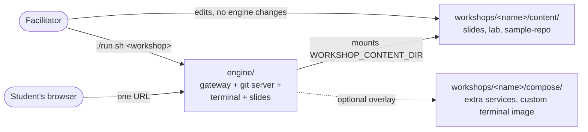

# Git & Version Control Lunch-and-Learn Series

A lunch-and-learn training series for engineering and IT operations,
building git fundamentals before moving into team-specific workflows (e.g.
DNS-as-Code).

## Layout

```
├── engine/                         # Reusable workshop runtime (Forgejo + web terminal + slides), templated across workshops
├── infra/corp-dev/gdojo-cc/        # Azure lab VM (Terraform); workshops/*.tfvars picks which workshop it boots
└── workshops/
    ├── README.md                   # Workshop catalog + how selection/overlay works + how to add one
    ├── git-fundamentals/           # Session 1: core git workflow (content-only workshop pack)
    │   ├── content/                # Mounted into the engine: slides, lab instructions, seed repo
    │   ├── docs/                   # Student/facilitator docs for the local-lab delivery
    │   └── delivery-azure-devops/  # Alternate delivery mode: Azure Repos, doc-only
    └── dns-as-code/                # Session 3: DNS-as-Code via dnscontrol (adds a PowerDNS backend + custom terminal image)
        ├── content/
        └── compose/                # Compose overlay + terminal Dockerfile — the "different infra" this workshop needs
```

`engine/` is the reusable part — a self-hosted Git server, browser terminal,
and slide deck, wired together so a student needs nothing but a browser.
Nothing in it is specific to any one workshop's topic: which workshop runs
is a runtime choice, not something you edit `engine/` to change.

Each `workshops/<name>/` is a self-contained **workshop pack** — content,
and (only if the lab needs it) its own Compose overlay for different
tooling or an extra backend service. Pick one with `./run.sh
<name>` locally, or a matching `-var-file` on the Azure/Terraform path. See
[`workshops/README.md`](workshops/README.md) for exactly how that works
and how to add a new workshop.



Full network/service topology and request flow are diagrammed in
[`engine/README.md`](engine/README.md#architecture).

## Start here

- **Run a workshop locally:** `./run.sh setup`, then `./run.sh <workshop>` — see [`engine/README.md`](engine/README.md)
- **Which workshops exist, and how to add one:** [`workshops/README.md`](workshops/README.md)
- **Session 1 (Git Fundamentals):** [`workshops/git-fundamentals/README.md`](workshops/git-fundamentals/README.md)
- **Session 3 (DNS as Code):** [`workshops/dns-as-code/README.md`](workshops/dns-as-code/README.md)
- **Run on an Azure lab VM:** [`infra/corp-dev/gdojo-cc/README.md`](infra/corp-dev/gdojo-cc/README.md)

## Audience

- Engineering team members (mixed git experience, some daily users)
- IT operations team members (little to no git/version control experience)
- Assumes comfort with a terminal; no assumed git knowledge

## Goals of the series

1. Get everyone speaking the same language around version control and git.
2. Build confidence with the core git workflow through hands-on practice.
3. Establish a shared team workflow/convention to point back to later.
4. Lay the foundation for later, more specific sessions (e.g. managing DNS
   zone files as code, PR review process, CI checks on infra changes).

## Session roadmap

| # | Session | Format | Status |
| - | ------- | ------ | ------ |
| 1 | Git Fundamentals: What/Why/How + Hands-on Lab | 60 min | [`workshops/git-fundamentals/`](workshops/git-fundamentals/) |
| 2 | Branching Workflows & Pull Requests in Practice | 45-60 min | Future |
| 3 | Team Git Conventions + DNS-as-Code Repo Walkthrough | 45-60 min | [`workshops/dns-as-code/`](workshops/dns-as-code/) |
| 4 | Handling Conflicts, Rebasing, and "Oh No" Recovery | 45-60 min | Future |
| 5 | Automating Checks: Pre-commit Hooks & CI Pipelines | 45-60 min | Future |
