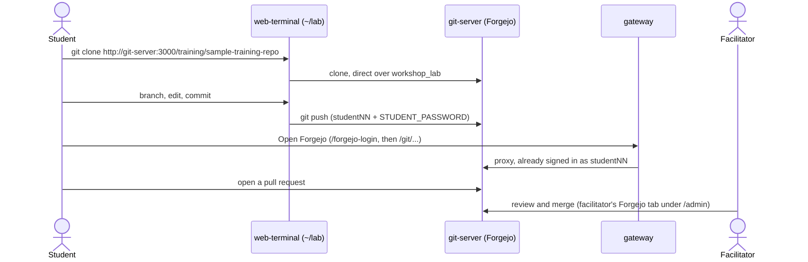
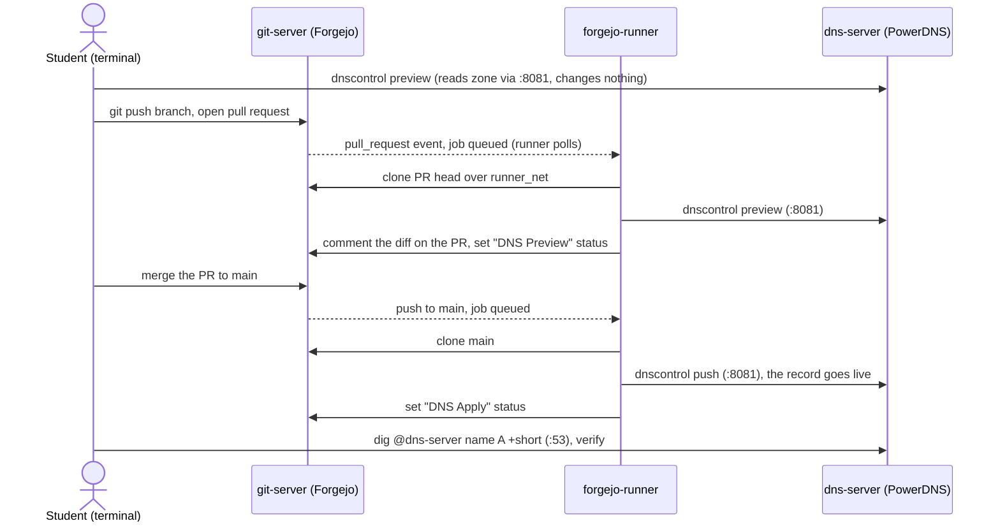
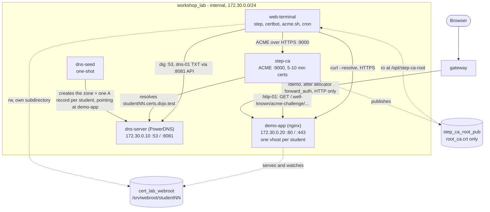
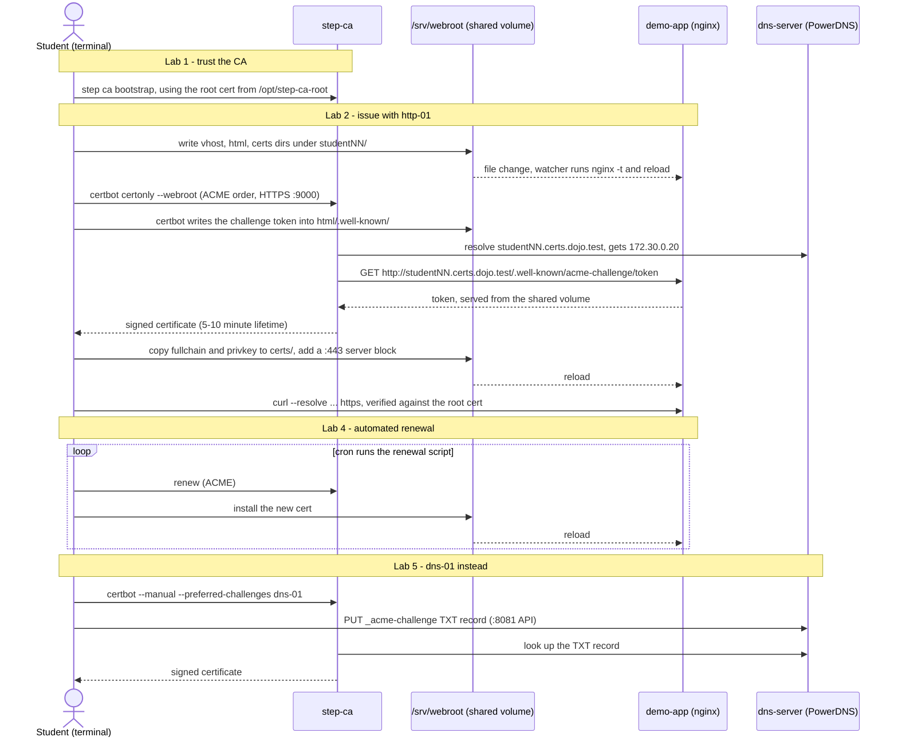
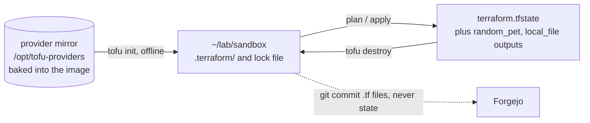
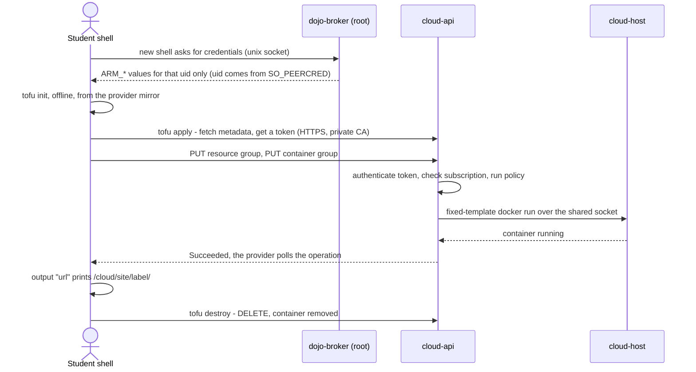

# Git & Version Control Lunch-and-Learn Series

A lunch-and-learn training series for engineering and IT operations,
building git fundamentals before moving into team-specific workflows (e.g.
DNS-as-Code, certificate automation, Infrastructure-as-Code).

## Layout

```
├── run.sh                          # Forwards to engine/run.sh, so ./run.sh <workshop> works from the repo root
├── engine/                         # Reusable workshop runtime (Forgejo + web terminal + slides), shared by every workshop
├── assets/branding/                # Shared branding
├── handouts/                       # Printable handouts (git-fundamentals, dns-as-code)
└── workshops/
    ├── README.md                   # Workshop catalog + how selection/overlay works + how to add one
    ├── assets/themes/              # Shared slide CSS, mounted into every workshop's deck
    ├── git-fundamentals/           # Session 1: core git workflow (content-only workshop pack)
    │   ├── content/                # Mounted into the engine: slides, lab instructions, seed repo
    │   ├── docs/                   # Student/facilitator docs for the local-lab delivery
    │   └── delivery-azure-devops/  # Alternate delivery mode: Azure Repos, doc-only
    ├── dns-as-code/                # Session 3: DNS-as-Code via dnscontrol
    │   ├── content/
    │   └── compose/                # Overlay: PowerDNS + Forgejo Actions runner + terminal with dnscontrol
    ├── cert-autorenewal/           # TLS certificate issuance and renewal via ACME
    │   ├── content/
    │   └── compose/                # Overlay: step-ca + PowerDNS + shared demo web app + terminal with certbot/acme.sh
    └── tofu-basics/                # OpenTofu basics (in progress): offline sandbox + "Dojo Cloud"
        ├── content/
        ├── compose/                # Overlay: cloud-api + cloud-host + terminal with tofu and a credential broker
        └── PLAN.md                 # Design, decisions, task list, progress log
```

`engine/` is the reusable part — a self-hosted Git server, browser terminal,
and slide deck, wired together so a student needs nothing but a browser.
Nothing in it is specific to any one workshop's topic: which workshop runs
is a runtime choice, not something you edit `engine/` to change.

Each `workshops/<name>/` is a self-contained **workshop pack** — content,
and (only if the lab needs it) its own Compose overlay for different
tooling or extra backend services. Pick one with `./run.sh <name>`. See
[`workshops/README.md`](workshops/README.md) for exactly how that works and
how to add a new workshop.


## Start here

- **Run a workshop locally:** `./run.sh setup`, then `./run.sh <workshop>` — see [`engine/README.md`](engine/README.md)
- **Which workshops exist, and how to add one:** [`workshops/README.md`](workshops/README.md)
- **Session 1 (Git Fundamentals):** [`workshops/git-fundamentals/README.md`](workshops/git-fundamentals/README.md)
- **Session 3 (DNS as Code):** [`workshops/dns-as-code/README.md`](workshops/dns-as-code/README.md)
- **Certificate Autorenewal:** [`workshops/cert-autorenewal/`](workshops/cert-autorenewal/) (lab instructions in `content/lab/`)
- **OpenTofu Basics:** [`workshops/tofu-basics/README.md`](workshops/tofu-basics/README.md) (design and status in [`PLAN.md`](workshops/tofu-basics/PLAN.md))

## How the platform is put together

Every workshop runs on the same engine, so the base topology is identical
each time. A workshop only ever *adds* to it. The sections below first show
the shared base, then what each workshop adds to it — its extra services,
who can reach whom, and how data moves through its labs.

### The shared engine (every workshop)

Only `gateway` has a published port. Everything else sits on internal-only
networks, so the gateway is the sole entry point and the only thing that
needs a hole in a firewall.


`git-server` is attached to both `workshop_lab` and `bootstrap_net`;
`bootstrap` lives on `bootstrap_net` only, so it can reach Forgejo and
nothing else. Full routing, auth and request flow:
[`engine/README.md`](engine/README.md#architecture).

**What a student's terminal can reach.** It sits only on `workshop_lab` —
no internet, no `docker.sock`, and every student account shares one network
namespace, so a source IP never identifies a student. It reaches
`git-server:3000` directly and can't reach `presentation` (slides are
browser-only). Any tool a workshop needs is baked into that workshop's
terminal image, pinned and checksum-verified.

### How workshop content flows into the engine (every workshop)

This is the one dataflow every workshop shares. A workshop's `content/`
folder is bind-mounted read-only into three places; nothing is copied into
an image.


`lab/` files a student has already edited are never overwritten by an
update. `FORGEJO_ORG`/`FORGEJO_REPO` come from the workshop's
`workshop.env`.

### Summary: what each workshop adds

| Workshop | Extra services | Extra networks | Terminal image adds | Data leaves the terminal to |
| -------- | -------------- | -------------- | ------------------- | --------------------------- |
| `git-fundamentals` | none | none | nothing (base image) | Forgejo only |
| `dns-as-code` | `dns-server`, `runner-setup`, `forgejo-runner` | `runner_net` | `dnscontrol`, `dig`, `python3` | Forgejo, PowerDNS |
| `cert-autorenewal` | `dns-server`, `dns-seed`, `step-ca`, `demo-app` | static subnet on `workshop_lab` | `step`, `certbot`, `acme.sh`, `openssl`, `dig`, `jq` | step-ca, PowerDNS, shared webroot volume |
| `tofu-basics` | `cloud-api`, `cloud-host` | `cloud_net` | `tofu` (also `terraform`), offline provider mirror, credential broker | `cloud-api` (Track B) |

Everything below is layered on the shared engine above — any service or
network not named there is unchanged.

---

### `git-fundamentals` — content only

**Infrastructure and connectivity:** the shared engine, exactly as-is. No
overlay, no extra services.

**Dataflow.** The labs are pure git against Forgejo. Clone, push and PR
review all talk to `git-server`; the browser only ever sees Forgejo through
the gateway.



Git traffic never goes through the gateway — pushes and clones go straight
from the terminal to `git-server:3000`, and only the browser UI is proxied.

---

### `dns-as-code` — Forgejo Actions runner + PowerDNS

**Infrastructure and connectivity.** Adds a PowerDNS authoritative server
and a CI runner. The runner executes student-authored workflow steps
directly on its own filesystem (no sandbox, no `docker.sock`), so it lives
on its own `runner_net` and can reach only `git-server` and `dns-server` —
never `allocator` or `web-terminal`.


**Dataflow.** One change travels the whole loop: local preview, PR, CI
preview, merge, CI apply, verify. The record only goes live when CI pushes
it after the merge — not when the student pushes their branch.



Zone data lives only in the PowerDNS container's own filesystem, so it
resets on every teardown. Credentials for the API (`creds.json`) are in the
seeded repo and are workshop-only, not secrets.

---

### `cert-autorenewal` — ACME CA + DNS + shared demo app

**Infrastructure and connectivity.** Adds a private ACME certificate
authority, a PowerDNS server that resolves every student's hostname, and one
shared nginx that serves every student's site. All of it lives on
`workshop_lab`, whose subnet is pinned (`172.30.0.0/24`) so `dns-server`
(`.10`) and `demo-app` (`.20`) have stable addresses that `step-ca` and the
seeded DNS records can point at.

Students never touch `demo-app` directly. Isolation is per-student
ownership of a subdirectory on a shared volume, not per-container. A
watcher inside `demo-app` reloads nginx when files change, so no
`docker.sock` or cross-container exec is needed.



The CA's private keys stay in `step-ca`'s own volume; only the public root
certificate is shared into the terminal. This workshop's `sample-repo` is
mounted straight into `~/lab/sample-repo` — there is no Forgejo clone step
in its labs.

**Dataflow.** Two proofs of control (http-01 in Labs 2–4, dns-01 in Lab 5)
and one renewal loop.



The `/demo` link on the workshop homepage is HTTP-only and never touches a
student's certificate, so `curl --cacert` from the terminal is the real
check that a cert is valid.

---

### `tofu-basics` — offline sandbox + "Dojo Cloud" (in progress)

Two tracks. **Track A** (sandbox) needs no infrastructure beyond the swapped
terminal image. **Track B** (Dojo Cloud) adds an Azure-inspired control
plane that the real `azurerm` provider talks to, so students run
`init`/`plan`/`apply`/`destroy` against something that behaves like a cloud.

**Infrastructure and connectivity.** The privileged `cloud-host` (a
Docker-in-Docker daemon that actually runs student containers) is
acceptable only because it is boxed in: it sits on an internal network with
no route to the internet or to any student, publishes nothing, and has no
listener except a unix socket shared with `cloud-api`. `cloud-api` is the
only thing that ever talks to it, using fixed templates — students never
speak Docker.


Dashed edges through the gateway are **planned, not wired yet**: the Dojo
Portal and the deployed-site links (`/cloud/site/<label>/`) need a gateway
route and a landing-page button (phase P5 in
[`PLAN.md`](workshops/tofu-basics/PLAN.md), which touches the base engine
and is gated on the maintainer's OK). Today a student deploys entirely from
their terminal. `cloud_data` mirrors control-plane state to disk so a
`cloud-api` restart doesn't forget what was deployed; `./run.sh stop` still
wipes it.

**Dataflow — Track A (sandbox).** Fully local; nothing leaves the
terminal container.



**Dataflow — Track B (Dojo Cloud).** The student never holds a long-lived
secret: the broker derives that student's credentials from the caller's
real uid, and `cloud-api` authorises every call against the token's own
subscription.



Policy rejections come back as ARM-shaped errors (a required tag missing,
a disallowed region, an oversized container, over quota) so the labs can
teach reading real-looking failures.

---

## Who can reach what

Rows are the caller; a ✓ is a real network path. Everything else is either
blocked by network isolation or never routed.

| From ↓ / To → | `git-server` | `presentation` | `dns-server` | `step-ca` / `demo-app` | `cloud-api` | `cloud-host` | Internet |
| ------------- | :----------: | :------------: | :----------: | :--------------------: | :---------: | :----------: | :------: |
| Student terminal | ✓ | — | dns-as-code, cert-autorenewal | cert-autorenewal | tofu-basics (:443; :8080 needs the gateway token) | — | — |
| `gateway` | ✓ | ✓ | — | `/demo` (cert-autorenewal) | planned (tofu-basics, P5) | — | published :80/:443 in, nothing else |
| `forgejo-runner` (dns-as-code) | ✓ | — | ✓ | — | — | — | — |
| `step-ca` (cert-autorenewal) | — | — | ✓ | ✓ | — | — | — |
| `cloud-api` (tofu-basics) | — | — | — | — | — | ✓ | — |
| `bootstrap` | ✓ | — | — | — | — | — | — |

Three deliberate boundaries carry the security model: `bootstrap_net`
(provisioning can reach Forgejo and nothing else), `runner_net` (student-authored
CI can't reach the control plane), and `cloud_net` (the privileged host is
reachable only through `cloud-api`'s fixed templates).

## Audience

- Engineering team members (mixed git experience, some daily users)
- IT operations team members (little to no git/version control experience)
- Assumes comfort with a terminal; no assumed git knowledge

## Goals of the series

1. Get everyone speaking the same language around version control and git.
2. Build confidence with the core git workflow through hands-on practice.
3. Establish a shared team workflow/convention to point back to later.
4. Lay the foundation for later, more specific sessions (e.g. managing DNS
   zone files as code, PR review process, CI checks on infra changes).

## Session roadmap

| # | Session | Format | Status |
| - | ------- | ------ | ------ |
| 1 | Git Fundamentals: What/Why/How + Hands-on Lab | 60 min | [`workshops/git-fundamentals/`](workshops/git-fundamentals/) |
| 2 | Branching Workflows & Pull Requests in Practice | 45-60 min | Future |
| 3 | Team Git Conventions + DNS-as-Code Repo Walkthrough | 45-60 min | [`workshops/dns-as-code/`](workshops/dns-as-code/) |
| 4 | Handling Conflicts, Rebasing, and "Oh No" Recovery | 45-60 min | Future |
| 5 | Automating Checks: Pre-commit Hooks & CI Pipelines | 45-60 min | Future |

### Additional workshops (not yet slotted into the numbered series)

| Workshop | Topic | Status |
| -------- | ----- | ------ |
| [`workshops/cert-autorenewal/`](workshops/cert-autorenewal/) | Automated TLS certificate issuance and renewal via ACME (step-ca, certbot, acme.sh) | Runs today |
| [`workshops/tofu-basics/`](workshops/tofu-basics/) | OpenTofu/Terraform basics: `init`/`plan`/`apply`/`destroy` and repo layout. Track A (offline sandbox) runs today; Track B (Dojo Cloud) is in progress | In progress — see [`PLAN.md`](workshops/tofu-basics/PLAN.md) |
