# GitOps Dojo

**A self-contained, offline, hands-on learning environment for practical
infrastructure skills.**

GitOps Dojo runs short-lived workshops where students do the real work: they
push commits and open pull requests, watch CI change a live DNS server, get TLS
certificates from a working ACME authority, and deploy containers into a cloud
that the real `azurerm` provider talks to. Every exercise uses real tools
against real services. Each workshop's lab is built for one class and removed
completely at the end.

**Zero install for students.** A student opens one URL in any browser and gets
their own VS Code, terminal, git server, slides and lab guide, already signed
in. There is nothing to download, no accounts to create and no laptop setup to
debug before the class can start.

**Fully self-contained and offline.** Everything a class needs runs inside the
stack: the git server, CI runners, DNS servers, a certificate authority and a
practice cloud. Once the images are built, a session needs no internet and no
outside accounts. Every tool is baked in, pinned to a version and checked
against a sha256.

**Ephemeral by design.** `./run.sh <workshop>` starts a whole lab on a laptop or
a single VM, and `./run.sh stop` removes it without a trace. Each class starts
clean, and several workshops run on the same engine.

**Safe to break.** Student terminals have no internet and no Docker socket. The
DNS zones, certificates and cloud resources belong to the lab, so a mistake
is part of the lesson and never an incident.

```sh
./run.sh setup              # first time only: writes engine/.env
./run.sh doctor             # will a start work here? (exits 1 if not)
./run.sh list               # which workshops exist
./run.sh tofu-basics        # build and start one
./run.sh tofu-basics --test # the same, with simulated students
./run.sh status             # what is running, healthy, who is signed in
./run.sh restart            # stuck? recreate every container, keep student work
./run.sh stop               # tear down and wipe
```

## What's here

### The workshops

| # | Workshop | What students learn | Labs | Length |
| - | -------- | ------------------- | ---- | ------ |
| 0 | [**Dojo Introduction**](workshops/dojo-introduction/) | A show-and-tell of the whole platform for a facilitator, not a lab: every module runs at once (vault, DNS, certificates, Dojo Cloud, CI runners) with a platform tour, a workshop library and a tools tour. | none | ~30 min |
| 1 | [**Git Fundamentals**](workshops/git-fundamentals/) | The core git workflow: clone, branch, commit, push, pull request, then reviewing and undoing changes, stashing, reading history and resolving merge conflicts. | 5 | 60 min |
| 2 | [**DNS as Code**](workshops/dns-as-code/) | Managing DNS records in git with `dnscontrol`. A pull request runs a CI preview, and merging it applies the change to a live PowerDNS server. | 5 | 45-60 min |
| 3 | [**Certificate Autorenewal**](workshops/cert-autorenewal/) | Getting TLS certificates over ACME from a private CA with `certbot` and `acme.sh`, installing them on a real web server, automating renewal (certificates last 5-10 minutes, so students see renewals happen) and the dns-01 challenge. | 5 | ~75 min |
| 4 | [**OpenTofu Basics**](workshops/tofu-basics/) | The Terraform workflow (`init`, `plan`, `apply`, `destroy`) and how an IaC repo is laid out. Track A is an offline sandbox. Track B deploys real containers through the real `azurerm` provider into **Dojo Cloud**, an Azure-inspired practice cloud with a portal, policies, quotas and drift. `terraform` runs OpenTofu. | 11 | ~2¼ h |
| 5 | [**Vault Fundamentals**](workshops/vault-fundamentals/) | Using a vault well, on a real OpenBao: get secrets out of code, git, pipelines and servers, and swap long-lived secrets for identity and short-lived credentials. Labs cover leaking and scanning, `sops` and `pass`, per-student namespaces and policies, an app and OpenBao Agent, CI that logs in with its Forgejo identity on single-use runners, deployments with a delivered secret ID or workload identity, dynamic Postgres logins and an incident drill. | 14 | ~3½ h |

The numbers are a learning path: teach them in order. `0` showcases the platform and is not a course; `1` to `5`
build on each other (DNS as Code reuses the git flow, Certificate Autorenewal's capstone drives the DNS API from
workshop 2, OpenTofu Basics extends the plan-before-apply and drift ideas, and Vault Fundamentals, which lists Git
Fundamentals as a prerequisite, comes last as the longest).

Each workshop pack has its own slide deck, lab guides, cheat sheet and a seed
repository. The lab guides are copied into every student's `~/lab` and shown
in the browser.

### The platform

- **One URL per class.** A Caddy gateway is the only exposed service. It assigns
  each browser a student account and routes it to that student's VS Code
  (code-server), terminal (ttyd + tmux), the Forgejo git server and the Marp
  slides, all signed in already.
- **A facilitator workspace at `/admin`.** A live roster with a read-only view
  of every student's terminal, a Release button to free a stuck account, a
  service status strip, and the facilitator's own VS Code, Terminal, Forgejo,
  Slides tabs, plus the tabs a workshop's modules add: Dojo Cloud and the **Class
  progress** board (tofu-basics), Vault, Audit, Runners and Apps
  (vault-fundamentals), DNS Admin (dns-as-code, cert-autorenewal).
- **Isolated labs.** Student terminals have no internet and no Docker socket.
  Every tool is baked into the workshop's image, pinned to a version and checked
  against a sha256. Extra services sit on internal-only networks, and anything a
  student can reach checks a gateway token before trusting who the caller is.
  See [Security boundaries](#security-boundaries).
- **Workshops are plug-ins.** A workshop is a folder under `workshops/`: a
  `workshop.env`, its content and, only if it needs them, reusable modules
  (`MODULES="runner-pool dns-gate"`), a Compose overlay, extra terminal tools and an
  `extensions.json` that declares its landing cards, `/admin` tabs and routes.
  The engine is never edited to add a workshop. See [`workshops/README.md`](workshops/README.md).
- **Demo bots.** `--test [N]` adds up to 35 simulated students (expert,
  intermediate and novice personas) who work through the labs for real, pushing
  branches and opening pull requests. Use them to rehearse solo, demo the
  admin dashboard or load-test a machine before a class.
- **A live start-up view.** In a terminal, `./run.sh` shows one status table
  that updates in place while the stack starts, and `./run.sh stop` shows one
  while it comes down (plain lines when piped or with `NO_COLOR`).
- **Runs on one machine.** A laptop for rehearsal or a single cloud VM for a
  real class, with Docker or Podman. `./run.sh capacity --students 30` sizes the
  per-student memory and process limits for that host. Nothing persists once the
  stack is stopped.

### Beyond the live lab

- **Azure DevOps edition** of Git Fundamentals
  ([`workshops/git-fundamentals/delivery-azure-devops/`](workshops/git-fundamentals/delivery-azure-devops/)):
  the same session delivered against Azure Repos, with a facilitator guide,
  checklists and a feedback survey.
- **Facilitator guides.** [`engine/README.md`](engine/README.md) covers setup,
  deployment, the admin workspace, mid-session content updates, cleanup and
  troubleshooting. OpenTofu Basics also has a run-of-show in
  [`FACILITATOR.md`](workshops/tofu-basics/FACILITATOR.md), and the roadmap and
  release history are in [`ROADMAP.md`](ROADMAP.md) and [`RELEASES.md`](RELEASES.md).
- **Tests.** OpenTofu Basics ships an end-to-end suite and a load test against
  the live stack ([`workshops/tofu-basics/tests/`](workshops/tofu-basics/tests/)),
  and Dojo Cloud's control plane has its own unit tests. Vault Fundamentals has
  one script per lab, a runner-pool and audit check, browser checks and a
  demo-bot load run ([`workshops/vault-fundamentals/tests/`](workshops/vault-fundamentals/tests/)).

## What you need on the host

The facilitator's machine needs a container engine, git and openssl. Students need only a browser.
**Podman** (with `podman-compose`) is the recommended engine; **Docker** with the Compose plugin also works.
`run.sh` is bash and the containers are Linux, so:

| Host | What to use |
|---|---|
| Ubuntu / Debian / Fedora | `./setup.sh` |
| Windows | `.\setup.ps1` in PowerShell: sets up WSL2 + Ubuntu, clones the repo inside it, then runs `setup.sh` there |
| macOS | `./setup.sh` (Homebrew; podman needs `podman machine`, or use Docker Desktop). Not yet tested on a Mac. |

`./setup.sh` detects the OS, asks you to confirm, shows what is missing and asks before installing anything
(`--check` only reports). `./run.sh` uses podman whenever `podman` and `podman-compose` are installed (rootless, no root daemon, so a
container escape lands on an unprivileged user) and falls back to Docker otherwise.

## Who it's for

Engineering and IT operations teams: people who use git every day, and people
who have never used version control. It assumes comfort with a terminal and no
git knowledge. The workshops build on each other: Git Fundamentals gives
everyone the clone, branch, pull request routine, and the later workshops apply
that routine to real operational work, where a change goes through review and
automation instead of being made by hand.

## Status and roadmap

| Workshop | Status |
| -------- | ------ |
| Git Fundamentals | Ready |
| DNS as Code | Ready |
| Certificate Autorenewal | Ready |
| OpenTofu Basics | Built and tested live. A human dry-run and a final browser pass remain (see [`ROADMAP.md`](ROADMAP.md)). |
| Vault Fundamentals (OpenBao) | Ready. Merged to `main` (PR #3): labs 0-13, the talk and the facilitator's Vault, Audit, Runners and Apps tabs. Live-tested with demo bots (10 students, about 2 GiB); a person walking labs 7-9 in the browser remains ([`ROADMAP.md`](ROADMAP.md)). |
| Dojo Introduction | Built and tested locally; a showcase, not a lab. |
| Threat-model remediation | 15 of 19 findings fixed, 2 partial, 2 accepted, on `feat/remediation` and not yet merged to `main`; see [`RELEASES.md`](RELEASES.md). |
| Git follow-ups: branching workflows and pull requests; conflicts, rebasing and recovery; pre-commit hooks and CI | Ideas, not started |

## Repository layout

```text
├── run.sh                    # Forwards to engine/run.sh
├── engine/                   # The shared runtime: gateway, allocator, web-terminal, Forgejo, slides
│   ├── README.md             # Setup, routing, auth, facilitator operations, troubleshooting
│   └── scripts/              # env setup, capacity calculator, teardown, shell completion
├── modules/                  # Reusable services + tools a workshop lists in MODULES (./run.sh modules)
│   ├── dns-gate/             # dns-api: PowerDNS API gate, per-account keys, CI by ID token (dns-as-code, cert-autorenewal)
│   ├── dns-ui/               # DNS Zones page and the facilitator's DNS Admin (dns-as-code, cert-autorenewal)
│   ├── dojo-cloud/           # Dojo Cloud: cloud-api, cloud-host, /cloud route, terminal broker (tofu-basics)
│   ├── forgejo-runner/       # One long-lived Actions runner for one repo (no workshop uses it now)
│   ├── openbao/              # OpenBao server, setup, SSO through Forgejo, terminal identity broker (vault-fundamentals)
│   └── runner-pool/          # Single-use Actions runners, autoscaled, Runners panel in /admin (vault-fundamentals, dns-as-code)
├── workshops/
│   ├── README.md             # How workshops are selected and how to add one
│   ├── assets/               # Shared slide theme and the in-browser lab reader
│   ├── git-fundamentals/     # Content only; also the Azure DevOps delivery mode
│   ├── dns-as-code/          # + PowerDNS; runner-pool, dns-ui and dns-gate modules
│   ├── cert-autorenewal/     # + step-ca, PowerDNS, shared nginx demo app
│   ├── dojo-introduction/    # Showcase of the whole platform; all modules at once
│   ├── tofu-basics/          # + tofu toolchain; uses the dojo-cloud module; FACILITATOR.md, tests/
│   └── vault-fundamentals/   # openbao + runner-pool modules, app-host and app-db; labs 0-13, tests/
├── ROADMAP.md                # All open work: the single list of tasks
├── RELEASES.md               # What shipped, newest first
├── docs/archive/             # Frozen design plans and decision logs (modules, tofu-basics, vault, remediation, reset)
├── threat-model-20260926-154208/  # Threat model report (fix history is in RELEASES.md)
└── assets/branding/          # Shared branding
```

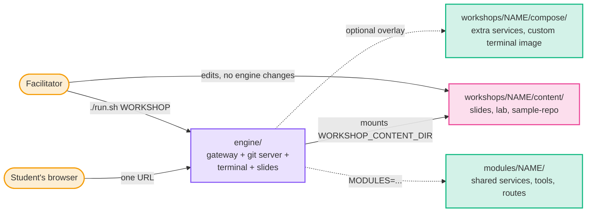

## Where to go next

- **Run a class:** [`engine/README.md`](engine/README.md), then the workshop's own README.
- **Add a workshop:** [`workshops/README.md`](workshops/README.md).
- **Understand how it fits together:** keep reading.

## How the platform is put together

Every workshop runs on the same engine, so the base topology is identical
each time. A workshop only ever *adds* to it. The sections below first show
the shared base, then what each workshop adds to it — its extra services,
who can reach whom, and how data moves through its labs.

### The shared engine (every workshop)

Only `gateway` has a published port. Everything else sits on internal-only
networks, so the gateway is the sole entry point and the only thing that
needs a hole in a firewall.

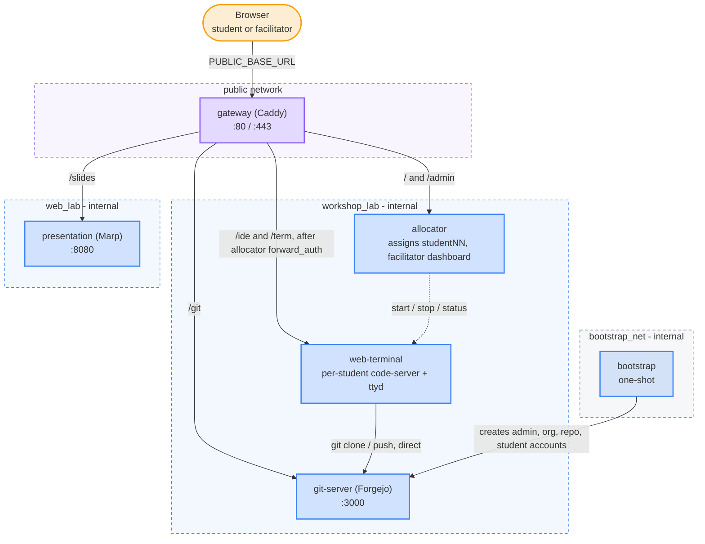

`git-server` is attached to both `workshop_lab` and `bootstrap_net`;
`bootstrap` lives on `bootstrap_net` only, so it can reach Forgejo and
nothing else. Full routing, auth and request flow:
[`engine/README.md`](engine/README.md#architecture).

**What a student's terminal can reach.** It sits only on `workshop_lab` —
no internet, no `docker.sock`, and every student account shares one network
namespace, so a source IP never identifies a student. It reaches
`git-server:3000` directly and can't reach `presentation` (slides are
browser-only). Any tool a workshop needs is baked into that workshop's
terminal image, pinned and checksum-verified.

### How workshop content flows into the engine (every workshop)

This is the one dataflow every workshop shares. A workshop's `content/`
folder is bind-mounted read-only into three places; nothing is copied into
an image.

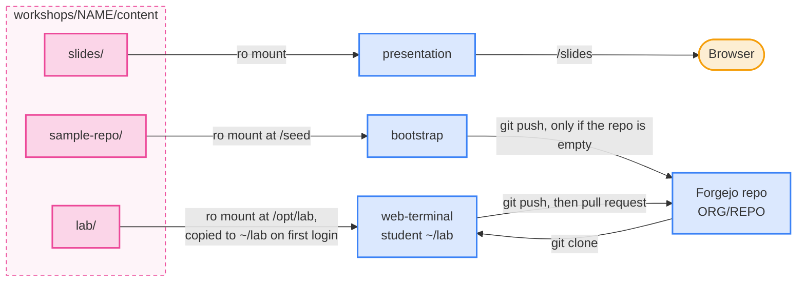

`lab/` files a student has already edited are never overwritten by an
update. `FORGEJO_ORG`/`FORGEJO_REPO` come from the workshop's
`workshop.env`.

### Summary: what each workshop adds

| Workshop | Modules | Extra services | Extra networks | Terminal image adds | Data leaves the terminal to |
| -------- | ------- | -------------- | -------------- | ------------------- | --------------------------- |
| `git-fundamentals` | — | none | none | nothing (base image) | Forgejo only |
| `dns-as-code` | `runner-pool`, `dns-ui`, `dns-gate` | `dns-server`, `dns-gates`; `runner-pool`, `runner-pool-shim`, `runner-controller`, `zone-viewer`, `dns-admin`, `dns-api` (modules) | `runner_net` (module) | `dnscontrol`, `dig`, `python3`; own DNS key (module) | Forgejo, `dns-api` |
| `cert-autorenewal` | `dns-ui`, `dns-gate` | `dns-server`, `dns-seed`, `step-ca`, `demo-app`; `zone-viewer`, `dns-admin`, `dns-api` (modules) | static subnet on `workshop_lab` | `step`, `certbot`, `acme.sh`, `openssl`, `dig`, `jq`; own DNS key (module) | step-ca, `dns-api`, shared webroot volume |
| `tofu-basics` | `dojo-cloud` | `cloud-api`, `cloud-host` (module) | `cloud_net` (module) | `tofu` (also `terraform`), offline provider mirror; credential broker (module) | `cloud-api` (Track B) |
| `vault-fundamentals` | `openbao`, `runner-pool` | `openbao`, `openbao-setup`, `openbao-sso-shim`, `openbao-audit`; `runner-pool`, `runner-pool-shim`, `runner-controller` (modules); `app-host`, `app-db` | `runner_net` (module; `openbao` and `app-host` join it) | `bao`, `bao-audit`, identity broker (module); `sops`, `gitleaks`, `pass`, `hvac`, `pg8000`, `psql`, `jq` | OpenBao, Forgejo, My App |
| `dojo-introduction` | `openbao`, `runner-pool`, `dojo-cloud`, `dns-ui`, `dns-gate` | Every module's services, plus PowerDNS, `step-ca` and the demo site reused from cert-autorenewal | `runner_net`, `cloud_net` (modules) | One image with `bao`, `sops`, `gitleaks`, `pass`, `dnscontrol`, `dig`, `step`, `certbot`, `acme.sh`, `tofu` | Everything above; nothing to complete |

Everything below is layered on the shared engine above — any service or
network not named there is unchanged.

---

### `git-fundamentals` — content only

**Infrastructure and connectivity:** the shared engine, exactly as-is. No
overlay, no extra services.

**Dataflow.** The labs are pure git against Forgejo. Clone, push and PR
review all talk to `git-server`; the browser only ever sees Forgejo through
the gateway.

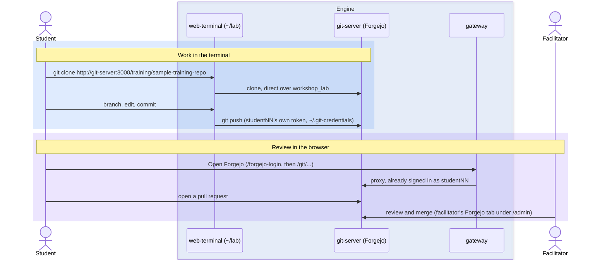

Git traffic never goes through the gateway — pushes and clones go straight
from the terminal to `git-server:3000`, and only the browser UI is proxied.

---

### `dns-as-code` — Forgejo Actions runner + PowerDNS

**Infrastructure and connectivity.** Adds a PowerDNS authoritative server,
the `dns-gate` module's `dns-api` in front of its API, and single-use CI
runners from the `runner-pool` module. Jobs run student-authored steps as
processes in the pool (no `docker.sock`), each on a fresh runner that is
deleted afterwards; the pool lives on its own `runner_net` and reaches only
`git-server`, `dns-api` and `dns-server` — never `allocator` or
`web-terminal`. PowerDNS's own API key is derived in `workshop.env` and
reaches only `dns-api` and the `dns-ui` module.

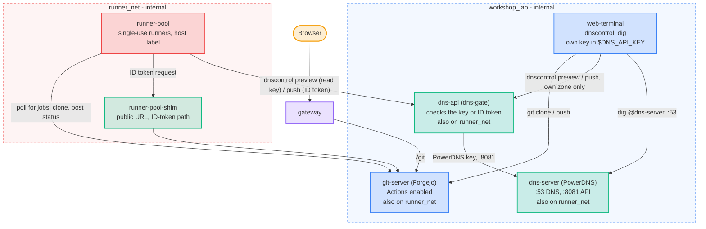

**Dataflow.** One change travels the whole loop: local preview, PR, CI
preview, merge, CI apply, verify. The record only goes live when CI pushes
it after the merge — not when the student pushes their branch. `dns-api`
lets the apply job change `dojo.test` only because Forgejo signed its ID
token for a push to `main` of the class repo; a PR's job, a feature branch
or a fork gets `403` whatever its workflow says.

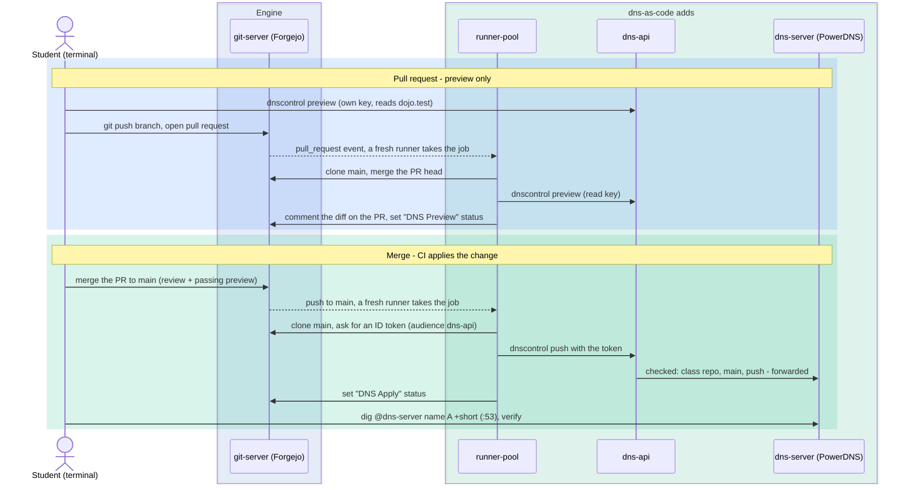

Zone data lives only in the PowerDNS container's own filesystem, so it
resets on every teardown. `creds.json` in the seeded repo names no secret:
`"apiKey": "$DNS_API_KEY"`, each account's own key in its terminal and the
job's ID token in CI.

---

### `cert-autorenewal` — ACME CA + DNS + shared demo app

**Infrastructure and connectivity.** Adds a private ACME certificate
authority, a PowerDNS server that resolves every student's hostname, and one
shared nginx that serves every student's site. All of it lives on
`workshop_lab`, whose subnet is pinned (`172.30.0.0/24`) so `dns-server`
(`.10`) and `demo-app` (`.20`) have stable addresses that `step-ca` and the
seeded DNS records can point at.

Students never touch `demo-app` directly. Isolation is per-student
ownership of a subdirectory on a shared volume, not per-container. A
watcher inside `demo-app` reloads nginx when files change, so no
`docker.sock` or cross-container exec is needed.

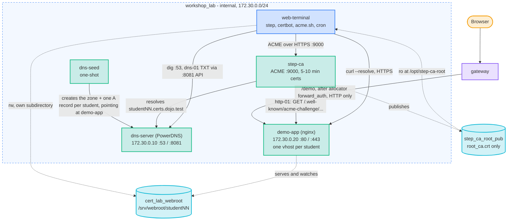

The CA's private keys stay in `step-ca`'s own volume; only the public root
certificate is shared into the terminal. This workshop's `sample-repo` is
mounted straight into `~/lab/sample-repo` — there is no Forgejo clone step
in its labs.

**Dataflow.** Two proofs of control (http-01 in Labs 2–4, dns-01 in Lab 5)
and one renewal loop.

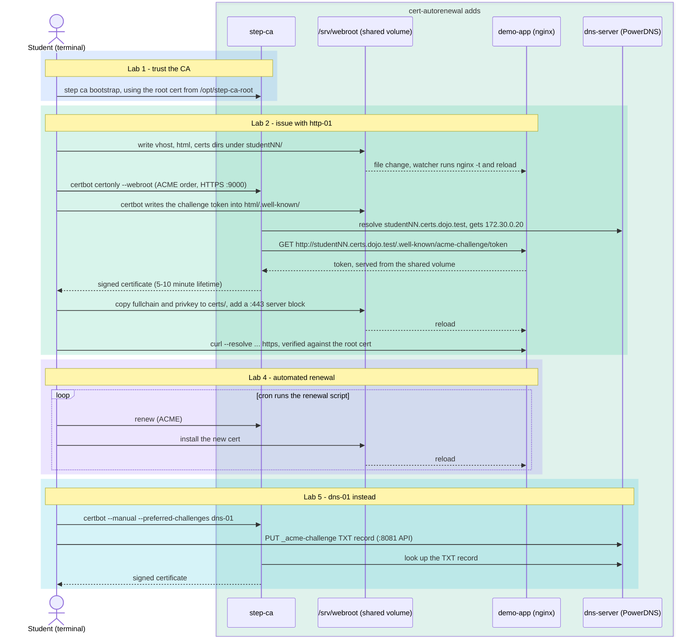

The `/demo` link on the workshop homepage is HTTP-only and never touches a
student's certificate, so `curl --cacert` from the terminal is the real
check that a cert is valid.

---

### `tofu-basics` — offline sandbox + "Dojo Cloud"

Two tracks. **Track A** (sandbox) needs no infrastructure beyond the swapped
terminal image. **Track B** (Dojo Cloud) adds an Azure-inspired control
plane that the real `azurerm` provider talks to, so students run
`init`/`plan`/`apply`/`destroy` against something that behaves like a cloud.

**Infrastructure and connectivity.** The privileged `cloud-host` (a
Docker-in-Docker daemon that actually runs student containers) is
acceptable only because it is boxed in: it sits on an internal network with
no route to the internet or to any student, publishes nothing, and has no
listener except a unix socket shared with `cloud-api`. `cloud-api` is the
only thing that ever talks to it, using fixed templates — students never
speak Docker.

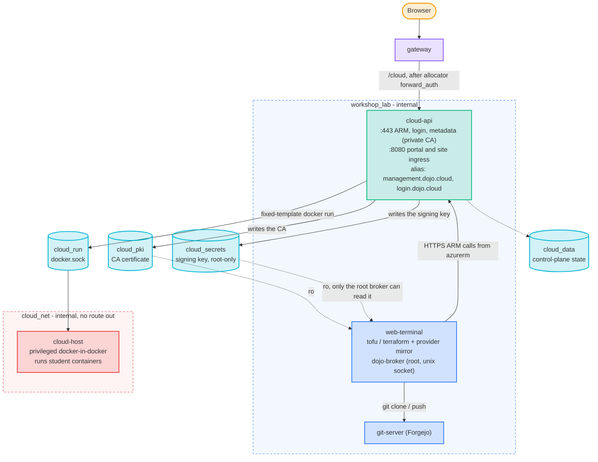

The gateway routes `/cloud` to `cloud-api`'s `:8080` listener: the Dojo
Portal at `/cloud/` and each deployed site at `/cloud/site/<label>/`. The
route, the landing-page card and the facilitator's matching **Dojo Cloud**
tab in `/admin` come from the `dojo-cloud` module's `extensions.json`, so
they exist only in a workshop that lists the module. `cloud_data` mirrors control-plane state to disk so a
`cloud-api` restart doesn't forget what was deployed; `./run.sh stop` still
wipes it.

**Dataflow — Track A (sandbox).** Fully local; nothing leaves the
terminal container.

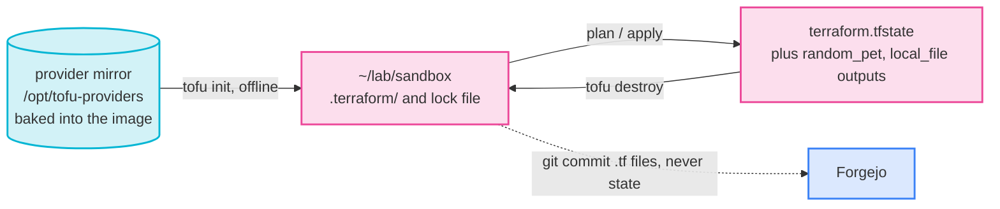

**Dataflow — Track B (Dojo Cloud).** The student never holds a long-lived
secret: the broker derives that student's credentials from the caller's
real uid, and `cloud-api` authorises every call against the token's own
subscription.

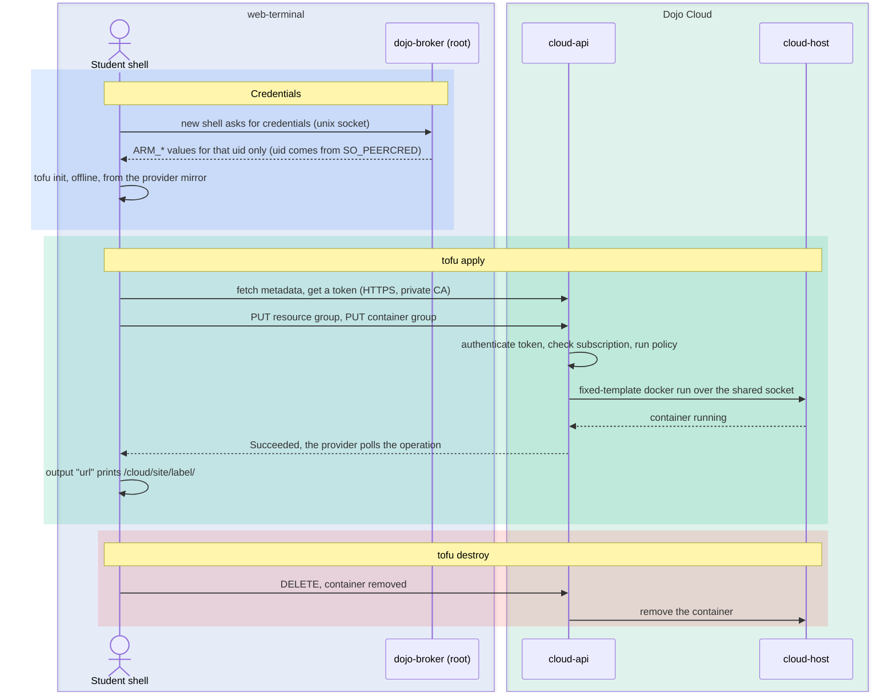

Policy rejections come back as ARM-shaped errors (a required tag missing,
a disallowed region, an oversized container, over quota) so the labs can
teach reading real-looking failures.

---

### `vault-fundamentals` — a real OpenBao, CI runners and a deploy target

One OpenBao serves the whole class, and each student works in a namespace of
their own under one shared, templated policy. The workshop adds three things
on top of the engine: the `openbao` module (the vault, its start-up setup,
single sign-on through Forgejo and an audit reader), the `runner-pool` module
(single-use CI runners, autoscaled) and, in the workshop's own overlay,
`app-host` (a deploy target with one slot per student) and `app-db`
(Postgres for the dynamic-credentials lab).

**Infrastructure and connectivity.** OpenBao listens on plain HTTP on
`workshop_lab` only. The gateway fronts its UI at `/ui` and `/v1` for browsers.
`openbao-setup` runs on every start: it unseals the vault, uses a temporary
root token to provision namespaces, policies, auth methods and one identity per
account, then revokes it, so no live root or provisioner token stays on disk.
Students log in from the terminal with no password: a broker on a unix socket
signs a short-lived JWT for the account on the other end (`SO_PEERCRED`) and
OpenBao trades it for a token. In the browser, the vault signs in through
Forgejo (OIDC).

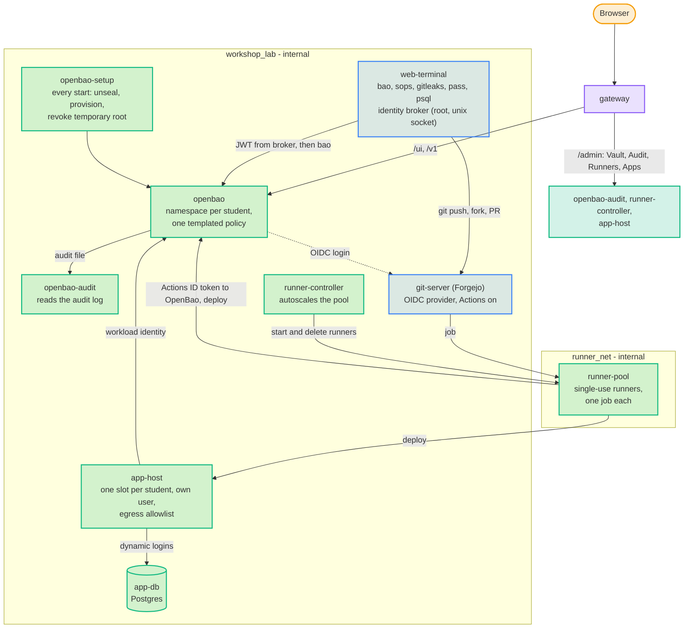

**The labs.** 0 sign in and take the tour, 1 leak a secret, 2 keep it
encrypted on your own machine (`sops`, `pass`), 3 use the shared vault, 4 be
the admin of your namespace, 5 an app reads a secret, 6 OpenBao Agent, 7
encrypted config in the repo, 8 Forgejo Actions secrets, 9 CI logs in to
OpenBao with its Actions ID token, 10 deploy with a delivered secret ID, 11
deploy with workload identity, 12 dynamic database credentials (optional), 13
an incident drill where a token leaks.

**Runners.** Each job runs on a runner that takes one job and is deleted with
everything it left behind, so no job finds another's files. The controller
keeps a warm idle minimum and scales up to a cap; the facilitator's **Runners**
panel shows each runner and has Auto / Manual and − / + controls.

**Facilitator tabs.** **Vault** (the UI, signed in as the facilitator),
**Audit** (every request, filterable by student, operation and path) and
**Apps** (each app-host slot and its log), next to Runners.

**Shortcuts stated to the class.** One unseal key share stays on a volume so the
vault unseals itself after a restart, and traffic to OpenBao and Postgres is
plain HTTP on the lab networks. See the workshop's
[README](workshops/vault-fundamentals/README.md) for why, and for sizing
(about 2 GiB for 10 demo bots).

### `dojo-introduction` — everything at once

Not a lab. The terminal image carries the tools of all four workshops and the
stack runs the vault, the runner pool, DNS with per-account zones, the
certificate authority and Dojo Cloud together, so a facilitator can click
through each capability as a student and as the facilitator. It adds no
services of its own: it lists the modules and reuses the other packs' sources
in one overlay, and serves each workshop's slides under a Workshop Library.

---

## Security boundaries

The lab assumes students will poke at everything they can reach, whether out of
curiosity or by accident. Three layers stop that from turning into access to
another student's work, to the host or to the internet:

1. **Trust zones.** There is one published port. Everything behind it sits on
   internal networks with no route out.
2. **Identity.** Only the gateway can say who a request is from, and every
   service checks that the claim really came from the gateway.
3. **Kernel checks.** Inside the shared terminal container, the Linux kernel
   decides which student is which, not anything a student can type.

### 1. Trust zones: one way in

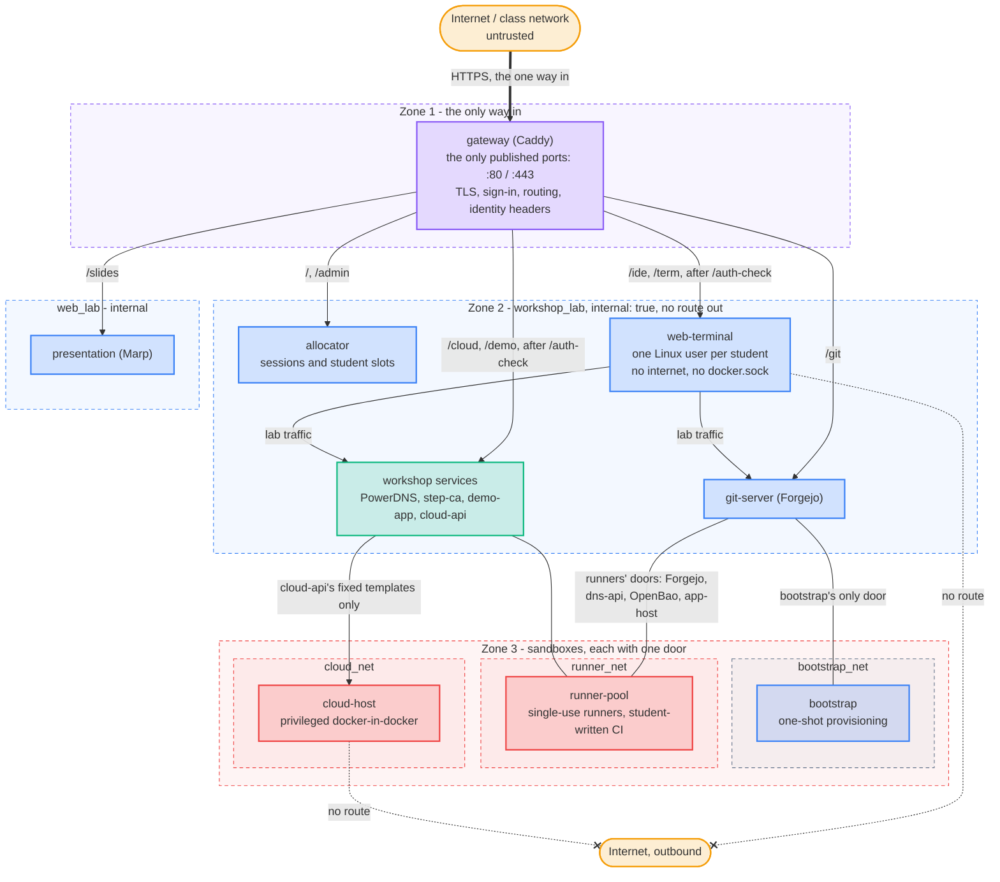

- **Zone 1:** `gateway` is the only container with published ports, so it is
  the only thing that needs a hole in a firewall. It is also the only
  container attached to both the outside and the inside.
- **Zone 2:** every lab network is a Compose network with `internal: true`, so
  it has no route to the internet. Student terminals can reach Forgejo and
  their workshop's services, and nothing outside. Tools are baked into the
  image (pinned and sha256-checked) because nothing can be downloaded at lab time.
- **Zone 3:** the parts that are risky by nature each get a network of their
  own with exactly one door. Provisioning can reach Forgejo and nothing else.
  Student-written CI can reach Forgejo and PowerDNS, never the allocator or the
  terminals. The privileged Docker host runs student containers, but only
  `cloud-api` can reach it, through a shared socket, using fixed templates.
  Students never speak Docker, and `cloud-api` itself drops every Linux
  capability except binding :443.

### 2. Identity: only the gateway can say who you are

The gateway signs everyone in and tells the services behind it who each request
is from. To make that claim impossible to forge, it always travels as a pair of
headers that Caddy sets itself: `X-Auth-User` (who) and `X-Gateway-Token` (a
secret from `engine/.env`, owner-only, that only Caddy and that one service know:
each upstream gets a token of its own, so one service can't replay another's).

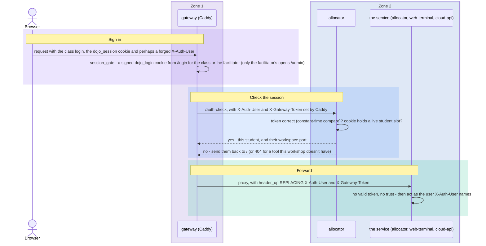

- **Headers are replaced, never passed through.** `header_up X-Auth-User ...`
  overwrites whatever the client sent, so a browser can't claim to be someone
  else by setting the header itself.
- **The token proves the request came through Caddy.** All students share one
  network, so a terminal can reach `allocator` or `cloud-api` directly. Without
  `X-Gateway-Token` those requests are refused (the Dojo Cloud portal answers
  `401`) before the identity header is ever read.
- **The cookie says which student.** The class shares one sign-in, so the
  student's own identity lives in their `dojo_session` cookie, which the
  allocator issues and checks on every `/auth-check`. A released or
  never-assigned session can't reach a workspace, even with the class password.
- **The facilitator has a separate door.** `/admin` accepts only a session
  signed in as the facilitator; the class login gets 403.

### 3. Kernel checks: students share a container, not an identity

Every student's shell, VS Code and terminal run in one `web-terminal`
container, and all students share its network namespace, so a source IP never
identifies anyone. Separation comes from Linux users instead, and the kernel
enforces it.

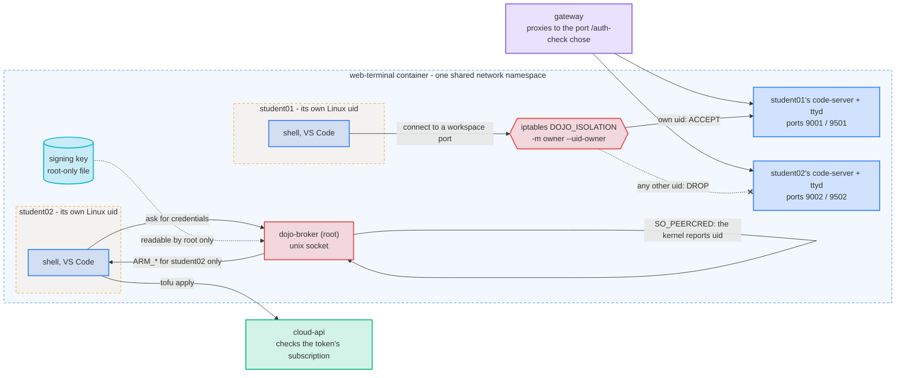

- **One Linux user per student.** `entrypoint.sh` creates `student01`..`studentNN`,
  each with its own uid and home directory. No student runs as root (the
  facilitator's shell does, by default, so they can help anyone). Homes are
  `0700`, and student Linux passwords are locked, so `su - student02` from
  student01's shell fails.
- **Each student has their own Forgejo login.** Every student's Forgejo password
  is derived from `STUDENT_PASSWORD_SEED` and their name, so one student's
  password doesn't open another's account. At start each terminal gets a scoped
  Forgejo token in `~/.git-credentials` and `~/.netrc` (both `0600`), so `git`
  and `curl` never ask for a password. The facilitator's Roster shows a
  student's password on demand (**Password** on their tile).
- **Workspace ports belong to their owner.** Each student's code-server and ttyd
  listen on a port of their own (9000+N and 9500+N). An `iptables` chain with an
  `owner` match lets a uid connect only to its own ports and drops everything
  else in those ranges, so student01 can't open student02's terminal from inside
  the container. From outside, only the gateway reaches them: it shares the
  `terminal_ingress` network with the terminal, and those ports are dropped on
  every other network. It only ever sends a request to the port `/auth-check`
  chose.
- **Each student sees only their own processes.** A student's IDE and terminal
  run in a PID namespace of their own, so `ps` shows nothing of a neighbour's
  command lines. The facilitator and the demo bots stay outside it.
- **Cloud credentials come from the kernel, not from the student**
  (tofu-basics). A shell asks the root-owned broker for its `ARM_*` values over
  a unix socket. The broker asks the kernel who is on the other end
  (`SO_PEERCRED`), so a student can only get their own credentials. The key that
  derives them is readable by root only, and `cloud-api` accepts a token only
  for that student's own subscription. The `openbao` module's identity broker
  (vault-fundamentals) works the same way: it signs a short-lived JWT only for
  the account on the other end of its socket, which OpenBao trades for a token.

### Other hardening

- **Sign-in.** The gateway refuses the default class and facilitator passwords
  off loopback and rate-limits wrong logins. `/slides` sits behind the class
  login. Plain HTTP off localhost prints a warning, and HTTPS sends HSTS.
- **Pages and services.** The allocator's pages run under a strict CSP with no
  inline script, and student-supplied text is only ever shown as text. The
  allocator is threaded, with a rate limit on new student assignments, so idle
  sockets can't stall sign-in.
- **Limits.** Each student's processes are capped, OpenBao has a request-rate
  quota per namespace, and `app-db`, `dns-api` and Dojo Cloud limit connections
  and request rates. Each limit is an env setting, and 0 turns it off.
- **Containers.** Runner-pool, app-host and their shims drop capabilities and
  set `no-new-privileges`. External images are pinned by digest. Every identity
  and control-plane decision writes one JSON log line.
- **Shared services.** CI writes DNS only with a Forgejo ID token issued for
  the class repository's `main` branch (`dns-gate`), so a pull request can't
  change live records. Each account has its own DNS key.

The threat-model report is in `threat-model-20260926-154208/`, and
[`RELEASES.md`](RELEASES.md) says which findings are fixed, partial or accepted.

### Who can reach what

Rows are the caller; a ✓ is a real network path. Everything else is either
blocked by network isolation or never routed.

| From ↓ / To → | `git-server` | `presentation` | `dns-server` | `step-ca` / `demo-app` | `cloud-api` | `cloud-host` | Internet |
| ------------- | :----------: | :------------: | :----------: | :--------------------: | :---------: | :----------: | :------: |
| Student terminal | ✓ | — | dns-as-code, cert-autorenewal | cert-autorenewal | tofu-basics (:443; :8080 needs the gateway token) | — | — |
| `gateway` | ✓ | ✓ | — | `/demo` (cert-autorenewal) | `/cloud` (tofu-basics) | — | published :80/:443 in, nothing else |
| `runner-pool` (dns-as-code: also `dns-api`; vault-fundamentals: also `openbao`, `app-host`) | ✓ | — | dns-as-code | — | — | — | — |
| `step-ca` (cert-autorenewal) | — | — | ✓ | ✓ | — | — | — |
| `cloud-api` (tofu-basics) | — | — | — | — | — | ✓ | — |
| `bootstrap` | ✓ | — | — | — | — | — | — |

vault-fundamentals adds `openbao` (`workshop_lab`), which the student terminal and app-host reach and the gateway fronts at `/ui` and `/v1`, and `runner_net`, which only the runner pool, `git-server`, `openbao` and `app-host` join.
