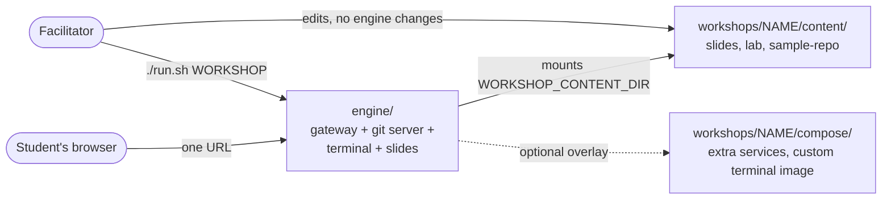
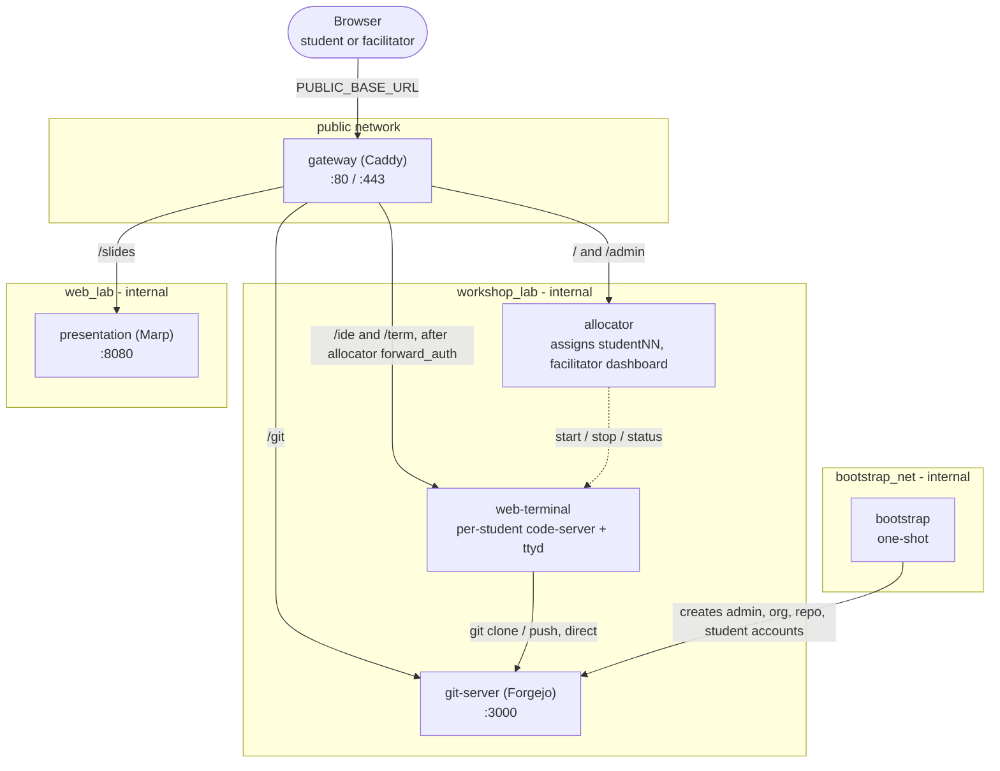
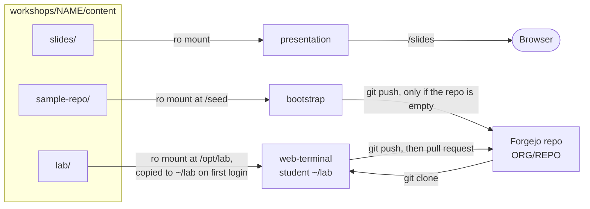
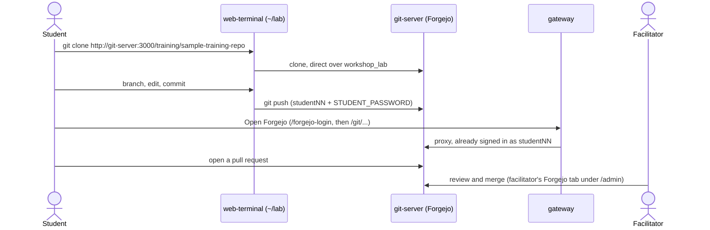
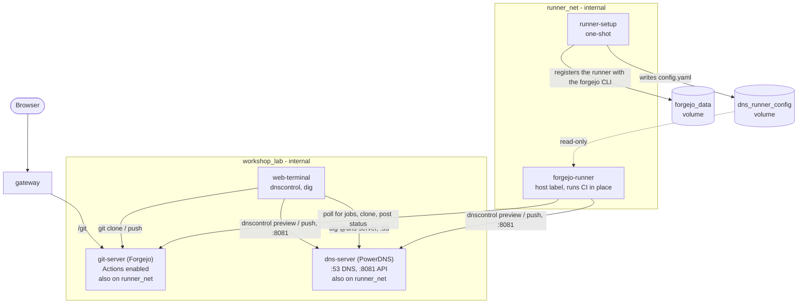
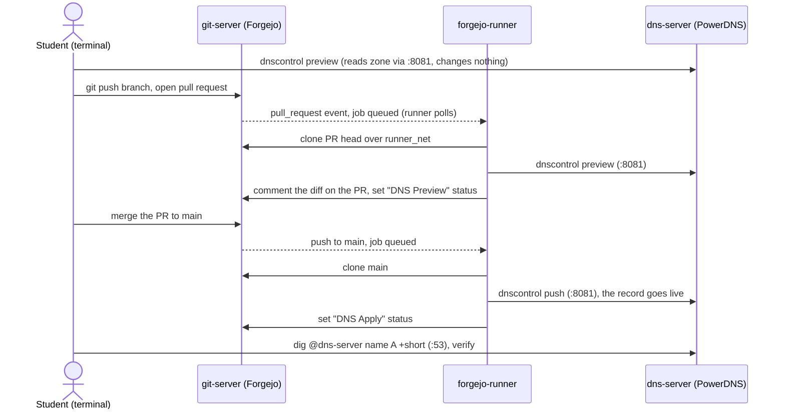
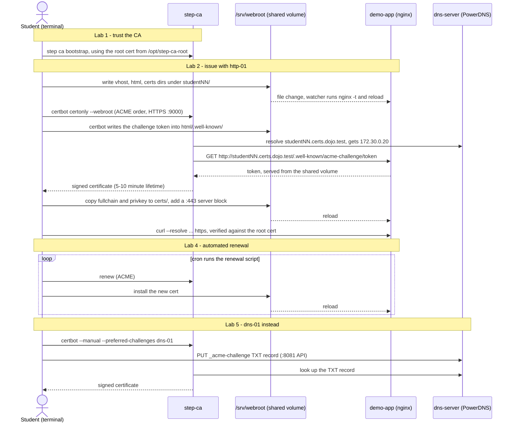
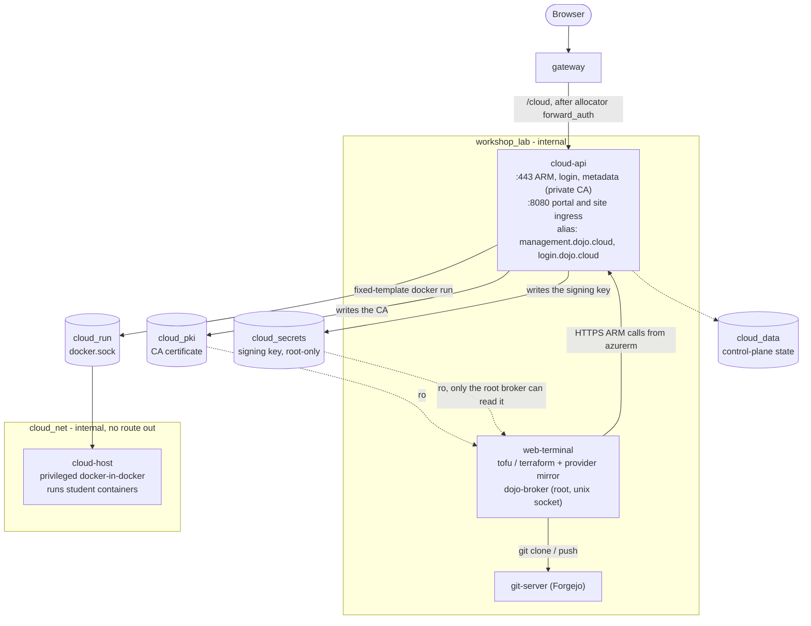
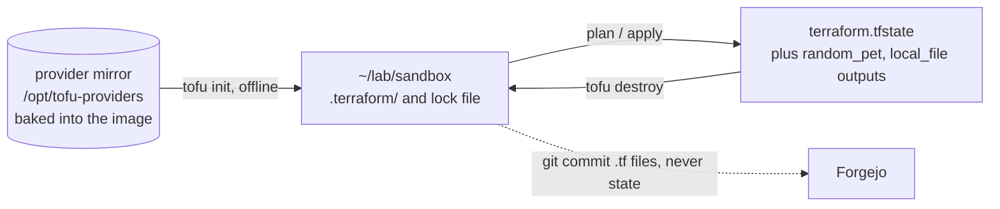
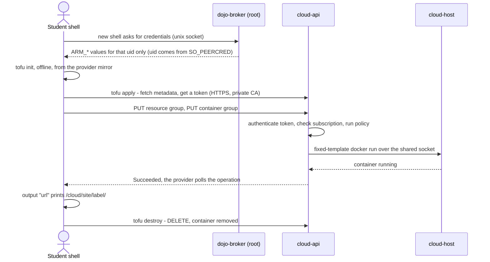

# GitOps Dojo

**A self-contained, offline, hands-on learning environment for practical
infrastructure skills.**

GitOps Dojo runs short-lived workshops where students do the real work: they
push commits and open pull requests, watch CI change a live DNS server, get TLS
certificates from a working ACME authority, and deploy containers into a cloud
that the real `azurerm` provider talks to. Every exercise uses real tools
against real services. Each workshop's lab is built for one class and removed
completely at the end.

**Zero install for students.** A student opens one URL in any browser and gets
their own VS Code, terminal, git server, slides and lab guide, already signed
in. There is nothing to download, no accounts to create and no laptop setup to
debug before the class can start.

**Fully self-contained and offline.** Everything a class needs runs inside the
stack: the git server, CI runners, DNS servers, a certificate authority and a
practice cloud. Once the images are built, a session needs no internet and no
outside accounts. Every tool is baked in, pinned to a version and checked
against a sha256.

**Ephemeral by design.** `./run.sh <workshop>` starts a whole lab on a laptop or
a single VM, and `./run.sh stop` removes it without a trace. Each class starts
clean, and several workshops run on the same engine.

**Safe to break.** Student terminals have no internet and no Docker socket. The
DNS zones, certificates and cloud resources belong to the lab, so a mistake
is part of the lesson and never an incident.

```sh
./run.sh setup              # first time only: writes engine/.env
./run.sh list               # which workshops exist
./run.sh tofu-basics        # build and start one
./run.sh tofu-basics --test # the same, with simulated students
./run.sh stop               # tear down and wipe
```

## What's here

### The workshops

| Workshop | What students learn | Labs | Length |
| -------- | ------------------- | ---- | ------ |
| [**Git Fundamentals**](workshops/git-fundamentals/) | The core git workflow: clone, branch, commit, push, pull request, then reviewing and undoing changes, stashing, reading history and resolving merge conflicts. | 5 | 60 min |
| [**DNS as Code**](workshops/dns-as-code/) | Managing DNS records in git with `dnscontrol`. A pull request runs a CI preview, and merging it applies the change to a live PowerDNS server. | 5 | 45-60 min |
| [**Certificate Autorenewal**](workshops/cert-autorenewal/) | Getting TLS certificates over ACME from a private CA with `certbot` and `acme.sh`, installing them on a real web server, automating renewal (certificates last 5-10 minutes, so students see renewals happen) and the dns-01 challenge. | 5 | ~75 min |
| [**OpenTofu Basics**](workshops/tofu-basics/) | The Terraform workflow (`init`, `plan`, `apply`, `destroy`) and how an IaC repo is laid out. Track A is an offline sandbox. Track B deploys real containers through the real `azurerm` provider into **Dojo Cloud**, an Azure-inspired practice cloud with a portal, policies, quotas and drift. `terraform` runs OpenTofu. | 11 | ~2¼ h |

Each workshop pack has its own slide deck, lab guides, cheat sheet and a seed
repository. The lab guides are copied into every student's `~/lab` and shown
in the browser.

### The platform

- **One URL per class.** A Caddy gateway is the only exposed service. It assigns
  each browser a student account and routes it to that student's VS Code
  (code-server), terminal (ttyd + tmux), the Forgejo git server and the Marp
  slides, all signed in already.
- **A facilitator workspace at `/admin`.** A live roster with a read-only view
  of every student's terminal, a Release button to free a stuck account, a
  service status strip, and the facilitator's own VS Code, Terminal, Forgejo,
  Slides and Dojo Cloud tabs. The **Class progress** board (tofu-basics) shows
  where each student has got to.
- **Isolated labs.** Student terminals have no internet and no Docker socket.
  Every tool is baked into the workshop's image, pinned to a version and checked
  against a sha256. Extra services sit on internal-only networks, and anything a
  student can reach checks a gateway token before trusting who the caller is.
- **Workshops are plug-ins.** A workshop is a folder under `workshops/`: a
  `workshop.env`, its content and, only if it needs one, a Compose overlay that
  adds services or a different terminal image. The engine is never edited to
  add a workshop. See [`workshops/README.md`](workshops/README.md).
- **Demo bots.** `--test [N]` adds up to 35 simulated students (expert,
  intermediate and novice personas) who work through the labs for real, pushing
  branches and opening pull requests. Use them to rehearse solo, demo the
  admin dashboard or load-test a machine before a class.
- **Runs on one machine.** A laptop for rehearsal or a single cloud VM for a
  real class, with Docker or Podman. `./run.sh capacity --students 30` sizes the
  per-student memory and process limits for that host. Nothing persists once the
  stack is stopped.

### Beyond the live lab

- **Take-home handouts** ([`handouts/`](handouts/)): the Git Fundamentals and
  DNS as Code labs adapted for self-paced practice against a student's own
  GitHub account (and, for DNS, a local PowerDNS stack or a real Cloudflare
  domain).
- **Azure DevOps edition** of Git Fundamentals
  ([`workshops/git-fundamentals/delivery-azure-devops/`](workshops/git-fundamentals/delivery-azure-devops/)):
  the same session delivered against Azure Repos, with a facilitator guide,
  checklists and a feedback survey.
- **Facilitator guides.** [`engine/README.md`](engine/README.md) covers setup,
  deployment, the admin workspace, mid-session content updates, cleanup and
  troubleshooting. OpenTofu Basics also has a run-of-show in
  [`FACILITATOR.md`](workshops/tofu-basics/FACILITATOR.md).
- **Tests.** OpenTofu Basics ships an end-to-end suite and a load test against
  the live stack ([`workshops/tofu-basics/tests/`](workshops/tofu-basics/tests/)),
  and Dojo Cloud's control plane has its own unit tests.

## Who it's for

Engineering and IT operations teams: people who use git every day, and people
who have never used version control. It assumes comfort with a terminal and no
git knowledge. The workshops build on each other: Git Fundamentals gives
everyone the clone, branch, pull request routine, and the later workshops apply
that routine to real operational work, where a change goes through review and
automation instead of being made by hand.

## Status and roadmap

| Workshop | Status |
| -------- | ------ |
| Git Fundamentals | Ready |
| DNS as Code | Ready |
| Certificate Autorenewal | Ready |
| OpenTofu Basics | Built and tested live. A human dry-run and a final browser pass remain ([`PLAN.md`](workshops/tofu-basics/PLAN.md)). |
| **Vault Fundamentals** (OpenBao) | Planned: secrets in code, git, pipelines and deployments, on a real OpenBao with CI runners ([`keyvault-workshop-plan.md`](keyvault-workshop-plan.md)). |
| Git follow-ups: branching workflows and pull requests; conflicts, rebasing and recovery; pre-commit hooks and CI | Ideas, not started |

## Repository layout

```text
├── run.sh                    # Forwards to engine/run.sh
├── engine/                   # The shared runtime: gateway, allocator, web-terminal, Forgejo, slides
│   ├── README.md             # Setup, routing, auth, facilitator operations, troubleshooting
│   └── scripts/              # env setup, capacity calculator, teardown, shell completion
├── workshops/
│   ├── README.md             # How workshops are selected and how to add one
│   ├── assets/               # Shared slide theme and the in-browser lab reader
│   ├── git-fundamentals/     # Content only; also the Azure DevOps delivery mode
│   ├── dns-as-code/          # + PowerDNS, Forgejo Actions runner
│   ├── cert-autorenewal/     # + step-ca, PowerDNS, shared nginx demo app
│   └── tofu-basics/          # + Dojo Cloud (cloud-api, cloud-host); PLAN.md, FACILITATOR.md, tests/
├── handouts/                 # Take-home versions of the labs
├── assets/branding/          # Shared branding
└── keyvault-workshop-plan.md # Plan for the next workshop (vault-fundamentals)
```



## Where to go next

- **Run a class:** [`engine/README.md`](engine/README.md), then the workshop's own README.
- **Add a workshop:** [`workshops/README.md`](workshops/README.md).
- **Understand how it fits together:** keep reading.

## How the platform is put together

Every workshop runs on the same engine, so the base topology is identical
each time. A workshop only ever *adds* to it. The sections below first show
the shared base, then what each workshop adds to it — its extra services,
who can reach whom, and how data moves through its labs.

### The shared engine (every workshop)

Only `gateway` has a published port. Everything else sits on internal-only
networks, so the gateway is the sole entry point and the only thing that
needs a hole in a firewall.



`git-server` is attached to both `workshop_lab` and `bootstrap_net`;
`bootstrap` lives on `bootstrap_net` only, so it can reach Forgejo and
nothing else. Full routing, auth and request flow:
[`engine/README.md`](engine/README.md#architecture).

**What a student's terminal can reach.** It sits only on `workshop_lab` —
no internet, no `docker.sock`, and every student account shares one network
namespace, so a source IP never identifies a student. It reaches
`git-server:3000` directly and can't reach `presentation` (slides are
browser-only). Any tool a workshop needs is baked into that workshop's
terminal image, pinned and checksum-verified.

### How workshop content flows into the engine (every workshop)

This is the one dataflow every workshop shares. A workshop's `content/`
folder is bind-mounted read-only into three places; nothing is copied into
an image.



`lab/` files a student has already edited are never overwritten by an
update. `FORGEJO_ORG`/`FORGEJO_REPO` come from the workshop's
`workshop.env`.

### Summary: what each workshop adds

| Workshop | Extra services | Extra networks | Terminal image adds | Data leaves the terminal to |
| -------- | -------------- | -------------- | ------------------- | --------------------------- |
| `git-fundamentals` | none | none | nothing (base image) | Forgejo only |
| `dns-as-code` | `dns-server`, `runner-setup`, `forgejo-runner` | `runner_net` | `dnscontrol`, `dig`, `python3` | Forgejo, PowerDNS |
| `cert-autorenewal` | `dns-server`, `dns-seed`, `step-ca`, `demo-app` | static subnet on `workshop_lab` | `step`, `certbot`, `acme.sh`, `openssl`, `dig`, `jq` | step-ca, PowerDNS, shared webroot volume |
| `tofu-basics` | `cloud-api`, `cloud-host` | `cloud_net` | `tofu` (also `terraform`), offline provider mirror, credential broker | `cloud-api` (Track B) |

Everything below is layered on the shared engine above — any service or
network not named there is unchanged.

---

### `git-fundamentals` — content only

**Infrastructure and connectivity:** the shared engine, exactly as-is. No
overlay, no extra services.

**Dataflow.** The labs are pure git against Forgejo. Clone, push and PR
review all talk to `git-server`; the browser only ever sees Forgejo through
the gateway.



Git traffic never goes through the gateway — pushes and clones go straight
from the terminal to `git-server:3000`, and only the browser UI is proxied.

---

### `dns-as-code` — Forgejo Actions runner + PowerDNS

**Infrastructure and connectivity.** Adds a PowerDNS authoritative server
and a CI runner. The runner executes student-authored workflow steps
directly on its own filesystem (no sandbox, no `docker.sock`), so it lives
on its own `runner_net` and can reach only `git-server` and `dns-server` —
never `allocator` or `web-terminal`.



**Dataflow.** One change travels the whole loop: local preview, PR, CI
preview, merge, CI apply, verify. The record only goes live when CI pushes
it after the merge — not when the student pushes their branch.



Zone data lives only in the PowerDNS container's own filesystem, so it
resets on every teardown. Credentials for the API (`creds.json`) are in the
seeded repo and are workshop-only, not secrets.

---

### `cert-autorenewal` — ACME CA + DNS + shared demo app

**Infrastructure and connectivity.** Adds a private ACME certificate
authority, a PowerDNS server that resolves every student's hostname, and one
shared nginx that serves every student's site. All of it lives on
`workshop_lab`, whose subnet is pinned (`172.30.0.0/24`) so `dns-server`
(`.10`) and `demo-app` (`.20`) have stable addresses that `step-ca` and the
seeded DNS records can point at.

Students never touch `demo-app` directly. Isolation is per-student
ownership of a subdirectory on a shared volume, not per-container. A
watcher inside `demo-app` reloads nginx when files change, so no
`docker.sock` or cross-container exec is needed.


The CA's private keys stay in `step-ca`'s own volume; only the public root
certificate is shared into the terminal. This workshop's `sample-repo` is
mounted straight into `~/lab/sample-repo` — there is no Forgejo clone step
in its labs.

**Dataflow.** Two proofs of control (http-01 in Labs 2–4, dns-01 in Lab 5)
and one renewal loop.



The `/demo` link on the workshop homepage is HTTP-only and never touches a
student's certificate, so `curl --cacert` from the terminal is the real
check that a cert is valid.

---

### `tofu-basics` — offline sandbox + "Dojo Cloud"

Two tracks. **Track A** (sandbox) needs no infrastructure beyond the swapped
terminal image. **Track B** (Dojo Cloud) adds an Azure-inspired control
plane that the real `azurerm` provider talks to, so students run
`init`/`plan`/`apply`/`destroy` against something that behaves like a cloud.

**Infrastructure and connectivity.** The privileged `cloud-host` (a
Docker-in-Docker daemon that actually runs student containers) is
acceptable only because it is boxed in: it sits on an internal network with
no route to the internet or to any student, publishes nothing, and has no
listener except a unix socket shared with `cloud-api`. `cloud-api` is the
only thing that ever talks to it, using fixed templates — students never
speak Docker.



The gateway routes `/cloud` to `cloud-api`'s `:8080` listener: the Dojo
Portal at `/cloud/` and each deployed site at `/cloud/site/<label>/`. The
route and the landing-page card only exist when the workshop sets
`CLOUD_ENABLED`, and the facilitator gets a matching **Dojo Cloud** tab in
`/admin`. `cloud_data` mirrors control-plane state to disk so a
`cloud-api` restart doesn't forget what was deployed; `./run.sh stop` still
wipes it.

**Dataflow — Track A (sandbox).** Fully local; nothing leaves the
terminal container.



**Dataflow — Track B (Dojo Cloud).** The student never holds a long-lived
secret: the broker derives that student's credentials from the caller's
real uid, and `cloud-api` authorises every call against the token's own
subscription.



Policy rejections come back as ARM-shaped errors (a required tag missing,
a disallowed region, an oversized container, over quota) so the labs can
teach reading real-looking failures.

---

## Who can reach what

Rows are the caller; a ✓ is a real network path. Everything else is either
blocked by network isolation or never routed.

| From ↓ / To → | `git-server` | `presentation` | `dns-server` | `step-ca` / `demo-app` | `cloud-api` | `cloud-host` | Internet |
| ------------- | :----------: | :------------: | :----------: | :--------------------: | :---------: | :----------: | :------: |
| Student terminal | ✓ | — | dns-as-code, cert-autorenewal | cert-autorenewal | tofu-basics (:443; :8080 needs the gateway token) | — | — |
| `gateway` | ✓ | ✓ | — | `/demo` (cert-autorenewal) | `/cloud` (tofu-basics) | — | published :80/:443 in, nothing else |
| `forgejo-runner` (dns-as-code) | ✓ | — | ✓ | — | — | — | — |
| `step-ca` (cert-autorenewal) | — | — | ✓ | ✓ | — | — | — |
| `cloud-api` (tofu-basics) | — | — | — | — | — | ✓ | — |
| `bootstrap` | ✓ | — | — | — | — | — | — |

Three deliberate boundaries carry the security model: `bootstrap_net`
(provisioning can reach Forgejo and nothing else), `runner_net` (student-authored
CI can't reach the control plane), and `cloud_net` (the privileged host is
reachable only through `cloud-api`'s fixed templates).
