# CTF workshop series: plan

Status: **draft 2, 2026-10-03.** Has replaced `dojo_ctf_planning.md`, now deleted. Nothing here is built. Items
marked **(spike)** are claims or designs that must be proven before anyone relies on them.

## 1. The idea in one paragraph

A series of capture-the-flag sessions on the existing Dojo engine. Each student gets a browser terminal (their attack
box, loaded with security tools) and a private vulnerable target that no classmate can reach. They hunt per-student
flags, submit them with a small CLI, and watch their points land on the achievements leaderboard. The series is a
ladder: classic boot2root warm-ups first, then GitOps-flavored targets that attack the things the other workshops
build (secrets in git history, a CI runner that runs untrusted jobs, state files with credentials, an exposed vault).
The last session turns it around: students defend their own target with git and CI.

## 2. Where it sits

- **A new module, `ctf-range`, plus one thin workshop pack per session.** The range (targets, firewall rules, flag
  service, terminal tools, and for CTF-5 the attacker bots and SOC feed — section 8.2) is reusable, so by the rule
  in `workshops/README.md` it is a module. Each session is a workshop pack that lists `MODULES="ctf-range ..."`,
  names which targets it uses and ships its labs and slides.
- **No engine changes.** Everything below is expressed as module compose, terminal image links, `start.d` hooks,
  `extensions.json` and the achievements catalog. If a step seems to need an engine edit, stop and re-check (see
  section 11, S1).
- **Builds on:** `git-fundamentals` for the git steps; the GitOps targets lean on `runner-pool`, `openbao` and
  `dojo-cloud` where a target needs a real CI runner, vault or cloud API.

## 3. What the first draft got wrong about this repo

| Draft assumed | Reality | Consequence |
|---|---|---|
| A pair of containers per student | One shared `web-terminal` container, one uid per student; the allocator never touches `docker.sock` | Targets are a fixed fleet, one per slot (section 4) |
| `TERMINAL_IMAGE`, `MODULES="student-isolated-network"` | The terminal image is a build chain; `MODULES` names folders in `modules/` | Tools go in `compose/terminal/Dockerfile`; the network lives in `ctf-range/compose.yml` |
| Attack box pinned to `10.99.0.10` | All students share one terminal container and one IP on the range network | Per-student separation is by uid firewall rules, as `DOJO_ISOLATION` already does |
| Nav cards `title/description/url` | Cards are `id/label/desc/href/icon`, validated by the renderer, and each needs a matching `/admin` tab | Use the real schema (section 9) |
| `ctfd` for scoring | A second login and identity outside the gateway; a second thing to reset | Use the achievements module (section 5) |
| One static flag in `flag.txt` | A shared flag is passed around the room | Per-student derived flags (section 5) |
| `version: "3.8"` compose key | Obsolete; ignored by modern Compose | Drop it |

## 4. Architecture: one target per slot

```mermaid
flowchart TB
    browser["Student browser"]

    subgraph gw["Gateway (Caddy) — only exposed service"]
        gateway["gateway"]
    end

    subgraph lab["workshop_lab network (existing, internal)"]
        allocator["allocator"]
        wt["web-terminal\n(student01..NN, one shared container,\nper-uid isolation)"]
        flags["ctf-flags service\n(section 5)"]
    end

    subgraph range["ctf_net (new, internal: true, no route out)"]
        t1["target-01"]
        t2["target-02"]
        tdots["..."]
        tn["target-NN"]
    end

    browser --> gateway
    gateway --> allocator
    gateway --> wt
    wt -.->|"auth-check"| allocator
    wt -->|"per-uid OUTPUT rule:\nstudentNN -> target-NN only"| t1
    wt --> t2
    wt --> tn
    wt -->|"dojo-flag submit"| flags
    t1 -.->|"reverse shell,\nfixed listener port range"| wt

    style range fill:#2d1b1b,stroke:#c0392b
    style lab fill:#1b2d1b,stroke:#2d8a2d
```

No edge connects `ctf_net` to the gateway, `workshop_lab`'s other services, or any other workshop's network —
targets reach nothing outbound, and each student's firewall rule permits exactly one target.

- **Targets.** `ctf-range/compose.yml` defines `target-01 .. target-NN` on `ctf_net`, an internal network with no
  route to the internet, the gateway, Forgejo or `workshop_lab`. Compose cannot loop, so the fleet size follows
  `STUDENT_COUNT` through a generated fragment **(spike CTF-S1)**.
- **Terminal side.** `web-terminal` joins `ctf_net` (map form, `ctf_net: {}`, because `web-terminal` already uses the
  map form). A `start.d/50-ctf-range.sh` hook adds the firewall rules.
- **Outbound isolation.** In the `OUTPUT` chain, `studentNN`'s uid may reach `target-NN`'s address and nothing else on
  the `ctf_net` subnet; everything else on it is dropped. Same shape as `DOJO_ISOLATION`, owner match per uid.
- **Target-to-target.** Targets must not reach each other, or one student's compromised box becomes a pivot onto a
  classmate's. Candidate mechanisms: one network per target joined by the terminal; a per-network `enable_icc=false`;
  firewall rules in a sidecar. Which of these work on both Docker and rootless Podman is **spike CTF-S2**.
- **Reverse shells need a return path.** The target must connect back to a listener in the student's terminal, and
  another student must not be able to connect to that listener. Plan: each student gets a fixed listener port
  range (for example `4000 + NN*10 .. +9`, chosen outside 9000-9099 and 9500-9899). `INPUT` accepts it only from
  `target-NN`, and loopback to that range is owner-matched like the IDE ports. Labs tell students which ports are
  theirs. **Spike CTF-S3**: confirm `ncat -lvnp` on those ports, firewall behavior with both runtimes, and that
  `OUTPUT`/`INPUT` rules survive a student reset.
- **Resources.** `ctf-range` sets a per-target `mem_limit`, `cpus` and `pids_limit`. Size by `STUDENT_COUNT`, the
  same way `capacity-calc.sh` sizes the terminal. Targets are small (tens of MB); the fleet is cheap compared to
  one code-server.
- **Reset.** A `resets` entry (`phase=teardown`/`provision`) recreates `target-NN` from its image and re-issues its
  flags. It checks `X-Dojo-Reset-Token` in constant time like every reset hook, because students can reach the
  service on `workshop_lab`. The same path backs the per-target **Reset** button on the landing card (CTF-D20): it
  recreates the live target from its pristine image, restoring the starting state, and does not touch solved status
  or the student's flags.
- **Student-controlled targets, one live per slot (CTF-D20, CTF-1 to CTF-4 only).** A student picks which of their
  session's targets to run from a card on the landing page. At most one is live per student, so the room never
  exceeds N attack containers.
  - **Stable slot address.** `slot-NN` keeps one address on `ctf_net`; starting a target recreates the slot's
    container from that target's image. The per-uid firewall rule therefore never changes when a student switches.
  - **Card.** One per target: state (stopped, starting, live, solved), the slot **IP only, never the ports** (students
    find those with `nmap`), a short briefing, **Start/Stop**, **Reset**, and a flag text box under it.
    Starting a second target stops the first, after a confirmation. Targets are listed in the suggested order but
    none is locked.
  - **Flags and state.** HMAC flags derive from student and target, so they survive stop, start and reset. A solved
    target stays solved. Stop and reset both return a target to its clean state (nothing persists, deliberately).
  - **Start queue.** Start and Reset requests go into one FIFO queue in the controller, and at most about 10 run at
    once (tuned in S14), so a room that all clicks Start together doesn't spike the host. A queued card shows
    "queued, position N" and then "starting". A student can cancel while queued. A student has at most one request
    in the queue, so repeated clicks don't stack. Stops skip the queue, because they free resources.
  - **Limits.** Auto-stop after about 20 min with no traffic. Reset is rate-limited per student.
  - **Controller and `ctf-host` (CTF-D21).** Starting and stopping needs a container daemon, which the allocator never
    has and which must not be the host's. A privileged `docker:dind` container, `ctf-host`, sits on an internal
    network and holds the slot containers; a separate `ctf-controller`, unreachable from students, is its only client
    over a unix socket in a shared volume. This is the `cloud-host`/`cloud-api` pattern from `dojo-cloud`. No host
    socket is mounted anywhere. Each slot is an IP alias on `ctf-host` with the target's ports published on it; the
    controller creates the slot containers itself from `STUDENT_COUNT` (spike CTF-S1, S14).
  - **Exception: CTF-5.** Defend needs all four targets live at once, so it keeps one always-on target per
    target per student (160 at 40 students) and has no toggle. Reset there is a facilitator action only, since a
    reset would wipe the student's patch.
- **Multi-port targets.** The slot may expose several services so `nmap` is useful: the lab service on a non-default
  port, plus decoys or supporting services. Each target's spec lists its ports and marks which are decoys and
  which are on the path. Web-app lessons with nothing to discover say so in the briefing and may use one port.
- **Hardening for every target:** read-only root with only the tmpfs mounts the service needs (Apache, for one, needs
  writable `/var/run/apache2`, `/var/lock/apache2`, `/var/log/apache2`; **verify**), `cap_drop: ALL` plus only what
  the service needs, `no-new-privileges` unless the box's privesc is the point, never `privileged`, never the
  Docker socket, images pinned by digest (`--dry-run` fails otherwise). A box whose privesc is a deliberate
  misconfiguration (sudo, capabilities) is a misconfiguration inside the target, not a weakness in how the target
  is contained.
- **Ports.** Target services stay off 9000-9099 and 9500-9899.

## 5. Flags and scoring

- **Per-student flags.** `flag{<challenge>-<hex>}` where `<hex>` is `HMAC-SHA256(STUDENT_PASSWORD_SEED,
  "ctf:<challenge>:<user>")` truncated, the same derivation style as the Forgejo passwords. Targets receive only the
  flag values for their owner (compose env, rendered at start), never the seed. A flag copied from a classmate does
  not verify.
- **Submission.** `dojo-flag submit <challenge> <flag>` in the terminal; it talks to a small `ctf-flags` service on
  `workshop_lab`. The service verifies, then posts a signed event through `modules/_shared/adapter_client.py`, the
  way dns-gate, cloud-api and openbao-audit do. A wrong flag never raises or blocks the CLI.
- **Scoring.** Each challenge is an achievements `challenge` (or `verify` milestone) in
  `workshops/<name>/achievements/`, with the user flag and root flag as two milestones, points by difficulty and the
  existing two-hint rule (hints, no answers; `rules.md` already forbids answers in labs). Adding a `ctf` event source
  touches the achievements module, not the engine **(spike CTF-S4**: how small can that change be).
- **Facilitator view.** A `/admin` tab, **CTF Range**: per student, target up or down, flags earned, last submission
  time, and Reset. The students' terminals are already in the Roster watch tiles, so the room can see who is stuck.
- **No separate scoreboard service.** The achievements leaderboard is the scoreboard.

## 6. Safety and scope rules (hold for every session)

- Targets only ever live on `ctf_net`. No route to the internet, the gateway, Forgejo or other workshops' networks.
- The terminal gains offensive tools (below) only in the `ctf-range` terminal link, never in the base image, so
  other workshops' terminals are unchanged.
- Students aim tools at their own `target-NN`. The labs say so at the top, and the firewall enforces it: a scan
  of the range subnet shows exactly one live host.
- Real-world boundary stated in the slides: these techniques are only legal against systems you own or are
  authorized to test.
- Vulnerable software is built from original, minimal sources in this repo, not copied from HTB. Public CVE
  software (for example a vulnerable Samba or Apache version) is pinned by digest and never reachable from outside
  `ctf_net`.

## 7. The challenge ladder

All targets are original builds that teach the same techniques as well-known boxes. They are **Linux containers
only**: a Windows or Active Directory target cannot run in this stack (see the appendix). The ladder grew past ten:
rather than force a 1:1 fit between ten OWASP categories and however many workshops this platform teaches, it has
**fourteen** targets across three tiers (4 low, 5 medium, 5 hard), so each OWASP Top 10 (2021) category gets its
own target, each lab workshop that has an attackable concept gets its own target, and API-specific vulnerability
classes (distinct from the web-app Top 10) get their own targets too, with no double-booking.

### 7.1 OWASP Top 10 coverage

| OWASP category | Target | Note |
|---|---|---|
| A01 Broken Access Control | 1 `idor-pcap` | Direct object reference, no ownership check |
| A02 Cryptographic Failures | 3 `cert-trust-bypass` | Invalid certificate accepted; chain/revocation never checked |
| A03 Injection | 0 `sqli-login`, 4 `ping-tool` | SQL injection; OS command injection (two, since they're different enough to both teach) |
| A04 Insecure Design | 9 `policy-bypass` | No bug to find — the authorization *rule* is wrong |
| A05 Security Misconfiguration | 5 `leaky-config` | Debug/backup files exposed by the web server |
| A06 Vulnerable and Outdated Components | 6 `dns-resolver-cve` | A real CVE in a pinned old component |
| A07 Identification and Authentication Failures | 2 `weak-auth-portal` | No rate limit, a predictable password-reset token |
| A08 Software and Data Integrity Failures | 10 `runner-escape` | CI pipeline trusts untrusted input |
| A09 Security Logging and Monitoring Failures | 11 `tfstate-treasure` | The breach is only visible after the fact, in Vault's audit log |
| A10 Server-Side Request Forgery | 7 `ssrf-fetcher` | A "fetch from URL" feature reaches an internal-only service it shouldn't |

Every category now has a target that teaches *only* that category (A03 gets two, since SQL and command injection
are both worth teaching and neither crowds out the other). Nothing is a forced fit.

### 7.1b API Security Top 10 coverage

The web OWASP Top 10 doesn't say much about pure JSON/REST APIs with no HTML front end, which several of this
platform's own services are (`allocator`'s endpoints, `dns-api`, the achievements adapter, Dojo Cloud's API). Two
targets are API-only (no browser UI at all — tools are `curl`/`jq`, not `gobuster`) and map to the
[OWASP API Security Top 10 (2023)](https://owasp.org/API-Security/editions/2023/en/0x11-t10/) instead:

| API category | Target | Note |
|---|---|---|
| API1:2023 Broken Object Level Authorization | 1 `idor-pcap` | Same bug as A01 above — BOLA is what A01 looks like on an API |
| API3:2023 Broken Object Property Level Authorization | 12 `api-mass-assignment` (NEW) | A `PATCH` accepts fields the client shouldn't be able to set |
| API5:2023 Broken Function Level Authorization | 13 `api-bfla` (NEW) | An authenticated low-privilege token can call an admin-only route because the API checks *who you are*, not *what you're allowed to call* |

### 7.2 Workshop-concept coverage

| Workshop | Target | What the target attacks |
|---|---|---|
| `git-fundamentals` | 8 `git-secrets` | History is forever; deleting a file does not revoke what it held |
| `tofu-basics` | 11 `tfstate-treasure` | State files are secrets too |
| `vault-fundamentals` | 11 `tfstate-treasure` | A leaked credential's blast radius; the audit log as the detection path |
| `dns-as-code` | 6 `dns-resolver-cve` | The DNS resolver itself, not the zone data, can be the weak link |
| `cloud-policy-as-code` | 9 `policy-bypass` | A policy that compiles and passes `opa test` can still be the wrong rule |
| `cert-autorenewal` | 3 `cert-trust-bypass` | A service that accepts a certificate it should have rejected |
| `dojo-introduction` | none | It's a facilitator tour, not a lab — nothing to attack |

Targets 0, 1, 2, 4, 5, 7 teach general web/Linux/API technique and aren't tied to a specific workshop, same as the
original draft's warm-ups.

### 7.3 The ladder

| # | Tier | Target | Foothold | Escalation / second flag | Teaches |
|---|---|---|---|---|---|
| 0 | Low | `sqli-login` (the PHP box in the old draft, kept as the warm-up) | SQL injection login bypass | none; single flag shown in the page | Reading a login query, `' OR 1=1 --`, why parameterized queries exist |
| 1 | Low | `idor-pcap` (the old draft's `pcap-dashboard`) | IDOR on `/data/<n>` downloads a `.pcap` with cleartext FTP credentials | A Python binary with `cap_setuid` | Enumeration, pcap reading (`tcpdump`/`tshark`), Linux capabilities |
| 2 | Low | `weak-auth-portal` (NEW) | No login rate limit plus a time-based, guessable password-reset token | The reset token for a second, higher-privileged account | Why "add a CAPTCHA" isn't the fix, token entropy, timing/guessability |
| 3 | Low | `cert-trust-bypass` (NEW, ties `cert-autorenewal`) | An internal API meant to require a client certificate accepts an expired or self-signed one because it skips chain/revocation checks | The accepted identity unlocks a second endpoint | Certificate chains, expiry and revocation, why "it has a cert" isn't "it has a *valid* cert" |
| 4 | Medium | `ping-tool` | Command injection in a "network diagnostics" page, reverse shell | `sudo -l` shows a passwordless GTFOBins binary | Reverse shells and the return-path ports, `sudo` audit, GTFOBins |
| 5 | Medium | `leaky-config` | A web admin panel exposes logs and a config backup holding credentials | Credentials reused for a local service | Post-exploitation enumeration, credential hygiene, log reading |
| 6 | Medium | `dns-resolver-cve` (NEW, ties `dns-as-code`) | A `dnsmasq` 2.77 resolver pinned to an old version with **CVE-2017-14491** (2-byte heap overflow in the DNS reply path): the target's resolver forwards to an attacker-controlled authoritative server inside `ctf_net`, which returns a crafted response that overflows the heap | Access gained through the resolver reaches a second flag on the same host | Why resolver software is itself an attack surface, CVE research, why pinning by digest cuts both ways — you must *update* the digest (bump 2.77 → 2.78), not just set one |
| 7 | Medium | `ssrf-fetcher` (NEW) | A "preview this URL" feature fetches server-side and can be pointed at `ctf_net`'s internal addresses instead of the internet | Reaches an internal-only admin endpoint on another service in the same target, not another student's target | Why outbound requests from a server are a trust boundary, allow-lists versus deny-lists, cloud-metadata-style SSRF without needing a real cloud metadata endpoint |
| 12 | Medium | `api-mass-assignment` (NEW, API-only) | A JSON `PATCH /users/me` endpoint binds the whole request body to the user object, so adding `"role":"admin"` to the payload sets it | The elevated token reaches a second, admin-only route | API1/API3-style mass assignment, why a JSON body isn't automatically a trusted struct, allow-listing bindable fields |
| 8 | Hard | `git-secrets` (GitOps, ties `git-fundamentals`) | A seed repo in Forgejo with a secret removed in a later commit but still in history | The recovered token reaches a second target | `git log -p`, `git secrets`-style scanning, why deleting a file is not revoking a secret |
| 9 | Hard | `policy-bypass` (GitOps, ties `cloud-policy-as-code`) | A Dojo Cloud Policy / Rego rule has a logic gap (a missing `deny` case, a default-allow fallthrough) that lets a request through the policy was meant to block | The gap reaches a resource the policy should have fenced off | Insecure design versus a bug: the policy has no syntax error and passes `opa test`; the *rule itself* is wrong |
| 10 | Hard | `runner-escape` (GitOps, needs `runner-pool`) | A workflow in a fork runs attacker-controlled code on a shared runner | Read another job's leftover state; expected to fail, which is the point | CI trust boundaries, `pull_request` vs `pull_request_target`, why runners are single-use |
| 11 | Hard | `tfstate-treasure` (GitOps, ties `tofu-basics` + `vault-fundamentals`) | `terraform.tfstate` committed or left in a bucket-like share, containing credentials | Credentials open a vault path; the debrief has students find the access in Vault's Audit tab | State files as secrets, remote state, least privilege, detection after the fact |
| 13 | Hard | `api-bfla` (NEW, API-only) | A valid student-scoped API token can call `POST /admin/reset-all` because the route checks the token is *valid*, not that it's a facilitator token | Resets every student's progress, which the solve script treats as "exploit confirmed" without actually running it against the live range | API5-style broken function-level authorization, why "authenticated" and "authorized" are different checks, the same shape of bug as `allocator`'s own `X-Auth-User` trust model if it were ever done wrong |
| 14 | Hard | `customer-portal` (NEW, CTF-5 defend-only) | SQL injection in a login/search field dumps a **plaintext SQLite** table of synthetic customer records that reference the student (name, email, a cleartext password, an account id tied to their handle) | A successful dump is posted to the room-wide **wall of shame** (8.12), in front of everyone; the student defends by fixing the query — PR → scan → merge to main → rebuild → redeploy the running app (S6) — after which the dump fails and their entry is marked contained | The full patch → PR → scan → merge → deploy loop (the GitOps payoff); SQL injection and data exfiltration; why app data stored in cleartext makes a breach worse |

Rungs 8-11 and 14 (and 3, 6, 7, 9, 12, 13) reuse existing modules instead of new code wherever they can; 14 is a new custom app build (defend-only). Which ones need a
custom target image and which can sit on top of Forgejo, `runner-pool`, `openbao`, the DNS stack and the policy
engine is **spike CTF-S5** (now covering all workshop-tied, SSRF-adjacent and API-only targets).

Each target ships with a **solve script** (the bot's steps, section 10) so every rung is proven solvable and a
broken image is caught before a class sees it.

## 8. The series

| Session | Theme | Tier | Targets | Length |
|---|---|---|---|---|
| CTF-1 | **Access and identity**: getting in when auth or access checks are weak | Low | 0, 2, 1, 3 | ~150 min (~130 + ~20 min Linux/`nmap` primer) |
| CTF-2 | **Server-side trust and APIs**: the server trusts input or the caller | Medium/Hard | 4, 7, 12, 13 | ~150 min |
| CTF-3 | **Secrets and misconfiguration**: leaked credentials and their reach | Medium/Hard | 5, 8, 11 | ~115 min |
| CTF-4 | **Trusting the wrong thing**: a component, a rule or a pipeline | Medium/Hard | 6, 9, 10 | ~115 min |
| CTF-5 | **Defend**: patch it with git | Hard | 8-11 + 14 (app-code), source in a Forgejo repo | ~120 min |

The attack sessions were grouped by how the exploit works, not by tier, so each stays inside a 2-3 hour window
(decision CTF-D12). The defend session is not split. CTF-5 expects CTF-3 and CTF-4 as prerequisites, because targets
8-11 are spread across them. Dependencies are confined: CTF-3 needs Forgejo and `openbao`; CTF-4 needs the DNS
stack, the policy engine and `runner-pool`; CTF-1 and CTF-2 need nothing beyond `ctf-range`.

Each session is its own workshop pack (`workshops/ctf-access/`, `ctf-server-trust/`, `ctf-secrets/`, `ctf-trust/`,
`ctf-defend/`; names are open) with `FORGEJO_ORG`/`FORGEJO_REPO` for its seed content. Packs differ only in content
and in which target images and flags they enable, so a new session is content work, not infrastructure work. Every
pack ships the same **Lab Info** library (section 9).

**CTF-5 (defend)** is the GitOps payoff, scoped to targets 8-11 (pipeline-adjacent artifact fixes: a secret to
rotate, a policy to correct, a workflow trigger to lock down, a state backend to move) **plus a dedicated app-code
target, 14 `customer-portal`** (CTF-D25). Targets 8-11 fix a config/secret/workflow artifact and the gate re-runs a
check; target 14 is the one where the fix is **application source** and merging it actually **rebuilds a container
image and redeploys it in place** (the full S6 loop), so it carries the whole "patch code → PR → scan → merge →
deploy → the running app is replaced" arc the GitOps story is about. Target 14 is defend-only — never attacked in an
earlier session — which keeps CTF-5's prerequisites unchanged (still CTF-3 and CTF-4 for targets 8-11). Adding it
makes CTF-5 **five** always-live defend targets per student, not four, so the capacity and isolation numbers (S2,
S15; CTF-D14's "four per student" → five → 200 targets at 40 students) size for five — one extra lightweight
Flask+SQLite container per student. Target 13 (`api-bfla`) is deliberately left out of CTF-5: its "exploit" is
calling a destructive admin route, and the defend loop must never re-run that against the live range (see target
13's note in section 7.3).

### 8.1 Why a CI gate alone isn't enough

The original design for CTF-5 was: student opens a PR, a pipeline rebuilds the target, re-runs the exploit once,
and the PR passes only if the exploit now fails. That's a correct *gate*, but it has no pressure in it — a student
can take as long as they like, and nothing happens in the room while they think. The ask is to make CTF-5 feel
like defending a live incident: probing noise in the background, a rising sense that something is actively
happening to *your* system, and a race to patch and ship before it's exploited for real. The CI gate stays (it's
still how a fix is proven), but it stops being the only thing creating pressure.

### 8.2 A swarm of attacker personas, not one bot, and a feed that reacts to them

```mermaid
flowchart LR
    bot["attacker-bot-NN\n(one container; 4-6 persona\nschedulers inside, own random\ndelay seed each, 30-180s)"]
    tgt["target-NN\n(student's own, pre-patch)"]
    soc["soc-feed\n(log tailer + formatter\n+ fake-origin tagger)"]
    ach["achievements\nsigned 'soc' events"]
    card["'SOC Alerts' card\n(student) + 'Cyber Map'\nwidget (room-wide)"]

    bot -->|"recon, then exploit\nattempts, independently timed\nper persona"| tgt
    tgt -->|"real access/error log lines"| soc
    bot -->|"self-reported persona id,\nfake origin, phase"| soc
    soc -->|"severity-tagged,\norigin-tagged alert"| ach
    ach --> card

    style bot fill:#2d1b1b,stroke:#c0392b
```

- **`attacker-bot-NN`**, one container per student (not 4-6 containers per student — see the resource note below),
  added to `ctf-range/compose.yml` alongside `target-NN`, scoped by the same static per-slot pattern as everything
  else in section 4: it only ever talks to its own `target-NN`, never another student's. It is **our** code, not
  something the student can reach or redirect; it needs no firewall carve-out for the student because the student
  never gets a shell on it.
- **Inside that one container, 4-6 independent persona schedulers**, not one timer. Each persona gets its own:
  - **Random delay seed**, drawn once at bot start from Uniform(30s, 180s), redrawn after every attempt — so one
    persona might probe every ~40 seconds while another is closer to every ~2.5 minutes, and the room hears a
    constant, uneven drumbeat instead of a synchronized chorus.
  - **Fake origin label** (country + a made-up ASN/IP block) for display only, drawn from a weighted list — more
    weight on a short set of commonly-cited threat-actor regions (China, Russia, Eastern Europe, with some US and
    other noise so it doesn't read as a single-country pile-on), **never derived from a real IP or real
    geolocation** — everything on `ctf_net` is internal, so there is nothing real to geolocate. This is flavor
    data for the map (8.4), not a claim about who's attacking; the slides/debrief say so explicitly, the same
    honesty the appendix already applies to the HTB reference list.
  - **A traffic style**, so personas don't all look alike: one leans recon-heavy (scanning, header-grabbing), one
    repeats the same exploit payload on a short fuse, one tries the exploit with small variations, and so on —
    variety comes from a handful of fixed style templates, not from anything adaptive.
- **Phases, gated by an elapsed-time floor so the session stays predictable in a room full of students moving at
  different speeds, not by traffic-dependent "AI" detection:**
  1. **Recon** (every persona, from session start): read-only probes — hitting known paths, grabbing headers.
     Harmless, but genuine traffic landing in the target's real access log.
  2. **Dwell time.** No persona attempts the real exploit before a fixed minimum has elapsed (session-configured,
     see spike CTF-S9) — this is the "appropriate amount of time" the target stays merely *probed* before it's
     actually at risk, giving every student a real window to find and ship a fix before anything can land.
  3. **Escalating**, independently per persona once the dwell time passes, and **ramping**, not flat: a persona's
     effective delay narrows from its original draw toward the tight end of the 30-180s range the longer a target
     stays open, and the mix of its requests shifts from mostly benign probes toward mostly the real payload, so
     the traffic visibly concentrates — more frequent, more pointed at the exact vulnerable endpoint — the closer
     the target gets to being exploited. Full mechanics in 8.11.
  4. **Exploited or contained**, per attempt: if the vulnerability is still live when a persona's attempt lands,
     that persona succeeds and reports a breach (never anything destructive — for the GitOps targets, "succeeds"
     means recovering the same credential/token the attack-phase session had the student recover). If the
     student's fix has already shipped, the attempt just fails like any other patched request, and that persona
     keeps retrying on its own schedule for the rest of the session, building a visible "N attempts blocked" count
     per persona.
- **Resource note.** Literally running 4-6 containers per student would multiply the fleet-sizing math in section
  4 by 4-6x for no benefit the student can see — the student experiences "several attackers," not "several
  containers." One `attacker-bot-NN` process multiplexing 4-6 lightweight persona schedulers gets the same felt
  effect at the same resource cost as today's single bot. If a later cycle wants personas to be genuinely separate
  processes (for fault isolation, say), that's a small change inside the same container, not a compose change.
- **`soc-feed`** tails the target's own log plus each persona's self-reported id/origin/phase, and turns both into
  severity-tagged, origin-tagged alerts (`INFO` recon, `WARN` repeated probing, `CRITICAL` an exploit attempt
  landed) posted through `modules/_shared/adapter_client.py` as a new signed event source — call it `soc`, sibling
  to the `dns-gate`, `cloud-api` and `openbao-audit` sources the achievements module already has (folds into the
  same **spike CTF-S4** work on adding an event source, not a second mechanism).
- **Front end:** an `extensions.json` card, "SOC Alerts," shows the student their own feed in something close to
  real time (a short poll is enough; it doesn't need to be a websocket). The matching `/admin` tab shows the whole
  room at once — every student's current phase, persona count, and a running breach/contained count — so the
  facilitator can see who's under pressure and who's already patched, the same shape as the existing "CTF Range"
  admin tab in section 5, just more columns. The room-wide "Cyber Map" (8.4) is the dramatized version of this
  same feed.
- **Why this is also the A09 lesson, room-wide.** Target 9 `tfstate-treasure`'s debrief already asks a student to
  find their own breach after the fact in Vault's audit log (section 7.3). CTF-5's SOC feed is the same idea live
  and ahead of the breach instead of after it — the two reinforce each other rather than being two unrelated
  feature builds.

### 8.3 Cyber map: a room-wide dashboard

The SOC feed's events are enough to drive a classic "attack map" visual — arcs sweeping in from fake origin points
on a world map toward dots representing each student's target — the kind of dashboard real SOC vendors use on a
lobby screen, built here from entirely synthetic data for engagement, not attribution.

- **It's a widget, not a card.** `extensions.json`'s `widgets` entry (distinct from a `cards` entry — see
  `workshops/README.md`'s schema) fits a room-wide, always-on visual better than a per-student nav card; it can
  live on the Workshop Library hub or get its own route (decided: one projector route, CTF-D18).
- **Data in:** the same `soc` achievement events as 8.2, with the fake origin field already attached. The map
  widget doesn't invent anything itself — it only renders what `soc-feed` already tagged.
- **What it shows:** a steady trickle of small, low-severity arcs (recon, from the weighted-but-mixed origin set)
  that visibly thickens once the dwell time (8.2) passes and personas start their exploit attempts, with a
  distinct marker (color, a brief flash, a toast) the moment any student's target reports a breach — visible to
  the whole room, not just that student, which is exactly the "sense of activity" being asked for.
- **Keep the fiction legible as fiction.** The origin weighting toward a handful of commonly-cited
  threat-actor regions is a deliberate dramatization, the same device real-world threat-map products use — the
  slides and debrief say plainly that this is flavor on top of entirely synthetic, internal-only traffic, not a
  claim about real attacker geography, so nobody leaves the session having learned a wrong lesson about
  attribution (which is genuinely hard and rarely resembles a live map in practice).
- **Build size.** A world outline, a handful of origin points, and arc animation is a small, mostly client-side
  job (an SVG or `<canvas>` map plus a short poll of the `soc` events) — no mapping service, no real geo database,
  no internet access needed at runtime, consistent with the pinned-tools/no-internet rule in section 9.
- **"Top 10 under siege" list, alongside the map.** A live-ranked list of the (student, target) pairs currently
  taking the most traffic — exactly the targets whose ramp (8.11) has pushed them hottest right now — with a
  rising hit count next to each. As the ramp pushes a target toward exploitation its count climbs and it moves up
  the list; the moment it's exploited or patched, 8.11's pivot rule moves the swarm's attention elsewhere and that
  entry falls off, making room for the next hottest target to surface. This is the room-wide version of exactly
  the "increasing number of attacks… until suddenly the target is exploited and the traffic pivots" effect, read
  as a leaderboard instead of only as arcs. Whether entries should name the student or stay anonymized (just
  "target type + an anonymous id") ties directly to the existing competition-versus-collaboration open question
  (#3) — a named top-10 list is a very different room than an anonymized one.

### 8.4 What creates the urgency, concretely

- A visible **countdown or phase indicator** per student ("recon" → "escalating" → a clock to the next attempt),
  not just a wall of log lines, so the pressure is legible at a glance.
- **Scoring reacts to the race, not just to the eventual fix** — formalized as the red/yellow/green status model
  in 8.10, which replaces the looser "no points lost either way" idea this bullet originally had: status, and the
  points behind it, now really do depend on whether the fix landed before or after the bot did.
- **The fix path is unchanged and still the real proof.** Patching only stops the *live* bot if the running
  `target-NN` is actually updated — which still means: branch, PR, `runner-pool` pipeline rebuilds/redeploys,
  pipeline re-runs the exploit once as the CI gate. The live bot is additional pressure during the session; the
  CI gate is still what proves the fix is real. This needs the same rebuild-without-`docker.sock` path as before
  **(spike CTF-S6)**, now with one more consumer: the live target the bot is hitting has to be *the same* running
  container the pipeline redeploys, not a separate copy, or patching never stops the bot.

### 8.5 Facilitator controls: inject and hint probes

Two distinct admin-tab actions, both firing extra, short-lived bot activity on demand. They look similar from the
feed's point of view but mean different things:

- **Inject (escalation).** Fires one additional, real exploit attempt immediately, for one chosen student,
  bypassing that persona's current delay — for re-engaging someone who's stalled, or for a dramatic moment for
  the whole room. Its result is identical in kind to any regular persona's scheduled attempt: fails if patched,
  a real (non-destructive) breach if not.
- **Hint probe (a kinetic hint, not a spoiler).** Fires a short burst of 3-6 **non-exploiting** probes at the
  specific vulnerable endpoint or parameter the target teaches, each separated by its own short random delay
  (tighter than the regular 30-180s range — something like Uniform(10s, 60s) so the burst reads within a couple
  of minutes), drawn from the same fake-origin pool as every other persona. A probe only touches the area — a
  benign parameter, a request that triggers an error message and nothing more — never the real payload. The
  resulting `soc-feed` alert is tagged and displayed exactly like any other `WARN`-level recon alert; **nothing
  marks it as a hint to the student.** The only signal is pattern: that one path or parameter is suddenly getting
  hit far more than the rest of the swarm — on the student's own feed, and as a visible cluster on the cyber map
  (8.3) if several students get hint probes at once. That's the whole mechanism: noticing the cluster *is* the
  hint. This is the existing two-hint rule (section 5, "hints, no answers") delivered as lived pressure instead of
  a line of text, not a third hinting system — the facilitator still decides when and for whom to spend a hint,
  same as unlocking a text hint today.
- **Either control can target one student, a chosen group, or everyone**, each getting their own independent
  burst with its own random timing — firing a hint probe at several stalled students simultaneously is what
  produces the "wide sweep across many targets at once" look on the room-wide cyber map, rather than one obvious
  isolated incident.
- Both reuse the exact persona-scheduler machinery from 8.2: a hint probe is a short-lived, fixed-count,
  non-exploiting persona spun up on demand, not new infrastructure. They need a facilitator → bot control path
  that doesn't exist yet — **spike CTF-S12** — since every bot in 8.2 is deliberately unreachable from the
  student's side; the control channel has to come from somewhere the student can't also reach (the allocator's
  existing admin-only path into `web-terminal`'s control port, section architecture, is the closest precedent).

### 8.6 A benign persona: teaching triage, not just reaction

One of the 4-6 personas (8.2) is deliberately not a threat: a misconfigured health-checker or a legitimate-looking
crawler whose traffic resembles recon but never escalates to an exploit attempt, no matter how much dwell time
passes or what the patch state is. It exists so the feed and the cyber map always carry some noise a sharp student
should learn to set aside — the same signal-versus-noise judgment a real SOC analyst makes constantly, and the
opposite failure mode from "the exploit landed because nobody looked." No new mechanism: it's one more persona
template that's simply never allowed into the escalating phase.

### 8.7 A second, bonus vulnerability: defense in depth

Each defend target (8-11) ships a second, smaller flaw, a **bonus** the swarm never exploits (decision CTF-D17):

- **Never exploited by the bots.** No persona ever sends a real payload at the bonus flaw, so it can never turn a
  light red and never affects the red/yellow/green status (8.10). The required fix still carries the whole
  race-against-the-bot pressure; the bonus adds no session-length pressure, because students can ignore it.
- **Still probed.** Personas send ordinary `WARN`-level probe variants (8.5's non-exploiting style) at the bonus
  area, mixed in with everything else. Nothing marks it as a bonus. A student who notices an odd cluster of hits on
  a path the main fix never touched has found a lead, the same "noticing the pattern is the hint" device as 8.5.
- **Scored in the same units.** A second flaw found and fixed is +1 unit (status is green 2 / yellow 1 / red 0, see
  8.10), proven by a second CI assertion on the same target. It counts only when the main CI gate has gone green on
  that target, so a red target can't bank it. Same pipeline, a second check, nothing new structurally.
- **Where the second flaws go** (best fits first):

| Target | Required flaw | Bonus flaw | Why it fits |
|---|---|---|---|
| 9 `policy-bypass` | The missing `deny` case | A second gap on a different match path (a wildcard or case-sensitivity hole) that the existing `opa test` cases never cover | Fixing it means writing the test that was missing, which is the lesson |
| 8 `git-secrets` | A token deleted from `main` but live in history | The same token still reachable from a stale branch or tag, so purging `main` alone is not enough | "Deleting is not revoking" has a second layer: rotate it, then purge every ref |
| 10 `runner-escape` | An untrusted fork runs code on a shared runner | The workflow's job token is broader than it needs (default `permissions:`), or a step echoes a secret to the log | Least privilege in CI, and a direct reuse of the A09 logging theme |
| 11 `tfstate-treasure` | State with credentials in a share or repo | The pipeline that moves the state logs the old credential once more in plaintext | Smallest and least natural of the four, so the first to cut if CTF-5 runs long |

The first-fix-isn't-the-last lesson survives, but it is now a reward for thoroughness instead of a trap.

### 8.8 Mean-time-to-patch, next to the map

Every `soc` event (first probe, dwell-time end, first exploit attempt, the moment the CI gate goes green) already
carries a timestamp once 8.2 exists, so a "time to patch" per student is close to free to compute and show next to
the cyber map (8.3) and on the facilitator's admin tab — not as a punitive leaderboard column (open question #7
already asks how harsh a breach should feel), just a number the whole room sees, because that's the metric a real
security team actually gets judged on, and it gives the debrief something concrete to compare.

### 8.9 An auto-built incident summary, for the debrief

At session end (or on Reset), pull one student's own `soc` event timeline and their winning PR's diff into a
single one-page artifact — what came in, when, what the fix was, how long it took. It's the "write it up" step
that's usually the part a lab skips, and it's the actual deliverable after a real incident. The achievements
module's existing per-student `space` and event history (section 5) likely already hold everything this needs;
whether it needs new rendering or can lean on `render_md.py`-style tooling the achievements module already has is
worth a quick look before assuming a new build — flag during CTF-P6 rather than CTF-P0, since it depends on the
SOC feed already existing.

### 8.10 Per-target status — red, yellow, green — and how it adds up to points

Every target in CTF-5 carries its own status light, visible on the student's own board and on the facilitator's
admin tab (one more column next to the existing per-target rows in section 5's "CTF Range" tab), and it moves
through exactly one of three states:

- 🟢 **Green — never breached.** No persona's exploit attempt has landed against this target, whether because it
  was already patched in time or the bot simply hasn't gotten there yet. Green is provisional until the session
  ends: it's "clean so far," not "safe forever."
- 🟡 **Yellow — breached, then fixed.** A persona's exploit landed at some point, *and* the CI gate has since gone
  green on a later commit. The light can only reach yellow by having been red first — there's no shortcut back to
  green.
- 🔴 **Red — breached, still open.** A persona's exploit has landed and no fix has shipped since. This is also
  the status of a target the student never touched at all once the session ends, if the bot got there first.

**The transition is one-way per breach: green → red → yellow, never back to green.** That's deliberate, not a
simplification — it's the same lesson as target 6 (`git-secrets`, section 7.3): a breach that's since been fixed
is not the same as a breach that never happened, and the status board should say so rather than erase it. A
yellow target can still be re-exploited later (its personas keep retrying per 8.2 even after a fix lands, by
design) — further breaches don't move the light anywhere it hasn't already been, but the debrief/incident summary
(8.9) can still show the retry count as its own detail, separate from the status tier.

- **Scoring at session end (decision CTF-D19).** Each target's final light is worth units: green 2, yellow 1,
  red 0, plus 1 per bonus flaw fixed (8.7, only once the main gate is green). Units are summed across the session's
  four targets (max 12) and multiplied by one configured factor into achievements points, on the leaderboard
  alongside the attack-session flag points (section 5). At x5 that is 10/5/0 per target and +5 per bonus. Retries
  after a fix cost nothing; they show only in the debrief.
- **A room-wide view, not just a personal one.** Because every student's status board exists at once, the
  facilitator's admin tab and the cyber map (8.3) can both show the whole room's reds turning to yellows over the
  course of the session — which is the visual version of exactly what was asked for: being able to watch the room
  go from a field of red dots to mostly yellow and green as people patch.
- **What "fixed" means for the status check has to be unambiguous** — the CI gate going green on a specific
  commit, not just a PR being opened (same requirement 8.1/8.4 already place on the fix path) — and "session end"
  needs a precise cutoff (wall-clock, or whenever the facilitator ends the session) so a target's final color
  isn't ambiguous. Both belong in **spike CTF-S9** alongside the existing timing questions, since they're the
  same "what exactly triggers a state change, and when does the clock stop" family of question.

### 8.11 Traffic shaping: the ramp, and pivoting attention across a student's four targets

A student runs all four CTF-5 targets at once (section 8, series table), and the swarm should feel like it's
working all four, not four independent, identically-paced sieges that happen to share a terminal. Two mechanics
make that work, both built on 8.2's existing per-persona delay/style machinery — no new bot architecture, just a
weighting function on top of it.

- **The ramp, per target.** Once a target passes its dwell time (8.2) and enters escalating, its personas don't
  jump straight to full intensity — the effective delay narrows continuously from the wide end of 30-180s toward
  the tight end, and the probability that an attempt is the real exploit payload (rather than a probe variant of
  the same traffic style) climbs alongside it, both as a function of how long that target has been in escalating.
  A target that's been open for one minute looks like light, mostly-benign probing; one open for ten minutes
  looks like a tight, almost-continuous drumbeat squarely on the vulnerable endpoint. This is what makes the
  pressure *mean* something — the room doesn't just hear noise, it hears noise that's visibly closing in.
- **The attention budget, across targets.** The 4-6 personas split their collective attention across the
  student's four targets rather than giving each a fixed, independent quarter. Weight goes toward whichever
  targets are still open (not yet yellow or green — see 8.10) and have been in escalating longest, i.e. closest
  to their own next exploit attempt; a target that's already resolved keeps only a trickle of baseline recon (for
  realism and so the map never shows a target going completely dark) instead of the ramp traffic it had before.
  The practical effect: fix the thing the swarm is leaning on hardest, and the room visibly watches the remaining
  heat redistribute onto whatever's left — the "traffic pivots to the next one" behavior, achieved by
  reallocating existing attention rather than literally moving bots between targets.
- **Pacing in one line (decision CTF-D18).** Before dwell ends, each persona holds its base delay X, drawn once from
  Uniform(30s, 180s) and held. From dwell end, the delay shrinks linearly over a 10 min ramp window toward a floor
  well below 30s (starting guess 5-10s, set in S13), so the traffic speeds up as the target gets closer to being
  exploited. A resolved target drops back to base-delay recon.
- **Why this doesn't need anything adaptive.** Both the ramp and the pivot are pure functions of elapsed time and
  current status (8.10) — inputs the system already has from 8.2 and 8.10 — not of anything the student does or
  any real traffic analysis. It reads as responsive without needing to actually watch the student's behavior,
  which keeps it deterministic and fair across a room of students moving at different speeds, the same design
  principle section 8.2 already commits to.
- **Spike CTF-S13, the ramp and weighting functions.** The actual curve (linear vs. exponential ramp, over what
  duration), the attention-split formula across up to four open targets at once, and how the live "Top 10 under
  siege" list (8.3) computes a rising count cheaply across a full room (a short rolling window of recent hits per
  (student, target) pair, most likely, rather than a cumulative total that only ever grows) all belong to one
  spike, since they're the same underlying "how hot is this target right now" calculation read three different
  ways (bot behavior, map arcs, and the top-10 list).

Each student's target source lives in their Forgejo repo; they fix the vulnerability in a branch, open a PR, and a
runner-pool pipeline rebuilds and re-tests the target and re-runs the exploit: the PR passes only if the exploit
now fails. Whether CTF-5 should also cover the low/medium/API targets (0-7, 12) in a later iteration, and with
their own attacker-bot, is a later iteration.

### 8.12 The wall of shame: a breach you watch happen, with your name on it

Target 14 `customer-portal` (section 7.3) turns the abstract "a target was breached" marker into something
personal and public. Each student's app sits over a **plaintext SQLite** database holding a handful of synthetic
customer records that reference *them* — a name, email, cleartext password and account id derived from their lab
handle (`student07`…). While the app is unpatched, the attacker swarm's SQL-injection dump succeeds, and the stolen
rows are posted to a room-wide **wall of shame** page: the class watches a feed of "leaked" customer records
appear, each tagged to whichever student's app just gave them up. It is the dramatized version of a real breach's
worst moment — stolen data dumped on the open web — built entirely from in-lab synthetic data.

- **Its own projector route, like the cyber map.** The wall of shame is a `widgets` entry on its own route
  (CTF-D18's one-projector-route precedent, section 8.3), a sibling to the cyber map and the "top 10 under siege"
  list, not a per-student card.
- **Driven by the event payload, never hardcoded.** A successful dump by an attacker persona emits the exfiltrated
  rows inside its `soc`/`ctf` achievement event (the same contract the map uses, spike CTF-S11); the widget renders
  only what the event carries. Tuning what a dump shows is a payload change, not a front-end change.
- **A live connection, then a cut one.** Each wall entry carries a connection state, not just a one-shot row dump.
  While the app is still exploitable the entry reads **LIVE** (the attacker still has a working line into the
  student's data, records still trickling in); the moment the patched app is redeployed and the next dump fails,
  the same entry flips to **DISCONNECTED**. That live→disconnected transition is the satisfying, legible "you cut
  them off" moment — a sharper read than a static "breached" tag, and it's the same underlying signal as the status
  light and MTTP, just shown as a connection. Mechanically it's the presence or absence of fresh successful-dump
  events for that (student, target) within a short rolling window, the same heat calculation 8.11/8.3 already use.
- **Containment is the reward.** Once the student patches the query, merges to main and the controller redeploys
  the app (the S6 loop), the next dump returns nothing — no new rows post, the connection shows DISCONNECTED, and
  their wall-of-shame entry is marked *contained* and ages off. This mirrors the red → yellow transition of the
  status light (CTF-D10) and feeds mean-time-to-patch (8.8): the wall is the visible, emotional read of the same
  event the MTTP figure counts.
- **Wire it always; make visibility a toggle.** The wiring — the successful-dump events, the widget, its route, the
  live/disconnected state — is built unconditionally. Whether the wall actually *renders in the lab* is a per-pack
  switch (a `workshop.env` flag, e.g. `CTF_WALL_OF_SHAME=on|off`, following the same pattern as the other CTF
  feature flags), so a facilitator can run CTF-5 with the wall projected for full dramatic pressure, or turn it off
  for a quieter or smaller session without changing any code or disabling the underlying events (the status light,
  MTTP and incident summary still work off the same events either way). Default on for the `ctf-defend` pack.
- **Safety: synthetic only, no real PII, ever.** Every record is generated from the student's in-lab handle and
  lab-local fake data. The wall never displays anything real, and the plaintext store exists purely so the dump is
  *legible* on screen — the point students feel is "this data was readable the instant they got in." Plaintext at
  rest is deliberate scenario design, reviewed under the same no-real-payload rule as the Lab Info library
  (CTF-P2b).
- **Which flaw is graded.** The scored, gated fix is the **SQL injection** (parameterize the query); the cleartext
  storage is available as a CTF-D17 **bonus second flaw** (encrypt/hash at rest) that bots surface but that never
  moves the status light on its own.

## 9. Content and front door

Per session pack, from `./run.sh new-workshop`:

- `content/slides/presentation.md` (Marp): the technique, the legal boundary, one example solved live.
- `content/lab/README.md` and lab files: seeded into `~/lab`; each target has a briefing (what the box is, which
  ports are yours, no answers), a hint ladder and a debrief page unlocked after the flag.
- **Target cards (CTF-D20, CTF-1 to CTF-4).** One card per target with state, slot IP, Start/Stop, Reset and a flag
  box (section 4). The facilitator `/admin` tab shows every student's live target and can stop or reset any of them.
- `extensions.json`: cards `{id, label, desc, href, icon}` for the briefing and flag submission; a matching `/admin`
  tab per card (the renderer warns otherwise). No `/guide/` or `/terminal/` routes: the Labs and Terminal tabs
  already exist.
- Terminal link (`compose/terminal/Dockerfile` or `modules/ctf-range/terminal/`): `nmap`, `ncat`, `tcpdump`/`tshark`,
  `gobuster` or `ffuf`, `sqlmap`, `curl`, `jq`, `john` or `hashcat`, `openssl` (for target 3's cert inspection),
  `dig`/`dnsrecon` (for target 6), `conftest`/`opa` (for target 9, to let students *run* the policy they're trying
  to beat, same tool `cloud-policy-as-code` already teaches), `httpie` (readable JSON for the two API-only targets,
  12 and 13 — `curl -s | jq` works too, but a dedicated API client is worth having), a wordlist subset. Every tool
  pinned with a sha256 per architecture (no internet at runtime). Metasploit is out of scope: too large for the
  terminal image.
- **Lab Info: one shared tool library (decision CTF-D16).** The students are new to security tooling, so every
  pack ships the same Lab Info section: a Linux and shell primer, then one primer per tool installed in the terminal
  link. It lives once in the `ctf-range` module (`content/lab-info/`, seeded to `~/lab-info`) with its own
  `extensions.json` card and matching `/admin` tab.
  - **Same for every session.** Each pack gets the whole library, covering tools it never uses (for example
    `dnsrecon` appears in sessions with no DNS target). A tool's presence in the help says nothing about what any
    lab needs, so it can't leak the technique. Labs never say which tool to use, and the library never says which
    lab a tool fits.
  - **Per tool:** what it is, how to read its output, the common flags, and a worked example against a neutral
    target (`$TARGET`, the student's own box, or a local file). `nmap` gets the fullest treatment: host and port
    discovery, service versions, reading the results.
  - **Mechanics, not exploits.** Examples show how a tool behaves, never a working payload for a lab: no injection
    strings, no reverse-shell one-liners, no cracked-hash walkthroughs, no CVE steps. Where a tool is inherently
    offensive (`sqlmap`, `john`), the primer covers flags and output and uses a toy input.
  - **Linux primer** (CTF-1's extra ~20 min): shell navigation, pipes, `grep`/`jq`, file permissions, processes,
    networking basics (IP, port, TCP vs UDP), HTTP request anatomy, and the legal boundary.
  - **Reference, not a walkthrough.** A hint ladder per target is separate (above), unlocked per the two-hint rule.
  - Pinned tool versions are recorded in the library so the help matches the installed binary.
- Sensei patterns for common errors (connection refused to the wrong port, a listener on a blocked port).

## 10. Phases

| Phase | Work | Done when |
|---|---|---|
| CTF-P0 | Spikes S1-S17 | Each has a written answer in section 12 |
| CTF-P1 | `ctf-range` skeleton: `ctf_net`, one target, firewall hook, reset hook | A student reaches only their target; `nmap` of the subnet shows one host; `--dry-run` clean |
| CTF-P2 | Flag service, `dojo-flag`, achievements event, `/admin` tab | A solve script's flag verifies; a copied flag does not |
| CTF-P2b | Lab Info library (Linux primer plus every tool primer), card and admin tab | Every installed tool has a primer; a reviewer finds no lab-specific payloads |
| CTF-P3 | Targets 0-4, 7, 12 and 13 and the CTF-1/CTF-2 packs | Every target solved by its script under `--test`; labs walked by hand; target 13's solve script never actually fires its destructive route against the live range |
| CTF-P4 | Class-size checks | `--test N` at 40 students (CTF-5 means 160 targets); target-to-target and listener isolation tests pass; memory sized |
| CTF-P5 | Targets 5, 6, 8-11 and the CTF-3/CTF-4 packs | Solved by script; rung 10's failure case documented |
| CTF-P6 | CTF-5 defend: build target 14 `customer-portal` and the CI gate (scan + exploit re-run) and merge→rebuild→redeploy loop first, then the live bot, SOC feed and wall of shame | A fixed PR passes the pipeline and the unfixed one fails; a merge to main rebuilds and redeploys the student's app in place so the live bot's next dump returns no data; a successful dump posts to the wall of shame and a contained one ages off |
| CTF-P7 | Live checks | One real class on the Azure path; results in `RELEASES.md` |

Isolation tests are acceptance tests, not nice-to-haves: one script per rule (can reach own target; cannot reach
another; cannot connect to another's listener; cannot reach `workshop_lab` services from the target).

## 11. Spikes

- **CTF-S1, N targets from `STUDENT_COUNT`.** Compose cannot loop. Options: a generated compose fragment written by a
  module step before `up`; `deploy.replicas` plus a name scheme; one fleet container running N target processes.
  Establish whether any existing module step can emit compose files without touching `engine/run.sh`. If none can,
  that is a separate engine-change proposal, not a design workaround (decision CTF-D15).
- **CTF-S2, target-to-target isolation on both runtimes.** Which of per-target networks, `enable_icc=false` or a
  sidecar firewall works under Docker and rootless Podman (`netavark`), and what `web-terminal` joining N networks
  costs.
- **CTF-S14, student-controlled targets.** The `ctf-controller` and its label-restricted socket proxy under Docker and
  rootless Podman; cold-start time per target (CTF-4's DNS, policy and `runner-pool` stacks especially) at 40
  students; that recreating the slot keeps its address and firewall rule; the queue's concurrency and the idle timeout
  values, including the worst-case wait when all 40 students press Start at once.
- **CTF-S3, listener return path.** Port ranges, `INPUT` rules by source, and survival across container restart and
  student reset; also that other uids cannot reach a student's listener over loopback.
- **CTF-S4, achievements `ctf` source.** Smallest change to add a signed `ctf` event source (as `cloud`, `bao`, `ca`
  exist), and whether `verify` verbs alone could cover flags without it.
- **CTF-S5, GitOps targets.** For `git-secrets`, `runner-escape` and `tfstate-treasure`, which pieces are existing
  modules and which need new images.
- **CTF-S6, defend loop.** How a student's patched source reaches a running target without `docker.sock`.
- **CTF-S7, the old SQLi box.** Build and run it. Items to check: `docker-php-ext-install sqlite3` (the official PHP
  image already bundles SQLite3; the extra step may fail), the `/var/lib/lists` typo in the cleanup line (should be
  `/var/lib/apt/lists`), the read-only root with Apache's runtime directories, and that `flag.txt` at mode `640`
  is readable by Apache's worker user.
- **CTF-S8, the seven new targets.** `weak-auth-portal` (2), `cert-trust-bypass` (3), `dns-resolver-cve` (6),
  `ssrf-fetcher` (7), `policy-bypass` (9), `api-mass-assignment` (12) and `api-bfla` (13) don't exist yet. For each:
  smallest realistic build (plain Flask/Express app versus something closer to the real component it teaches),
  and for `dns-resolver-cve` specifically, which disclosed CVE is both buildable from source here and *not* a risk
  to anything outside `ctf_net` if the same component ever drifted onto a shared network by mistake. For target 13,
  confirm the solve script can prove the route is callable (for example a HEAD request or a dry-run flag on the
  target's own API) without ever executing the destructive reset against the live range.
- **CTF-S9, the persona swarm's schedule and dwell time.** Concrete numbers for the 30-180 second per-persona
  delay range, how many personas (4, 5 or 6 — fixed or itself randomized per student), and how long the dwell
  time (8.2) needs to be so the fastest reasonable student still has a real window to patch before any exploit
  attempt is live. Also what happens to a student who's still mid-fix when the session's wall-clock simply ends —
  does the bot stop, or does the debrief treat an in-progress breach as part of the lesson. And: confirming the
  bot container truly cannot be reached or redirected by the student (no shell, no exposed control port on
  `ctf_net`), since it's the one range component the student must never be able to influence.
- **CTF-S10, the SOC feed as a live-updating UI, not just stored events.** The achievements module's event sources
  (section 5, spike CTF-S4) are built to be queried, not necessarily pushed in real time to a card or a map
  widget. Smallest way to get a "new alert" to show up within a few seconds — short polling on the existing card
  is the safe default; confirm there's no cheaper option already in the engine before reaching for anything more.
- **CTF-S11, the cyber map widget.** Whether `extensions.json`'s `widgets` entry can actually host a persistent,
  always-rendering, room-wide visual the way a per-student `cards` entry hosts a nav link (check the schema and
  the renderer's rules in `workshops/README.md` before assuming it fits), where it lives (Workshop Library hub
  versus its own route — decided: its own route, CTF-D18), and confirming the fake-origin weighting lives entirely in
  `soc-feed`'s event payload, not hardcoded in the widget, so the weighting can be tuned without a front-end
  change.
- **CTF-S12, a facilitator-to-bot control channel.** Every `attacker-bot-NN` (8.2) is deliberately unreachable
  from the student's side, which means "inject" and "hint probe" (8.5) need a path in from somewhere the student
  can't also reach — closest existing precedent is the allocator's admin-only path into `web-terminal`'s internal
  control port (`engine/README.md`). Whether that same shape (an internal-only control port, called only by the
  allocator or the admin tab's backend) fits the bot, or a simpler signal (a file the bot polls, written by a
  `start.d`-style hook) is enough for something this infrequent.
- **CTF-S15, terminal footprint (CTF-D22).** Per-student memory with code-server open is about 260MB
  (`engine/README.md`, Capacity), which at 40 students is likely the largest memory line in a CTF session. Confirm
  code-server only starts on the first `/ide` request, so a pack whose students stay in the terminal never pays for
  it; measure a terminal-only student against the 260MB figure with `./run.sh capacity` and a `--test` bot; and check
  whether a pack can hide the VS Code tab without an engine change (the workspace page comes from the allocator, so it
  may not be possible, which would be a separate engine proposal per CTF-D15). Also decide how CTF-5, where students
  patch YAML, Rego and workflows, sizes for IDE use.
- **CTF-S16, the CTF terminal workspace (CTF-D22).** One ttyd window holding a file browser, an editor and a shell,
  built in a terminal link (`/etc/tmux.conf` and the shared zshrc are layered over, not edited). Candidates: `yazi`
  (browser), `micro` (editor), and a multiplexer chosen by a bake-off between tmux alone, Zellij nested in tmux, and
  Zellij's own web client. The facilitator watch tiles must keep working: today that is `tmux attach -r`
  (`workspace-control.py`). Still to check: whether `yazi` follows the shell's `cd` through a `chpwd` hook; whether
  the tmux `session-created` hook fires for the first session; mouse, OSC52 clipboard, file drop and sixel in ttyd;
  Chrome and Firefox capturing Ctrl-T, Ctrl-N and Ctrl-W (Zellij's default tab and resize modes use the first two);
  a read-only Zellij watcher attach working end to end; and a pass by someone who has never used a multiplexer.
- **CTF-S17, a SAST/SCA scan step in the defend pipeline.** CTF-5's pipeline (spike CTF-S6) already builds the
  student's branch and re-runs the exploit as the CI gate; the ask is one more stage in that same job, not a new
  mechanism, that runs a static-analysis and dependency-scan tool over the student's pushed source and surfaces
  real findings (CWE category and file:line) as pointer noise toward the flaw, matching "a real team would have
  this." It does **not** gate pass/fail — only the exploit re-check decides red/yellow/green (CTF-D19); the scan is
  informational so an unrelated finding in a scanner can never flip a correct fix to red. To settle: which tool(s)
  for whatever language targets 8-11 ship in (a no-network SAST tool and a dependency/SCA tool, both pinned per
  CTF-D16), whether findings surface unconditionally every run or sit behind the existing two-hint ladder (section
  9) given that a scan finding is more specific than today's hints, where they render (the status strip next to
  red/yellow/green, or the SOC feed), and the smallest way to add this stage to `runner-pool`'s job without a new
  `JOB_TOOLS` entry per target image.

## 12. Spike answers

Run 2026-10-04 on macOS, Podman 6.1.3 (rootful `applehv` machine, netavark 1.17.2), podman-compose 1.6.0. **Docker
and rootless Podman were not available, so every "works on both runtimes" claim below is Podman-rootful only and
still needs a Linux/Docker pass (CTF-P4).** Throwaway test scripts were not kept. Status key: **proven** (ran it),
**read** (settled from the repo's code), **open** (needs a decision or a live number).

| Spike | Status | One-line answer |
|---|---|---|
| S1 | proven + read | No existing step emits compose, and `deploy.replicas` is ignored. Don't generate N services; let the controller own the containers (S14) |
| S2 | proven | Firewall *inside each target* isolates targets from each other, with no network tricks. Per-target networks also work to 160 |
| S3 | proven | Owner-matched `OUTPUT` plus source-matched `INPUT` gives the return path and isolates listeners. Rules need re-applying at container start |
| S4 | read | A `ctf` event source is about 6 one-line edits in 2 files plus tests; a verifier plugin needs none but polls |
| S5 | read | All three GitOps targets live in Forgejo, `runner-pool` and OpenBao on `workshop_lab`, not in a `ctf_net` slot; only small additions needed |
| S6 | proven in part | Registry-based rebuild/redeploy works with no `docker.sock` anywhere; cold-registry timing only, see below |
| S7 | proven | The old box builds only after two fixes and runs hardened at about 13 MB |
| S8 | open | Not run; see below |
| S9 | open | Numbers are proposals; only a live class settles them |
| S10 | read | Poll every 4-5 s, the engine-wide pattern |
| S11 | read | A map is its own facilitator-gated route, not a `widgets` entry |
| S12 | read | Spool directory in a volume the terminal never mounts, as `runner-pool` does |
| S13 | proven in part | CPU budget for the 5-10s ramp floor is fine (well under 1 core); curve shape, attention-split and top-10 formula still open, see below |
| S14 | proven in part, **changes the plan** | The host-socket proxy has no precedent and is the riskiest piece; a boxed Docker-in-Docker host works and matches `dojo-cloud` |
| S15 | read + open | Code-server is lazy per the README (about 260 MB when open); terminal-only cost is in S16. Hiding the VS Code tab is untested |
| S16 | proven in part | tmux + yazi + micro is about 23 MB per student; adding Zellij adds 40-50 MB. Watcher attach unconfirmed |
| S17 | open | Not run; see below |

### S1, N targets from `STUDENT_COUNT`

- `engine/dojo/stack.py:extra_files` returns a static list: each module's `compose.yml` in `MODULES` order, then the
  overlay. The only generating step is `_render_extensions` in `start.py`, and it renders `extensions.json` into
  `.generated/`, never compose. So no existing step can emit a compose fragment.
- `deploy.replicas: 3` under podman-compose 1.6.0 started **one** container. Replicas and `--scale` are not an option,
  because `run.sh` doesn't pass a scale flag.
- A fleet container (one container, N target processes) gives up per-slot addresses and per-target hardening.
- **Answer:** don't make Compose own the fleet. D20 already needs a controller that starts and stops slots, so the
  controller creates the slot containers itself, from `STUDENT_COUNT`, when it starts. This needs no engine change,
  so CTF-D15 does not trigger. It makes S14 the load-bearing spike.

### S2, target-to-target isolation

- Baseline on one internal bridge: container A reaches B on TCP and ICMP. Isolation does not come for free.
- **Firewall inside the target (recommended).** The target's entrypoint runs with `NET_ADMIN`, sets `INPUT` and `OUTPUT`
  to `DROP`, accepts loopback and only the terminal's address, then `exec`s the service through
  `setpriv --bounding-set=-all --inh-caps=-all --ambient-caps=-all`. Result: terminal to target worked, sibling
  target to target timed out on TCP and ICMP, and the service's `CapEff` and `CapBnd` were all zero, so even a root
  shell in the target cannot flush the rules. Needs `iptables` and `util-linux` (real `setpriv`; busybox's has no
  `--bounding-set`) in the target image, which must be built with network access, since `ctf_net` has none. Works
  with any runtime that honours `cap_add`.
- **Per-target networks.** 160 `--internal` /29 networks were created in 13 s, one container attached to all 160
  started instantly (161 interfaces), and removal took 16 s. It works, but joining the terminal to N networks at
  compose time is exactly the generated-fragment problem S1 rules out. Keep as a fallback.
- **`enable_icc=false`.** netavark's `network create` offers no ICC option, so it isn't available under Podman. The
  nested Docker option (S14) does use `dockerd --icc=false` and blocked lateral traffic (rc=1; the baseline for that
  exact pair was not re-run).
- Not tested: rootless Podman, Docker, and the terminal joining 160 networks.

### S3, listener return path

Mock terminal with `NET_ADMIN`, two uids (ranges 4010-4019 and 4020-4029), two targets, one service on 9000:

- Target 1 reached uid 1's listener on 4011; target 2 could not (`INPUT` is `-i <ctf if> -s <target> --dport <range>`).
- Target 1 could not reach a service on port 9000 on the terminal.
- uid 2 could not reach uid 1's listener over `127.0.0.1` or over the terminal's own `ctf_net` address; uid 1 reached
  its own over loopback. The rules are one owner-matched `OUTPUT` chain, evaluated for local delivery too.
- Packet counters showed uid 1's traffic to its own target hit the `ACCEPT` rule and to the other target hit the
  `DROP` rule. (Wall-clock timings of a refused versus dropped connect were unusable: even root took about 3 s here,
  which looks like a harness quirk. Use counters, not timings, in the isolation tests.)
- **Rules do not survive a container restart** (`OUTPUT` policy was back to `ACCEPT`). Apply them from
  `start.d/50-ctf-range.sh`, as `DOJO_ISOLATION` is applied by the entrypoint. A student reset does not touch them,
  since they live in the container's netns, not in the student's account.
- **Residual risk:** iptables cannot stop another uid *binding* a classmate's listener port first, which would sabotage
  that classmate's `ncat`. The test for it was inconclusive. It is self-contained (no data exposed), so accept it and
  say so in the labs, or reserve ports at start.

### S4, achievements `ctf` source

- **Event source (recommended).** Add `ctf` to `ADAPTER_SOURCES`, `ADAPTER_EVENTS` and `MATCH_FIELDS` in
  `modules/achievements/catalog/catalog.py`, and to `ADAPTER_EVENTS` plus the tuple at `matcher.py:428` and the
  dispatch table at `matcher.py:450`, with tests. No new field is needed: send `{source:"ctf", event:"flag", user,
  reason:"<challenge>", op:"user|root"}` and match with the existing `reason`/`op` text fields. Posting uses
  `modules/_shared/adapter_client.py` as the other modules do. This touches the achievements module only.
- **No core change (fallback).** A plugin in a folder named in `ACHIEVEMENTS_PLUGIN_DIRS`
  (`verifiers.json` plus a Python file with `VERBS`) adding a `flag_solved` verb that asks `ctf-flags`, used by
  `verify` milestones. Cost: it is state-polled (`ACHIEVEMENTS_STATE_SECONDS`, default 20, at most 40 backend checks
  per pass), so with about 28 milestones per student at 40 students the unlock latency is **unmeasured** and may be
  minutes. Fine for correctness, poor for a live leaderboard.
- Verbs alone can cover validity (the service checks the flag), but not immediacy.

### S5, GitOps targets

All three run on `workshop_lab` services the terminal can already reach; none belongs in a `ctf_net` slot, and
`ctf_net` must still never reach Forgejo (section 6).

- `git-secrets`: the Forgejo seed builder (`forgejo-repo` in `achievements/forgejo.py`, per-student values by hash)
  makes the repo with the leaked commit. The verifier verbs `history_absent` and plugin `repo_secret` exist. New: the
  second target the recovered token opens, a tiny token-gated image on `ctf_net`.
- `runner-escape`: `runner-pool` already gives single-use runners with a per-job user and PID namespace, and "expected
  to fail" needs no new image, only a seed repo and workflow. Concurrency is capped (`RUNNER_MAX`, default
  `ceil(STUDENT_COUNT/3)`), so 40 students share about 14 runners; that is a class-size risk for CTF-3/4 and belongs in
  CTF-P4.
- `tfstate-treasure`: a seed repo holding the state file, plus a credential written under OpenBao `students/<user>`
  by a setup step, the same shape `vault-fundamentals` uses (`modules/openbao/setup`, `reset`). The `bao` source and
  `plugins/bao` verbs already exist for the debrief. New: the seed and the setup script, no image.

### S6, defend loop

Run 2026-10-04 (scratchpad, not kept). Constraint found while reading S14: with no host socket, "a student's
patched source reaches a running target" must go through the same controller, which then needs a **build**
capability (build the image from the student's pushed branch), the most dangerous call of all.

Built and ran the recommended direction with a stand-in registry on a local network (not the real `runner-pool`
pipeline or `ctf_ops`):

1. A CI step (standing in for the Forgejo job) builds "student source" and pushes it to the registry under an
   approved name:tag.
2. The controller's entire capability is pull-by-name, then stop/rm/run — no Dockerfile, no build context, no
   `docker.sock`, ever. This confirms the S14 finding that the controller itself stays unprivileged.
3. Recreating under the **same** slot name is what makes "patch stops the live bot" true: the bot's next probe
   hits the new container because the address/name didn't move, not because anything redirects it.
4. Pull + stop + rm + run measured about 10.5 s end to end against a cold local registry.

**Answer:** the direction holds; adopt it (no change to the recommendation). **Not measured:** the real
`runner-pool`/Forgejo registry path, and a warm-registry number — 10.5 s is a cold-registry upper bound, not a
real figure. This recreate time has to be shorter than the gap between two bot attempts (S9's dwell/retry
numbers), or a patch can land between attempts and still read as having missed the window; re-measure for real
before CTF-P6 and check it against whatever S9 settles on.

### S7, the old SQLi box

Built and ran it in `scratchpad/s7`, as written, then hardened:

1. `docker-php-ext-install sqlite3` **fails** the build (the official image already bundles `sqlite3`, `pdo_sqlite`;
   confirmed with `php -m`). Delete the whole `RUN apt-get ...` step; nothing else needs installing.
2. The `/var/lib/lists` typo is real (`/var/lib/apt/lists`), moot once step 1 is deleted.
3. Hardened run works: `--read-only --cap-drop ALL --no-new-privileges --pids-limit 100 --memory 128m`, `tmpfs` on
   `/var/run/apache2`, `/var/lock/apache2`, `/var/log/apache2` (and `/tmp`), `USER www-data`, and Apache moved to
   port 8081 (it cannot bind 80 without `NET_BIND_SERVICE`; with `cap_drop ALL` and root it also fails with `AH00072`).
   Root Apache would additionally need `SETUID`/`SETGID`, so run as `www-data`.
4. `flag.txt` at `640 root:www-data` is readable by the Apache worker; the SQLi (`admin'--`) returned the flag.
5. Idle memory was 12.75 MB. Per-student flags: the read-only root means the flag must arrive by env or a tmpfs file
   written at start, not baked into the image. Not yet built.

### S8, the new targets

**Defend-set split (from section 8's session table).** Of the original seven new targets, only **9 `policy-bypass`**
is in the CTF-5 defend set; 2, 3, 6, 7, 12, 13 are attack-only, so only 9 needs a student-patchable source tree
(and it's Rego on the existing policy engine, not app code). An **eighth new target, 14 `customer-portal`**, is
added as CTF-5's dedicated **app-code** defend target (CTF-D25).

Suggested minimal builds, unproven unless noted:

- **2 `weak-auth-portal`, 7 `ssrf-fetcher`, 12 `api-mass-assignment`, 13 `api-bfla`:** plain Flask. Target 13's safe
  proof is a `HEAD`/`OPTIONS` on the destructive route that returns 200 vs 403 without running it.
- **3 `cert-trust-bypass`:** a small nginx/openssl front that accepts a cert it should reject.
- **9 `policy-bypass`:** Rego on the existing policy engine; dual-use (attacked in CTF-4, defended in CTF-5), with a
  default-allow fallthrough that still passes `opa test`.
- **6 `dns-resolver-cve`:** CVE chosen — **`dnsmasq` 2.77 / CVE-2017-14491** (researched 2026-10-04). Why it fits
  the target-6 criteria:
    - *Buildable from source here.* dnsmasq is a small single-tree C codebase that builds with just `gcc` + `make`;
      `dbus`/`libidn` are optional and compiled out, so no awkward dependencies. Pin 2.77 (vulnerable); the fix is
      bumping to 2.78 — exactly the "update the pinned digest, don't just set one" lesson for `dns-as-code`.
    - *Deterministic trigger, not a race.* It's a 2-byte heap overflow in the **DNS reply-building path**, triggered
      when the resolver forwards a query and processes a crafted response from an upstream/authoritative server the
      attacker controls — not the DHCP CVEs in the sibling set (…14492/93/94), and not a cache-poisoning race. A
      public PoC exists in the form of a malicious DNS server (Python), which is the shape the solve script takes.
    - *Containable.* The vulnerable resolver is the *victim*; it only overflows when it queries the planted
      malicious name on the attacker server that lives inside the target on `ctf_net`. If the component ever drifted
      onto a shared network it would not attack anything outbound — the risk is only to itself, and only when
      pointed at the malicious zone, which doesn't exist outside the range.
    - *To confirm when built (CTF-P5 work).* A reliable crash/DoS foothold is straightforward; **reliable RCE** on
      modern libc/heap is not, so building the target decides whether the foothold is a controlled-build RCE (no
      ASLR/hardening, known libc + heap layout, so the shipped PoC fires every time) or a crash-to-info path to the
      second flag. Backup if RCE proves impractical in the time budget: the 2021 "Dnspooq" set
      (CVE-2020-25681…25687) offers overflow + cache-poisoning variants in the same codebase.
- **14 `customer-portal` (NEW, CTF-5 defend-only, decided SQLite — CTF-D25):** a small Python/Flask app over a
  **plaintext SQLite** file (one container per slot, no sidecar DB — cheapest and consistent with one-target-per-slot).
  The DB seeds a `customers` table of synthetic rows referencing the student's handle plus a secret row = the flag.
  Vuln: SQL injection in a login/search field; the exploit dumps the table ("data stolen") and posts the rows to the
  wall of shame (8.12). Fix: parameterize the query. Gate (CTF-D19): the exploit re-run dumps nothing →
  green. Deploy: merge to main rebuilds the image and the controller recreates the slot in place (S6's proven
  pull + stop/rm/run under the same slot name). SAST (this fixes S17's app-side tool): a pinned, no-network Python
  SAST for CWE-89, informational only (CTF-D23/D24). Still to build and run — the full PR → scan → merge → redeploy
  loop against the real `runner-pool`/registry path (S6's open warm-registry number) is where to prove it.

### S9, persona swarm numbers

Proposals only (nothing here has been run): 5 personas fixed per student, per-persona delay 30-180 s, dwell 8 minutes
at base delay before any ramp (D18), and the bot stops at the wall-clock end with the debrief showing any breach still
open (so an unfinished fix is part of the lesson). Bot isolation is the S12 answer. These need one real class
(CTF-P7) to tune, so S9 stays open.

### S10, live SOC feed

Poll. Every existing live UI in the engine does: `achievements` board, widget and admin poll every 5 s, its toast every
4 s, the Runners panel every 2.5 s. A 4-5 s poll gives "new alert within a few seconds" with nothing new to build.

### S11, the cyber map

`widgets` entries are same-origin pages framed at the top of each **student's** landing page, with a size of small,
medium or large. Technically a page can render persistently inside one, but a room-wide projector view is a facilitator
screen, so as D18 says: its own route (gate `facilitator`) plus an `/admin` tab with the same `id`. Fake-origin
weighting lives in the event payload from `soc-feed`, not in the page, so it can be tuned without a front-end change.

### S12, facilitator to bot channel

The terminal and the students sit on `ctf_net` and `workshop_lab`, so a bot cannot rely on either for secrecy. Use the
`runner-pool` shape: the controller (reachable only by the allocator or the facilitator-gated admin tab, checking
`X-Gateway-Token` and `X-Auth-User`) writes a small file into a named volume that only the bot mounts, and the bot
polls it (`runner-pool`'s controller drops configs in `/spool/start/`). No listener on the bot at all. This is infrequent
enough for a file. The bots themselves must not be on a network a student's rule permits; student `OUTPUT` rules drop
everything in the `ctf_net` subnet except the own target, which covers a bot placed there.

### S13, the ramp and weighting functions

Scope per section 11: the ramp curve shape, the attention-split formula across up to four open targets, and the
cheap top-10-under-siege computation, plus the CPU-budget check for the proposed 5-10 s ramp floor.

**CPU budget: proven, synthetic (2026-10-04).** The real CTF workshop and its persona-swarm driver don't exist in the repo yet
(CTF-P4), so this couldn't be a `--test N` run against it — the engine's existing `--test` bots are the unrelated
git-fundamentals demo bots (CLAUDE.md: "bots only exercise git"). Stood in a throwaway driver instead (scratchpad,
not kept): 160 `asyncio` persona loops, each sleeping a random 5-10 s then issuing one HTTP GET, round-robined
across 10 lightweight target containers, run for 75 s inside the Podman VM (8 vCPU, matching `podman machine
inspect`).

- The driver itself (160 concurrent loops) cost 2.5-3.1% of **one** core throughout the run — the sleeping/scheduling
  overhead of 160 personas is negligible on any machine this workshop would run on.
- Each target container held steady at about 0.3% CPU and 11.8 MB RAM under its share of probe traffic (roughly
  2 req/s each, consistent with 16 personas/target at a 7.5 s average delay) — in line with S14's existing ~12.75 MB
  idle figure, so probing adds almost nothing on top.
- Extrapolated to 160 targets: about 0.3% x 160 ≈ 48% of one core and about 1.9 GB RAM for the targets, plus well
  under one core for the driver — comfortably inside an 8-vCPU budget with headroom for everything else running.
- Caveat: this used trivial Python HTTP targets, not the real CTF-4/5 app images, and a synthetic driver, not the
  real persona-swarm code (S9, still open and needs CTF-P7). The *rate* and *concurrency* shape is validated; the
  per-target cost will shift once real (heavier) target images replace this stand-in — re-check then, not before
  CTF-P6.

**Curve shape, attention-split formula, top-10 computation: still open.** These are design choices, not numbers that
need a live class — they can be settled on paper (or with the same synthetic harness) without CTF-P7.

### S14, student-controlled targets: the controller and its socket

**Do not build the label-restricted host-socket proxy.** Findings:

- Nothing in this repo mounts the host `docker.sock` (`engine/docker-compose.yml` says "no docker.sock"; `dojo-cloud`
  boxes a privileged Docker-in-Docker daemon on an internal network instead). A proxy would be the first such
  exposure, and the host socket is root on the host.
- Recreate means the **create** call, and a proxy cannot judge a create body by container label alone: a body with
  `Privileged` or a host bind mount would pass a label filter and give a controller compromise full host control.
  Filtering start/stop/restart by name is easy; filtering create safely means validating the body against an
  allow-list, which is bespoke security code.
- **Boxed `ctf-host` (recommended).** A privileged `docker:dind` container on an internal network, the controller its
  only client over a unix socket in a shared volume, exactly as `cloud-host`/`cloud-api`. Tested with
  `docker:29.8.1-dind`, `dockerd --icc=false`:
  - IP aliases on the host's `eth0` (one per slot), with inner targets published on that alias: a probe on the
    outer network reached each slot's service on its own address (TARGET-A, TARGET-B).
  - Reverse shell: a target reached a listener on the outer network (`REVSHELL-LISTENER`).
  - Lateral target to target: blocked under `--icc=false` (rc=1).
  - The inner bridge address was not routable from the outer network (rc=1).
  - Restart of a target took 261 ms and kept the slot address and port; so Reset is fast.
- **Source address (proven rootless, 2026-10-04).** Inner targets are masqueraded to the host's one address by
  default, which would break "`INPUT` only from target-NN". A per-target `iptables -t nat -I POSTROUTING -s <inner ip>
  -d <ctf_net> -j SNAT --to-source <slot ip>` inside `ctf-host` fixes it: counters on the terminal side showed 5
  packets from the host's address before the rule and 5 from the slot address after it. The inner address stays
  stable across a restart, so the rule can be written once per slot.

- **Not measured:** cold-start time at 40 students (needs the real CTF-4 images), queue concurrency of about 10, the
  idle timeout, and the worst-case wait when all 40 press Start. Only the trivial 261 ms restart exists.
- A nested Docker daemon also changes S1 for the better: the controller can `docker run` 160 containers from its own
  loop. CTF-5's 160 always-on targets need a memory figure for the nested daemon (it ran at 12.75 MB per Apache target
  plus the daemon itself; the daemon's own overhead was not measured).

### S15, terminal footprint

- **Read (`engine/README.md`, Capacity):** code-server is spawned lazily on the first `/ide` visit and released on
  Release or after the idle timeout, at about 260 MB per student with a session open (about 200 MB of that is the
  extension host, pty host and language servers; the engine already trimmed it from about 480 MB). A student who never
  opens `/ide` should never pay for it.
- **Open:** whether anything else starts code-server eagerly; whether a pack can hide the VS Code tab (the workspace
  page is allocator-served, so possibly not without an engine change, which would be its own proposal); and how
  CTF-5 sizes for IDE use. Measure with `./run.sh capacity` and a `--test` bot when the stack is next up.

### S16, the CTF terminal workspace: first measurements

A throwaway bake-off on 2026-10-04 (rootless Podman, Debian bookworm, arm64; scripts not kept): 5 users each
running a file browser (`yazi` 26.9.1) and an editor (`micro` 2.0.11) in a 200x50 pty, sampled 75 s in with
simulated keystrokes. Per student:

| Setup | PSS | Anonymous (private) |
|---|---|---|
| tmux 3.3a + yazi + micro | 23 MB | 18 MB |
| tmux + Zellij 0.45.1, tab and status bars | 74 MB | 62 MB |
| tmux + Zellij, no bars (plain layout) | 65 MB | 53 MB |
| tmux + Zellij `no-web` build, bars | 76 MB | 65 MB |

- The tmux server is about 1 MB per student; `yazi` and `micro` are about 10 MB each.
- Zellij adds roughly 40-50 MB per student whatever the layout, and the `no-web` build saves nothing. That is over
  the 30 MB threshold agreed for choosing it. It is still about 3.5x lighter than code-server (260 MB); tmux is about
  11x lighter.
- `zellij web --start` is a separate process of about 4 MB per student. A non-loopback bind without a certificate is
  refused ("Cannot bind to non-loopback IP ... without an SSL certificate"). A read-only token is documented as able to
  "only attach to existing sessions as watcher", which would suit the facilitator tile. I created the token but did
  **not** get a watcher attach to show a screen in this harness, so that is **unconfirmed**.
- **Not measured:** a real ttyd client, hours of runtime (one report has Zellij growing over days), a second tab,
  the facilitator mirror, and x86_64. Downloads used (arm64): `zellij-aarch64-unknown-linux-musl.tar.gz` sha256
  `05f0802afadd53f8db9514e7cae53c9ae8432fed1b35b8294aa816ee3044a16b`, `yazi-aarch64-unknown-linux-musl.zip` sha256
  `dd569daecaae914185f295634109295ccd25c1b42b02eb89a74f651970024f2e`.
- **Built and run in the real engine (2026-10-04, git-fundamentals, `--test 3 --fast`):** the facilitator roster shows
  the three bots through `zellij watch` (no VS Code tab); a student's ttyd creates the `dojo` layout with the shell in
  `~/lab`; `/start/ide` answers 404. Two things the prototype hid: Zellij shows a **First Run Setup Wizard** over the
  layout unless `ZELLIJ_CONFIG_DIR=/etc/zellij` is set for every `su -` command (done through `/etc/zsh/zshenv`), and
  background sessions (`attach --create-background`) ignore the layout, so bots run Zellij inside a detached tmux pty.
  Not yet checked: a student reconnect while the tile is open, hours of runtime, and the browser keys.
  Follow-up the same day: the side pane changed from `yazi` (a three-column browser that needed `file`) to a read-only
  `dojo-sidebar` listing that follows the shell's directory through a zsh `chpwd` hook, and `file` is installed. A
  pty test showed that `su -c` starts the command in a new session, so later browser-window resizes never reach the
  program: Zellij stayed at its first size (99 columns after resizing to 160). `su --pty` relays them (169 columns), so
  the Zellij terminal and watch commands use it. The tmux flavor goes through the same plain `su -c` and shows the same
  stuck size in the same test; that flavor was left unchanged.
- **Provisional reading:** tmux with a friendly status line, mouse mode and a popup cheat sheet meets the efficiency
  goal. Zellij costs about three times as much and needs either nesting inside tmux (which keeps the existing
  `tmux attach -r` watch tiles) or an engine change to keep the facilitator view. Decide after the remaining checks
  in section 11.

### S17, a SAST/SCA scan step

Not run. User decision (2026-10-04): the scan is informational only, never a CI gate — only the exploit re-check
(S6) decides red/yellow/green (CTF-D19) — but its findings should surface as a pointer toward the flaw, the way a
real team's pipeline output would.

**Offline posture decided (CTF-D24, 2026-10-04).** Both tools are self-contained: baked into the `runner-pool`
runner image with a pinned ruleset/vulnerability-DB snapshot at build time, never fetched at run time — matching
the engine's "nothing reaches outward except `gateway`" network model and CTF-D16's pinned-version precedent. A
pull-through-proxy/mirror approach was considered and rejected: it adds a new always-on service for no real benefit
here, since the targets are a closed, deliberately-planted set of flaws, not a moving target. The goal is
recognizing *this lab's* known-embedded vulnerabilities (SQLi, hardcoded creds, intentionally outdated dependency
versions, etc.) with a frozen ruleset/DB chosen to cover them — not currency against newly-disclosed CVEs, which
this focused, disconnected instance has no need for and should not depend on.

Still open: concrete tool choice per language for targets 8-11 (a no-network SAST tool whose default/OSS ruleset
already covers common injection/secrets patterns, e.g. Semgrep, plus an SCA tool that can run fully offline against
a vendored advisory DB, e.g. `grype`/`pip-audit` in offline mode, snapshotted once to cover the specific outdated
packages the lab deliberately ships); whether findings show unconditionally every run or sit behind the two-hint
ladder (section 9), given a scan finding is more specific than today's hints; where they render (status strip
versus SOC feed); and the smallest way to add the stage to `runner-pool`'s job.

### What this changes in the plan

1. Decided (CTF-D21): the boxed Docker-in-Docker `ctf-host` replaces the host-socket proxy; section 4 is updated.
   The S14 tests ran on rootful Podman, and **were repeated rootless with the same results** (see "Rootless re-run").
2. S1 is solved by the controller creating containers, so CTF-D15 (engine change) does not apply.
3. S6's direction is confirmed (registry-based rebuild/redeploy, no `docker.sock`); only a warm-registry recreate
   time against the real `runner-pool` pipeline remains, needed before CTF-P6. The rootless re-run and SNAT are
   done (see "Rootless re-run").
4. S13's CPU-budget question is answered (synthetic swarm, well under an 8-vCPU budget); its curve-shape,
   attention-split and top-10 formula are open design choices, not blocked on a live class. Open until a live
   class: S9 and the cold-start/queue numbers in S14.
5. Open before CTF-P6: building the new app-code defend target 14 `customer-portal` (CTF-D25) with its full
   PR → scan → merge → redeploy loop. S8's `dns-resolver-cve` is now chosen (`dnsmasq` 2.77 / CVE-2017-14491);
   what remains is building target 6 to settle RCE-vs-crash (CTF-P5 work), not a design choice. S17's app-side tool
   is now fixed (a pinned, no-network Python SAST for CWE-89, by target 14); its remaining open piece is only the
   IaC/secret scanners for targets 8-11.

### Rootless re-run (2026-10-04)

Repeated S2, S3 and S14 as the unprivileged `core` user in the same machine: rootless Podman 5.8.1, netavark, own
storage (the rootful stack was untouched). Note the machine's Podman is 5.8.1 for `core` and 6.1.3 on the Mac client.

- **S2** (in-target firewall): identical. Terminal to target worked, sibling to target failed, caps all zero.
- **S3** (return path, owner and source rules): identical on every line; the mock terminal needs only `NET_ADMIN`.
- **S14** (boxed `ctf-host`): a **privileged `docker:dind` container works rootless** (overlayfs storage, up in about 1 s).
  Alias addresses, published ports on an alias, the reverse path, `--icc=false` lateral blocking, no route to the inner
  address, 187 ms restart that keeps slot address and port, and per-target SNAT all behaved as in the rootful run.
  This also settles the earlier SNAT question.
- **Still not covered:** Docker (as a runtime), the macOS-native rootless path (the check ran inside the Podman
  machine's Linux VM, which is how the Mac setup runs it anyway), the lateral test has no no-`icc=false` control
  (it was blocked, but I did not show it would pass without the flag), and the cold-start and queue numbers at 40.
- A leftover `localhost/s2base` image (alpine plus iptables) remains in `core`'s storage; harmless.

## 13. Decisions so far

- **CTF-D1 (user, 2026-10-03):** Isolation is **N static targets, one per slot**, with per-uid firewall rules in the
  terminal; no `docker.sock`, no engine change.
- **CTF-D2 (user, 2026-10-03):** Flavor is **both, as a ladder**: classic boot2root warm-ups, then GitOps-flavored
  attack paths.
- **CTF-D3 (user, 2026-10-03):** Flags are validated through the **achievements module with per-student flags**. No
  CTFd.
- **CTF-D4 (user, 2026-10-03):** Scope is a **multi-session series**, not a single session. "Attack-Defend" is
  included as the final session (CTF-5).
- **CTF-D5:** The range is a **module** (`ctf-range`) and each session a thin workshop pack, per the repo rule that
  anything a second workshop would want becomes a module.
- **CTF-D6:** Targets are **original builds** inspired by the HTB techniques, not copies of HTB machines, and
  **Linux only**.
- **CTF-D7 (user, 2026-10-03):** The ladder is **not capped at ten**. It grew to fourteen targets so the OWASP Top
  10 (2021), the OWASP API Security Top 10 (2023), and every workshop with an attackable concept each get their
  own target instead of sharing one to hit a round number.
- **CTF-D8 (user, 2026-10-03):** CTF-5 (defend) gets a **live attacker bot per student plus a simulated SOC/SIEM
  alert feed, with the bot as 4-6 randomly-timed personas and a room-wide synthetic "cyber map" dashboard**
  (section 8.1-8.4), to create real-time pressure during the session instead of relying on the CI
  gate alone. The CI gate (pipeline rebuilds, re-runs the exploit, PR passes only if it now fails) stays as the
  actual proof that a fix works; the bot and feed are the pressure layered on top of it, not a replacement for it.
- **CTF-D9 (user, 2026-10-03):** CTF-5 additionally gets: a facilitator-fired **hint probe** (a short,
  non-exploiting burst at the vulnerable area, firing on one student, a group, or everyone at once, each with
  independent random timing so it reads as a wide sweep — section 8.5), a facilitator **inject** control for a
  real extra attempt, a **benign persona** for triage practice (8.6), an optional **second latent vulnerability**
  per target (8.7), a **mean-time-to-patch** figure shown with the map (8.8), and an **auto-built incident
  summary** for the debrief (8.9).
- **CTF-D10 (user, 2026-10-03):** Each CTF-5 target carries a **red/yellow/green status** (never breached, breached
  then fixed, breached and still open), one-way (green → red → yellow, never back to green), shown per student
  and room-wide, with **points attached to the status at session end** rather than only to whether the flag was
  ever recovered (section 8.10). This replaces the earlier "no points lost either way" framing in 8.4.
- **CTF-D11 (user, 2026-10-03):** CTF-5's traffic **ramps and pivots** (8.11): probe frequency and the
  probe-versus-real-exploit mix both climb the longer a target's been in its escalating phase, and the swarm's
  attention concentrates on whichever of the student's four targets is closest to exploitation, shifting away
  once a target resolves. The cyber map (8.3) gets a **"Top 10 under siege" list** of the hottest
  (student, target) pairs in the room right now, driven by the same heat calculation.
- **CTF-D12 (user, 2026-10-03):** Five sessions: CTF-1 access and identity (0, 2, 1, 3), CTF-2 server-side trust and
  APIs (4, 7, 12, 13), CTF-3 secrets and misconfiguration (5, 8, 11), CTF-4 trusting the wrong thing (6, 9, 10),
  CTF-5 defend (8-11, unsplit, needs CTF-3 and CTF-4 first). Packs: `ctf-access`, `ctf-server-trust`, `ctf-secrets`,
  `ctf-trust`, `ctf-defend`.
- **CTF-D13 (user, 2026-10-03):** The leaderboard is public in CTF-1 to CTF-4. In CTF-5 the "Top 10 under siege"
  list is anonymized ("target type + anonymous id").
- **CTF-D14 (user, 2026-10-03):** Design and test for about **40 students**. CTF-5 then needs 160 targets (four per
  student), which spike S2 must prove.
- **CTF-D15 (user, 2026-10-03):** If generating N targets needs an engine change (S1), it is proposed as a
  **separate change**, not designed around.
- **CTF-D16 (user, 2026-10-03):** Students need a Linux/`nmap` primer. A shared **Lab Info** library (section 9)
  ships in every pack: tool primers with neutral examples, no lab-specific payloads, identical across sessions so it
  can't hint at what a lab needs.
- **CTF-D17 (user, 2026-10-03):** Each defend target carries a **bonus second flaw** that bots probe but never
  exploit, scored separately and never affecting the status light (8.7).
- **CTF-D19 (user, 2026-10-03):** Defend scoring is **units**: green 2 / yellow 1 / red 0, bonus +1 (gated on the
  main fix), times one configurable multiplier into achievements points. This replaces the 10/5/0 and +3 guesses.
- **CTF-D18 (user, 2026-10-03):** Bot delay is held at a base value X until dwell ends, then shrinks as the target
  nears exploitation (8.11). Adopted defaults: no extra retry penalty; flatter
  region-level origin mix; one projector route for the cyber map; facilitator-only hint probes; linear 10 min ramp;
  top-10 always up to ten entries from hot pairs. Bot-pacing numbers still come from spike S9.
- **CTF-D20 (user, 2026-10-03):** In CTF-1 to CTF-4 the student controls their targets from landing-page cards: free
  order, **one live at a time**, Start/Stop, a per-target **Reset** to the starting state, and a flag box under
  each card. The card shows the slot IP only and never the ports, and targets may expose several ports (some
  decoys) so `nmap` is useful. CTF-5 is exempt (all four targets always live). Needs a `ctf-controller` (spike S14).

- **CTF-D21 (user, 2026-10-04):** The range runs its targets in a **boxed Docker-in-Docker `ctf-host`** driven by a
  `ctf-controller`, not behind a host-socket proxy. Rootless Podman is the preferred runtime, so nothing may need the
  host's container socket. Supersedes the socket-proxy wording in CTF-D20's implementation note (spike S14).

- **CTF-D22 (user, 2026-10-04):** No VPN or SSH access path: students stay in the browser. CTF packs get a
  **terminal-native workspace** from one shared terminal link: a file browser, an editor and a shell in one ttyd
  window, plus a status line (target, flags, hints), with every CTF tool installed once so it is not rebuilt per
  session. VS Code stays lazy and opt-in, and CTF-5 may still want it. The multiplexer (tmux or Zellij) is chosen by the
  S16 bake-off, with the facilitator's read-only view of each student kept either way, and resource footprint a
  first-order criterion (S15).

- **CTF-D23 (user, 2026-10-04):** CTF-5's pipeline (spike CTF-S6) gets a SAST/SCA scan stage. It is **informational,
  not a gate** — only the exploit re-check decides red/yellow/green (CTF-D19) — but its findings point the student
  toward the flaw, the way a real team's pipeline output would (spike CTF-S17).

- **CTF-D24 (user, 2026-10-04):** CTF-S17's SAST and SCA tools are **self-contained**: baked into the `runner-pool`
  runner image with a pinned ruleset/vulnerability-DB snapshot at build time, never reaching outward at run time
  (matching the engine's network model and CTF-D16's pinned-version precedent). They only need to catch this lab's
  own deliberately-planted flaws, not track newly-disclosed CVEs — this is a closed, disconnected instance, not a
  moving target, so DB currency is a non-goal.

- **CTF-D23 (user, 2026-10-04):** The students' terminal becomes a selectable **Zellij flavor**: `TERMINAL_FLAVOR=zellij`
  in `engine/.env` or a workshop's `workshop.env` (the latter wins) builds `gitopsdojo/zellij-terminal:base` on top of
  `web-terminal:base` and runs a Zellij session (a read-only listing of the shell's directory, the shell, editor `micro`) instead of VS Code and tmux,
  with `zellij watch` for the facilitator tile. One shared `workspace-control.py` with a flavor flag; labs reworded
  flavor-neutrally. This is the engine change CTF-D15 called for; it ships first for `git-fundamentals` (branch
  `feat/zellij-terminal`), and the CTF packs set the flavor in their own `workshop.env`.

- **CTF-D25 (user, 2026-10-04):** CTF-5 gains a dedicated **app-code** defend target, **14 `customer-portal`** — a
  Python/Flask app over a **plaintext SQLite** DB with a SQL injection that dumps a table of synthetic customer
  records referencing the student. It is the full GitOps payoff: fix the query, open a PR, the pipeline scans
  (CTF-D23/D24) and re-runs the exploit as the gate (CTF-D19), then **merging to main rebuilds the image and the
  controller redeploys it in place** (spike S6), replacing the running app. A successful dump is posted to a
  room-wide **wall of shame** on its own projector route (8.12, a sibling of the cyber map); each entry shows a
  **LIVE → DISCONNECTED** connection state that flips the moment the redeployed fix makes the next dump fail. The
  wall's wiring is built unconditionally, but its visibility in the lab is a per-pack toggle
  (`CTF_WALL_OF_SHAME=on|off` in `workshop.env`, default on for `ctf-defend`). Once the student
  patches and redeploys, the dump fails and their entry is marked contained. All records are synthetic, referencing
  only the in-lab student handle — no real PII, ever. Plaintext at rest is deliberate scenario design that makes the
  dump legible; the **graded fix is the SQL injection**, with cleartext storage available as a CTF-D17 bonus flaw.
  Decided SQLite (one container per slot, no sidecar DB). This target is defend-only — never attacked in an earlier
  session — so CTF-5's prerequisites are unchanged, and it fixes S17's app-side tool to a pinned, no-network Python
  SAST for CWE-89 (CTF-D24). It makes CTF-5 **five** always-live defend targets per student (200 at 40 students),
  which S2/S15 capacity must now size for.

## 14. Open questions

Questions 1-13 of draft 1 are resolved in section 13 (CTF-D12 to D18). What remains:

1. **Multiplier.** Start at x5 (10/5/0, bonus +5), or lower the bonus to 0.5 unit if it feels too large?
2. **Ramp floor.** The fully ramped delay (5-10s guess) is set in spike S13.
3. **Lab Info ownership.** Who reviews the primers for leaked payloads? Proposed: a checklist in CTF-P2b, checked
   against every solve script.

## Appendix: the HTB reference list, corrected

The old draft's list of ten machines stays useful as inspiration for technique, with these corrections:

- **Links.** The draft's URLs were placeholders (`gitlab.io2018/...`, bare `youtube.com`). Real write-ups are on
  IppSec's site (`ippsec.rocks`) and 0xdf's blog (`0xdf.gitlab.io`). Re-find each one before citing it.
- **Verify before keeping:** "EternalLoop" as an HTB machine (I cannot confirm it exists; the nested-zip-cracking
  idea itself is a fine automation exercise), and the claim that Nibbles is official PEN-200 course material (it is a
  widely used OSCP-prep box, which is different).
- **Reproducible here (Linux):** Lame (Samba username map script), Shocker (Shellshock via CGI), Cap (IDOR, pcap,
  capabilities), Jarvis (SQLi to web shell to script hijack), Nibbles (file upload RCE), plus the nested-archive
  automation idea. Map them to rungs 1-3 and as stretch targets.
- **Not reproducible here:** Jerry (Windows Tomcat; the technique, a default-credential Tomcat manager and a `.war`
  upload, can be rebuilt on Linux), Active, Forest (Windows Active Directory) and Netmon (Windows PRTG). Their ideas
  (Kerberoasting, AS-REP roasting, BloodHound paths, config-backup credential leaks) need a Windows domain, which
  this stack cannot host. Park them, or cover the concepts in slides.
- **Wording.** "Credential Splunking" in the old matrix should read "credential spelunking".
- **Licensing.** Do not copy HTB machine files or flags into this repo. Build original boxes from the technique
  descriptions only, as section 7's ladder already does.