# CTF workshop series: plan

Status: **draft 1, 2026-10-03.** Has replaced `dojo_ctf_planning.md`, now deleted. Nothing here is built. Items
marked **(spike)** are claims or designs that must be proven before anyone relies on them.

## 1. The idea in one paragraph

A series of capture-the-flag sessions on the existing Dojo engine. Each student gets a browser terminal (their attack
box, loaded with security tools) and a private vulnerable target that no classmate can reach. They hunt per-student
flags, submit them with a small CLI, and watch their points land on the achievements leaderboard. The series is a
ladder: classic boot2root warm-ups first, then GitOps-flavored targets that attack the things the other workshops
build (secrets in git history, a CI runner that runs untrusted jobs, state files with credentials, an exposed vault).
The last session turns it around: students defend their own target with git and CI.

## 2. Where it sits

- **A new module, `ctf-range`, plus one thin workshop pack per session.** The range (targets, firewall rules, flag
  service, terminal tools, and for CTF-4 the attacker bots and SOC feed — section 8.2) is reusable, so by the rule
  in `workshops/README.md` it is a module. Each session is a workshop pack that lists `MODULES="ctf-range ..."`,
  names which targets it uses and ships its labs and slides.
- **No engine changes.** Everything below is expressed as module compose, terminal image links, `start.d` hooks,
  `extensions.json` and the achievements catalog. If a step seems to need an engine edit, stop and re-check (see
  section 11, S1).
- **Builds on:** `git-fundamentals` for the git steps; the GitOps targets lean on `runner-pool`, `openbao` and
  `dojo-cloud` where a target needs a real CI runner, vault or cloud API.

## 3. What the first draft got wrong about this repo

| Draft assumed | Reality | Consequence |
|---|---|---|
| A pair of containers per student | One shared `web-terminal` container, one uid per student; the allocator never touches `docker.sock` | Targets are a fixed fleet, one per slot (section 4) |
| `TERMINAL_IMAGE`, `MODULES="student-isolated-network"` | The terminal image is a build chain; `MODULES` names folders in `modules/` | Tools go in `compose/terminal/Dockerfile`; the network lives in `ctf-range/compose.yml` |
| Attack box pinned to `10.99.0.10` | All students share one terminal container and one IP on the range network | Per-student separation is by uid firewall rules, as `DOJO_ISOLATION` already does |
| Nav cards `title/description/url` | Cards are `id/label/desc/href/icon`, validated by the renderer, and each needs a matching `/admin` tab | Use the real schema (section 9) |
| `ctfd` for scoring | A second login and identity outside the gateway; a second thing to reset | Use the achievements module (section 5) |
| One static flag in `flag.txt` | A shared flag is passed around the room | Per-student derived flags (section 5) |
| `version: "3.8"` compose key | Obsolete; ignored by modern Compose | Drop it |

## 4. Architecture: one target per slot

```mermaid
flowchart TB
    browser["Student browser"]

    subgraph gw["Gateway (Caddy) — only exposed service"]
        gateway["gateway"]
    end

    subgraph lab["workshop_lab network (existing, internal)"]
        allocator["allocator"]
        wt["web-terminal\n(student01..NN, one shared container,\nper-uid isolation)"]
        flags["ctf-flags service\n(section 5)"]
    end

    subgraph range["ctf_net (new, internal: true, no route out)"]
        t1["target-01"]
        t2["target-02"]
        tdots["..."]
        tn["target-NN"]
    end

    browser --> gateway
    gateway --> allocator
    gateway --> wt
    wt -.->|"auth-check"| allocator
    wt -->|"per-uid OUTPUT rule:\nstudentNN -> target-NN only"| t1
    wt --> t2
    wt --> tn
    wt -->|"dojo-flag submit"| flags
    t1 -.->|"reverse shell,\nfixed listener port range"| wt

    style range fill:#2d1b1b,stroke:#c0392b
    style lab fill:#1b2d1b,stroke:#2d8a2d
```

No edge connects `ctf_net` to the gateway, `workshop_lab`'s other services, or any other workshop's network —
targets reach nothing outbound, and each student's firewall rule permits exactly one target.

- **Targets.** `ctf-range/compose.yml` defines `target-01 .. target-NN` on `ctf_net`, an internal network with no
  route to the internet, the gateway, Forgejo or `workshop_lab`. Compose cannot loop, so the fleet size follows
  `STUDENT_COUNT` through a generated fragment **(spike CTF-S1)**.
- **Terminal side.** `web-terminal` joins `ctf_net` (map form, `ctf_net: {}`, because `web-terminal` already uses the
  map form). A `start.d/50-ctf-range.sh` hook adds the firewall rules.
- **Outbound isolation.** In the `OUTPUT` chain, `studentNN`'s uid may reach `target-NN`'s address and nothing else on
  the `ctf_net` subnet; everything else on it is dropped. Same shape as `DOJO_ISOLATION`, owner match per uid.
- **Target-to-target.** Targets must not reach each other, or one student's compromised box becomes a pivot onto a
  classmate's. Candidate mechanisms: one network per target joined by the terminal; a per-network `enable_icc=false`;
  firewall rules in a sidecar. Which of these work on both Docker and rootless Podman is **spike CTF-S2**.
- **Reverse shells need a return path.** The target must connect back to a listener in the student's terminal, and
  another student must not be able to connect to that listener. Plan: each student gets a fixed listener port
  range (for example `4000 + NN*10 .. +9`, chosen outside 9000-9099 and 9500-9899). `INPUT` accepts it only from
  `target-NN`, and loopback to that range is owner-matched like the IDE ports. Labs tell students which ports are
  theirs. **Spike CTF-S3**: confirm `ncat -lvnp` on those ports, firewall behavior with both runtimes, and that
  `OUTPUT`/`INPUT` rules survive a student reset.
- **Resources.** `ctf-range` sets a per-target `mem_limit`, `cpus` and `pids_limit`. Size by `STUDENT_COUNT`, the
  same way `capacity-calc.sh` sizes the terminal. Targets are small (tens of MB); the fleet is cheap compared to
  one code-server.
- **Reset.** A `resets` entry (`phase=teardown`/`provision`) recreates `target-NN` from its image and re-issues its
  flags. It checks `X-Dojo-Reset-Token` in constant time like every reset hook, because students can reach the
  service on `workshop_lab`.
- **Hardening for every target:** read-only root with only the tmpfs mounts the service needs (Apache, for one, needs
  writable `/var/run/apache2`, `/var/lock/apache2`, `/var/log/apache2`; **verify**), `cap_drop: ALL` plus only what
  the service needs, `no-new-privileges` unless the box's privesc is the point, never `privileged`, never the
  Docker socket, images pinned by digest (`--dry-run` fails otherwise). A box whose privesc is a deliberate
  misconfiguration (sudo, capabilities) is a misconfiguration inside the target, not a weakness in how the target
  is contained.
- **Ports.** Target services stay off 9000-9099 and 9500-9899.

## 5. Flags and scoring

- **Per-student flags.** `flag{<challenge>-<hex>}` where `<hex>` is `HMAC-SHA256(STUDENT_PASSWORD_SEED,
  "ctf:<challenge>:<user>")` truncated, the same derivation style as the Forgejo passwords. Targets receive only the
  flag values for their owner (compose env, rendered at start), never the seed. A flag copied from a classmate does
  not verify.
- **Submission.** `dojo-flag submit <challenge> <flag>` in the terminal; it talks to a small `ctf-flags` service on
  `workshop_lab`. The service verifies, then posts a signed event through `modules/_shared/adapter_client.py`, the
  way dns-gate, cloud-api and openbao-audit do. A wrong flag never raises or blocks the CLI.
- **Scoring.** Each challenge is an achievements `challenge` (or `verify` milestone) in
  `workshops/<name>/achievements/`, with the user flag and root flag as two milestones, points by difficulty and the
  existing two-hint rule (hints, no answers; `rules.md` already forbids answers in labs). Adding a `ctf` event source
  touches the achievements module, not the engine **(spike CTF-S4**: how small can that change be).
- **Facilitator view.** A `/admin` tab, **CTF Range**: per student, target up or down, flags earned, last submission
  time, and Reset. The students' terminals are already in the Roster watch tiles, so the room can see who is stuck.
- **No separate scoreboard service.** The achievements leaderboard is the scoreboard.

## 6. Safety and scope rules (hold for every session)

- Targets only ever live on `ctf_net`. No route to the internet, the gateway, Forgejo or other workshops' networks.
- The terminal gains offensive tools (below) only in the `ctf-range` terminal link, never in the base image, so
  other workshops' terminals are unchanged.
- Students aim tools at their own `target-NN`. The labs say so at the top, and the firewall enforces it: a scan
  of the range subnet shows exactly one live host.
- Real-world boundary stated in the slides: these techniques are only legal against systems you own or are
  authorized to test.
- Vulnerable software is built from original, minimal sources in this repo, not copied from HTB. Public CVE
  software (for example a vulnerable Samba or Apache version) is pinned by digest and never reachable from outside
  `ctf_net`.

## 7. The challenge ladder

All targets are original builds that teach the same techniques as well-known boxes. They are **Linux containers
only**: a Windows or Active Directory target cannot run in this stack (see the appendix). The ladder grew past ten:
rather than force a 1:1 fit between ten OWASP categories and however many workshops this platform teaches, it has
**fourteen** targets across three tiers (4 low, 5 medium, 5 hard), so each OWASP Top 10 (2021) category gets its
own target, each lab workshop that has an attackable concept gets its own target, and API-specific vulnerability
classes (distinct from the web-app Top 10) get their own targets too, with no double-booking.

### 7.1 OWASP Top 10 coverage

| OWASP category | Target | Note |
|---|---|---|
| A01 Broken Access Control | 1 `idor-pcap` | Direct object reference, no ownership check |
| A02 Cryptographic Failures | 3 `cert-trust-bypass` | Invalid certificate accepted; chain/revocation never checked |
| A03 Injection | 0 `sqli-login`, 4 `ping-tool` | SQL injection; OS command injection (two, since they're different enough to both teach) |
| A04 Insecure Design | 9 `policy-bypass` | No bug to find — the authorization *rule* is wrong |
| A05 Security Misconfiguration | 5 `leaky-config` | Debug/backup files exposed by the web server |
| A06 Vulnerable and Outdated Components | 6 `dns-resolver-cve` | A real CVE in a pinned old component |
| A07 Identification and Authentication Failures | 2 `weak-auth-portal` | No rate limit, a predictable password-reset token |
| A08 Software and Data Integrity Failures | 10 `runner-escape` | CI pipeline trusts untrusted input |
| A09 Security Logging and Monitoring Failures | 11 `tfstate-treasure` | The breach is only visible after the fact, in Vault's audit log |
| A10 Server-Side Request Forgery | 7 `ssrf-fetcher` | A "fetch from URL" feature reaches an internal-only service it shouldn't |

Every category now has a target that teaches *only* that category (A03 gets two, since SQL and command injection
are both worth teaching and neither crowds out the other). Nothing is a forced fit.

### 7.1b API Security Top 10 coverage

The web OWASP Top 10 doesn't say much about pure JSON/REST APIs with no HTML front end, which several of this
platform's own services are (`allocator`'s endpoints, `dns-api`, the achievements adapter, Dojo Cloud's API). Two
targets are API-only (no browser UI at all — tools are `curl`/`jq`, not `gobuster`) and map to the
[OWASP API Security Top 10 (2023)](https://owasp.org/API-Security/editions/2023/en/0x11-t10/) instead:

| API category | Target | Note |
|---|---|---|
| API1:2023 Broken Object Level Authorization | 1 `idor-pcap` | Same bug as A01 above — BOLA is what A01 looks like on an API |
| API3:2023 Broken Object Property Level Authorization | 12 `api-mass-assignment` (NEW) | A `PATCH` accepts fields the client shouldn't be able to set |
| API5:2023 Broken Function Level Authorization | 13 `api-bfla` (NEW) | An authenticated low-privilege token can call an admin-only route because the API checks *who you are*, not *what you're allowed to call* |

### 7.2 Workshop-concept coverage

| Workshop | Target | What the target attacks |
|---|---|---|
| `git-fundamentals` | 8 `git-secrets` | History is forever; deleting a file does not revoke what it held |
| `tofu-basics` | 11 `tfstate-treasure` | State files are secrets too |
| `vault-fundamentals` | 11 `tfstate-treasure` | A leaked credential's blast radius; the audit log as the detection path |
| `dns-as-code` | 6 `dns-resolver-cve` | The DNS resolver itself, not the zone data, can be the weak link |
| `cloud-policy-as-code` | 9 `policy-bypass` | A policy that compiles and passes `opa test` can still be the wrong rule |
| `cert-autorenewal` | 3 `cert-trust-bypass` | A service that accepts a certificate it should have rejected |
| `dojo-introduction` | none | It's a facilitator tour, not a lab — nothing to attack |

Targets 0, 1, 2, 4, 5, 7 teach general web/Linux/API technique and aren't tied to a specific workshop, same as the
original draft's warm-ups.

### 7.3 The ladder

| # | Tier | Target | Foothold | Escalation / second flag | Teaches |
|---|---|---|---|---|---|
| 0 | Low | `sqli-login` (the PHP box in the old draft, kept as the warm-up) | SQL injection login bypass | none; single flag shown in the page | Reading a login query, `' OR 1=1 --`, why parameterized queries exist |
| 1 | Low | `idor-pcap` (the old draft's `pcap-dashboard`) | IDOR on `/data/<n>` downloads a `.pcap` with cleartext FTP credentials | A Python binary with `cap_setuid` | Enumeration, pcap reading (`tcpdump`/`tshark`), Linux capabilities |
| 2 | Low | `weak-auth-portal` (NEW) | No login rate limit plus a time-based, guessable password-reset token | The reset token for a second, higher-privileged account | Why "add a CAPTCHA" isn't the fix, token entropy, timing/guessability |
| 3 | Low | `cert-trust-bypass` (NEW, ties `cert-autorenewal`) | An internal API meant to require a client certificate accepts an expired or self-signed one because it skips chain/revocation checks | The accepted identity unlocks a second endpoint | Certificate chains, expiry and revocation, why "it has a cert" isn't "it has a *valid* cert" |
| 4 | Medium | `ping-tool` | Command injection in a "network diagnostics" page, reverse shell | `sudo -l` shows a passwordless GTFOBins binary | Reverse shells and the return-path ports, `sudo` audit, GTFOBins |
| 5 | Medium | `leaky-config` | A web admin panel exposes logs and a config backup holding credentials | Credentials reused for a local service | Post-exploitation enumeration, credential hygiene, log reading |
| 6 | Medium | `dns-resolver-cve` (NEW, ties `dns-as-code`) | A DNS resolver component pinned to an old version with a disclosed CVE (cache poisoning or a parsing RCE, depending on what's practical to build) | Access gained through the resolver reaches a second flag on the same host | Why resolver software is itself an attack surface, CVE research, why pinning by digest cuts both ways — you must *update* the digest, not just set one |
| 7 | Medium | `ssrf-fetcher` (NEW) | A "preview this URL" feature fetches server-side and can be pointed at `ctf_net`'s internal addresses instead of the internet | Reaches an internal-only admin endpoint on another service in the same target, not another student's target | Why outbound requests from a server are a trust boundary, allow-lists versus deny-lists, cloud-metadata-style SSRF without needing a real cloud metadata endpoint |
| 12 | Medium | `api-mass-assignment` (NEW, API-only) | A JSON `PATCH /users/me` endpoint binds the whole request body to the user object, so adding `"role":"admin"` to the payload sets it | The elevated token reaches a second, admin-only route | API1/API3-style mass assignment, why a JSON body isn't automatically a trusted struct, allow-listing bindable fields |
| 8 | Hard | `git-secrets` (GitOps, ties `git-fundamentals`) | A seed repo in Forgejo with a secret removed in a later commit but still in history | The recovered token reaches a second target | `git log -p`, `git secrets`-style scanning, why deleting a file is not revoking a secret |
| 9 | Hard | `policy-bypass` (GitOps, ties `cloud-policy-as-code`) | A Dojo Cloud Policy / Rego rule has a logic gap (a missing `deny` case, a default-allow fallthrough) that lets a request through the policy was meant to block | The gap reaches a resource the policy should have fenced off | Insecure design versus a bug: the policy has no syntax error and passes `opa test`; the *rule itself* is wrong |
| 10 | Hard | `runner-escape` (GitOps, needs `runner-pool`) | A workflow in a fork runs attacker-controlled code on a shared runner | Read another job's leftover state; expected to fail, which is the point | CI trust boundaries, `pull_request` vs `pull_request_target`, why runners are single-use |
| 11 | Hard | `tfstate-treasure` (GitOps, ties `tofu-basics` + `vault-fundamentals`) | `terraform.tfstate` committed or left in a bucket-like share, containing credentials | Credentials open a vault path; the debrief has students find the access in Vault's Audit tab | State files as secrets, remote state, least privilege, detection after the fact |
| 13 | Hard | `api-bfla` (NEW, API-only) | A valid student-scoped API token can call `POST /admin/reset-all` because the route checks the token is *valid*, not that it's a facilitator token | Resets every student's progress, which the solve script treats as "exploit confirmed" without actually running it against the live range | API5-style broken function-level authorization, why "authenticated" and "authorized" are different checks, the same shape of bug as `allocator`'s own `X-Auth-User` trust model if it were ever done wrong |

Rungs 8-11 (and 3, 6, 7, 9, 12, 13) reuse existing modules instead of new code wherever they can. Which ones need a
custom target image and which can sit on top of Forgejo, `runner-pool`, `openbao`, the DNS stack and the policy
engine is **spike CTF-S5** (now covering all workshop-tied, SSRF-adjacent and API-only targets).

Each target ships with a **solve script** (the bot's steps, section 10) so every rung is proven solvable and a
broken image is caught before a class sees it.

## 8. The series

| Session | Theme | Tier | Targets | Length |
|---|---|---|---|---|
| CTF-1 | Web foothold | Low | 0, 1, 2, 3 | ~130 min |
| CTF-2 | Linux privesc, misconfiguration & APIs | Medium | 4, 5, 6, 7, 12 | ~160 min |
| CTF-3 | Attack the GitOps pipeline | Hard | 8, 9, 10, 11, 13 | ~190 min |
| CTF-4 | Defend: patch it with git | targets 8-11, source in a Forgejo repo | ~120 min |

Each session is its own workshop pack (`workshops/ctf-web/`, `ctf-privesc/`, `ctf-pipeline/`, `ctf-defend/`; names
are open) with `FORGEJO_ORG`/`FORGEJO_REPO` for its seed content. Packs differ only in content and in which target
images and flags they enable, so a new session is content work, not infrastructure work. Four to five targets per
session at ~130-190 minutes is long for a lunch-and-learn slot; splitting any of CTF-1/2/3 into two shorter
sessions, or carving the two API-only targets (12, 13) into their own short `ctf-api` session, is an open question
(section 14).

**CTF-4 (defend)** is the GitOps payoff, scoped to targets 8-11 because those are the ones with pipeline-adjacent
fixes (a secret to rotate, a policy to correct, a workflow trigger to lock down, a state backend to move). Target
13 (`api-bfla`) is deliberately left out of CTF-4: its "exploit" is calling a destructive admin route, and the
defend loop must never re-run that against the live range (see target 13's note in section 7.3).

### 8.1 Why a CI gate alone isn't enough

The original design for CTF-4 was: student opens a PR, a pipeline rebuilds the target, re-runs the exploit once,
and the PR passes only if the exploit now fails. That's a correct *gate*, but it has no pressure in it — a student
can take as long as they like, and nothing happens in the room while they think. The ask is to make CTF-4 feel
like defending a live incident: probing noise in the background, a rising sense that something is actively
happening to *your* system, and a race to patch and ship before it's exploited for real. The CI gate stays (it's
still how a fix is proven), but it stops being the only thing creating pressure.

### 8.2 A swarm of attacker personas, not one bot, and a feed that reacts to them

```mermaid
flowchart LR
    bot["attacker-bot-NN\n(one container; 4-6 persona\nschedulers inside, own random\ndelay seed each, 30-180s)"]
    tgt["target-NN\n(student's own, pre-patch)"]
    soc["soc-feed\n(log tailer + formatter\n+ fake-origin tagger)"]
    ach["achievements\nsigned 'soc' events"]
    card["'SOC Alerts' card\n(student) + 'Cyber Map'\nwidget (room-wide)"]

    bot -->|"recon, then exploit\nattempts, independently timed\nper persona"| tgt
    tgt -->|"real access/error log lines"| soc
    bot -->|"self-reported persona id,\nfake origin, phase"| soc
    soc -->|"severity-tagged,\norigin-tagged alert"| ach
    ach --> card

    style bot fill:#2d1b1b,stroke:#c0392b
```

- **`attacker-bot-NN`**, one container per student (not 4-6 containers per student — see the resource note below),
  added to `ctf-range/compose.yml` alongside `target-NN`, scoped by the same static per-slot pattern as everything
  else in section 4: it only ever talks to its own `target-NN`, never another student's. It is **our** code, not
  something the student can reach or redirect; it needs no firewall carve-out for the student because the student
  never gets a shell on it.
- **Inside that one container, 4-6 independent persona schedulers**, not one timer. Each persona gets its own:
  - **Random delay seed**, drawn once at bot start from Uniform(30s, 180s), redrawn after every attempt — so one
    persona might probe every ~40 seconds while another is closer to every ~2.5 minutes, and the room hears a
    constant, uneven drumbeat instead of a synchronized chorus.
  - **Fake origin label** (country + a made-up ASN/IP block) for display only, drawn from a weighted list — more
    weight on a short set of commonly-cited threat-actor regions (China, Russia, Eastern Europe, with some US and
    other noise so it doesn't read as a single-country pile-on), **never derived from a real IP or real
    geolocation** — everything on `ctf_net` is internal, so there is nothing real to geolocate. This is flavor
    data for the map (8.4), not a claim about who's attacking; the slides/debrief say so explicitly, the same
    honesty the appendix already applies to the HTB reference list.
  - **A traffic style**, so personas don't all look alike: one leans recon-heavy (scanning, header-grabbing), one
    repeats the same exploit payload on a short fuse, one tries the exploit with small variations, and so on —
    variety comes from a handful of fixed style templates, not from anything adaptive.
- **Phases, gated by an elapsed-time floor so the session stays predictable in a room full of students moving at
  different speeds, not by traffic-dependent "AI" detection:**
  1. **Recon** (every persona, from session start): read-only probes — hitting known paths, grabbing headers.
     Harmless, but genuine traffic landing in the target's real access log.
  2. **Dwell time.** No persona attempts the real exploit before a fixed minimum has elapsed (session-configured,
     see spike CTF-S9) — this is the "appropriate amount of time" the target stays merely *probed* before it's
     actually at risk, giving every student a real window to find and ship a fix before anything can land.
  3. **Escalating**, independently per persona once the dwell time passes: each persona starts trying its own
     exploit attempt on its own delay schedule.
  4. **Exploited or contained**, per attempt: if the vulnerability is still live when a persona's attempt lands,
     that persona succeeds and reports a breach (never anything destructive — for the GitOps targets, "succeeds"
     means recovering the same credential/token the attack-phase session had the student recover). If the
     student's fix has already shipped, the attempt just fails like any other patched request, and that persona
     keeps retrying on its own schedule for the rest of the session, building a visible "N attempts blocked" count
     per persona.
- **Resource note.** Literally running 4-6 containers per student would multiply the fleet-sizing math in section
  4 by 4-6x for no benefit the student can see — the student experiences "several attackers," not "several
  containers." One `attacker-bot-NN` process multiplexing 4-6 lightweight persona schedulers gets the same felt
  effect at the same resource cost as today's single bot. If a later cycle wants personas to be genuinely separate
  processes (for fault isolation, say), that's a small change inside the same container, not a compose change.
- **`soc-feed`** tails the target's own log plus each persona's self-reported id/origin/phase, and turns both into
  severity-tagged, origin-tagged alerts (`INFO` recon, `WARN` repeated probing, `CRITICAL` an exploit attempt
  landed) posted through `modules/_shared/adapter_client.py` as a new signed event source — call it `soc`, sibling
  to the `dns-gate`, `cloud-api` and `openbao-audit` sources the achievements module already has (folds into the
  same **spike CTF-S4** work on adding an event source, not a second mechanism).
- **Front end:** an `extensions.json` card, "SOC Alerts," shows the student their own feed in something close to
  real time (a short poll is enough; it doesn't need to be a websocket). The matching `/admin` tab shows the whole
  room at once — every student's current phase, persona count, and a running breach/contained count — so the
  facilitator can see who's under pressure and who's already patched, the same shape as the existing "CTF Range"
  admin tab in section 5, just more columns. The room-wide "Cyber Map" (8.4) is the dramatized version of this
  same feed.
- **Why this is also the A09 lesson, room-wide.** Target 9 `tfstate-treasure`'s debrief already asks a student to
  find their own breach after the fact in Vault's audit log (section 7.3). CTF-4's SOC feed is the same idea live
  and ahead of the breach instead of after it — the two reinforce each other rather than being two unrelated
  feature builds.

### 8.3 Cyber map: a room-wide dashboard

The SOC feed's events are enough to drive a classic "attack map" visual — arcs sweeping in from fake origin points
on a world map toward dots representing each student's target — the kind of dashboard real SOC vendors use on a
lobby screen, built here from entirely synthetic data for engagement, not attribution.

- **It's a widget, not a card.** `extensions.json`'s `widgets` entry (distinct from a `cards` entry — see
  `workshops/README.md`'s schema) fits a room-wide, always-on visual better than a per-student nav card; it can
  live on the Workshop Library hub or get its own route, open question in section 14.
- **Data in:** the same `soc` achievement events as 8.2, with the fake origin field already attached. The map
  widget doesn't invent anything itself — it only renders what `soc-feed` already tagged.
- **What it shows:** a steady trickle of small, low-severity arcs (recon, from the weighted-but-mixed origin set)
  that visibly thickens once the dwell time (8.2) passes and personas start their exploit attempts, with a
  distinct marker (color, a brief flash, a toast) the moment any student's target reports a breach — visible to
  the whole room, not just that student, which is exactly the "sense of activity" being asked for.
- **Keep the fiction legible as fiction.** The origin weighting toward a handful of commonly-cited
  threat-actor regions is a deliberate dramatization, the same device real-world threat-map products use — the
  slides and debrief say plainly that this is flavor on top of entirely synthetic, internal-only traffic, not a
  claim about real attacker geography, so nobody leaves the session having learned a wrong lesson about
  attribution (which is genuinely hard and rarely resembles a live map in practice).
- **Build size.** A world outline, a handful of origin points, and arc animation is a small, mostly client-side
  job (an SVG or `<canvas>` map plus a short poll of the `soc` events) — no mapping service, no real geo database,
  no internet access needed at runtime, consistent with the pinned-tools/no-internet rule in section 9.

### 8.4 What creates the urgency, concretely

- A visible **countdown or phase indicator** per student ("recon" → "escalating" → a clock to the next attempt),
  not just a wall of log lines, so the pressure is legible at a glance.
- **Scoring reacts to the race, not just to the eventual fix.** A "contained it" achievement for patching before
  any attempt lands; a smaller one for patching after some attempts fail but before a breach; a logged incident
  (no points lost — this is a lab, not a punishment) if the bot's exploit lands before the fix ships. The point is
  to make "we got breached" a visible, discussed-in-the-debrief event, not a quiet failure.
- **The fix path is unchanged and still the real proof.** Patching only stops the *live* bot if the running
  `target-NN` is actually updated — which still means: branch, PR, `runner-pool` pipeline rebuilds/redeploys,
  pipeline re-runs the exploit once as the CI gate. The live bot is additional pressure during the session; the
  CI gate is still what proves the fix is real. This needs the same rebuild-without-`docker.sock` path as before
  **(spike CTF-S6)**, now with one more consumer: the live target the bot is hitting has to be *the same* running
  container the pipeline redeploys, not a separate copy, or patching never stops the bot.

Each student's target source lives in their Forgejo repo; they fix the vulnerability in a branch, open a PR, and a
runner-pool pipeline rebuilds and re-tests the target and re-runs the exploit: the PR passes only if the exploit
now fails. Whether CTF-4 should also cover the low/medium/API targets (0-7, 12) in a later iteration, and with
their own attacker-bot, is an open question (section 14).

## 9. Content and front door

Per session pack, from `./run.sh new-workshop`:

- `content/slides/presentation.md` (Marp): the technique, the legal boundary, one example solved live.
- `content/lab/README.md` and lab files: seeded into `~/lab`; each target has a briefing (what the box is, which
  ports are yours, no answers), a hint ladder and a debrief page unlocked after the flag.
- `extensions.json`: cards `{id, label, desc, href, icon}` for the briefing and flag submission; a matching `/admin`
  tab per card (the renderer warns otherwise). No `/guide/` or `/terminal/` routes: the Labs and Terminal tabs
  already exist.
- Terminal link (`compose/terminal/Dockerfile` or `modules/ctf-range/terminal/`): `nmap`, `ncat`, `tcpdump`/`tshark`,
  `gobuster` or `ffuf`, `sqlmap`, `curl`, `jq`, `john` or `hashcat`, `openssl` (for target 3's cert inspection),
  `dig`/`dnsrecon` (for target 6), `conftest`/`opa` (for target 9, to let students *run* the policy they're trying
  to beat, same tool `cloud-policy-as-code` already teaches), `httpie` (readable JSON for the two API-only targets,
  12 and 13 — `curl -s | jq` works too, but a dedicated API client is worth having), a wordlist subset. Every tool
  pinned with a sha256 per architecture (no internet at runtime). Metasploit is out of scope: too large for the
  terminal image.
- Sensei patterns for common errors (connection refused to the wrong port, a listener on a blocked port).

## 10. Phases

| Phase | Work | Done when |
|---|---|---|
| CTF-P0 | Spikes S1-S11 | Each has a written answer in section 12 |
| CTF-P1 | `ctf-range` skeleton: `ctf_net`, one target, firewall hook, reset hook | A student reaches only their target; `nmap` of the subnet shows one host; `--dry-run` clean |
| CTF-P2 | Flag service, `dojo-flag`, achievements event, `/admin` tab | A solve script's flag verifies; a copied flag does not |
| CTF-P3 | Targets 0-7 and 12 (low/medium + the mass-assignment API target) and the CTF-1/CTF-2 packs | Every target solved by its script under `--test`; labs walked by hand |
| CTF-P4 | Class-size checks | `--test N` at full class size; target-to-target and listener isolation tests pass; memory sized |
| CTF-P5 | GitOps targets 8-11 and 13 (the BFLA API target) and the CTF-3 pack | Solved by script; rung 10's failure case documented; target 13's solve script never actually fires its destructive route against the live range |
| CTF-P6 | CTF-4 defend: CI gate first, then the live bot and SOC feed | A fixed PR passes the pipeline; the unfixed one fails; separately, the live bot's next attempt fails only after that same PR is live |
| CTF-P7 | Live checks | One real class on the Azure path; results in `RELEASES.md` |

Isolation tests are acceptance tests, not nice-to-haves: one script per rule (can reach own target; cannot reach
another; cannot connect to another's listener; cannot reach `workshop_lab` services from the target).

## 11. Spikes

- **CTF-S1, N targets from `STUDENT_COUNT`.** Compose cannot loop. Options: a generated compose fragment written by a
  module step before `up`; `deploy.replicas` plus a name scheme; one fleet container running N target processes.
  Establish whether any existing module step can emit compose files without touching `engine/run.sh`. If none can,
  that is a question for the user (an engine change needs approval).
- **CTF-S2, target-to-target isolation on both runtimes.** Which of per-target networks, `enable_icc=false` or a
  sidecar firewall works under Docker and rootless Podman (`netavark`), and what `web-terminal` joining N networks
  costs.
- **CTF-S3, listener return path.** Port ranges, `INPUT` rules by source, and survival across container restart and
  student reset; also that other uids cannot reach a student's listener over loopback.
- **CTF-S4, achievements `ctf` source.** Smallest change to add a signed `ctf` event source (as `cloud`, `bao`, `ca`
  exist), and whether `verify` verbs alone could cover flags without it.
- **CTF-S5, GitOps targets.** For `git-secrets`, `runner-escape` and `tfstate-treasure`, which pieces are existing
  modules and which need new images.
- **CTF-S6, defend loop.** How a student's patched source reaches a running target without `docker.sock`.
- **CTF-S7, the old SQLi box.** Build and run it. Items to check: `docker-php-ext-install sqlite3` (the official PHP
  image already bundles SQLite3; the extra step may fail), the `/var/lib/lists` typo in the cleanup line (should be
  `/var/lib/apt/lists`), the read-only root with Apache's runtime directories, and that `flag.txt` at mode `640`
  is readable by Apache's worker user.
- **CTF-S8, the seven new targets.** `weak-auth-portal` (2), `cert-trust-bypass` (3), `dns-resolver-cve` (6),
  `ssrf-fetcher` (7), `policy-bypass` (9), `api-mass-assignment` (12) and `api-bfla` (13) don't exist yet. For each:
  smallest realistic build (plain Flask/Express app versus something closer to the real component it teaches),
  and for `dns-resolver-cve` specifically, which disclosed CVE is both buildable from source here and *not* a risk
  to anything outside `ctf_net` if the same component ever drifted onto a shared network by mistake. For target 13,
  confirm the solve script can prove the route is callable (for example a HEAD request or a dry-run flag on the
  target's own API) without ever executing the destructive reset against the live range.
- **CTF-S9, the persona swarm's schedule and dwell time.** Concrete numbers for the 30-180 second per-persona
  delay range, how many personas (4, 5 or 6 — fixed or itself randomized per student), and how long the dwell
  time (8.2) needs to be so the fastest reasonable student still has a real window to patch before any exploit
  attempt is live. Also what happens to a student who's still mid-fix when the session's wall-clock simply ends —
  does the bot stop, or does the debrief treat an in-progress breach as part of the lesson. And: confirming the
  bot container truly cannot be reached or redirected by the student (no shell, no exposed control port on
  `ctf_net`), since it's the one range component the student must never be able to influence.
- **CTF-S10, the SOC feed as a live-updating UI, not just stored events.** The achievements module's event sources
  (section 5, spike CTF-S4) are built to be queried, not necessarily pushed in real time to a card or a map
  widget. Smallest way to get a "new alert" to show up within a few seconds — short polling on the existing card
  is the safe default; confirm there's no cheaper option already in the engine before reaching for anything more.
- **CTF-S11, the cyber map widget.** Whether `extensions.json`'s `widgets` entry can actually host a persistent,
  always-rendering, room-wide visual the way a per-student `cards` entry hosts a nav link (check the schema and
  the renderer's rules in `workshops/README.md` before assuming it fits), where it lives (Workshop Library hub
  versus its own route — open question in section 14), and confirming the fake-origin weighting lives entirely in
  `soc-feed`'s event payload, not hardcoded in the widget, so the weighting can be tuned without a front-end
  change.

## 12. Spike answers

None yet.

## 13. Decisions so far

- **CTF-D1 (user, 2026-10-03):** Isolation is **N static targets, one per slot**, with per-uid firewall rules in the
  terminal; no `docker.sock`, no engine change.
- **CTF-D2 (user, 2026-10-03):** Flavor is **both, as a ladder**: classic boot2root warm-ups, then GitOps-flavored
  attack paths.
- **CTF-D3 (user, 2026-10-03):** Flags are validated through the **achievements module with per-student flags**. No
  CTFd.
- **CTF-D4 (user, 2026-10-03):** Scope is a **multi-session series**, not a single session. "Attack-Defend" is
  included as the final session (CTF-4).
- **CTF-D5:** The range is a **module** (`ctf-range`) and each session a thin workshop pack, per the repo rule that
  anything a second workshop would want becomes a module.
- **CTF-D6:** Targets are **original builds** inspired by the HTB techniques, not copies of HTB machines, and
  **Linux only**.
- **CTF-D7 (user, 2026-10-03):** The ladder is **not capped at ten**. It grew to fourteen targets so the OWASP Top
  10 (2021), the OWASP API Security Top 10 (2023), and every workshop with an attackable concept each get their
  own target instead of sharing one to hit a round number.
- **CTF-D8 (user, 2026-10-03):** CTF-4 (defend) gets a **live attacker bot per student plus a simulated SOC/SIEM
  alert feed, with the bot as 4-6 randomly-timed personas and a room-wide synthetic "cyber map" dashboard**
  (section 8.1-8.4), to create real-time pressure during the session instead of relying on the CI
  gate alone. The CI gate (pipeline rebuilds, re-runs the exploit, PR passes only if it now fails) stays as the
  actual proof that a fix works; the bot and feed are the pressure layered on top of it, not a replacement for it.

## 14. Open questions for the user

1. **Series order and naming.** Is CTF-1 web, CTF-2 privesc, CTF-3 pipeline, CTF-4 defend the right order? Names for
   the packs (`ctf-web` etc.)?
2. **Audience level.** Do these students have any command-line security background, or does CTF-1 need a Linux
   and `nmap` primer first?
3. **Competition or collaboration.** Public leaderboard with points, or private progress with a facilitator debrief?
   (The achievements module supports both; the tone of the room differs.)
4. **Scale.** Largest class you expect? It sets target count, firewall rule count and whether spike S2 is
   comfortable or hard.
5. **S1 fallback.** If generating N targets turns out to need an engine change, do you want it proposed as a
   separate change, or should the design bend to avoid it (a fleet container, for instance)?
6. **Session shape at fourteen targets.** CTF-2 and CTF-3 are now four to five targets and 160-190 minutes — long
   for a lunch-and-learn. Keep four sessions at that length, split into more/shorter sessions (section 8 suggests
   up to eight), or carve the two API-only targets (12, 13) into their own short `ctf-api` session?
7. **How harsh should a breach feel?** Section 8.4 proposes no points lost for a live breach, just a logged
   incident discussed in the debrief — keep CTF-4 low-stakes that way, or should an uncontained breach cost
   points/leaderboard position to make the pressure mean something competitively?
8. **Bot pacing.** Section 8.2's dwell time and 30-180s per-persona delay range need real numbers (how long the
   dwell time is, how many students in the room, how fast the fastest student is expected to patch). Is there a
   target "time to patch" in mind, or should CTF-S9 propose one from scratch?
9. **The origin-weighting list, specifically.** Section 8.2 proposes weighting fake origins toward China, Russia
   and Eastern Europe with some US/other noise, on the theory that it reads as a recognizable "threat map" trope
   rather than a real claim. Confirm that's the list you want (add/drop countries, or make the distribution flatter
   so it's less about specific countries and more about volume/intensity).
10. **Where the cyber map lives.** A big, always-on room display (projector, second monitor) the facilitator
    controls, a widget on each student's own hub, or both? That changes whether it needs a dedicated route
    (section 8.3) versus just another `extensions.json` widget on an existing page.

## Appendix: the HTB reference list, corrected

The old draft's list of ten machines stays useful as inspiration for technique, with these corrections:

- **Links.** The draft's URLs were placeholders (`gitlab.io2018/...`, bare `youtube.com`). Real write-ups are on
  IppSec's site (`ippsec.rocks`) and 0xdf's blog (`0xdf.gitlab.io`). Re-find each one before citing it.
- **Verify before keeping:** "EternalLoop" as an HTB machine (I cannot confirm it exists; the nested-zip-cracking
  idea itself is a fine automation exercise), and the claim that Nibbles is official PEN-200 course material (it is a
  widely used OSCP-prep box, which is different).
- **Reproducible here (Linux):** Lame (Samba username map script), Shocker (Shellshock via CGI), Cap (IDOR, pcap,
  capabilities), Jarvis (SQLi to web shell to script hijack), Nibbles (file upload RCE), plus the nested-archive
  automation idea. Map them to rungs 1-3 and as stretch targets.
- **Not reproducible here:** Jerry (Windows Tomcat; the technique, a default-credential Tomcat manager and a `.war`
  upload, can be rebuilt on Linux), Active, Forest (Windows Active Directory) and Netmon (Windows PRTG). Their ideas
  (Kerberoasting, AS-REP roasting, BloodHound paths, config-backup credential leaks) need a Windows domain, which
  this stack cannot host. Park them, or cover the concepts in slides.
- **Wording.** "Credential Splunking" in the old matrix should read "credential spelunking".
- **Licensing.** Do not copy HTB machine files or flags into this repo. Build original boxes from the technique
  descriptions only, as section 7's ladder already does.