# CTF workshop series: plan

Status: **draft 2, 2026-10-03.** Has replaced `dojo_ctf_planning.md`, now deleted. Nothing here is built. Items
marked **(spike)** are claims or designs that must be proven before anyone relies on them. The spike-answer log and
the full decisions log (CTF-S1..S17, CTF-D1..D25) moved to [`CTF-SPIKES.md`](CTF-SPIKES.md) on 2026-10-05, to keep
this file lighter to read; it's a companion file to this one, same status, same ownership.

---

### ⏩ Resume here (checkpoint 2026-10-06)

**Phase:** CTF-P0 spikes answered; CTF-P1 build well underway on `feat/zellij-terminal`. **All 14 of the 14
attack-ladder targets are now built and wired in** (CTF-S8, rows 0-3, 4/7/12/13, 5 `leaky-config`,
8 `git-secrets`, 9 `policy-bypass`, 10 `runner-escape`, 11 `tfstate-treasure` and now 6 `dns-resolver-cve` —
see below); target 14 `customer-portal` (CTF-5, defend-only) was already built and has a real session pack,
`workshops/ctf-defend/`. The last open target-build item — "confirm uClibc-ng 1.0.39's monotonic TXID behaviour
end-to-end" — settled empirically in the same session (`CTF-SPIKES.md` Run D). **CTF-D26 is now built** (per-pack
`ctf-host` image scoping) — see below.

**Built and live-verified today (2026-10-06):**

- **CTF-D26 (per-pack `ctf-host` image scoping), built as decided yesterday.** `ctf-host/Dockerfile` now has a
  shared `range-base` stage plus three named final stages: `ctf-host` (default, full catalog — what every other
  pack and `workshops/ctf-defend-test`'s shared harness still build, unaffected), `ctf-host-ctf1` (CTF-1's 4
  targets only), `ctf-host-ctf2` (CTF-2's 4 targets only). `entrypoint.sh`'s import functions each skip gracefully
  when their rootfs isn't baked into that particular image; `compose.yml`'s `ctf-host` service takes its build
  target/image tag/healthcheck image list from three new `module.env` vars. **Live-verified**: `--target
  ctf-host-ctf1`/`ctf-host-ctf2` builds each only build their own 4 target stages (confirmed from the build log —
  the other pack's stages and the customer-portal/ctf-builder plumbing never execute); full catalog 1.89GB vs ≈900MB
  per scoped image. CTF-1/CTF-2 still have no real session pack (that's still open, see "Next step" below) — this
  only proves the mechanism works; a real pack just sets the three vars.
- **Target 5 `leaky-config` (CTF-3 "Secrets and misconfiguration")**: an ops dashboard whose `/admin/logs` directory
  was wired with no auth at all. Two files: one is noise (a stale DB-credential backup that unlocks nothing), the
  other has the real leak (a failed-auth handler that logged a service account's Basic Auth credentials in
  plaintext). Escalation is pure credential reuse against `/internal/metrics` — no second bug, same shape as
  weak-auth-portal's "the check itself is fine" lesson but for logging instead of token derivation. Baked into
  `ctf-host`'s full-catalog stage and wired as the 9th entry in `ctf-defend-test`'s `CTF_ATTACK_TARGETS`.
  **Live-verified** end to end on a cold `./run.sh ctf-defend-test` start: claimed student01's slot through the
  real `/assign` flow, started the `leaky-config` target through the real `/ctf-attack/attack/start` gateway route
  (queued → live), solved it with `exploit/solve.py` run from *inside* student01's own terminal account against
  `ctf-host`'s published port (not a standalone `podman run`), confirmed student02's uid times out reaching the
  same port (per-uid isolation holds), confirmed the decoy SSH banner on the port-base+1 slot, then stopped the
  slot and `./run.sh stop`'d the whole stack clean (no containers, no volumes left). All engine + ctf-range unit
  suites (58+53+26+10+43) pass with both changes in.
- **Target 8 `git-secrets` (CTF-3, ties `git-fundamentals`)**: the first target with no bug inside the image at
  all — the foothold is entirely in a Forgejo repo's git history (CTF-SPIKES.md's S5 answer, finally built). A new
  module-level hook, `terminal/start.d/55-git-secrets.sh` (a no-op unless a pack's `CTF_ATTACK_TARGETS` lists
  `git-secrets`), gives each student their own `<user>/internal-tools` repo: commit 1 adds `deploy.sh` with a
  plaintext `DEPLOY_TOKEN=...`, commit 2 "cleans it up" (the token is gone from the tree, still in history).
  `app.py` is a correctly-checked, token-gated `/deploy/trigger` — recovering the token from history and presenting
  it is the whole exploit. New generic plumbing this needed: `ctf-controller`'s `AttackManager._env_for` now hands
  every attack-ladder slot a second rendered secret, `CTF_TARGET_TOKEN` (`flags.render(..., challenge=f"{target}-token")`,
  same derivation as `CTF_FLAG`, just its own tag) — unused by every other target, read only by this one; the
  provisioning hook recomputes the identical value independently (same two-copies-not-shared-code idiom as every
  other flag/token in this range), so the value baked into history and the value the app checks are guaranteed to
  match without the target container ever holding `STUDENT_PASSWORD_SEED`. **Live-verified** end to end: both
  students' repos seeded with distinct history during a cold `./run.sh ctf-defend-test` start; started the target
  through the real `/ctf-attack/attack/start` route; `exploit/solve.py` run from *inside* student01's own terminal
  walked Forgejo's real commits API, read the token out of the diff (one regex fix needed mid-verification — the
  leaked line's value was quoted, `DEPLOY_TOKEN="flag{...}"`, and the first cut of the regex captured the quotes
  too), and traded it for the flag; confirmed student02 is isolated from student01's slot and the decoy SSH banner
  fingerprints. One infra finding along the way: `ctf-host`'s healthcheck retry budget (30×10s=300s) was tuned for
  10 images and this run (11 images) took longer and transiently showed "unhealthy" before self-healing once the
  last import landed — harmless (`ctf-controller`/`ctf-builder` still waited correctly) but bumped to 60 retries
  (10 min) for headroom as the catalog grows toward 14. 54 ctf-controller unit tests pass (one new, for
  `CTF_TARGET_TOKEN`).
- **Target 11 `tfstate-treasure` (CTF-3, ties `tofu-basics` + `vault-fundamentals`)**: also no image — the second
  target with the foothold entirely outside `ctf_net` (CTF-SPIKES.md's S5 answer, "the seed and the setup script,
  no image"). Added `openbao` to `ctf-defend-test`'s `MODULES` (first time this pack has used it) with **no**
  `student`/tenancy policy of its own: a student's SSO/CLI OpenBao login gets zero capability in this pack, by
  design — the only way into `secret/data/tfstate-treasure/<user>` is an AppRole `role_id`/`secret_id` leaked via
  each student's own `<user>/infra-state` Forgejo repo (a committed `terraform.tfstate` whose one resource is a
  `vault_approle_auth_backend_login`), seeded by a new workshop hook, `compose/terminal/start.d/95-tfstate-treasure.sh`.
  The Vault side (`compose/openbao-setup.d/60-tfstate-treasure.sh` + `provisioner.hcl`) writes the matching policy,
  AppRole role and flag. Both hooks derive the flag and the role/secret id independently from
  `STUDENT_PASSWORD_SEED` (same two-copies idiom as `git-secrets`'s `CTF_TARGET_TOKEN`) — but `openbao-setup` runs
  in the openbao module's own Alpine image, which has **no python3 or openssl**, so that hook does HMAC-SHA256 by
  hand with nothing but `sha256sum`/`printf`/`od`, checked against RFC 4231's test vector and against `flags.py`'s
  own output for a real seed before being trusted for a real flag. **Live-verified** end to end on a cold
  `./run.sh ctf-defend-test` start: `exploit/solve.py` run from inside each student's own terminal read
  `terraform.tfstate` off Forgejo's API, logged in to OpenBao's AppRole auth method with the recovered
  `role_id`/`secret_id`, and read the flag at `secret/data/tfstate-treasure/<user>`; confirmed a student's own
  identity gets a `403` on that same path with no AppRole login (the leak really is the only way in); confirmed the
  file audit device (always on, `modules/openbao/config.hcl`) recorded both the AppRole login and the secret read
  for each student, proving the debrief's "find the breach after the fact in the audit log" claim. One bug caught
  mid-build: Vault/OpenBao ACL policy globs — `+` matches one whole path *segment*, not a mid-segment prefix, so
  `sys/policies/acl/tfstate-treasure-+` 403'd every write; fixed to the suffix glob, `tfstate-treasure-*`. One
  process note: podman-compose left `openbao-setup` and `openbao-audit` in `Created` (never auto-started) on this
  run; a manual `podman start` on each was enough, same shape as the `./run.sh stop` needing two runs noted
  earlier — not chased further, not a regression from this target's changes.
- **Target 9 `policy-bypass` (CTF-4, ties `cloud-policy-as-code`)**: a standalone Flask app again (back to the
  shape most targets use, unlike 8/11's "no image" shape) — chosen over `dns-resolver-cve` and `runner-escape`
  precisely because it has no open spike risk (see "Next step" below, both of those do). A04:2021 "Insecure
  Design": `policy_engine.py` is vendored **verbatim** (not independently re-derived — a real deterministic
  evaluator, not a secret, so copying it is the right call here, unlike every flag/token HMAC in this range) from
  `modules/dojo-cloud/cloud-api/policy_engine.py`, the actual rule engine `cloud-policy-as-code` teaches against.
  The vulnerable policy itself, defined in `app.py`, denies writes to a protected resource group
  (`rg-vault-gateway`) **unless the write request's own `tags['provisioned-by']` already reads `security-team`**
  — trusting a label the requester attaches to their own request as proof of who they are, the same category of
  mistake as trusting an unsigned header or an attacker-controlled JSON field, one layer up in policy instead of
  app code. `GET /api/policy` shows the whole rule in the open (no bug to find — the rule itself is wrong, and it
  still "passes" every shape check). No new generic plumbing needed: `CTF_FLAG` was already provided to every
  attack-ladder slot. **Live-verified** end to end on a cold `./run.sh ctf-defend-test` start: both students'
  slots queued → live through the real `/ctf-attack/attack/start` route; `exploit/solve.py` run from inside each
  student's own terminal account read the live policy over the real gateway → firewall → `ctf-host` path (never a
  standalone `podman run`), extracted the tag name/value the rule treats as proof straight from the JSON (never
  hardcoded), self-reported it on a provision request, and got back a correctly-derived, distinct flag per
  student; confirmed a request with no self-reported tag still 403s with the real ARM-shaped policy error;
  confirmed student02's uid times out reaching student01's slot (isolation holds); confirmed the decoy SSH banner
  fingerprints; both flags accepted by the real `dojo-flag submit` CLI, and student01's flag correctly rejected
  when tried against student02's own submission. All suites (58 engine + 54 ctf-controller, unchanged — this
  target needed zero controller/ctf-flags code changes, config-only wiring) pass before and after.
- **Target 10 `runner-escape` (CTF-4, GitOps, needs `runner-pool`)**: **no image** — the "no container slot"
  shape (like 8 `git-secrets` and 11 `tfstate-treasure`), provisioned entirely by a terminal hook
  (`workshops/ctf-defend-test/compose/terminal/start.d/96-runner-escape.sh`, this pack only, same scoping
  reasoning as `tfstate-treasure` needing `openbao`: `runner-escape` needs `runner-pool` in `MODULES`). Each
  student gets their own `<user>/ci-pipeline` Forgejo repo: a normal CI workflow on `main` (checkout + lint,
  touches no secret) plus one Actions secret, `CTF_FLAG`, that workflow never reads. The foothold is CI trust:
  Forgejo's `pull_request` runs the **PR branch's** version of the workflow file, so the student edits
  `.forgejo/workflows/ci.yml` on a branch, opens a same-repo PR, and their added step runs on a shared
  `runner-pool` runner with `secrets.CTF_FLAG` in scope — "attacker-controlled code on a shared runner" (row 10's
  foothold), the single-tenant equivalent of a fork PR. **This settled `runner-escape`'s open spike** (whether
  Forgejo's PR workflows reliably fire with repo secrets, left inconclusive in `docs/archive/REMEDIATION-PLAN.md`
  T0.3): plain `pull_request` with same-repo secrets works reliably — proven both by this target's live run and by
  `defend-pr.yml` (target 14) already relying on it — so `runner-escape` **never needs `pull_request_target`**,
  the mode T0.3 actually left unsettled. **Live-verified** end to end on a cold `./run.sh ctf-defend-test` start,
  both students, `exploit/solve.py` run from inside each student's own terminal account (via its own `~/.netrc`
  Forgejo token): the injected step read `secrets.CTF_FLAG` and exfiltrated it, each student got a distinct,
  correctly-derived flag, both accepted by the real `dojo-flag submit` and student01's rejected against
  student02. **One design pivot caught mid-verification**: the auto-issued Actions `GITHUB_TOKEN` (confirmed
  40 chars, present on every job) is blocked by the branch pre-receive hook from pushing to *any* branch on this
  pinned Forgejo (`User 'forgejo-actions' is not allowed to push`), so the first design's "write the flag to a
  file on the PR branch" exfil was a dead end; the token *can* post a PR comment (201), so the exploit
  exfiltrates through a **PR comment** instead (base64, marker-prefixed) — the smallest reliable channel, no
  Actions-log API needed. **The escalation deliberately fails, and that is the lesson** (row 10: "read another
  job's leftover state; expected to fail, which is the point"): the same malicious PR's probe step ran as its own
  per-job user (`uid=20005`), saw another runner's home present but `drwx------`/unreadable, and `ps aux` showed
  only its own process tree — `runner-pool`'s per-job user + PID namespace + post-job wipe holding exactly as
  designed. No second flag. Zero controller/ctf-flags/engine code changes — new files are the hook, the target
  `README.md` and `exploit/solve.py` only (plus one line in the pack's terminal `Dockerfile` to install the
  hook); 58 engine tests pass before and after.
- **Target 6 `dns-resolver-cve` (CTF-3 "Vulnerable and outdated components", ties `dns-as-code`)**: **the last
  attack-ladder target**, now built. CVE-2022-30295 in uClibc / uClibc-ng ≤ 1.0.40 — monotonically increasing DNS
  TXIDs. A tiny C check-in agent is cross-compiled statically against uClibc-ng 1.0.39 using the pinned Bootlin
  `x86-64--uclibc--stable-2021.11-5` toolchain (sha256 `e68fd1b2…`, tarball URL+hash pinned in a new
  `dns-resolver-cve-agent-build` stage in `ctf-host/Dockerfile`), so the real CVE lives in the one binary the lab
  resolves through. The target rootfs (new `dns-resolver-cve` stage, imported as `ctf-dns-resolver-cve:base`) runs
  that agent + an in-process Python Flask control panel + a UDP DNS answerer on 127.0.0.1:5353 + a "real vault"
  TCP receiver on 127.0.0.1:9000 + an "attacker's receiver" on 127.0.0.2:9000 + the standard decoy :2222.
  **The open item that was blocking build-start — "confirm 1.0.39 emits a predictable monotonic TXID end-to-end" —
  was settled empirically in the same session**: a probe agent made 20 getaddrinfo calls against a logging UDP
  answerer and emitted TXIDs 2, 3, 4, …, 21 strictly +1 each query (`CTF-SPIKES.md` Run D). **One honest
  correction to the plan draft**: the stub's source port is **kernel-ephemeral, not static :53** as some writeups
  and the earlier plan draft claimed; only the TXID is predictable in 1.0.39 built this way, and the lab's
  `/observations` exposes both facts. **Live-verified** end to end on a cold `./run.sh ctf-defend-test` start:
  both students' slots up through the real `/attack/start` gateway route, real monotonic TXIDs visible on
  `/observations`, `exploit/solve.py` run from inside each student's own terminal predicted the next TXID (`last+1`),
  armed `/spoof`, waited one agent cycle, pulled the captured service token (`CTF_TARGET_TOKEN` = flag 1) and
  replayed it at `/admin` for flag 2 (`CTF_FLAG`). All four distinct, correctly-derived flags accepted by the real
  `dojo-flag submit`; cross-student submissions correctly rejected. **One deliberate deviation from the plan draft
  on topology**: the plan imagined a cross-slot off-path attacker on `ctf_net`, but the range's inner dockerd runs
  with `--icc=false` + a DOCKER-USER drop on NEW outbound — a slot cannot reach another slot across the inner
  bridge at all, so the attack is architecturally impossible there. The CVE itself (predictable TXID,
  kernel-ephemeral source port) stays real and observable; the mechanical staging is in-process on loopback inside
  the one slot container. Both target `README.md` and `app.py`'s module docstring state this topology trade
  honestly. The slot stays within the controller's central hardening (`CapDrop ALL`, no-new-privileges,
  `ReadonlyRootfs`): the agent sets `_res.nsaddr_list[0]` to 127.0.0.1:5353 after `res_init()`, bypassing
  `/etc/resolv.conf` so no privileged :53 bind is ever needed. Zero controller/ctf-flags/engine code changes.
  58 engine + 54 ctf-controller tests pass unchanged.
- **One process note, not a product bug**: running manual `podman build`/`rmi` commands concurrently with a
  `./run.sh` stack build/start starved the same podman image store and made `run.sh`'s own post-build `reap()` step
  time out and crash with a traceback (the containers it had already started kept running fine regardless — this
  hit only the cleanup step, confirmed by the stack coming up healthy afterward). Confirms the existing "one stack
  builder at a time" rule (`worktree-shared-image-tags.md`) extends to ad-hoc manual builds too, not just a second
  `./run.sh` invocation — don't run a manual `podman build`/`rmi` against the same image store while a `./run.sh`
  build/start is in flight.

**Built and live-verified today, on top of everything in the "Closed since" rows in `ROADMAP.md`'s CTF table:**

- **Targets 0-3 (CTF-1 "Access and identity") and 4/7/12/13 (CTF-2 "Server-side trust and APIs")** — `sqli-login`,
  `idor-pcap`, `weak-auth-portal`, `cert-trust-bypass`, `ping-tool`, `ssrf-fetcher`, `api-mass-assignment`,
  `api-bfla`. Each a standalone Flask app under `modules/ctf-range/targets/<name>/`, with its own `app.py`
  (vulnerability + inline fix comment), `Dockerfile`, `README.md` and `exploit/solve.py`.
- **The HackTheBox-style multi-port shape, per the user's explicit request**: a student `nmap`s their box and
  finds more than the one port they'll use. `docker_api.py`/`controller.py`'s `Config.attack_ports()` gives every
  attack-ladder slot a fixed 3-port block (the real app + decoy ports), not one port; decoys are banner-only TCP
  listeners (never real `sshd`/`vsftpd` — the universal `CapDrop: ["ALL"]` hardening makes that impossible anyway)
  that fingerprint correctly under `nmap -sV` then always dead-end. SSH decoy on all 8; `idor-pcap` additionally
  gets an FTP decoy, scoped to its own leaked-creds story per the user ("decoy services should be scoped around
  what the lab is", not a uniform set).
- **All 8 wired into the real `ctf-host`/`ctf-controller` path**, not just built in isolation: baked into
  `ctf-host` (one `docker import` each, `ctf-<name>:base`) and set as the full catalog in
  `workshops/ctf-defend-test/workshop.env`'s `CTF_ATTACK_TARGETS` (the CTF-D20 toggle's config surface).
- **Two real bugs, found only by testing the actual gateway → per-uid-firewall → `ctf-host` path end to end (not
  standalone `podman run`, which is what every target had only been checked against before today)**:
  1. Baking 10 images into `ctf-host` instead of 2 pushed its own readiness (~4-5 min) past `web-terminal`'s
     start.d window, so the per-uid `CTF_ISOLATION` firewall hook's one-shot "skip if `ctf-host` isn't resolvable
     yet" guard fired every time and silently left **no isolation rules in place at all** — confirmed live,
     student02 could reach student01's attack slot with zero delay. Fixed: `50-ctf-range.sh` now retries for up
     to 180s instead of skipping once.
  2. `ping-tool`'s whole command-injection lesson depends on `host` actually returning, but `ctf_ops`/`ctf_net`
     are `internal: true` (CTF-D24) with no resolver reachable at all, so a DNS query had nowhere to go and the
     injected second shell command never ran — the first one just hung until Flask's own subprocess timeout
     killed the lot. Fixed: a `dnsmasq` stub inside `ctf-host` (`--dns 127.0.0.1`, `--no-resolv --no-hosts`,
     wildcard-answers everything) so a lookup resolves or fails near-instantly either way — still fully offline,
     just fast instead of hanging.
- Verified: 53/53 unit tests; a cold `./run.sh ctf-defend-test` start with no manual intervention now wires the
  firewall correctly and holds isolation (blocked uid times out, correct uid gets through); logged in as the class
  account, claimed a slot, and through the real gateway's `/ctf-attack` route toggled between all 8 targets one at
  a time (confirmed via `docker ps` on `ctf-host`: the old slot container is replaced, never two live at once) and
  solved every one with its own `exploit/solve.py`; every decoy port probed live and fingerprinted correctly. Full
  detail and commit hashes in `git log` (`feat/zellij-terminal`) and `ROADMAP.md`'s CTF table.

**Also landed the same day, by a parallel session (not this checkpoint's own work, noted for context):** the real
`workshops/ctf-defend/` session pack (CTF-5) — previously only the facilitator-only `ctf-defend-test` harness
existed — plus its achievements catalog (milestones, funny unlocks, a capstone). This matters for "what's next"
below: CTF-1/CTF-2 still have no real session pack of their own, only the shared test harness's full-catalog
fixture.

**New open item (CTF-D26 in `CTF-SPIKES.md`, user's suggestion, not yet built):** `ctf-host`'s Dockerfile bakes
every attack-ladder target into one shared image regardless of which pack uses it — fine for today's full-catalog
test harness, wasteful once real single-session packs exist (CTF-1's pack would still pay to build+import all 8+
targets to expose only 4). Decided direction: per-pack `ctf-host:ctf-1`/`ctf-host:ctf-2` tags via named BuildKit
multi-stage targets, each `COPY --from=` only its own session's stages — do this when CTF-1/CTF-2 become real packs,
not before.

**Built and live-verified, in order:** target 14 `customer-portal` scaffold + its informational SAST stage and
defend pipeline; the range control plane (`ctf-host` + `ctf-controller`, CTF-D21/S14); spike S6's full defend loop —
an in-lab registry + `ctf-builder` so a real merge rebuilds and redeploys a student's target in place, proven end to
end on `workshops/ctf-defend-test` at **83s push-to-redeployed**, with both of S6's follow-on perf/race issues closed
same day; the digest-sync check (`check-pins.sh`); the `ctf-flags` submission service (§5) and per-uid target
isolation (CTF-S2/S3), live-verified with real submissions and firewall checks; the wall of shame (§8.12) **minimal
slice** — event, storage, route — scoped down since the bot swarm/SOC feed it needs to mean anything isn't built
yet; the offensive tool suite in the terminal image (§9); the **Lab Info library** (CTF-D16, CTF-P2b), content and
browser route both; and now the **CTF-1 to CTF-4 start/stop toggle + queue (CTF-D20)**: a new `AttackManager` in
`ctf-controller/controller.py`, entirely separate from the always-on CTF-5 reconcile loop it sits beside — a FIFO
start/reset queue capped at `CTF_ATTACK_MAX_CONCURRENT`, a per-student state machine (stopped → queued → starting →
live/error), and a time-based idle auto-stop (a documented simplification — the controller has no visibility into a
target's actual traffic). Fully generic over `CTF_ATTACK_TARGETS` (`module.env`, empty by default, since the real
target-1..4 images are CTF-S8), so wiring a real target is a config change, never a code change. The card
(`extensions.json`'s `"ctf-attack"` id) is a small page `ctf-controller` now serves directly — it also joined
`workshop_lab` — behind the gateway's `identity` gate, a different auth scheme (`GATEWAY_TOKEN` + `X-Auth-User`,
`dojo_http.py`) from the existing `/redeploy`/`/slots` Bearer-token paths, which are untouched. **Live-verified** on
`workshops/ctf-defend-test` with a temporary `CTF_ATTACK_TARGETS` override pointing one catalog id at the
already-built customer-portal base image (kept in that pack's `workshop.env` as a reusable test fixture, same as
its tokens): a real assigned student started it (queued → live), reset it (requeued, came back live), and stopped
it; the facilitator's `/attack/status` correctly reports no slot of its own and the `/admin` page renders the
"Attack Range" tab; the plan's "one request per student, not stacked" and "stop skips the queue" rules both held
under a real HTTP sequence; and now the **attacker-bot persona swarm + SOC event feed (§8.2-8.11), REVISED from
this section's original per-student-container sketch at the user's request**: ONE `attacker-bot` service for the
whole room (not a fleet), one thread per student, reaching each target the exact same way the student's own
terminal does over `ctf_net`'s published ports — no docker socket, no place inside `ctf-host`, zero collision with
CTF-D20's work. Posts straight to achievements over `workshop_lab` (`ctf-flags`'s trust tier) — no separate
soc-feed/log-tailing service needed. The whole room shares ONE clock (the user asked whether detonation should be
synchronized — yes): green/recon → yellow/escalating (delay ramps down, exploit probability climbs) → red/detonated
(every attempt is now the real payload, each student jittered 0-60s so it isn't one dead-simultaneous stampede).
A new `soc` achievements adapter source drives a student "SOC Alerts" card and a facilitator room-wide admin tab,
each showing the big green→yellow→red countdown the user asked for. Two more rounds the same day, both per user
request: **(1)** the whole swarm/clock now waits for an explicit facilitator "Start Attack Swarm" button (the lab
can build and sit idle while students are briefed — `store.py`'s `admin_soc_start()`/`admin_soc_reset()`,
`bot.py`'s signed `POST /api/soc/control` poll); **(2)** the cyber map (§8.3), facilitator inject/hint-probe
controls (§8.5, spike S12's channel — finally built, reusing the same control poll), mean-time-to-patch and the
incident summary (§8.8-8.9), all built on a new persisted per-target status light (§8.10) as their foundation.
103 achievements + 43 attacker-bot unit tests pass. The bot→achievements→SOC-card/map/incident chain through a
real `./run.sh` stack (this paragraph's own open item as of 2026-10-05d) is now closed: the parallel session's
`workshops/ctf-defend/` pack (above) gave achievements a real catalog and live-verified a full stack start with it.
Full detail in `ROADMAP.md`'s CTF row and in git history; this checkpoint only tracks what's next.

**👉 Next step (pick up here):**

1. **All 14 attack-ladder target images are now built** (CTF-S8 complete). Row 6 `dns-resolver-cve` was closed
   in the same session that opened this checkpoint, with its own open item (empirical TXID monotonicity) settled
   first via a Bootlin uClibc-ng 1.0.39 probe (see `CTF-SPIKES.md` Run D) and the full target cold-stack
   live-verified — real uClibc stub in the loop, real `/observations` evidence of TXIDs 2,3,4,...; two students'
   slots up through the real `/attack/start` gateway route, `exploit/solve.py` landing both the captured token
   (flag 1) and the replayed-admin flag (flag 2) from inside each student's own terminal, all four flags accepted
   by `dojo-flag submit`, cross-student submissions rejected. The target's write-up (`modules/ctf-range/targets/
   dns-resolver-cve/README.md`) corrects one plan draft claim honestly: TXIDs are monotonic (as expected) but the
   stub's **source port is kernel-ephemeral**, not static :53 — only the TXID is predictable in 1.0.39 built this
   way. The attack is modelled on in-container loopback because the inner dockerd's `--icc=false` topology forbids
   a real cross-slot off-path attack; the CVE itself stays real and observable.
2. **CTF-1/CTF-2 still have no real session pack of their own**, only the shared `ctf-defend-test` harness
   fixture — CTF-D26's per-pack `ctf-host` scoping mechanism is now built and proven (see above), but nobody has
   used it in a real pack yet. When that work happens: `workshops/ctf-access/` (CTF-1) and
   `workshops/ctf-server-trust/` (CTF-2, names open), each setting `CTF_HOST_BUILD_TARGET`/`CTF_HOST_IMAGE`/
   `CTF_HOST_EXPECTED_IMAGES` to its own stage and `CTF_ATTACK_TARGETS` to its own 4 targets, plus real slides/labs
   content (CTF-5's `ctf-defend/` is the depth bar — not a copy of the test-harness fixture).
3. **The SAST/IaC/secret/SCA scanners for targets 8-11** (S17 in `CTF-SPIKES.md`) — both `git-secrets` (8) and
   `tfstate-treasure` (11) turned out not to need one: the CTF flow is flag-submission, not a graded PR check, so
   neither ended up using `modules/achievements/achievements/forgejo.py`'s `history_absent` verb this was originally
   sketched against. Revisit only if a later target actually needs it.
4. **A class-sized dry run** of the CTF-5 attacker-bot swarm (many students, real dwell/ramp durations) — every
   live check so far has been single-student, fast HTTP round-trips, not a timed room.

---

## 1. The idea in one paragraph

A series of capture-the-flag sessions on the existing Dojo engine. Each student gets a browser terminal (their attack
box, loaded with security tools) and a private vulnerable target that no classmate can reach. They hunt per-student
flags, submit them with a small CLI, and watch their points land on the achievements leaderboard. The series is a
ladder: classic boot2root warm-ups first, then GitOps-flavored targets that attack the things the other workshops
build (secrets in git history, a CI runner that runs untrusted jobs, state files with credentials, an exposed vault).
The last session turns it around: students defend their own target with git and CI.

## 2. Where it sits

- **A new module, `ctf-range`, plus one thin workshop pack per session.** The range (targets, firewall rules, flag
  service, terminal tools, and for CTF-5 the attacker bots and SOC feed — section 8.2) is reusable, so by the rule
  in `workshops/README.md` it is a module. Each session is a workshop pack that lists `MODULES="ctf-range ..."`,
  names which targets it uses and ships its labs and slides.
- **No engine changes.** Everything below is expressed as module compose, terminal image links, `start.d` hooks,
  `extensions.json` and the achievements catalog. If a step seems to need an engine edit, stop and re-check (see
  section 11, S1).
- **Builds on:** `git-fundamentals` for the git steps; the GitOps targets lean on `runner-pool`, `openbao` and
  `dojo-cloud` where a target needs a real CI runner, vault or cloud API.

## 3. What the first draft got wrong about this repo

| Draft assumed | Reality | Consequence |
|---|---|---|
| A pair of containers per student | One shared `web-terminal` container, one uid per student; the allocator never touches `docker.sock` | Targets are a fixed fleet, one per slot (section 4) |
| `TERMINAL_IMAGE`, `MODULES="student-isolated-network"` | The terminal image is a build chain; `MODULES` names folders in `modules/` | Tools go in `compose/terminal/Dockerfile`; the network lives in `ctf-range/compose.yml` |
| Attack box pinned to `10.99.0.10` | All students share one terminal container and one IP on the range network | Per-student separation is by uid firewall rules, as `DOJO_ISOLATION` already does |
| Nav cards `title/description/url` | Cards are `id/label/desc/href/icon`, validated by the renderer, and each needs a matching `/admin` tab | Use the real schema (section 9) |
| `ctfd` for scoring | A second login and identity outside the gateway; a second thing to reset | Use the achievements module (section 5) |
| One static flag in `flag.txt` | A shared flag is passed around the room | Per-student derived flags (section 5) |
| `version: "3.8"` compose key | Obsolete; ignored by modern Compose | Drop it |

## 4. Architecture: one target per slot

```mermaid
flowchart TB
    browser["Student browser"]

    subgraph gw["Gateway (Caddy) — only exposed service"]
        gateway["gateway"]
    end

    subgraph lab["workshop_lab network (existing, internal)"]
        allocator["allocator"]
        wt["web-terminal\n(student01..NN, one shared container,\nper-uid isolation)"]
        flags["ctf-flags service\n(section 5)"]
    end

    subgraph range["ctf_net (new, internal: true, no route out)"]
        t1["target-01"]
        t2["target-02"]
        tdots["..."]
        tn["target-NN"]
    end

    browser --> gateway
    gateway --> allocator
    gateway --> wt
    wt -.->|"auth-check"| allocator
    wt -->|"per-uid OUTPUT rule:\nstudentNN -> target-NN only"| t1
    wt --> t2
    wt --> tn
    wt -->|"dojo-flag submit"| flags
    t1 -.->|"reverse shell,\nfixed listener port range"| wt

    style range fill:#2d1b1b,stroke:#c0392b
    style lab fill:#1b2d1b,stroke:#2d8a2d
```

No edge connects `ctf_net` to the gateway, `workshop_lab`'s other services, or any other workshop's network —
targets reach nothing outbound, and each student's firewall rule permits exactly one target.

- **Targets.** `ctf-range/compose.yml` defines `target-01 .. target-NN` on `ctf_net`, an internal network with no
  route to the internet, the gateway, Forgejo or `workshop_lab`. Compose cannot loop, so the fleet size follows
  `STUDENT_COUNT` through a generated fragment **(spike CTF-S1)**.
- **Terminal side.** `web-terminal` joins `ctf_net` (map form, `ctf_net: {}`, because `web-terminal` already uses the
  map form). A `start.d/50-ctf-range.sh` hook adds the firewall rules.
- **Outbound isolation.** In the `OUTPUT` chain, `studentNN`'s uid may reach `target-NN`'s address and nothing else on
  the `ctf_net` subnet; everything else on it is dropped. Same shape as `DOJO_ISOLATION`, owner match per uid.
- **Target-to-target.** Targets must not reach each other, or one student's compromised box becomes a pivot onto a
  classmate's. Candidate mechanisms: one network per target joined by the terminal; a per-network `enable_icc=false`;
  firewall rules in a sidecar. Which of these work on both Docker and rootless Podman is **spike CTF-S2**.
- **Reverse shells need a return path.** The target must connect back to a listener in the student's terminal, and
  another student must not be able to connect to that listener. Plan: each student gets a fixed listener port
  range (for example `4000 + NN*10 .. +9`, chosen outside 9000-9099 and 9500-9899). `INPUT` accepts it only from
  `target-NN`, and loopback to that range is owner-matched like the IDE ports. Labs tell students which ports are
  theirs. **Spike CTF-S3**: confirm `ncat -lvnp` on those ports, firewall behavior with both runtimes, and that
  `OUTPUT`/`INPUT` rules survive a student reset.
- **Resources.** `ctf-range` sets a per-target `mem_limit`, `cpus` and `pids_limit`. Size by `STUDENT_COUNT`, the
  same way `capacity-calc.sh` sizes the terminal. Targets are small (tens of MB); the fleet is cheap compared to
  one code-server.
- **Reset.** A `resets` entry (`phase=teardown`/`provision`) recreates `target-NN` from its image and re-issues its
  flags. It checks `X-Dojo-Reset-Token` in constant time like every reset hook, because students can reach the
  service on `workshop_lab`. The same path backs the per-target **Reset** button on the landing card (CTF-D20): it
  recreates the live target from its pristine image, restoring the starting state, and does not touch solved status
  or the student's flags.
- **Student-controlled targets, one live per slot (CTF-D20, CTF-1 to CTF-4 only).** A student picks which of their
  session's targets to run from a card on the landing page. At most one is live per student, so the room never
  exceeds N attack containers.
  - **Stable slot address.** `slot-NN` keeps one address on `ctf_net`; starting a target recreates the slot's
    container from that target's image. The per-uid firewall rule therefore never changes when a student switches.
  - **Card.** One per target: state (stopped, starting, live, solved), the slot **IP only, never the ports** (students
    find those with `nmap`), a short briefing, **Start/Stop**, **Reset**, and a flag text box under it.
    Starting a second target stops the first, after a confirmation. Targets are listed in the suggested order but
    none is locked.
  - **Flags and state.** HMAC flags derive from student and target, so they survive stop, start and reset. A solved
    target stays solved. Stop and reset both return a target to its clean state (nothing persists, deliberately).
  - **Start queue.** Start and Reset requests go into one FIFO queue in the controller, and at most about 10 run at
    once (tuned in S14), so a room that all clicks Start together doesn't spike the host. A queued card shows
    "queued, position N" and then "starting". A student can cancel while queued. A student has at most one request
    in the queue, so repeated clicks don't stack. Stops skip the queue, because they free resources.
  - **Limits.** Auto-stop after about 20 min with no traffic. Reset is rate-limited per student.
  - **Controller and `ctf-host` (CTF-D21).** Starting and stopping needs a container daemon, which the allocator never
    has and which must not be the host's. A privileged `docker:dind` container, `ctf-host`, sits on an internal
    network and holds the slot containers; a separate `ctf-controller`, unreachable from students, is its only client
    over a unix socket in a shared volume. This is the `cloud-host`/`cloud-api` pattern from `dojo-cloud`. No host
    socket is mounted anywhere. Each slot is an IP alias on `ctf-host` with the target's ports published on it; the
    controller creates the slot containers itself from `STUDENT_COUNT` (spike CTF-S1, S14).
  - **Exception: CTF-5.** Defend needs all four targets live at once, so it keeps one always-on target per
    target per student (160 at 40 students) and has no toggle. Reset there is a facilitator action only, since a
    reset would wipe the student's patch.
- **Multi-port targets.** The slot may expose several services so `nmap` is useful: the lab service on a non-default
  port, plus decoys or supporting services. Each target's spec lists its ports and marks which are decoys and
  which are on the path. Web-app lessons with nothing to discover say so in the briefing and may use one port.
- **Hardening for every target:** read-only root with only the tmpfs mounts the service needs (Apache, for one, needs
  writable `/var/run/apache2`, `/var/lock/apache2`, `/var/log/apache2`; **verify**), `cap_drop: ALL` plus only what
  the service needs, `no-new-privileges` unless the box's privesc is the point, never `privileged`, never the
  Docker socket, images pinned by digest (`--dry-run` fails otherwise). A box whose privesc is a deliberate
  misconfiguration (sudo, capabilities) is a misconfiguration inside the target, not a weakness in how the target
  is contained.
- **Ports.** Target services stay off 9000-9099 and 9500-9899.

## 5. Flags and scoring

- **Per-student flags.** `flag{<challenge>-<hex>}` where `<hex>` is `HMAC-SHA256(STUDENT_PASSWORD_SEED,
  "ctf:<challenge>:<user>")` truncated, the same derivation style as the Forgejo passwords. Targets receive only the
  flag values for their owner (compose env, rendered at start), never the seed. A flag copied from a classmate does
  not verify.
- **Submission.** `dojo-flag submit <challenge> <flag>` in the terminal; it talks to a small `ctf-flags` service on
  `workshop_lab`. The service verifies, then posts a signed event through `modules/_shared/adapter_client.py`, the
  way dns-gate, cloud-api and openbao-audit do. A wrong flag never raises or blocks the CLI.
- **Scoring.** Each challenge is an achievements `challenge` (or `verify` milestone) in
  `workshops/<name>/achievements/`, with the user flag and root flag as two milestones, points by difficulty and the
  existing two-hint rule (hints, no answers; `rules.md` already forbids answers in labs). Adding a `ctf` event source
  touches the achievements module, not the engine **(spike CTF-S4**: how small can that change be).
- **Facilitator view.** A `/admin` tab, **CTF Range**: per student, target up or down, flags earned, last submission
  time, and Reset. The students' terminals are already in the Roster watch tiles, so the room can see who is stuck.
- **No separate scoreboard service.** The achievements leaderboard is the scoreboard.

## 6. Safety and scope rules (hold for every session)

- Targets only ever live on `ctf_net`. No route to the internet, the gateway, Forgejo or other workshops' networks.
- The terminal gains offensive tools (below) only in the `ctf-range` terminal link, never in the base image, so
  other workshops' terminals are unchanged.
- Students aim tools at their own `target-NN`. The labs say so at the top, and the firewall enforces it: a scan
  of the range subnet shows exactly one live host.
- Real-world boundary stated in the slides: these techniques are only legal against systems you own or are
  authorized to test.
- Vulnerable software is built from original, minimal sources in this repo, not copied from HTB. Public CVE
  software (for example a vulnerable Samba or Apache version) is pinned by digest and never reachable from outside
  `ctf_net`.

## 7. The challenge ladder

All targets are original builds that teach the same techniques as well-known boxes. They are **Linux containers
only**: a Windows or Active Directory target cannot run in this stack (see the appendix). The ladder grew past ten:
rather than force a 1:1 fit between ten OWASP categories and however many workshops this platform teaches, it has
**fourteen** targets across three tiers (4 low, 5 medium, 5 hard), so each OWASP Top 10 (2021) category gets its
own target, each lab workshop that has an attackable concept gets its own target, and API-specific vulnerability
classes (distinct from the web-app Top 10) get their own targets too, with no double-booking.

### 7.1 OWASP Top 10 coverage

| OWASP category | Target | Note |
|---|---|---|
| A01 Broken Access Control | 1 `idor-pcap` | Direct object reference, no ownership check |
| A02 Cryptographic Failures | 3 `cert-trust-bypass` | Invalid certificate accepted; chain/revocation never checked |
| A03 Injection | 0 `sqli-login`, 4 `ping-tool` | SQL injection; OS command injection (two, since they're different enough to both teach) |
| A04 Insecure Design | 9 `policy-bypass` | No bug to find — the authorization *rule* is wrong |
| A05 Security Misconfiguration | 5 `leaky-config` | Debug/backup files exposed by the web server |
| A06 Vulnerable and Outdated Components | 6 `dns-resolver-cve` | A real CVE in a pinned old component |
| A07 Identification and Authentication Failures | 2 `weak-auth-portal` | No rate limit, a predictable password-reset token |
| A08 Software and Data Integrity Failures | 10 `runner-escape` | CI pipeline trusts untrusted input |
| A09 Security Logging and Monitoring Failures | 11 `tfstate-treasure` | The breach is only visible after the fact, in Vault's audit log |
| A10 Server-Side Request Forgery | 7 `ssrf-fetcher` | A "fetch from URL" feature reaches an internal-only service it shouldn't |

Every category now has a target that teaches *only* that category (A03 gets two, since SQL and command injection
are both worth teaching and neither crowds out the other). Nothing is a forced fit.

### 7.1b API Security Top 10 coverage

The web OWASP Top 10 doesn't say much about pure JSON/REST APIs with no HTML front end, which several of this
platform's own services are (`allocator`'s endpoints, `dns-api`, the achievements adapter, Dojo Cloud's API). Two
targets are API-only (no browser UI at all — tools are `curl`/`jq`, not `gobuster`) and map to the
[OWASP API Security Top 10 (2023)](https://owasp.org/API-Security/editions/2023/en/0x11-t10/) instead:

| API category | Target | Note |
|---|---|---|
| API1:2023 Broken Object Level Authorization | 1 `idor-pcap` | Same bug as A01 above — BOLA is what A01 looks like on an API |
| API3:2023 Broken Object Property Level Authorization | 12 `api-mass-assignment` (NEW) | A `PATCH` accepts fields the client shouldn't be able to set |
| API5:2023 Broken Function Level Authorization | 13 `api-bfla` (NEW) | An authenticated low-privilege token can call an admin-only route because the API checks *who you are*, not *what you're allowed to call* |

### 7.2 Workshop-concept coverage

| Workshop | Target | What the target attacks |
|---|---|---|
| `git-fundamentals` | 8 `git-secrets` | History is forever; deleting a file does not revoke what it held |
| `tofu-basics` | 11 `tfstate-treasure` | State files are secrets too |
| `vault-fundamentals` | 11 `tfstate-treasure` | A leaked credential's blast radius; the audit log as the detection path |
| `dns-as-code` | 6 `dns-resolver-cve` | The DNS resolver itself, not the zone data, can be the weak link |
| `cloud-policy-as-code` | 9 `policy-bypass` | A policy that compiles and passes `opa test` can still be the wrong rule |
| `cert-autorenewal` | 3 `cert-trust-bypass` | A service that accepts a certificate it should have rejected |
| `dojo-introduction` | none | It's a facilitator tour, not a lab — nothing to attack |

Targets 0, 1, 2, 4, 5, 7 teach general web/Linux/API technique and aren't tied to a specific workshop, same as the
original draft's warm-ups.

### 7.3 The ladder

| # | Tier | Target | Foothold | Escalation / second flag | Teaches |
|---|---|---|---|---|---|
| 0 | Low | `sqli-login` (the PHP box in the old draft, kept as the warm-up) | SQL injection login bypass | none; single flag shown in the page | Reading a login query, `' OR 1=1 --`, why parameterized queries exist |
| 1 | Low | `idor-pcap` (the old draft's `pcap-dashboard`) | IDOR on `/data/<n>` downloads a `.pcap` with cleartext FTP credentials | A Python binary with `cap_setuid` | Enumeration, pcap reading (`tcpdump`/`tshark`), Linux capabilities |
| 2 | Low | `weak-auth-portal` (NEW) | No login rate limit plus a time-based, guessable password-reset token | The reset token for a second, higher-privileged account | Why "add a CAPTCHA" isn't the fix, token entropy, timing/guessability |
| 3 | Low | `cert-trust-bypass` (NEW, ties `cert-autorenewal`) | An internal API meant to require a client certificate accepts an expired or self-signed one because it skips chain/revocation checks | The accepted identity unlocks a second endpoint | Certificate chains, expiry and revocation, why "it has a cert" isn't "it has a *valid* cert" |
| 4 | Medium | `ping-tool` | Command injection in a "network diagnostics" page, reverse shell | `sudo -l` shows a passwordless GTFOBins binary | Reverse shells and the return-path ports, `sudo` audit, GTFOBins |
| 5 | Medium | `leaky-config` | A web admin panel exposes logs and a config backup holding credentials | Credentials reused for a local service | Post-exploitation enumeration, credential hygiene, log reading |
| 6 | Medium | `dns-resolver-cve` (NEW, ties `dns-as-code`) | The target's internal agent is linked against **uClibc-ng ≤ 1.0.40 with CVE-2022-30295**: its stub resolver uses **monotonically increasing transaction IDs and a static source port 53**, so an off-path attacker inside `ctf_net` observes one lookup, **predicts** the next TXID, and lands a *single* spoofed reply (no brute force) that answers `vault.svc.internal` with the attacker's address | The spoofed answer makes the agent connect to the attacker and hand over its service token (credential capture); replaying the token against the real internal endpoint reaches a second flag on the same host | Why the resolver (here the libc stub) is itself an attack surface, CVE research, why pinning by digest cuts both ways — you must *update* the pin (bump uClibc-ng past 1.0.40), not just set one; why TXID + source-port randomization exist |
| 7 | Medium | `ssrf-fetcher` (NEW) | A "preview this URL" feature fetches server-side and can be pointed at `ctf_net`'s internal addresses instead of the internet | Reaches an internal-only admin endpoint on another service in the same target, not another student's target | Why outbound requests from a server are a trust boundary, allow-lists versus deny-lists, cloud-metadata-style SSRF without needing a real cloud metadata endpoint |
| 12 | Medium | `api-mass-assignment` (NEW, API-only) | A JSON `PATCH /users/me` endpoint binds the whole request body to the user object, so adding `"role":"admin"` to the payload sets it | The elevated token reaches a second, admin-only route | API1/API3-style mass assignment, why a JSON body isn't automatically a trusted struct, allow-listing bindable fields |
| 8 | Hard | `git-secrets` (GitOps, ties `git-fundamentals`) | A seed repo in Forgejo with a secret removed in a later commit but still in history | The recovered token reaches a second target | `git log -p`, `git secrets`-style scanning, why deleting a file is not revoking a secret |
| 9 | Hard | `policy-bypass` (GitOps, ties `cloud-policy-as-code`) | A Dojo Cloud Policy / Rego rule has a logic gap (a missing `deny` case, a default-allow fallthrough) that lets a request through the policy was meant to block | The gap reaches a resource the policy should have fenced off | Insecure design versus a bug: the policy has no syntax error and passes `opa test`; the *rule itself* is wrong |
| 10 | Hard | `runner-escape` (GitOps, needs `runner-pool`) | A workflow in a fork runs attacker-controlled code on a shared runner | Read another job's leftover state; expected to fail, which is the point | CI trust boundaries, `pull_request` vs `pull_request_target`, why runners are single-use |
| 11 | Hard | `tfstate-treasure` (GitOps, ties `tofu-basics` + `vault-fundamentals`) | `terraform.tfstate` committed or left in a bucket-like share, containing credentials | Credentials open a vault path; the debrief has students find the access in Vault's Audit tab | State files as secrets, remote state, least privilege, detection after the fact |
| 13 | Hard | `api-bfla` (NEW, API-only) | A valid student-scoped API token can call `POST /admin/reset-all` because the route checks the token is *valid*, not that it's a facilitator token | Resets every student's progress, which the solve script treats as "exploit confirmed" without actually running it against the live range | API5-style broken function-level authorization, why "authenticated" and "authorized" are different checks, the same shape of bug as `allocator`'s own `X-Auth-User` trust model if it were ever done wrong |
| 14 | Hard | `customer-portal` (NEW, CTF-5 defend-only) | SQL injection in a login/search field dumps a **plaintext SQLite** table of synthetic customer records that reference the student (name, email, a cleartext password, an account id tied to their handle) | A successful dump is posted to the room-wide **wall of shame** (8.12), in front of everyone; the student defends by fixing the query — PR → scan → merge to main → rebuild → redeploy the running app (S6) — after which the dump fails and their entry is marked contained | The full patch → PR → scan → merge → deploy loop (the GitOps payoff); SQL injection and data exfiltration; why app data stored in cleartext makes a breach worse |

Rungs 8-11 and 14 (and 3, 6, 7, 9, 12, 13) reuse existing modules instead of new code wherever they can; 14 is a new custom app build (defend-only). Which ones need a
custom target image and which can sit on top of Forgejo, `runner-pool`, `openbao`, the DNS stack and the policy
engine is **spike CTF-S5** (now covering all workshop-tied, SSRF-adjacent and API-only targets).

Each target ships with a **solve script** (the bot's steps, section 10) so every rung is proven solvable and a
broken image is caught before a class sees it.

## 8. The series

| Session | Theme | Tier | Targets | Length |
|---|---|---|---|---|
| CTF-1 | **Access and identity**: getting in when auth or access checks are weak | Low | 0, 2, 1, 3 | ~150 min (~130 + ~20 min Linux/`nmap` primer) |
| CTF-2 | **Server-side trust and APIs**: the server trusts input or the caller | Medium/Hard | 4, 7, 12, 13 | ~150 min |
| CTF-3 | **Secrets and misconfiguration**: leaked credentials and their reach | Medium/Hard | 5, 8, 11 | ~115 min |
| CTF-4 | **Trusting the wrong thing**: a component, a rule or a pipeline | Medium/Hard | 6, 9, 10 | ~115 min |
| CTF-5 | **Defend**: patch it with git | Hard | 8-11 + 14 (app-code), source in a Forgejo repo | ~120 min |

The attack sessions were grouped by how the exploit works, not by tier, so each stays inside a 2-3 hour window
(decision CTF-D12). The defend session is not split. CTF-5 expects CTF-3 and CTF-4 as prerequisites, because targets
8-11 are spread across them. Dependencies are confined: CTF-3 needs Forgejo and `openbao`; CTF-4 needs the DNS
stack, the policy engine and `runner-pool`; CTF-1 and CTF-2 need nothing beyond `ctf-range`.

Each session is its own workshop pack (`workshops/ctf-access/`, `ctf-server-trust/`, `ctf-secrets/`, `ctf-trust/`,
`ctf-defend/`; names are open) with `FORGEJO_ORG`/`FORGEJO_REPO` for its seed content. Packs differ only in content
and in which target images and flags they enable, so a new session is content work, not infrastructure work. Every
pack ships the same **Lab Info** library (section 9).

**CTF-5 (defend)** is the GitOps payoff, scoped to targets 8-11 (pipeline-adjacent artifact fixes: a secret to
rotate, a policy to correct, a workflow trigger to lock down, a state backend to move) **plus a dedicated app-code
target, 14 `customer-portal`** (CTF-D25). Targets 8-11 fix a config/secret/workflow artifact and the gate re-runs a
check; target 14 is the one where the fix is **application source** and merging it actually **rebuilds a container
image and redeploys it in place** (the full S6 loop), so it carries the whole "patch code → PR → scan → merge →
deploy → the running app is replaced" arc the GitOps story is about. Target 14 is defend-only — never attacked in an
earlier session — which keeps CTF-5's prerequisites unchanged (still CTF-3 and CTF-4 for targets 8-11). Adding it
makes CTF-5 **five** always-live defend targets per student, not four, so the capacity and isolation numbers (S2,
S15; CTF-D14's "four per student" → five → 200 targets at 40 students) size for five — one extra lightweight
Flask+SQLite container per student. Target 13 (`api-bfla`) is deliberately left out of CTF-5: its "exploit" is
calling a destructive admin route, and the defend loop must never re-run that against the live range (see target
13's note in section 7.3).

### 8.1 Why a CI gate alone isn't enough

The original design for CTF-5 was: student opens a PR, a pipeline rebuilds the target, re-runs the exploit once,
and the PR passes only if the exploit now fails. That's a correct *gate*, but it has no pressure in it — a student
can take as long as they like, and nothing happens in the room while they think. The ask is to make CTF-5 feel
like defending a live incident: probing noise in the background, a rising sense that something is actively
happening to *your* system, and a race to patch and ship before it's exploited for real. The CI gate stays (it's
still how a fix is proven), but it stops being the only thing creating pressure.

### 8.2 A swarm of attacker personas, not one bot, and a feed that reacts to them

```mermaid
flowchart LR
    bot["attacker-bot-NN\n(one container; 4-6 persona\nschedulers inside, own random\ndelay seed each, 30-180s)"]
    tgt["target-NN\n(student's own, pre-patch)"]
    soc["soc-feed\n(log tailer + formatter\n+ fake-origin tagger)"]
    ach["achievements\nsigned 'soc' events"]
    card["'SOC Alerts' card\n(student) + 'Cyber Map'\nwidget (room-wide)"]

    bot -->|"recon, then exploit\nattempts, independently timed\nper persona"| tgt
    tgt -->|"real access/error log lines"| soc
    bot -->|"self-reported persona id,\nfake origin, phase"| soc
    soc -->|"severity-tagged,\norigin-tagged alert"| ach
    ach --> card

    style bot fill:#2d1b1b,stroke:#c0392b
```

> **Revised 2026-10-05, at the user's request — built this way, not as sketched below.** One
> `attacker-bot` service for the whole room, not one container per student: a single process
> with one thread per student, reaching each target over `ctf_net`'s published ports the same
> way the student's own terminal does. The room runs on ONE shared clock rather than
> independent per-persona timers, so detonation (the moment every attempt becomes the real
> payload) happens for the whole room together, each student jittered by 0-60s so it doesn't
> read as one dead-simultaneous stampede — this is also what drives the big green/yellow/red
> countdown §8.4 asks for. See `modules/ctf-range/attacker-bot/personas.py`'s module docstring
> for the actual mechanics, and the checkpoint above for where it stands. The diagram and
> "4-6 persona schedulers inside one container" prose below describe the ORIGINAL sketch, not
> what's built — kept for the traffic-style/fake-origin ideas, which the implementation does
> keep.

- **`attacker-bot-NN`**, one container per student (not 4-6 containers per student — see the resource note below),
  added to `ctf-range/compose.yml` alongside `target-NN`, scoped by the same static per-slot pattern as everything
  else in section 4: it only ever talks to its own `target-NN`, never another student's. It is **our** code, not
  something the student can reach or redirect; it needs no firewall carve-out for the student because the student
  never gets a shell on it.
- **Inside that one container, 4-6 independent persona schedulers**, not one timer. Each persona gets its own:
  - **Random delay seed**, drawn once at bot start from Uniform(30s, 180s), redrawn after every attempt — so one
    persona might probe every ~40 seconds while another is closer to every ~2.5 minutes, and the room hears a
    constant, uneven drumbeat instead of a synchronized chorus.
  - **Fake origin label** (country + a made-up ASN/IP block) for display only, drawn from a weighted list — more
    weight on a short set of commonly-cited threat-actor regions (China, Russia, Eastern Europe, with some US and
    other noise so it doesn't read as a single-country pile-on), **never derived from a real IP or real
    geolocation** — everything on `ctf_net` is internal, so there is nothing real to geolocate. This is flavor
    data for the map (8.4), not a claim about who's attacking; the slides/debrief say so explicitly, the same
    honesty the appendix already applies to the HTB reference list.
  - **A traffic style**, so personas don't all look alike: one leans recon-heavy (scanning, header-grabbing), one
    repeats the same exploit payload on a short fuse, one tries the exploit with small variations, and so on —
    variety comes from a handful of fixed style templates, not from anything adaptive.
- **Phases, gated by an elapsed-time floor so the session stays predictable in a room full of students moving at
  different speeds, not by traffic-dependent "AI" detection:**
  1. **Recon** (every persona, from session start): read-only probes — hitting known paths, grabbing headers.
     Harmless, but genuine traffic landing in the target's real access log.
  2. **Dwell time.** No persona attempts the real exploit before a fixed minimum has elapsed (session-configured,
     see spike CTF-S9) — this is the "appropriate amount of time" the target stays merely *probed* before it's
     actually at risk, giving every student a real window to find and ship a fix before anything can land.
  3. **Escalating**, independently per persona once the dwell time passes, and **ramping**, not flat: a persona's
     effective delay narrows from its original draw toward the tight end of the 30-180s range the longer a target
     stays open, and the mix of its requests shifts from mostly benign probes toward mostly the real payload, so
     the traffic visibly concentrates — more frequent, more pointed at the exact vulnerable endpoint — the closer
     the target gets to being exploited. Full mechanics in 8.11.
  4. **Exploited or contained**, per attempt: if the vulnerability is still live when a persona's attempt lands,
     that persona succeeds and reports a breach (never anything destructive — for the GitOps targets, "succeeds"
     means recovering the same credential/token the attack-phase session had the student recover). If the
     student's fix has already shipped, the attempt just fails like any other patched request, and that persona
     keeps retrying on its own schedule for the rest of the session, building a visible "N attempts blocked" count
     per persona.
- **Resource note.** Literally running 4-6 containers per student would multiply the fleet-sizing math in section
  4 by 4-6x for no benefit the student can see — the student experiences "several attackers," not "several
  containers." One `attacker-bot-NN` process multiplexing 4-6 lightweight persona schedulers gets the same felt
  effect at the same resource cost as today's single bot. If a later cycle wants personas to be genuinely separate
  processes (for fault isolation, say), that's a small change inside the same container, not a compose change.
- **`soc-feed`** tails the target's own log plus each persona's self-reported id/origin/phase, and turns both into
  severity-tagged, origin-tagged alerts (`INFO` recon, `WARN` repeated probing, `CRITICAL` an exploit attempt
  landed) posted through `modules/_shared/adapter_client.py` as a new signed event source — call it `soc`, sibling
  to the `dns-gate`, `cloud-api` and `openbao-audit` sources the achievements module already has (folds into the
  same **spike CTF-S4** work on adding an event source, not a second mechanism).
- **Front end:** an `extensions.json` card, "SOC Alerts," shows the student their own feed in something close to
  real time (a short poll is enough; it doesn't need to be a websocket). The matching `/admin` tab shows the whole
  room at once — every student's current phase, persona count, and a running breach/contained count — so the
  facilitator can see who's under pressure and who's already patched, the same shape as the existing "CTF Range"
  admin tab in section 5, just more columns. The room-wide "Cyber Map" (8.4) is the dramatized version of this
  same feed.
- **Why this is also the A09 lesson, room-wide.** Target 9 `tfstate-treasure`'s debrief already asks a student to
  find their own breach after the fact in Vault's audit log (section 7.3). CTF-5's SOC feed is the same idea live
  and ahead of the breach instead of after it — the two reinforce each other rather than being two unrelated
  feature builds.

### 8.3 Cyber map: a room-wide dashboard

The SOC feed's events are enough to drive a classic "attack map" visual — arcs sweeping in from fake origin points
on a world map toward dots representing each student's target — the kind of dashboard real SOC vendors use on a
lobby screen, built here from entirely synthetic data for engagement, not attribution.

- **It's a widget, not a card.** `extensions.json`'s `widgets` entry (distinct from a `cards` entry — see
  `workshops/README.md`'s schema) fits a room-wide, always-on visual better than a per-student nav card; it can
  live on the Workshop Library hub or get its own route (decided: one projector route, CTF-D18).
- **Data in:** the same `soc` achievement events as 8.2, with the fake origin field already attached. The map
  widget doesn't invent anything itself — it only renders what `soc-feed` already tagged.
- **What it shows:** a steady trickle of small, low-severity arcs (recon, from the weighted-but-mixed origin set)
  that visibly thickens once the dwell time (8.2) passes and personas start their exploit attempts, with a
  distinct marker (color, a brief flash, a toast) the moment any student's target reports a breach — visible to
  the whole room, not just that student, which is exactly the "sense of activity" being asked for.
- **Keep the fiction legible as fiction.** The origin weighting toward a handful of commonly-cited
  threat-actor regions is a deliberate dramatization, the same device real-world threat-map products use — the
  slides and debrief say plainly that this is flavor on top of entirely synthetic, internal-only traffic, not a
  claim about real attacker geography, so nobody leaves the session having learned a wrong lesson about
  attribution (which is genuinely hard and rarely resembles a live map in practice).
- **Build size.** A world outline, a handful of origin points, and arc animation is a small, mostly client-side
  job (an SVG or `<canvas>` map plus a short poll of the `soc` events) — no mapping service, no real geo database,
  no internet access needed at runtime, consistent with the pinned-tools/no-internet rule in section 9.
- **"Top 10 under siege" list, alongside the map.** A live-ranked list of the (student, target) pairs currently
  taking the most traffic — exactly the targets whose ramp (8.11) has pushed them hottest right now — with a
  rising hit count next to each. As the ramp pushes a target toward exploitation its count climbs and it moves up
  the list; the moment it's exploited or patched, 8.11's pivot rule moves the swarm's attention elsewhere and that
  entry falls off, making room for the next hottest target to surface. This is the room-wide version of exactly
  the "increasing number of attacks… until suddenly the target is exploited and the traffic pivots" effect, read
  as a leaderboard instead of only as arcs. Whether entries should name the student or stay anonymized (just
  "target type + an anonymous id") ties directly to the existing competition-versus-collaboration open question
  (#3) — a named top-10 list is a very different room than an anonymized one.

### 8.4 What creates the urgency, concretely

- A visible **countdown or phase indicator** per student ("recon" → "escalating" → a clock to the next attempt),
  not just a wall of log lines, so the pressure is legible at a glance.
- **Scoring reacts to the race, not just to the eventual fix** — formalized as the red/yellow/green status model
  in 8.10, which replaces the looser "no points lost either way" idea this bullet originally had: status, and the
  points behind it, now really do depend on whether the fix landed before or after the bot did.
- **The fix path is unchanged and still the real proof.** Patching only stops the *live* bot if the running
  `target-NN` is actually updated — which still means: branch, PR, `runner-pool` pipeline rebuilds/redeploys,
  pipeline re-runs the exploit once as the CI gate. The live bot is additional pressure during the session; the
  CI gate is still what proves the fix is real. This needs the same rebuild-without-`docker.sock` path as before
  **(spike CTF-S6)**, now with one more consumer: the live target the bot is hitting has to be *the same* running
  container the pipeline redeploys, not a separate copy, or patching never stops the bot.

### 8.5 Facilitator controls: inject and hint probes

Two distinct admin-tab actions, both firing extra, short-lived bot activity on demand. They look similar from the
feed's point of view but mean different things:

- **Inject (escalation).** Fires one additional, real exploit attempt immediately, for one chosen student,
  bypassing that persona's current delay — for re-engaging someone who's stalled, or for a dramatic moment for
  the whole room. Its result is identical in kind to any regular persona's scheduled attempt: fails if patched,
  a real (non-destructive) breach if not.
- **Hint probe (a kinetic hint, not a spoiler).** Fires a short burst of 3-6 **non-exploiting** probes at the
  specific vulnerable endpoint or parameter the target teaches, each separated by its own short random delay
  (tighter than the regular 30-180s range — something like Uniform(10s, 60s) so the burst reads within a couple
  of minutes), drawn from the same fake-origin pool as every other persona. A probe only touches the area — a
  benign parameter, a request that triggers an error message and nothing more — never the real payload. The
  resulting `soc-feed` alert is tagged and displayed exactly like any other `WARN`-level recon alert; **nothing
  marks it as a hint to the student.** The only signal is pattern: that one path or parameter is suddenly getting
  hit far more than the rest of the swarm — on the student's own feed, and as a visible cluster on the cyber map
  (8.3) if several students get hint probes at once. That's the whole mechanism: noticing the cluster *is* the
  hint. This is the existing two-hint rule (section 5, "hints, no answers") delivered as lived pressure instead of
  a line of text, not a third hinting system — the facilitator still decides when and for whom to spend a hint,
  same as unlocking a text hint today.
- **Either control can target one student, a chosen group, or everyone**, each getting their own independent
  burst with its own random timing — firing a hint probe at several stalled students simultaneously is what
  produces the "wide sweep across many targets at once" look on the room-wide cyber map, rather than one obvious
  isolated incident.
- Both reuse the exact persona-scheduler machinery from 8.2: a hint probe is a short-lived, fixed-count,
  non-exploiting persona spun up on demand, not new infrastructure. They need a facilitator → bot control path
  that doesn't exist yet — **spike CTF-S12** — since every bot in 8.2 is deliberately unreachable from the
  student's side; the control channel has to come from somewhere the student can't also reach (the allocator's
  existing admin-only path into `web-terminal`'s control port, section architecture, is the closest precedent).

### 8.6 A benign persona: teaching triage, not just reaction

One of the 4-6 personas (8.2) is deliberately not a threat: a misconfigured health-checker or a legitimate-looking
crawler whose traffic resembles recon but never escalates to an exploit attempt, no matter how much dwell time
passes or what the patch state is. It exists so the feed and the cyber map always carry some noise a sharp student
should learn to set aside — the same signal-versus-noise judgment a real SOC analyst makes constantly, and the
opposite failure mode from "the exploit landed because nobody looked." No new mechanism: it's one more persona
template that's simply never allowed into the escalating phase.

### 8.7 A second, bonus vulnerability: defense in depth

Each defend target (8-11) ships a second, smaller flaw, a **bonus** the swarm never exploits (decision CTF-D17):

- **Never exploited by the bots.** No persona ever sends a real payload at the bonus flaw, so it can never turn a
  light red and never affects the red/yellow/green status (8.10). The required fix still carries the whole
  race-against-the-bot pressure; the bonus adds no session-length pressure, because students can ignore it.
- **Still probed.** Personas send ordinary `WARN`-level probe variants (8.5's non-exploiting style) at the bonus
  area, mixed in with everything else. Nothing marks it as a bonus. A student who notices an odd cluster of hits on
  a path the main fix never touched has found a lead, the same "noticing the pattern is the hint" device as 8.5.
- **Scored in the same units.** A second flaw found and fixed is +1 unit (status is green 2 / yellow 1 / red 0, see
  8.10), proven by a second CI assertion on the same target. It counts only when the main CI gate has gone green on
  that target, so a red target can't bank it. Same pipeline, a second check, nothing new structurally.
- **Where the second flaws go** (best fits first):

| Target | Required flaw | Bonus flaw | Why it fits |
|---|---|---|---|
| 9 `policy-bypass` | The missing `deny` case | A second gap on a different match path (a wildcard or case-sensitivity hole) that the existing `opa test` cases never cover | Fixing it means writing the test that was missing, which is the lesson |
| 8 `git-secrets` | A token deleted from `main` but live in history | The same token still reachable from a stale branch or tag, so purging `main` alone is not enough | "Deleting is not revoking" has a second layer: rotate it, then purge every ref |
| 10 `runner-escape` | An untrusted fork runs code on a shared runner | The workflow's job token is broader than it needs (default `permissions:`), or a step echoes a secret to the log | Least privilege in CI, and a direct reuse of the A09 logging theme |
| 11 `tfstate-treasure` | State with credentials in a share or repo | The pipeline that moves the state logs the old credential once more in plaintext | Smallest and least natural of the four, so the first to cut if CTF-5 runs long |

The first-fix-isn't-the-last lesson survives, but it is now a reward for thoroughness instead of a trap.

### 8.8 Mean-time-to-patch, next to the map

Every `soc` event (first probe, dwell-time end, first exploit attempt, the moment the CI gate goes green) already
carries a timestamp once 8.2 exists, so a "time to patch" per student is close to free to compute and show next to
the cyber map (8.3) and on the facilitator's admin tab — not as a punitive leaderboard column (open question #7
already asks how harsh a breach should feel), just a number the whole room sees, because that's the metric a real
security team actually gets judged on, and it gives the debrief something concrete to compare.

### 8.9 An auto-built incident summary, for the debrief

At session end (or on Reset), pull one student's own `soc` event timeline and their winning PR's diff into a
single one-page artifact — what came in, when, what the fix was, how long it took. It's the "write it up" step
that's usually the part a lab skips, and it's the actual deliverable after a real incident. The achievements
module's existing per-student `space` and event history (section 5) likely already hold everything this needs;
whether it needs new rendering or can lean on `render_md.py`-style tooling the achievements module already has is
worth a quick look before assuming a new build — flag during CTF-P6 rather than CTF-P0, since it depends on the
SOC feed already existing.

### 8.10 Per-target status — red, yellow, green — and how it adds up to points

Every target in CTF-5 carries its own status light, visible on the student's own board and on the facilitator's
admin tab (one more column next to the existing per-target rows in section 5's "CTF Range" tab), and it moves
through exactly one of three states:

- 🟢 **Green — never breached.** No persona's exploit attempt has landed against this target, whether because it
  was already patched in time or the bot simply hasn't gotten there yet. Green is provisional until the session
  ends: it's "clean so far," not "safe forever."
- 🟡 **Yellow — breached, then fixed.** A persona's exploit landed at some point, *and* the CI gate has since gone
  green on a later commit. The light can only reach yellow by having been red first — there's no shortcut back to
  green.
- 🔴 **Red — breached, still open.** A persona's exploit has landed and no fix has shipped since. This is also
  the status of a target the student never touched at all once the session ends, if the bot got there first.

**The transition is one-way per breach: green → red → yellow, never back to green.** That's deliberate, not a
simplification — it's the same lesson as target 6 (`git-secrets`, section 7.3): a breach that's since been fixed
is not the same as a breach that never happened, and the status board should say so rather than erase it. A
yellow target can still be re-exploited later (its personas keep retrying per 8.2 even after a fix lands, by
design) — further breaches don't move the light anywhere it hasn't already been, but the debrief/incident summary
(8.9) can still show the retry count as its own detail, separate from the status tier.

- **Scoring at session end (decision CTF-D19).** Each target's final light is worth units: green 2, yellow 1,
  red 0, plus 1 per bonus flaw fixed (8.7, only once the main gate is green). Units are summed across the session's
  four targets (max 12) and multiplied by one configured factor into achievements points, on the leaderboard
  alongside the attack-session flag points (section 5). At x5 that is 10/5/0 per target and +5 per bonus. Retries
  after a fix cost nothing; they show only in the debrief.
- **A room-wide view, not just a personal one.** Because every student's status board exists at once, the
  facilitator's admin tab and the cyber map (8.3) can both show the whole room's reds turning to yellows over the
  course of the session — which is the visual version of exactly what was asked for: being able to watch the room
  go from a field of red dots to mostly yellow and green as people patch.
- **What "fixed" means for the status check has to be unambiguous** — the CI gate going green on a specific
  commit, not just a PR being opened (same requirement 8.1/8.4 already place on the fix path) — and "session end"
  needs a precise cutoff (wall-clock, or whenever the facilitator ends the session) so a target's final color
  isn't ambiguous. Both belong in **spike CTF-S9** alongside the existing timing questions, since they're the
  same "what exactly triggers a state change, and when does the clock stop" family of question.

### 8.11 Traffic shaping: the ramp, and pivoting attention across a student's four targets

A student runs all four CTF-5 targets at once (section 8, series table), and the swarm should feel like it's
working all four, not four independent, identically-paced sieges that happen to share a terminal. Two mechanics
make that work, both built on 8.2's existing per-persona delay/style machinery — no new bot architecture, just a
weighting function on top of it.

- **The ramp, per target.** Once a target passes its dwell time (8.2) and enters escalating, its personas don't
  jump straight to full intensity — the effective delay narrows continuously from the wide end of 30-180s toward
  the tight end, and the probability that an attempt is the real exploit payload (rather than a probe variant of
  the same traffic style) climbs alongside it, both as a function of how long that target has been in escalating.
  A target that's been open for one minute looks like light, mostly-benign probing; one open for ten minutes
  looks like a tight, almost-continuous drumbeat squarely on the vulnerable endpoint. This is what makes the
  pressure *mean* something — the room doesn't just hear noise, it hears noise that's visibly closing in.
- **The attention budget, across targets.** The 4-6 personas split their collective attention across the
  student's four targets rather than giving each a fixed, independent quarter. Weight goes toward whichever
  targets are still open (not yet yellow or green — see 8.10) and have been in escalating longest, i.e. closest
  to their own next exploit attempt; a target that's already resolved keeps only a trickle of baseline recon (for
  realism and so the map never shows a target going completely dark) instead of the ramp traffic it had before.
  The practical effect: fix the thing the swarm is leaning on hardest, and the room visibly watches the remaining
  heat redistribute onto whatever's left — the "traffic pivots to the next one" behavior, achieved by
  reallocating existing attention rather than literally moving bots between targets.
- **Pacing in one line (decision CTF-D18).** Before dwell ends, each persona holds its base delay X, drawn once from
  Uniform(30s, 180s) and held. From dwell end, the delay shrinks linearly over a 10 min ramp window toward a floor
  well below 30s (starting guess 5-10s, set in S13), so the traffic speeds up as the target gets closer to being
  exploited. A resolved target drops back to base-delay recon.
- **Why this doesn't need anything adaptive.** Both the ramp and the pivot are pure functions of elapsed time and
  current status (8.10) — inputs the system already has from 8.2 and 8.10 — not of anything the student does or
  any real traffic analysis. It reads as responsive without needing to actually watch the student's behavior,
  which keeps it deterministic and fair across a room of students moving at different speeds, the same design
  principle section 8.2 already commits to.
- **Spike CTF-S13, the ramp and weighting functions.** The actual curve (linear vs. exponential ramp, over what
  duration), the attention-split formula across up to four open targets at once, and how the live "Top 10 under
  siege" list (8.3) computes a rising count cheaply across a full room (a short rolling window of recent hits per
  (student, target) pair, most likely, rather than a cumulative total that only ever grows) all belong to one
  spike, since they're the same underlying "how hot is this target right now" calculation read three different
  ways (bot behavior, map arcs, and the top-10 list).

Each student's target source lives in their Forgejo repo; they fix the vulnerability in a branch, open a PR, and a
runner-pool pipeline rebuilds and re-tests the target and re-runs the exploit: the PR passes only if the exploit
now fails. Whether CTF-5 should also cover the low/medium/API targets (0-7, 12) in a later iteration, and with
their own attacker-bot, is a later iteration.

### 8.12 The wall of shame: a breach you watch happen, with your name on it

Target 14 `customer-portal` (section 7.3) turns the abstract "a target was breached" marker into something
personal and public. Each student's app sits over a **plaintext SQLite** database holding a handful of synthetic
customer records that reference *them* — a name, email, cleartext password and account id derived from their lab
handle (`student07`…). While the app is unpatched, the attacker swarm's SQL-injection dump succeeds, and the stolen
rows are posted to a room-wide **wall of shame** page: the class watches a feed of "leaked" customer records
appear, each tagged to whichever student's app just gave them up. It is the dramatized version of a real breach's
worst moment — stolen data dumped on the open web — built entirely from in-lab synthetic data.

- **Its own projector route, like the cyber map.** The wall of shame is a `widgets` entry on its own route
  (CTF-D18's one-projector-route precedent, section 8.3), a sibling to the cyber map and the "top 10 under siege"
  list, not a per-student card.
- **Driven by the event payload, never hardcoded.** A successful dump by an attacker persona emits the exfiltrated
  rows inside its `soc`/`ctf` achievement event (the same contract the map uses, spike CTF-S11); the widget renders
  only what the event carries. Tuning what a dump shows is a payload change, not a front-end change.
- **A live connection, then a cut one.** Each wall entry carries a connection state, not just a one-shot row dump.
  While the app is still exploitable the entry reads **LIVE** (the attacker still has a working line into the
  student's data, records still trickling in); the moment the patched app is redeployed and the next dump fails,
  the same entry flips to **DISCONNECTED**. That live→disconnected transition is the satisfying, legible "you cut
  them off" moment — a sharper read than a static "breached" tag, and it's the same underlying signal as the status
  light and MTTP, just shown as a connection. Mechanically it's the presence or absence of fresh successful-dump
  events for that (student, target) within a short rolling window, the same heat calculation 8.11/8.3 already use.
- **Containment is the reward.** Once the student patches the query, merges to main and the controller redeploys
  the app (the S6 loop), the next dump returns nothing — no new rows post, the connection shows DISCONNECTED, and
  their wall-of-shame entry is marked *contained* and ages off. This mirrors the red → yellow transition of the
  status light (CTF-D10) and feeds mean-time-to-patch (8.8): the wall is the visible, emotional read of the same
  event the MTTP figure counts.
- **Wire it always; make visibility a toggle.** The wiring — the successful-dump events, the widget, its route, the
  live/disconnected state — is built unconditionally. Whether the wall actually *renders in the lab* is a per-pack
  switch (a `workshop.env` flag, e.g. `CTF_WALL_OF_SHAME=on|off`, following the same pattern as the other CTF
  feature flags), so a facilitator can run CTF-5 with the wall projected for full dramatic pressure, or turn it off
  for a quieter or smaller session without changing any code or disabling the underlying events (the status light,
  MTTP and incident summary still work off the same events either way). Default on for the `ctf-defend` pack.
- **Safety: synthetic only, no real PII, ever.** Every record is generated from the student's in-lab handle and
  lab-local fake data. The wall never displays anything real, and the plaintext store exists purely so the dump is
  *legible* on screen — the point students feel is "this data was readable the instant they got in." Plaintext at
  rest is deliberate scenario design, reviewed under the same no-real-payload rule as the Lab Info library
  (CTF-P2b).
- **Which flaw is graded.** The scored, gated fix is the **SQL injection** (parameterize the query); the cleartext
  storage is available as a CTF-D17 **bonus second flaw** (encrypt/hash at rest) that bots surface but that never
  moves the status light on its own.

## 9. Content and front door

Per session pack, from `./run.sh new-workshop`:

- `content/slides/presentation.md` (Marp): the technique, the legal boundary, one example solved live.
- `content/lab/README.md` and lab files: seeded into `~/lab`; each target has a briefing (what the box is, which
  ports are yours, no answers), a hint ladder and a debrief page unlocked after the flag.
- **Target cards (CTF-D20, CTF-1 to CTF-4).** One card per target with state, slot IP, Start/Stop, Reset and a flag
  box (section 4). The facilitator `/admin` tab shows every student's live target and can stop or reset any of them.
- `extensions.json`: cards `{id, label, desc, href, icon}` for the briefing and flag submission; a matching `/admin`
  tab per card (the renderer warns otherwise). No `/guide/` or `/terminal/` routes: the Labs and Terminal tabs
  already exist.
- Terminal link (`compose/terminal/Dockerfile` or `modules/ctf-range/terminal/`): `nmap`, `ncat`, `tcpdump`/`tshark`,
  `gobuster` or `ffuf`, `sqlmap`, `curl`, `jq`, `john` or `hashcat`, `openssl` (for target 3's cert inspection),
  `dig`/`dnsrecon` (for target 6), `conftest`/`opa` (for target 9, to let students *run* the policy they're trying
  to beat, same tool `cloud-policy-as-code` already teaches), `httpie` (readable JSON for the two API-only targets,
  12 and 13 — `curl -s | jq` works too, but a dedicated API client is worth having), a wordlist subset. Every tool
  pinned with a sha256 per architecture (no internet at runtime). Metasploit is out of scope: too large for the
  terminal image.
- **Lab Info: one shared tool library (decision CTF-D16).** The students are new to security tooling, so every
  pack ships the same Lab Info section: a Linux and shell primer, then one primer per tool installed in the terminal
  link. It lives once in the `ctf-range` module (`content/lab-info/`, seeded to `~/lab-info`) with its own
  `extensions.json` card and matching `/admin` tab.
  - **Same for every session.** Each pack gets the whole library, covering tools it never uses (for example
    `dnsrecon` appears in sessions with no DNS target). A tool's presence in the help says nothing about what any
    lab needs, so it can't leak the technique. Labs never say which tool to use, and the library never says which
    lab a tool fits.
  - **Per tool:** what it is, how to read its output, the common flags, and a worked example against a neutral
    target (`$TARGET`, the student's own box, or a local file). `nmap` gets the fullest treatment: host and port
    discovery, service versions, reading the results.
  - **Mechanics, not exploits.** Examples show how a tool behaves, never a working payload for a lab: no injection
    strings, no reverse-shell one-liners, no cracked-hash walkthroughs, no CVE steps. Where a tool is inherently
    offensive (`sqlmap`, `john`), the primer covers flags and output and uses a toy input.
  - **Linux primer** (CTF-1's extra ~20 min): shell navigation, pipes, `grep`/`jq`, file permissions, processes,
    networking basics (IP, port, TCP vs UDP), HTTP request anatomy, and the legal boundary.
  - **Reference, not a walkthrough.** A hint ladder per target is separate (above), unlocked per the two-hint rule.
  - Pinned tool versions are recorded in the library so the help matches the installed binary.
- Sensei patterns for common errors (connection refused to the wrong port, a listener on a blocked port).

## 10. Phases

| Phase | Work | Done when |
|---|---|---|
| CTF-P0 | Spikes S1-S17 | Each has a written answer in [`CTF-SPIKES.md`](CTF-SPIKES.md) |
| CTF-P1 | `ctf-range` skeleton: `ctf_net`, one target, firewall hook, reset hook | A student reaches only their target; `nmap` of the subnet shows one host; `--dry-run` clean |
| CTF-P2 | Flag service, `dojo-flag`, achievements event, `/admin` tab | A solve script's flag verifies; a copied flag does not |
| CTF-P2b | Lab Info library (Linux primer plus every tool primer), card and admin tab | Every installed tool has a primer; a reviewer finds no lab-specific payloads |
| CTF-P3 | Targets 0-4, 7, 12 and 13 and the CTF-1/CTF-2 packs | Every target solved by its script under `--test`; labs walked by hand; target 13's solve script never actually fires its destructive route against the live range |
| CTF-P4 | Class-size checks | `--test N` at 40 students (CTF-5 means 160 targets); target-to-target and listener isolation tests pass; memory sized |
| CTF-P5 | Targets 5, 6, 8-11 and the CTF-3/CTF-4 packs | Solved by script; rung 10's failure case documented |
| CTF-P6 | CTF-5 defend: build target 14 `customer-portal` and the CI gate (scan + exploit re-run) and merge→rebuild→redeploy loop first, then the live bot, SOC feed and wall of shame | A fixed PR passes the pipeline and the unfixed one fails; a merge to main rebuilds and redeploys the student's app in place so the live bot's next dump returns no data; a successful dump posts to the wall of shame and a contained one ages off |
| CTF-P7 | Live checks | One real class on the Azure path; results in `RELEASES.md` |

Isolation tests are acceptance tests, not nice-to-haves: one script per rule (can reach own target; cannot reach
another; cannot connect to another's listener; cannot reach `workshop_lab` services from the target).

## 11. Spikes

- **CTF-S1, N targets from `STUDENT_COUNT`.** Compose cannot loop. Options: a generated compose fragment written by a
  module step before `up`; `deploy.replicas` plus a name scheme; one fleet container running N target processes.
  Establish whether any existing module step can emit compose files without touching `engine/run.sh`. If none can,
  that is a separate engine-change proposal, not a design workaround (decision CTF-D15).
- **CTF-S2, target-to-target isolation on both runtimes.** Which of per-target networks, `enable_icc=false` or a
  sidecar firewall works under Docker and rootless Podman (`netavark`), and what `web-terminal` joining N networks
  costs.
- **CTF-S14, student-controlled targets.** The `ctf-controller` and its label-restricted socket proxy under Docker and
  rootless Podman; cold-start time per target (CTF-4's DNS, policy and `runner-pool` stacks especially) at 40
  students; that recreating the slot keeps its address and firewall rule; the queue's concurrency and the idle timeout
  values, including the worst-case wait when all 40 students press Start at once.
- **CTF-S3, listener return path.** Port ranges, `INPUT` rules by source, and survival across container restart and
  student reset; also that other uids cannot reach a student's listener over loopback.
- **CTF-S4, achievements `ctf` source.** Smallest change to add a signed `ctf` event source (as `cloud`, `bao`, `ca`
  exist), and whether `verify` verbs alone could cover flags without it.
- **CTF-S5, GitOps targets.** For `git-secrets`, `runner-escape` and `tfstate-treasure`, which pieces are existing
  modules and which need new images.
- **CTF-S6, defend loop.** How a student's patched source reaches a running target without `docker.sock`.
- **CTF-S7, the old SQLi box.** Build and run it. Items to check: `docker-php-ext-install sqlite3` (the official PHP
  image already bundles SQLite3; the extra step may fail), the `/var/lib/lists` typo in the cleanup line (should be
  `/var/lib/apt/lists`), the read-only root with Apache's runtime directories, and that `flag.txt` at mode `640`
  is readable by Apache's worker user.
- **CTF-S8, the seven new targets.** `weak-auth-portal` (2), `cert-trust-bypass` (3), `dns-resolver-cve` (6),
  `ssrf-fetcher` (7), `policy-bypass` (9), `api-mass-assignment` (12) and `api-bfla` (13) don't exist yet. For each:
  smallest realistic build (plain Flask/Express app versus something closer to the real component it teaches),
  and for `dns-resolver-cve` specifically, which disclosed CVE is both buildable from source here and *not* a risk
  to anything outside `ctf_net` if the same component ever drifted onto a shared network by mistake. For target 13,
  confirm the solve script can prove the route is callable (for example a HEAD request or a dry-run flag on the
  target's own API) without ever executing the destructive reset against the live range.
- **CTF-S9, the persona swarm's schedule and dwell time.** Concrete numbers for the 30-180 second per-persona
  delay range, how many personas (4, 5 or 6 — fixed or itself randomized per student), and how long the dwell
  time (8.2) needs to be so the fastest reasonable student still has a real window to patch before any exploit
  attempt is live. Also what happens to a student who's still mid-fix when the session's wall-clock simply ends —
  does the bot stop, or does the debrief treat an in-progress breach as part of the lesson. And: confirming the
  bot container truly cannot be reached or redirected by the student (no shell, no exposed control port on
  `ctf_net`), since it's the one range component the student must never be able to influence.
- **CTF-S10, the SOC feed as a live-updating UI, not just stored events.** The achievements module's event sources
  (section 5, spike CTF-S4) are built to be queried, not necessarily pushed in real time to a card or a map
  widget. Smallest way to get a "new alert" to show up within a few seconds — short polling on the existing card
  is the safe default; confirm there's no cheaper option already in the engine before reaching for anything more.
- **CTF-S11, the cyber map widget.** Whether `extensions.json`'s `widgets` entry can actually host a persistent,
  always-rendering, room-wide visual the way a per-student `cards` entry hosts a nav link (check the schema and
  the renderer's rules in `workshops/README.md` before assuming it fits), where it lives (Workshop Library hub
  versus its own route — decided: its own route, CTF-D18), and confirming the fake-origin weighting lives entirely in
  `soc-feed`'s event payload, not hardcoded in the widget, so the weighting can be tuned without a front-end
  change.
- **CTF-S12, a facilitator-to-bot control channel.** Every `attacker-bot-NN` (8.2) is deliberately unreachable
  from the student's side, which means "inject" and "hint probe" (8.5) need a path in from somewhere the student
  can't also reach — closest existing precedent is the allocator's admin-only path into `web-terminal`'s internal
  control port (`engine/README.md`). Whether that same shape (an internal-only control port, called only by the
  allocator or the admin tab's backend) fits the bot, or a simpler signal (a file the bot polls, written by a
  `start.d`-style hook) is enough for something this infrequent.
- **CTF-S15, terminal footprint (CTF-D22).** Per-student memory with code-server open is about 260MB
  (`engine/README.md`, Capacity), which at 40 students is likely the largest memory line in a CTF session. Confirm
  code-server only starts on the first `/ide` request, so a pack whose students stay in the terminal never pays for
  it; measure a terminal-only student against the 260MB figure with `./run.sh capacity` and a `--test` bot; and check
  whether a pack can hide the VS Code tab without an engine change (the workspace page comes from the allocator, so it
  may not be possible, which would be a separate engine proposal per CTF-D15). Also decide how CTF-5, where students
  patch YAML, Rego and workflows, sizes for IDE use.
- **CTF-S16, the CTF terminal workspace (CTF-D22).** One ttyd window holding a file browser, an editor and a shell,
  built in a terminal link (`/etc/tmux.conf` and the shared zshrc are layered over, not edited). Candidates: `yazi`
  (browser), `micro` (editor), and a multiplexer chosen by a bake-off between tmux alone, Zellij nested in tmux, and
  Zellij's own web client. The facilitator watch tiles must keep working: today that is `tmux attach -r`
  (`workspace-control.py`). Still to check: whether `yazi` follows the shell's `cd` through a `chpwd` hook; whether
  the tmux `session-created` hook fires for the first session; mouse, OSC52 clipboard, file drop and sixel in ttyd;
  Chrome and Firefox capturing Ctrl-T, Ctrl-N and Ctrl-W (Zellij's default tab and resize modes use the first two);
  a read-only Zellij watcher attach working end to end; and a pass by someone who has never used a multiplexer.
- **CTF-S17, a SAST/SCA scan step in the defend pipeline.** CTF-5's pipeline (spike CTF-S6) already builds the
  student's branch and re-runs the exploit as the CI gate; the ask is one more stage in that same job, not a new
  mechanism, that runs a static-analysis and dependency-scan tool over the student's pushed source and surfaces
  real findings (CWE category and file:line) as pointer noise toward the flaw, matching "a real team would have
  this." It does **not** gate pass/fail — only the exploit re-check decides red/yellow/green (CTF-D19); the scan is
  informational so an unrelated finding in a scanner can never flip a correct fix to red. To settle: which tool(s)
  for whatever language targets 8-11 ship in (a no-network SAST tool and a dependency/SCA tool, both pinned per
  CTF-D16), whether findings surface unconditionally every run or sit behind the existing two-hint ladder (section
  9) given that a scan finding is more specific than today's hints, where they render (the status strip next to
  red/yellow/green, or the SOC feed), and the smallest way to add this stage to `runner-pool`'s job without a new
  `JOB_TOOLS` entry per target image.

## 12. Spike answers and decisions

Moved to [`CTF-SPIKES.md`](CTF-SPIKES.md) (2026-10-05) to keep this file lighter to read: every spike's answer
(CTF-S1...S17) and the full decisions log (CTF-D1...D25) live there now. Spike and decision IDs referenced
throughout this plan point to that file.

## 13. Open questions

Questions 1-13 of draft 1 are resolved in [`CTF-SPIKES.md`](CTF-SPIKES.md) (CTF-D12 to D18). What remains:

1. **Multiplier.** Start at x5 (10/5/0, bonus +5), or lower the bonus to 0.5 unit if it feels too large?
2. **Ramp floor.** The fully ramped delay (5-10s guess) is set in spike S13.
3. **Lab Info ownership.** Who reviews the primers for leaked payloads? Proposed: a checklist in CTF-P2b, checked
   against every solve script.

## Appendix: the HTB reference list, corrected

The old draft's list of ten machines stays useful as inspiration for technique, with these corrections:

- **Links.** The draft's URLs were placeholders (`gitlab.io2018/...`, bare `youtube.com`). Real write-ups are on
  IppSec's site (`ippsec.rocks`) and 0xdf's blog (`0xdf.gitlab.io`). Re-find each one before citing it.
- **Verify before keeping:** "EternalLoop" as an HTB machine (I cannot confirm it exists; the nested-zip-cracking
  idea itself is a fine automation exercise), and the claim that Nibbles is official PEN-200 course material (it is a
  widely used OSCP-prep box, which is different).
- **Reproducible here (Linux):** Lame (Samba username map script), Shocker (Shellshock via CGI), Cap (IDOR, pcap,
  capabilities), Jarvis (SQLi to web shell to script hijack), Nibbles (file upload RCE), plus the nested-archive
  automation idea. Map them to rungs 1-3 and as stretch targets.
- **Not reproducible here:** Jerry (Windows Tomcat; the technique, a default-credential Tomcat manager and a `.war`
  upload, can be rebuilt on Linux), Active, Forest (Windows Active Directory) and Netmon (Windows PRTG). Their ideas
  (Kerberoasting, AS-REP roasting, BloodHound paths, config-backup credential leaks) need a Windows domain, which
  this stack cannot host. Park them, or cover the concepts in slides.
- **Wording.** "Credential Splunking" in the old matrix should read "credential spelunking".
- **Licensing.** Do not copy HTB machine files or flags into this repo. Build original boxes from the technique
  descriptions only, as section 7's ladder already does.