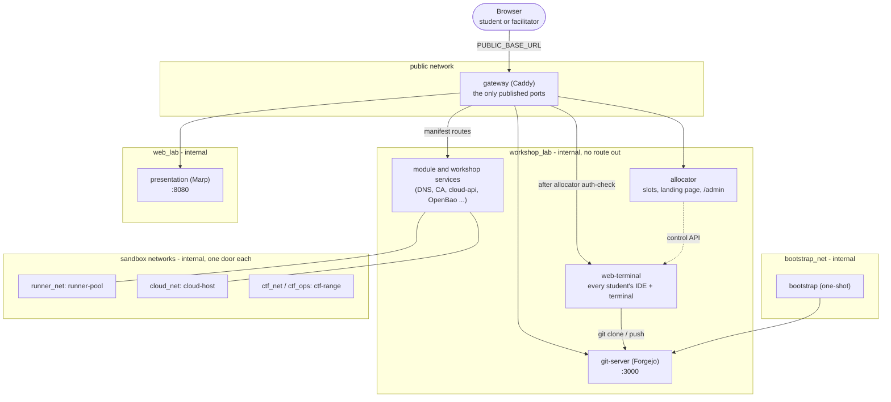
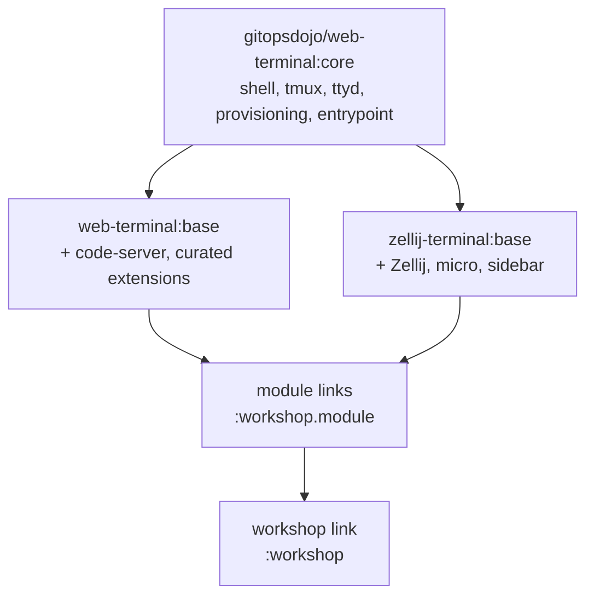
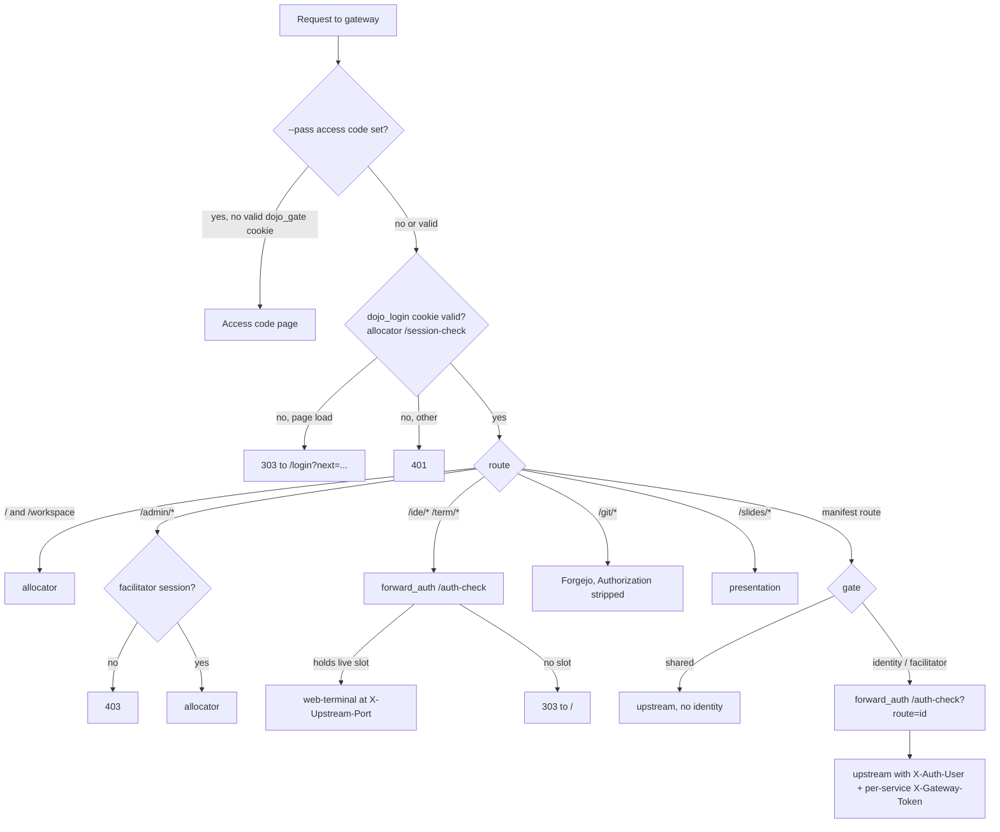

# Architecture

How the stack is put together: the services, the networks, what happens between typing `./dojo <workshop>` and
a student seeing a login page, and where state lives. Fine detail for each service is in
[`engine/README.md`](../engine/README.md); how data moves is in [Data flows](data-flows.md); the trust reasoning is
in [Security](security.md).

## 1. The shape of a running stack



Only `gateway` publishes ports. It is also the only service attached to both the outside and the inside.
`web-terminal` and `allocator` are deliberately **not** on `web_lab`, so a student's shell can reach `git-server:3000`
but not `presentation:8080` (slides are browser-only).

## 2. Services

### Engine services (`engine/docker-compose.yml`)

| Service | Built from | Role | Notable details |
|---|---|---|---|
| `gateway` | `engine/gateway/` (Caddy) | TLS, `/login` session gate, routing, identity headers, optional access-code gate | `Caddyfile` imports the rendered `extensions.caddy`. Always strips `Authorization` before Forgejo. HSTS on https |
| `allocator` | `engine/allocator/` (stdlib Python, threaded) | Slot table, `/auth-check`, Forgejo SSO, landing page, `/workspace`, `/admin`, student reset, status probes | Never touches a container engine; talks only to `web-terminal`'s control port and Forgejo. Slot table persisted to the `allocator_state` volume |
| `web-terminal` | `engine/web-terminal/` (`:core`) + flavor leaf + module/workshop links | Runs each student's code-server and ttyd, spawned on demand by `workspace-control.py` | One Linux user per student; per-uid firewall; PID namespace per student |
| `git-server` | Forgejo image (digest-pinned) | Repos, PRs, review, Actions, OIDC provider (vault workshop) | Data in `forgejo_data` |
| `bootstrap` | Forgejo image, one-shot | Creates admin, org, seed repo, `students` team, accounts | Idempotent. On `bootstrap_net` only |
| `presentation` | `engine/presentation/` (Marp) | Serves decks and lab copies as HTML | No PDF/Chromium |

### Terminal flavors



`[terminal] flavor` in `dojo.toml` (or `--terminal` for one run) chooses the leaf. `code-server` gives VS Code in
the browser plus a tmux terminal (~260 MB per active student). `zellij` gives a terminal-only workspace with a
read-only file listing, shell and the `micro` editor (~50 MB per student). The same `workspace-control.py` runs in
both. Module and workshop Dockerfiles only ever see an opaque `ARG BASE`, so they work with either leaf.

### Ports inside `web-terminal`

| Range | Used for |
|---|---|
| 9000 + N | Student N's code-server (`/ide`) |
| 9500 + N | Student N's ttyd terminal (`/term`) |
| 9600 + N | Student N's read-only watch view (`/admin/watch/studentNN`) |
| 9700.., 9750.., 9800.. | Demo bots' IDE, terminal and watch ports |

The gateway reaches these over a private network, `terminal_ingress`, that only the gateway and `web-terminal` join.
The entrypoint drops these ports on every other interface, so nothing on `workshop_lab` can skip the allocator's
auth check by dialling the port directly. Workshop services a student must reach must stay **off TCP 9000-9099 and
9500-9899** (the per-account firewall drops them silently).

## 3. Networks

| Network | Internal? | Members | Purpose |
|---|---|---|---|
| `public` (default) | no | `gateway` | The one way in |
| `workshop_lab` | yes | allocator, web-terminal, git-server, gateway, most module/workshop services | Where the lab lives; no route to the internet |
| `web_lab` | yes | gateway, presentation | Slides only |
| `bootstrap_net` | yes | bootstrap, git-server | Provisioning reaches Forgejo and nothing else |
| `terminal_ingress` | yes | gateway, web-terminal | The gateway's private path to workspace ports. Fragments may not join it |
| `runner_net` | yes | runner-pool, shim, git-server, selected services | Student-written CI reaches only what a workshop lists |
| `cloud_net` | yes | cloud-api, cloud-host | The privileged Docker-in-Docker host's only neighbour |
| `ctf_net`, `ctf_ops` | yes | ctf-range services | Vulnerable targets and the range's control plane |
| `dns_admin_net` | yes | gateway, dns-server, dns-admin | Keeps PowerDNS-Admin out of student reach |

## 4. From command to running stack

`./dojo <workshop>` is a Python CLI (`engine/dojo/`, Click + Rich). The launcher `./dojo` only fixes `sys.path`;
`dojo/boot.py` unpacks the hash-pinned wheels in `requirements.lock` into `engine/.cache/` on first run (no pip, no
venv).

```mermaid
sequenceDiagram
    actor F as Facilitator
    participant D as dojo CLI
    participant FS as files
    participant CE as podman / docker compose

    F->>D: ./dojo cert-autorenewal --test 3
    D->>FS: resolve settings (dojo.toml, dojo.local.toml, .env, profile, workshop.env, module.env)
    D->>D: safety gates (default passwords off loopback, port clashes, plain http warning)
    D->>D: refuse if a different workshop is running; take the run lock
    D->>CE: build what changed (core, leaf, each module link, workshop link, gateway, allocator, ...)
    D->>D: copy manifests to .generated/in, render with render_extensions.py
    D->>FS: write .generated/gateway/extensions.caddy, allocator/extensions.json, upstream-tokens.env
    D->>FS: record .build-state/current.json, last-start
    D->>CE: compose -f base -f module.yml ... -f overlay up -d
    CE-->>D: container events
    D->>F: live status table until healthy; explain anything that did not settle
    D->>CE: remove images the rebuilds superseded
```

Key points:

- **Settings are resolved once** into the environment Compose sees. `workshop.env`/`module.env` are shell code
  (they derive tokens with `$(...)`), run by `sh`; the TOML files are mapped to env vars by `dojo/config.py`.
- **Compose files**: `docker-compose.yml`, then each module's `compose.yml` in `MODULES` order, then the workshop
  overlay. The exact list is recorded in `.build-state/current.json`, so `./dojo stop` removes precisely what was started.
- **Build change detection** hashes each build context, every module folder and the overlay folder; unchanged
  things are reused. `--dry-run` reports the plan without touching anything.
- **Image housekeeping**: images a rebuild displaced are removed after the new containers run. Only `gitopsdojo/*`
  and Compose's own `engine_*` images are ever candidates. On podman, builds use Docker image format so the
  `HEALTHCHECK` is kept.
- **Manifest rendering happens before anything starts.** A bad manifest stops the run (see
  [Authoring](authoring.md#4-the-extensionsjson-manifest)).
- **Mutual exclusion**: a run lock (`/tmp/gitops-dojo-<uid>.lock`) means one build or start at a time, worktrees included.
- **Pins are enforced**: every external image must be pinned by digest and every tool by version and sha256;
  `--dry-run` fails otherwise (`engine/scripts/check-pins.sh`, `check-tool-pins.sh`).

## 5. How the gateway decides what to do



The login cookie `dojo_login` is signed, derived from `GATEWAY_TOKEN` and both passwords (changing either password
signs everyone out), and lasts 12 hours. Wrong passwords are rate-limited (30 a minute per client address, then 429;
a correct password is never refused). Behind a trusted proxy, `GATEWAY_TRUSTED_PROXIES` names it so the limit counts
each browser rather than the proxy.

## 6. The allocator

Stdlib Python on `ThreadingHTTPServer`, one thread per connection with a 3 s socket timeout, so an idle client
stalls only itself.

| Module | Responsibility |
|---|---|
| `server.py` | Entry point; the locking rules live in its header |
| `handler.py` | Request plumbing, identity, GET/POST routing |
| `accounts.py` | Signed login cookies, password checks, login rate guard, `/login` assets |
| `allocation.py` | Slot table, state file, per-student ports, workspace-control client |
| `api.py` | `/auth-check`, assign, release, reset, admin JSON endpoints |
| `views.py`, `pages.py` | Landing, confirmation, `/workspace` and `/admin` pages, CSP |
| `probes.py` | Background health probes for the status strip |
| `reset.py` | One-student reset worker |
| `render_extensions.py` | Validates and renders manifests (also run standalone by `dojo`) |
| `config.py`, `dojo_secret.py` | Environment and the derived-secret functions |

Rules that keep it safe and fast:

- `_state_lock` guards the slot table; claiming a slot finds the first free `studentNN` and writes it in one
  critical section, so two simultaneous `/assign` calls never get the same slot.
- **No lock is held across I/O.** Handlers copy what they need, release the lock, then call out. A release records
  the slot token, stops the workspace without the lock, then clears the slot only if the token is unchanged.
- One Docker/control list call per request, cached ~2 s, because every student's portal polls every ~3 s.
- Slot assignment is a token bucket (`ASSIGN_BURST` 10, then `ASSIGN_PER_MINUTE` 20). Browsers that already hold a
  slot, the facilitator and bots are never limited.

## 7. The web-terminal

`entrypoint.sh` creates the accounts and runs the start hooks; `workspace-control.py` is the control server
(`/start`, `/stop`, `/status`, `/reset`) behind the allocator.

- **Accounts**: `provision-account.sh` creates the user, a locked Linux password, a `0700` home, `~/lab` copied
  from `/opt/lab` (never overwriting edited files), shell config, and a Forgejo token written to
  `~/.git-credentials` and `~/.netrc` by `forgejo-token.py`.
- **Isolation**: per-uid `iptables` chain (`DOJO_ISOLATION`), a user+PID namespace per student held by one holder
  process and entered with `nsenter`, `prlimit --nproc` per process.
- **Hooks**: `/etc/dojo/start.d/NN-name.sh` at container start (modules `50-`, workshops `90-`), plus
  `account.d/` and `reset.d/` per-account hooks. A failing start hook stops the container.
- **Lazy processes**: code-server and ttyd start on first request. After a tab closes, code-server frees its
  extension host after `reconnection_grace_seconds` (300) and exits after `idle_timeout_seconds` (900); tmux
  terminals survive.
- **Health**: `web-terminal-healthcheck` sends the control token; do not replace it with a bare `wget`.

## 8. State and volumes

| State | Where | Lifetime |
|---|---|---|
| Forgejo data (repos, accounts, PRs) | `forgejo_data` volume | until `./dojo stop` |
| Student homes | `terminal_home` volume | until `./dojo stop` |
| Slot table | `allocator_state` volume (`slots.json`) | survives restarts, wiped by `stop` |
| Module state (DNS zones, CA keys, cloud data, vault raft, achievements `state.json`) | each module's named volumes | until `stop` |
| Running stack record | `.build-state/current.json` | until `stop` |
| History | `.build-state/history.jsonl` (one line per start/restart/build/stop with timing and outcome) | kept |
| Generated config | `engine/.generated/` (git-ignored) | regenerated every start |
| Dependencies | `engine/.cache/` (git-ignored) | until deleted |

**Every volume is named**, including paths an image declares as `VOLUME`; otherwise an anonymous volume survives
`./dojo stop`. Volumes are prefixed `engine_`.

## 9. Workshop content mounts

A pack's `content/` is bind-mounted read-only: `slides/` into `presentation`, `lab/` into `web-terminal` at
`/opt/lab` (copied into each `~/lab` on first login), `sample-repo/` into `bootstrap` at `/seed` (pushed only if
the Forgejo repo is empty), plus `bots/steps.sh` at `/opt/workshop-content`. Editing slides or labs shows up
without a rebuild. `content/slides/lab/*.md.txt` are git-ignored copies of the labs that `dojo` makes at start for
the in-browser lab reader.

## 10. Scale and capacity

- Memory is dominated by active students' code-server instances. `./dojo capacity --students N` sizes
  `WEB_TERMINAL_MEM_LIMIT`, `WEB_TERMINAL_PIDS_LIMIT` and `CODE_SERVER_MAX_HEAP_MB`.
- Rule of thumb when nothing can be measured: RAM = concurrent students × 650 MB × 1.15 + 512 MB; pids =
  concurrent students × 40 + 200. Measured reality was ~260 MB per code-server student, so this is conservative.
- Some workshops raise their own ceilings in `workshop.env` (cloud-policy-as-code uses `6g` / `1024`).
- Up to 99 student accounts, 35 bots.
