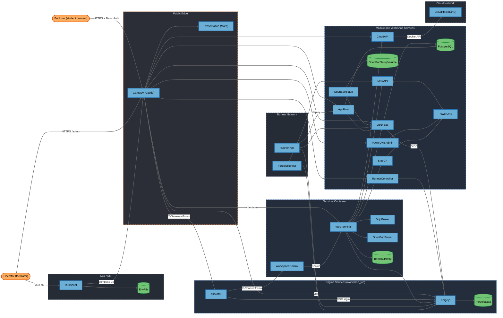
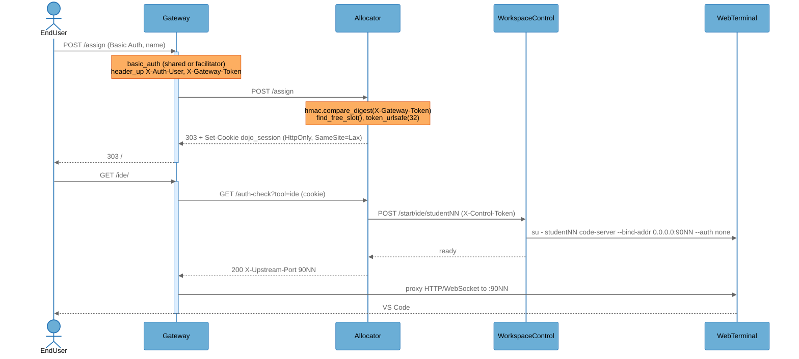
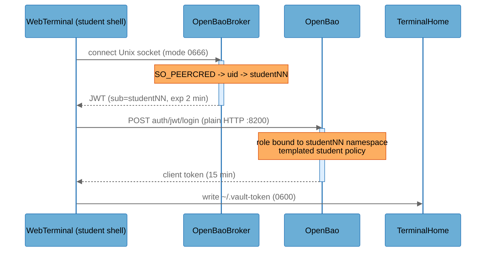
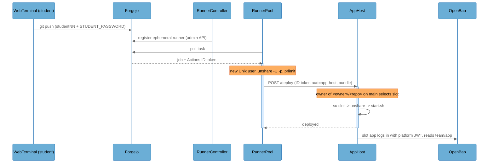

# Architecture Overview

## System Purpose

GitOps Dojo is a lunch-and-learn training platform. A facilitator starts a workshop with `./run.sh <workshop>`, and students reach a browser-only lab (VS Code, terminal, Forgejo git server, slides, and workshop-specific services) from one URL. Each student gets an assigned Linux account in a shared terminal container; workshop packs and reusable modules add services such as an Azure-inspired "Dojo Cloud" API, OpenBao (vault), Forgejo Actions runners, PowerDNS and a step-ca certificate authority. Users are students (untrusted, shared class credential) and one facilitator (privileged, `/admin` workspace).

## Key Components

| Component          | Type                | Description                                                                                                                                  |
| ------------------ | ------------------- | -------------------------------------------------------------------------------------------------------------------------------------------- |
| EndUser            | External Interactor | Student browser; authenticates with the shared class Basic Auth credential, then claims a studentNN slot                                     |
| Operator           | External Interactor | Facilitator; uses the facilitator Basic Auth credential for `/admin`, and runs `./run.sh` on the lab host                                    |
| Gateway            | Process             | Caddy reverse proxy (`engine/gateway/Caddyfile`); the only published service; Basic Auth, header injection, route gates                      |
| Allocator          | Process             | Python HTTP server (`engine/allocator/server.py`); slot assignment, session cookie, `/auth-check` forward-auth, Forgejo SSO, `/admin` roster |
| WorkspaceControl   | Process             | Control API in the terminal container (`engine/web-terminal/workspace-control.py`); spawns per-account code-server/ttyd                      |
| WebTerminal        | Process             | Shared terminal container: per-student code-server and ttyd processes, student shells, iptables loopback isolation                           |
| Forgejo            | Process             | Git server (`codeberg.org/forgejo/forgejo`), accounts seeded by `engine/git-server/bootstrap.sh`, Actions and OIDC issuer                    |
| Presentation       | Process             | Marp slide server (`engine/presentation/`), unauthenticated `/slides`                                                                        |
| RunScript          | Process             | `engine/run.sh` + `render_extensions.py` on the lab host; loads `.env`, renders manifests, builds and starts the stack                       |
| CloudAPI           | Process             | Dojo Cloud ARM-like API and portal (`modules/dojo-cloud/cloud-api/server.py`) with OAuth client-credentials and JWTs                         |
| CloudHost          | Process             | Privileged Docker-in-Docker daemon (`modules/dojo-cloud/cloud-host/`) that runs student container groups                                     |
| DojoBroker         | Process             | Root Unix-socket broker in the terminal (`modules/dojo-cloud/terminal/dojo-broker.py`) issuing Dojo Cloud credentials by `SO_PEERCRED`       |
| OpenBaoBroker      | Process             | Root Unix-socket broker in the terminal (`modules/openbao/terminal/openbao-broker.py`) signing short-lived JWTs for OpenBao login            |
| OpenBao            | Process             | OpenBao 2.7.0 vault server (`modules/openbao/config.hcl`), per-student namespaces, audit device                                              |
| OpenBaoSetup       | Process             | Root setup container (`modules/openbao/setup/setup.sh`); init, unseal, provisioner token, tenancy scripts                                    |
| RunnerPool         | Process             | Single-use Forgejo runner supervisor (`modules/runner-pool/pool/supervise.py`) executing student CI jobs                                     |
| RunnerController   | Process             | Runner autoscaler and `/admin` Runners panel (`modules/runner-pool/controller/controller.py`)                                                |
| AppHost            | Process             | Deploy target (`workshops/vault-fundamentals/compose/app-host/apphost.py`) running student app bundles per slot                              |
| ForgejoRunner      | Process             | Shared Forgejo Actions runner with `host` executor (`modules/forgejo-runner/runner/register.sh`) for dns-as-code                             |
| DNSAPI             | Process             | PowerDNS API gate (`workshops/dns-as-code/compose/dns-api/gate.py`) that swaps in the real key and enforces zone rules                       |
| PowerDNS           | Process             | Authoritative DNS server with HTTP API (`pdns-auth-49`), used by dns-as-code and cert-autorenewal                                            |
| PowerDNSAdmin      | Process             | PowerDNS-Admin UI (`modules/dns-ui/dns-admin/`) trusting gateway remote-user identity                                                        |
| StepCA             | Process             | Smallstep CA with ACME provisioner (`workshops/cert-autorenewal/compose/step-ca/entrypoint.sh`)                                              |
| EnvFile            | Data Store          | `engine/.env` (and `.env.home`) on the lab host; all passwords and machine tokens in plaintext                                               |
| TerminalHome       | Data Store          | `terminal_home` volume: every student's `/home/<user>`, including `~/.vault-token` and git credentials                                       |
| ForgejoData        | Data Store          | `forgejo_data` volume: Forgejo SQLite DB, repositories, runner registrations                                                                 |
| OpenBaoSetupVolume | Data Store          | OpenBao setup volume holding the unseal key and long-lived provisioner token                                                                 |
| PostgreSQL         | Data Store          | `app-db` PostgreSQL for vault-fundamentals lab 12; per-student databases and roles                                                           |

## Component Diagram

## Top Scenarios

### Scenario 1: Student claims a slot and opens VS Code

A student passes the shared Basic Auth gate, enters a name, and the Allocator assigns a free studentNN slot with an HttpOnly session cookie. Opening `/ide` makes Caddy call `/auth-check`; the Allocator asks WorkspaceControl to spawn that account's code-server (`--auth none`) and returns the upstream port, which Caddy proxies.

### Scenario 2: Student signs in to OpenBao from the terminal

On shell start, `openbao-login` asks the root OpenBaoBroker over a Unix socket to vouch for the caller; the broker reads the peer UID with `SO_PEERCRED`, signs a two-minute JWT, and the helper exchanges it at OpenBao for a namespace-scoped token written to `~/.vault-token` (mode 0600).

### Scenario 3: Student CI pipeline deploys an app (vault-fundamentals)

A push to the student's fork triggers a Forgejo Actions job; the RunnerController keeps single-use runners registered; the RunnerPool runs the job as a fresh Unix user in a user+PID namespace; the job deploys a bundle to AppHost using a Forgejo Actions ID token, and AppHost starts the app as the slot's user, which then logs in to OpenBao with a platform identity.

### Scenario 4: Facilitator watches a student terminal

The facilitator authenticates to `/admin` with the facilitator-only Basic Auth; the roster polls `/admin/api/sessions`; opening a tile calls `/auth-check-watch`, which spawns a read-only ttyd mirror (`tmux attach -r`) of the student's session.

### Scenario 5: dns-as-code change through CI

A student opens a PR changing `dnsconfig.js`; the shared ForgejoRunner (`host` executor) runs `dns-preview.yml`, then after approval and merge runs `dns-apply.yml`, which pushes to DNSAPI. DNSAPI accepts writes to the protected `dojo.test` zone only from the runner's IP and forwards to PowerDNS with the real API key.

## Technology Stack

| Layer          | Technologies                                                                                                                                                                                                                                                                                        |
| -------------- | --------------------------------------------------------------------------------------------------------------------------------------------------------------------------------------------------------------------------------------------------------------------------------------------------- |
| Languages      | Python 3.12 (stdlib `http.server` services), POSIX sh/bash, JavaScript (browser panels, Marp engine), HCL (OpenBao policies)                                                                                                                                                                        |
| Frameworks     | Caddy 2, code-server, ttyd + tmux, Marp CLI, Forgejo 16 + Forgejo Actions runner 13, OpenBao 2.7.0, PowerDNS Auth 4.9, PowerDNS-Admin, Smallstep step-ca, Docker-in-Docker                                                                                                                          |
| Data Stores    | Forgejo SQLite (`forgejo_data`), OpenBao Raft (`openbao_data`), PostgreSQL (`app-db`), JSON state files (Dojo Cloud), PowerDNS SQLite, named volumes (`terminal_home`)                                                                                                                              |
| Infrastructure | podman/docker compose on one host (WSL2 or VM), internal bridge networks `workshop_lab`, `web_lab`, `runner_net`, `cloud_net`, `dns_admin_net`, `bootstrap_net`                                                                                                                                     |
| Security       | Caddy `basic_auth` (bcrypt), shared-secret headers (`X-Gateway-Token`, `X-Control-Token`) with `hmac.compare_digest`, iptables owner-match loopback isolation, `SO_PEERCRED` brokers, HMAC JWTs, OpenBao namespaces/policies/audit, user+PID namespaces with `prlimit`, strict CSP on module panels |

## Deployment Model

The whole stack runs on one host under podman/docker compose (`engine/docker-compose.yml` plus module `compose.yml` files and workshop overlays). Only the Gateway publishes ports: `${LAB_HOST_IP}:${GATEWAY_HTTP_PORT:-80}` and `:${GATEWAY_HTTPS_PORT:-443}`. With a real hostname in `PUBLIC_BASE_URL`, Caddy obtains a Let's Encrypt certificate; with `http://...` it serves plain HTTP; with `GATEWAY_LISTEN=http://:8080` it sits behind another TLS proxy (home mode). All other services are on internal bridge networks (`internal: true`). Students, however, run arbitrary code as their own Linux user inside the WebTerminal container, which is attached to `workshop_lab`, so every service on `workshop_lab` is reachable from any authenticated student. Student CI code runs on `runner_net` (RunnerPool, ForgejoRunner), and student app code runs inside AppHost, which is attached to both `workshop_lab` and `runner_net`. The lab can be hosted on a public cloud VM, on a LAN, or on the facilitator's desktop.

**Deployment Classification:** `NETWORK_SERVICE`

### Component Exposure Table

| Component          | Listens On                                                          | Auth Required                                                   | Reachability   | Min Prerequisite   | Derived Tier |
| ------------------ | ------------------------------------------------------------------- | --------------------------------------------------------------- | -------------- | ------------------ | ------------ |
| EndUser            | N/A — no listener                                                   | No                                                              | No Listener    | None               | T1           |
| Operator           | N/A — no listener                                                   | No                                                              | No Listener    | None               | T1           |
| Gateway            | `${LAB_HOST_IP}:80`, `:443` (published)                             | No for `/slides`; Yes (Basic Auth) elsewhere                    | External       | None               | T1           |
| Allocator          | `0.0.0.0:8080` on `workshop_lab`                                    | Yes (X-Gateway-Token + cookie / X-Auth-User)                    | Internal Only  | Authenticated User | T2           |
| WorkspaceControl   | `0.0.0.0:7682` on `workshop_lab`                                    | Yes (X-Control-Token)                                           | Internal Only  | Authenticated User | T2           |
| WebTerminal        | `0.0.0.0:9000-9899` (code-server/ttyd) on `workshop_lab`            | No at the process (`--auth none`); Yes via Gateway forward-auth | Internal Only  | Authenticated User | T2           |
| Forgejo            | `0.0.0.0:3000` on `workshop_lab`, `runner_net`                      | Yes (Forgejo login)                                             | Internal Only  | Authenticated User | T2           |
| Presentation       | `:8080` on `web_lab` (via Gateway `/slides`)                        | No                                                              | External       | None               | T1           |
| RunScript          | N/A — no listener                                                   | No                                                              | No Listener    | Host/OS Access     | T3           |
| CloudAPI           | `:443`, `:8080` on `workshop_lab`                                   | Yes (JWT bearer / gateway identity)                             | Internal Only  | Authenticated User | T2           |
| CloudHost          | Docker Unix socket on shared volume; `cloud_net` only               | No (socket mode 0666)                                           | No Listener    | Host/OS Access     | T3           |
| DojoBroker         | Unix socket in WebTerminal                                          | Yes (`SO_PEERCRED`)                                             | Localhost Only | Authenticated User | T2           |
| OpenBaoBroker      | Unix socket in WebTerminal (mode 0666)                              | Yes (`SO_PEERCRED`)                                             | Localhost Only | Authenticated User | T2           |
| OpenBao            | `0.0.0.0:8200` plain HTTP on `workshop_lab`, `runner_net`           | Yes (OpenBao tokens)                                            | Internal Only  | Authenticated User | T2           |
| OpenBaoSetup       | N/A — no listener                                                   | No                                                              | No Listener    | Host/OS Access     | T3           |
| RunnerPool         | N/A — outbound poller on `runner_net`                               | No                                                              | No Listener    | Authenticated User | T2           |
| RunnerController   | `:8080` on `workshop_lab`                                           | Yes (X-Gateway-Token + facilitator)                             | Internal Only  | Authenticated User | T2           |
| AppHost            | `:8080` on `workshop_lab`, `runner_net`                             | Yes (Forgejo ID token / gateway identity)                       | Internal Only  | Authenticated User | T2           |
| ForgejoRunner      | N/A — outbound poller on `runner_net`                               | No                                                              | No Listener    | Authenticated User | T2           |
| DNSAPI             | `:8081` on `workshop_lab`, `runner_net`                             | Yes (public key `workshop-not-a-secret` + source IP)            | Internal Only  | Authenticated User | T2           |
| PowerDNS           | `:53`, API `:8081` on `workshop_lab`, `runner_net`, `dns_admin_net` | Yes (API key derived from GATEWAY_TOKEN)                        | Internal Only  | Authenticated User | T2           |
| PowerDNSAdmin      | `:80` on `dns_admin_net` only                                       | Yes (gateway remote-user)                                       | Internal Only  | Privileged User    | T2           |
| StepCA             | `:9443` HTTPS on `workshop_lab`                                     | No for ACME                                                     | Internal Only  | Authenticated User | T2           |
| EnvFile            | N/A — no listener                                                   | No                                                              | No Listener    | Host/OS Access     | T3           |
| TerminalHome       | N/A — volume in WebTerminal                                         | No (Unix permissions)                                           | No Listener    | Authenticated User | T2           |
| ForgejoData        | N/A — volume in Forgejo                                             | No                                                              | No Listener    | Host/OS Access     | T3           |
| OpenBaoSetupVolume | N/A — volume in OpenBaoSetup                                        | No                                                              | No Listener    | Host/OS Access     | T3           |
| PostgreSQL         | `:5432` on `workshop_lab`                                           | Yes (per-student roles)                                         | Internal Only  | Authenticated User | T2           |

> Internal-only services are rated `Authenticated User` rather than `Internal Network` because every authenticated student has a shell on `workshop_lab`; volumes inside the WebTerminal container are likewise reachable by any student shell. EndUser and Operator rows are actors, not attack targets.

## Security Infrastructure Inventory

| Component                      | Security Role                            | Configuration                                                                                                                     | Notes                                                                             |
| ------------------------------ | ---------------------------------------- | --------------------------------------------------------------------------------------------------------------------------------- | --------------------------------------------------------------------------------- |
| Gateway (Caddy)                | Authentication, TLS, header trust anchor | `basic_auth` with bcrypt hashes; `header_up X-Auth-User` / `X-Gateway-Token` overwrite client values (`engine/gateway/Caddyfile`) | Automatic HTTPS only when `PUBLIC_BASE_URL` has a real hostname; no rate limiting |
| Allocator gateway check        | Service-to-service authentication        | `hmac.compare_digest(X-Gateway-Token)` before any routing (`server.py:541-550`)                                                   | Session cookie `HttpOnly; SameSite=Lax`, `Secure` when HTTPS                      |
| WorkspaceControl token         | Service-to-service authentication        | `X-Control-Token` with `hmac.compare_digest` (`workspace-control.py:362-364`)                                                     |                                                                                   |
| DOJO_ISOLATION iptables chain  | Cross-student loopback isolation         | OUTPUT-chain owner match per uid, default DROP on 9000-9899 (`entrypoint.sh:162-405`)                                             | Filters traffic from inside the terminal container only; INPUT not filtered       |
| DojoBroker / OpenBaoBroker     | Workload identity                        | `SO_PEERCRED` on Unix sockets, root-held signing keys                                                                             | Short-lived credentials bound to the caller's uid                                 |
| OpenBao                        | Secret management, audit                 | Namespaces per student, templated policy, file audit device, provisioner token (root revoked)                                     | `tls_disable = true`; single unseal share                                         |
| RunnerPool / AppHost sandboxes | Tenant isolation for student code        | Per-job/slot Unix user, `unshare -U -p`, `prlimit`, cleanup                                                                       | No network isolation per tenant                                                   |
| Dojo Cloud policy              | Authorization and resource policy        | Fixed Docker create template, image allowlist, quotas, `CapDrop: ALL` (`policy.py`, `docker_api.py`)                              | Nested daemon is privileged                                                       |
| DNSAPI                         | API gateway for PowerDNS                 | Real key swap, protected-zone rule, CI identified by source IP (`gate.py`)                                                        | Cannot distinguish students                                                       |
| Module panels                  | XSS defence                              | Strict CSP, `textContent`/DOM construction only                                                                                   | Allocator pages have no CSP header                                                |
| `env-setup.sh`                 | Secret generation                        | `openssl rand -hex` for tokens; interactive mode generates random passwords                                                       | `--default` mode sets `admin`/`student123`                                        |

## Repository Structure

| Directory                                 | Purpose                                                                                 |
| ----------------------------------------- | --------------------------------------------------------------------------------------- |
| `engine/`                                 | Shared runtime: `run.sh`, `docker-compose.yml`, `.env.example`, scripts                 |
| `engine/gateway/`                         | Caddy gateway image and `Caddyfile`                                                     |
| `engine/allocator/`                       | Slot allocator, forward-auth, `/admin`, manifest renderer `render_extensions.py`        |
| `engine/web-terminal/`                    | Terminal image, account provisioning `entrypoint.sh`, `workspace-control.py`, demo bots |
| `engine/git-server/`                      | Forgejo bootstrap script                                                                |
| `engine/presentation/`                    | Marp slide server                                                                       |
| `modules/dojo-cloud/`                     | Dojo Cloud API, DinD host, terminal broker                                              |
| `modules/openbao/`                        | OpenBao server, setup, SSO shim, audit panel, terminal broker                           |
| `modules/runner-pool/`                    | Single-use runner pool, controller and panel                                            |
| `modules/forgejo-runner/`                 | Shared Forgejo Actions runner                                                           |
| `modules/dns-ui/`                         | PowerDNS-Admin and zone viewer                                                          |
| `workshops/*/`                            | Workshop packs: `workshop.env`, content, overlays (dns-api, step-ca, app-host, app-db)  |
| `.github/workflows/`, `.azure-pipelines/` | Handout build CI                                                                        |
