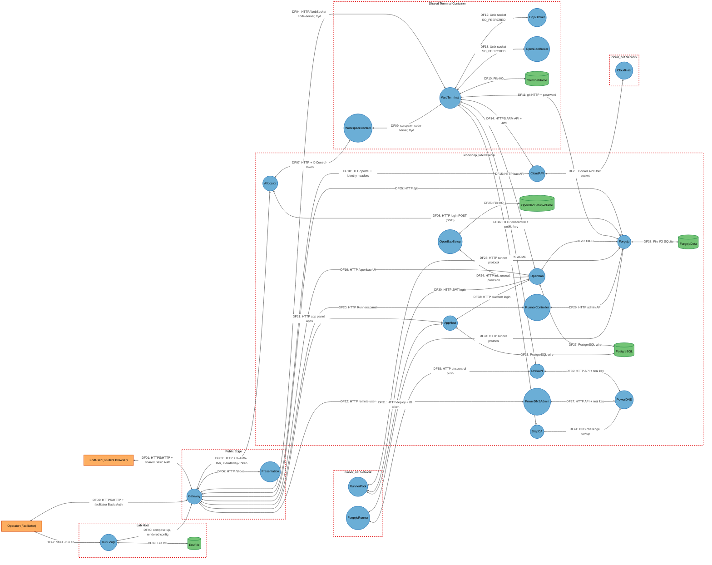
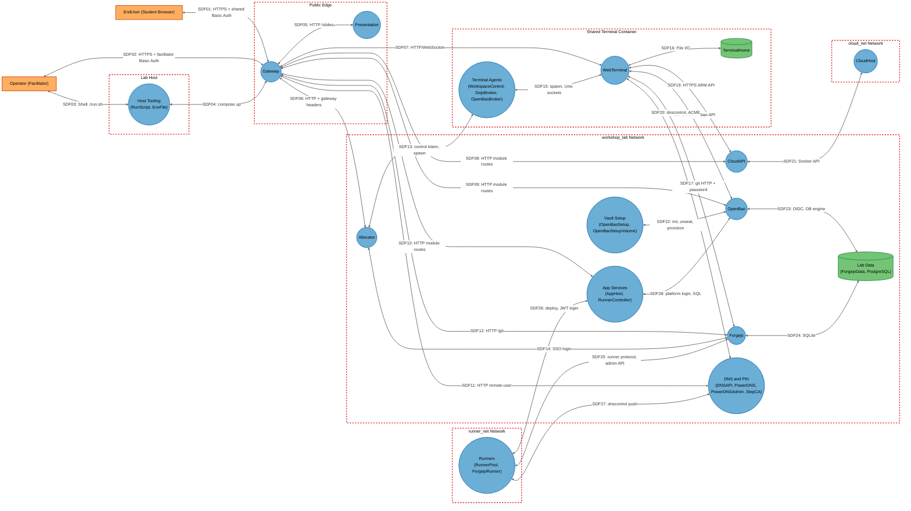

# Threat Model

## Data Flow Diagram

## Element Table

| Element            | Type                | TMT Category            | Description                                                           | Trust Boundary       |
| ------------------ | ------------------- | ----------------------- | --------------------------------------------------------------------- | -------------------- |
| EndUser            | External Interactor | SE.EI.TMCore.Browser    | Student browser holding the shared class credential and a slot cookie | Outside (untrusted)  |
| Operator           | External Interactor | SE.EI.TMCore.User       | Facilitator with the facilitator credential and host shell            | Outside (trusted)    |
| Gateway            | Process             | SE.P.TMCore.WebServer   | Caddy reverse proxy, Basic Auth, TLS, identity header injection       | PublicEdge           |
| Presentation       | Process             | SE.P.TMCore.WebServer   | Marp slide server, unauthenticated `/slides`                          | PublicEdge           |
| Allocator          | Process             | SE.P.TMCore.WebSvc      | Slot assignment, session cookies, forward-auth, Forgejo SSO, `/admin` | WorkshopLab          |
| Forgejo            | Process             | SE.P.TMCore.WebApp      | Git server, Actions, OIDC issuer                                      | WorkshopLab          |
| CloudAPI           | Process             | SE.P.TMCore.WebSvc      | Dojo Cloud ARM-like API and portal                                    | WorkshopLab          |
| OpenBao            | Process             | SE.P.TMCore.WebSvc      | Vault server with student namespaces                                  | WorkshopLab          |
| OpenBaoSetup       | Process             | SE.P.TMCore.OSProcess   | Init, unseal and provisioning scripts (root)                          | WorkshopLab          |
| RunnerController   | Process             | SE.P.TMCore.WebSvc      | Runner autoscaler and `/admin` panel                                  | WorkshopLab          |
| AppHost            | Process             | SE.P.TMCore.WebSvc      | Deploy target running student apps as slot users                      | WorkshopLab          |
| DNSAPI             | Process             | SE.P.TMCore.WebSvc      | PowerDNS API gate                                                     | WorkshopLab          |
| PowerDNS           | Process             | SE.P.TMCore.NonMS       | Authoritative DNS server with HTTP API                                | WorkshopLab          |
| PowerDNSAdmin      | Process             | SE.P.TMCore.WebApp      | DNS admin UI using gateway remote-user                                | WorkshopLab          |
| StepCA             | Process             | SE.P.TMCore.WebSvc      | Private CA with ACME provisioner                                      | WorkshopLab          |
| WorkspaceControl   | Process             | SE.P.TMCore.OSProcess   | Root control API that spawns per-account processes                    | WebTerminalContainer |
| WebTerminal        | Process             | SE.P.TMCore.OSProcess   | Per-student code-server, ttyd and shells                              | WebTerminalContainer |
| DojoBroker         | Process             | SE.P.TMCore.OSProcess   | Root credential broker for Dojo Cloud                                 | WebTerminalContainer |
| OpenBaoBroker      | Process             | SE.P.TMCore.OSProcess   | Root JWT broker for OpenBao login                                     | WebTerminalContainer |
| RunnerPool         | Process             | SE.P.TMCore.OSProcess   | Single-use runners executing student CI                               | RunnerNet            |
| ForgejoRunner      | Process             | SE.P.TMCore.OSProcess   | Shared `host`-executor runner                                         | RunnerNet            |
| CloudHost          | Process             | SE.P.TMCore.VM          | Privileged Docker-in-Docker daemon                                    | CloudNet             |
| RunScript          | Process             | SE.P.TMCore.NonMS       | Host launcher and manifest renderer                                   | LabHost              |
| EnvFile            | Data Store          | SE.DS.TMCore.ConfigFile | Plaintext secrets for the stack                                       | LabHost              |
| TerminalHome       | Data Store          | SE.DS.TMCore.FS         | Student home directories                                              | WebTerminalContainer |
| ForgejoData        | Data Store          | SE.DS.TMCore.SQL        | Forgejo SQLite DB and repositories                                    | WorkshopLab          |
| OpenBaoSetupVolume | Data Store          | SE.DS.TMCore.FS         | Unseal key and provisioner token                                      | WorkshopLab          |
| PostgreSQL         | Data Store          | SE.DS.TMCore.SQL        | Lab database with per-student roles                                   | WorkshopLab          |

## Data Flow Table

| ID   | Source           | Target             | Protocol          | Description                                                                        |
| ---- | ---------------- | ------------------ | ----------------- | ---------------------------------------------------------------------------------- |
| DF01 | EndUser          | Gateway            | HTTPS/HTTP        | All student traffic with shared Basic Auth credential and slot cookie              |
| DF02 | Operator         | Gateway            | HTTPS/HTTP        | Facilitator traffic, `/admin` workspace                                            |
| DF03 | Gateway          | Allocator          | HTTP              | Pages, `/assign`, `/auth-check`, route checks with X-Auth-User and X-Gateway-Token |
| DF04 | Gateway          | WebTerminal        | HTTP/WebSocket    | Proxy to the student's code-server/ttyd port chosen by `/auth-check`               |
| DF05 | Gateway          | Forgejo            | HTTP              | `/git` proxy with Authorization header stripped                                    |
| DF06 | Gateway          | Presentation       | HTTP              | `/slides` proxy, no authentication                                                 |
| DF07 | Allocator        | WorkspaceControl   | HTTP              | Start/stop/status calls with X-Control-Token                                       |
| DF08 | Allocator        | Forgejo            | HTTP              | Server-side login POST using STUDENT_PASSWORD or admin password; cookies relayed   |
| DF09 | WorkspaceControl | WebTerminal        | Process spawn     | `su - <user>` code-server `--auth none` / ttyd                                     |
| DF10 | WebTerminal      | TerminalHome       | File I/O          | Student files, tokens, git config                                                  |
| DF11 | WebTerminal      | Forgejo            | HTTP              | git clone/push with student credentials                                            |
| DF12 | WebTerminal      | DojoBroker         | Unix socket       | Credential request authenticated by peer uid                                       |
| DF13 | WebTerminal      | OpenBaoBroker      | Unix socket       | JWT request authenticated by peer uid                                              |
| DF14 | WebTerminal      | CloudAPI           | HTTPS             | OAuth token and ARM calls from OpenTofu                                            |
| DF15 | WebTerminal      | OpenBao            | HTTP              | `bao` CLI and SDK calls                                                            |
| DF16 | WebTerminal      | DNSAPI             | HTTP              | dnscontrol with public key                                                         |
| DF17 | WebTerminal      | StepCA             | HTTPS             | ACME certificate orders                                                            |
| DF18 | Gateway          | CloudAPI           | HTTP              | Portal with X-Auth-User and X-Gateway-Token                                        |
| DF19 | Gateway          | OpenBao            | HTTP              | OpenBao UI through SSO shim                                                        |
| DF20 | Gateway          | RunnerController   | HTTP              | Facilitator Runners panel                                                          |
| DF21 | Gateway          | AppHost            | HTTP              | App panel and deployed app pages                                                   |
| DF22 | Gateway          | PowerDNSAdmin      | HTTP              | Remote-user identity for facilitator                                               |
| DF23 | CloudAPI         | CloudHost          | Unix socket       | Docker Engine API over shared volume socket                                        |
| DF24 | OpenBaoSetup     | OpenBao            | HTTP              | Init, unseal, provisioner token, tenancy                                           |
| DF25 | OpenBaoSetup     | OpenBaoSetupVolume | File I/O          | Unseal key and tokens                                                              |
| DF26 | OpenBao          | Forgejo            | HTTP              | OIDC discovery and token exchange                                                  |
| DF27 | OpenBao          | PostgreSQL         | PostgreSQL        | Database secrets engine creating dynamic logins                                    |
| DF28 | RunnerPool       | Forgejo            | HTTP              | Runner fetches tasks and reports logs                                              |
| DF29 | RunnerController | Forgejo            | HTTP              | Runner registration and job queries with admin API                                 |
| DF30 | RunnerPool       | OpenBao            | HTTP              | CI job JWT login                                                                   |
| DF31 | RunnerPool       | AppHost            | HTTP              | Deploy bundle with Actions ID token                                                |
| DF32 | AppHost          | OpenBao            | HTTP              | Slot app login with platform JWT                                                   |
| DF33 | AppHost          | PostgreSQL         | PostgreSQL        | Slot app queries                                                                   |
| DF34 | ForgejoRunner    | Forgejo            | HTTP              | Runner fetches tasks                                                               |
| DF35 | ForgejoRunner    | DNSAPI             | HTTP              | CI dnscontrol push to protected zone                                               |
| DF36 | DNSAPI           | PowerDNS           | HTTP              | Forwarded API calls with real key                                                  |
| DF37 | PowerDNSAdmin    | PowerDNS           | HTTP              | UI API calls with real key                                                         |
| DF38 | Forgejo          | ForgejoData        | File I/O          | SQLite and repositories                                                            |
| DF39 | RunScript        | EnvFile            | File I/O          | Reads/writes secrets                                                               |
| DF40 | RunScript        | Gateway            | Container runtime | Builds images, renders Caddy/allocator extensions, starts stack                    |
| DF41 | StepCA           | PowerDNS           | DNS               | ACME challenge validation lookups                                                  |
| DF42 | Operator         | RunScript          | Shell             | Facilitator runs `./run.sh`                                                        |

## Trust Boundary Table

| Boundary             | Description                                                                               | Contains                                                                                                                                                             |
| -------------------- | ----------------------------------------------------------------------------------------- | -------------------------------------------------------------------------------------------------------------------------------------------------------------------- |
| LabHost              | The host OS running podman/docker and the repo checkout                                   | RunScript, EnvFile                                                                                                                                                   |
| PublicEdge           | Containers on the published `public` network or `web_lab` fronted by it                   | Gateway, Presentation                                                                                                                                                |
| WorkshopLab          | Internal `workshop_lab` bridge (plus `dns_admin_net`); reachable from every student shell | Allocator, Forgejo, ForgejoData, CloudAPI, OpenBao, OpenBaoSetup, OpenBaoSetupVolume, RunnerController, AppHost, PostgreSQL, DNSAPI, PowerDNS, PowerDNSAdmin, StepCA |
| WebTerminalContainer | One container and one network namespace shared by every student, bot and the facilitator  | WorkspaceControl, WebTerminal, DojoBroker, OpenBaoBroker, TerminalHome                                                                                               |
| RunnerNet            | Internal `runner_net` where student CI code runs                                          | RunnerPool, ForgejoRunner                                                                                                                                            |
| CloudNet             | Internal `cloud_net` with the nested Docker daemon                                        | CloudHost                                                                                                                                                            |

## Summary View

## Summary to Detailed Mapping

| Summary Element | Contains                                    | Summary Flows                     | Maps to Detailed Flows                         |
| --------------- | ------------------------------------------- | --------------------------------- | ---------------------------------------------- |
| HostTooling     | RunScript, EnvFile                          | SDF03, SDF04                      | DF39, DF40, DF42                               |
| Gateway         | Gateway                                     | SDF01, SDF02, SDF05-SDF12         | DF01-DF06, DF18-DF22                           |
| Presentation    | Presentation                                | SDF05                             | DF06                                           |
| Allocator       | Allocator                                   | SDF06, SDF13, SDF14               | DF03, DF07, DF08                               |
| TerminalAgents  | WorkspaceControl, DojoBroker, OpenBaoBroker | SDF13, SDF15                      | DF07, DF09, DF12, DF13                         |
| WebTerminal     | WebTerminal                                 | SDF07, SDF15-SDF20                | DF04, DF09-DF17                                |
| TerminalHome    | TerminalHome                                | SDF16                             | DF10                                           |
| Forgejo         | Forgejo                                     | SDF12, SDF14, SDF17, SDF24, SDF25 | DF05, DF08, DF11, DF26, DF28, DF29, DF34, DF38 |
| CloudAPI        | CloudAPI                                    | SDF08, SDF19, SDF21               | DF14, DF18, DF23                               |
| CloudHost       | CloudHost                                   | SDF21                             | DF23                                           |
| OpenBao         | OpenBao                                     | SDF09, SDF18, SDF22, SDF23, SDF28 | DF15, DF19, DF24, DF26, DF27, DF30, DF32       |
| VaultSetup      | OpenBaoSetup, OpenBaoSetupVolume            | SDF22                             | DF24, DF25                                     |
| AppServices     | AppHost, RunnerController                   | SDF10, SDF26, SDF28               | DF20, DF21, DF29, DF31, DF32, DF33             |
| DnsServices     | DNSAPI, PowerDNS, PowerDNSAdmin, StepCA     | SDF11, SDF20, SDF27               | DF16, DF17, DF22, DF35, DF36, DF37, DF41       |
| LabData         | ForgejoData, PostgreSQL                     | SDF23, SDF24                      | DF27, DF33, DF38                               |
| Runners         | RunnerPool, ForgejoRunner                   | SDF25, SDF26, SDF27               | DF28, DF30, DF31, DF34, DF35                   |
