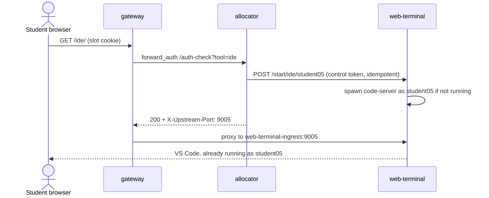
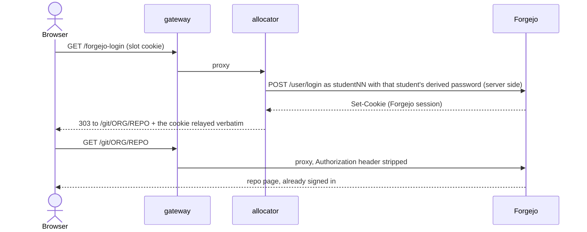
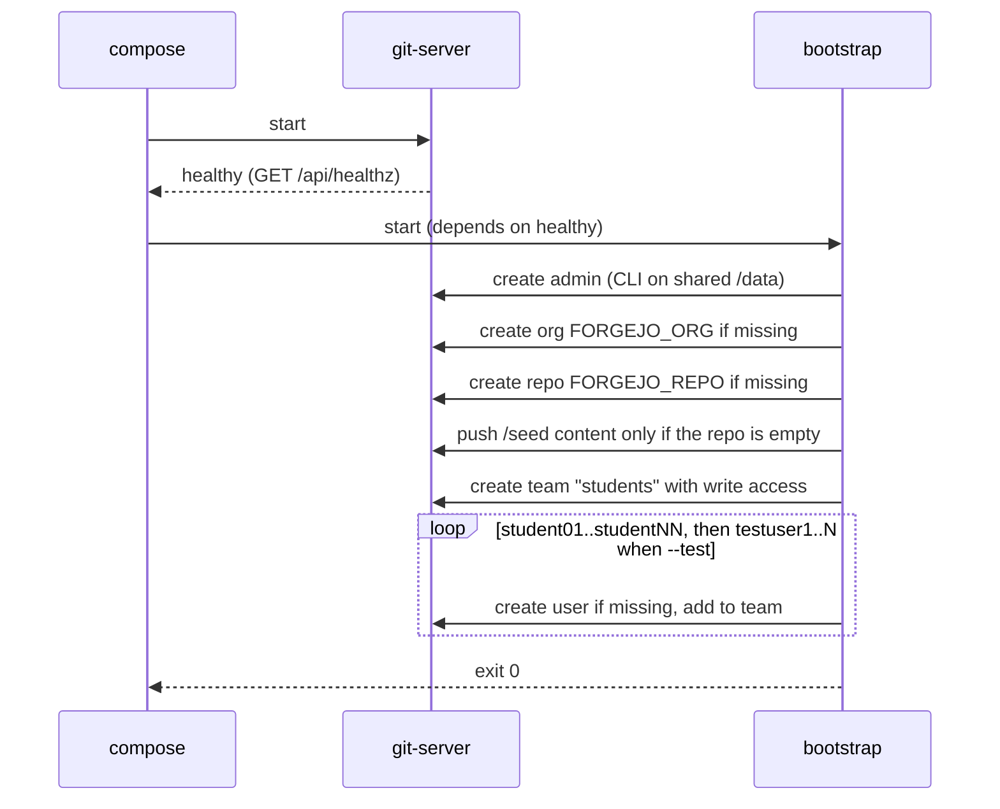
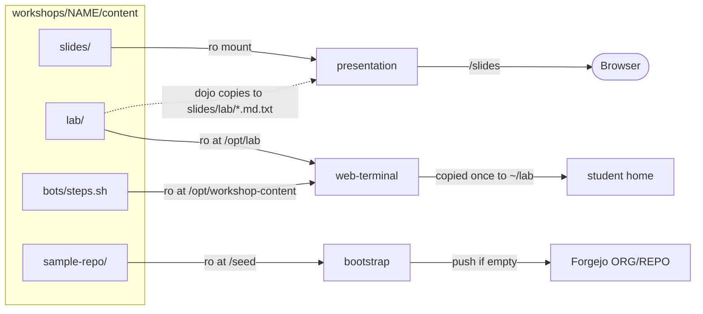
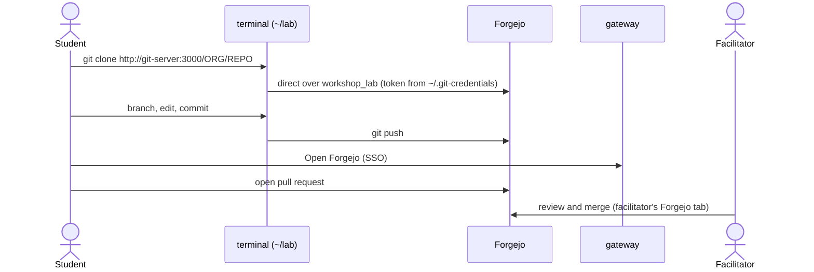
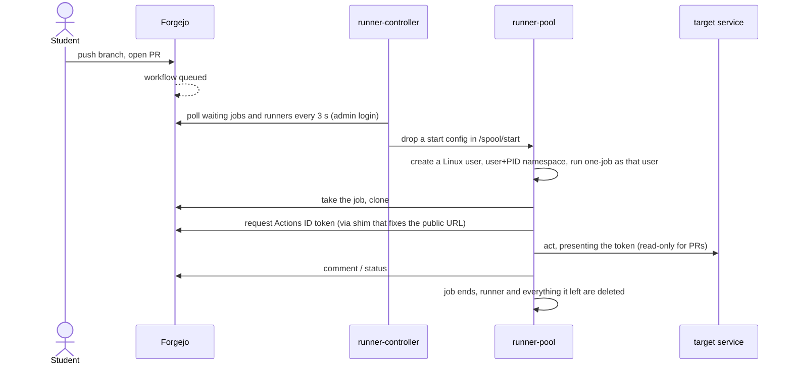
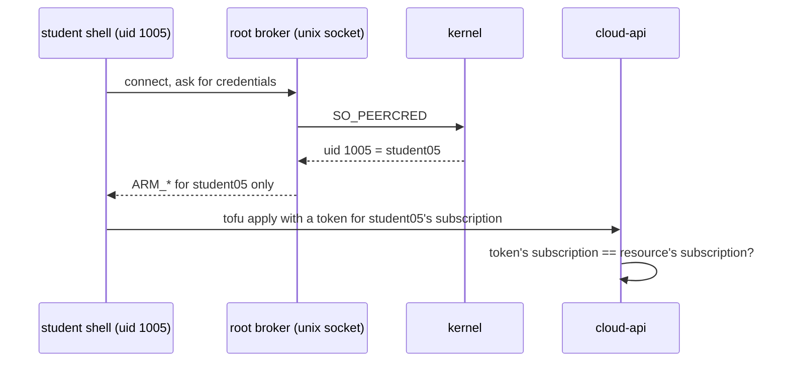
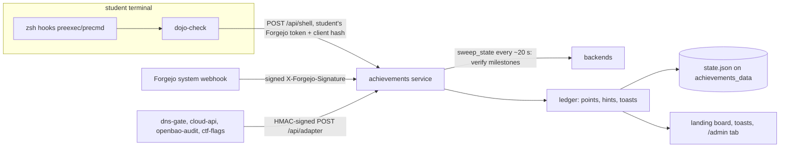
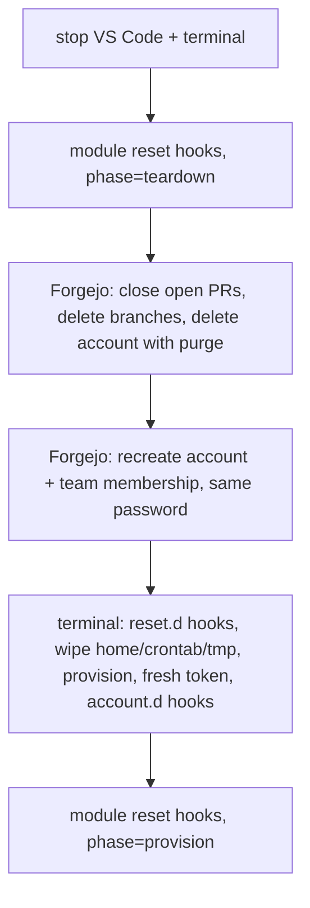
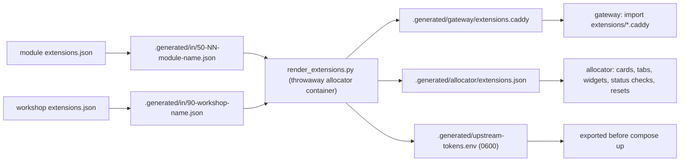

# Data flows

Step-by-step traces of how things move through the platform. Each section names the files that implement it so you
can follow along in the code. Topology and component roles are in [Architecture](architecture.md).

1. [Sign-in and slot assignment](#1-sign-in-and-slot-assignment)
2. [Opening VS Code or the terminal](#2-opening-vs-code-or-the-terminal)
3. [Forgejo single sign-on](#3-forgejo-single-sign-on)
4. [Provisioning at start (bootstrap)](#4-provisioning-at-start-bootstrap)
5. [Workshop content into the lab](#5-workshop-content-into-the-lab)
6. [The everyday git loop](#6-the-everyday-git-loop)
7. [CI: a pull request through the runner pool](#7-ci-a-pull-request-through-the-runner-pool)
8. [Credentials the student never types](#8-credentials-the-student-never-types)
9. [Per-workshop flows](#9-per-workshop-flows)
10. [Achievements events](#10-achievements-events)
11. [Facilitator watch, release and reset](#11-facilitator-watch-release-and-reset)
12. [Manifest rendering](#12-manifest-rendering)
13. [Demo bots](#13-demo-bots)

---

## 1. Sign-in and slot assignment

```mermaid
sequenceDiagram
    actor S as Student browser
    participant GW as gateway
    participant AL as allocator

    S->>GW: GET / (no cookie)
    GW->>AL: /session-check
    AL-->>GW: no session
    GW-->>S: 303 /login?next=/
    S->>GW: POST /login (class username + password)
    GW->>AL: proxy /login (rate-limited)
    AL-->>S: 303 / + signed dojo_login cookie (12 h)
    S->>GW: GET /
    GW->>AL: /session-check ok, proxy /
    AL-->>S: name-entry form
    S->>GW: POST /assign (name)
    GW->>AL: proxy
    AL->>AL: token bucket, then claim first free studentNN atomically
    AL-->>S: 303 + slot cookie; page "You're student05" with the workshop's cards
```

- The `dojo_login` cookie proves *class membership* (or facilitator). The slot cookie proves *which student*.
- Caddy copies the session check's `X-Session-User` into `X-Auth-User` with `header_up`, which overwrites any
  client-supplied header. A facilitator identity at `/` is sent to `/admin` and never gets a slot.
- The slot table is written to `allocator_state` on every claim and release, so an allocator crash keeps every assignment.
- A student who returns with the same cookie gets the same slot. After a **Release**, the next visit reassigns
  (the same account if still free, otherwise the next one).
- Code: `engine/allocator/accounts.py` (login, cookies), `allocation.py` (slots), `api.py` (`/assign`, `/auth-check`),
  `engine/gateway/Caddyfile` (`session_gate`).

## 2. Opening VS Code or the terminal



A released or never-assigned session gets `303 /` at the auth check instead. The first load can 502 for a
second or two while the process binds its port; a reload fixes it. `/term/` works the same way on port 9500 + N
(ttyd attached to the student's tmux or Zellij session).

## 3. Forgejo single sign-on

The **Open Forgejo** button links to `/forgejo-login`, not to `/git/`.



Why this shape: students have shell access on the same internal network as Forgejo, so trusting any header-based
identity (reverse-proxy auth) would let one forge another. Server-side form login keeps the identity decision in
the allocator. `?next=<path>` (same-site paths only) lets a module's OIDC sign-in pass through already authenticated.
The facilitator signs in as `FORGEJO_ADMIN_USER`. `Authorization` is stripped because Forgejo's API hard-fails on a
Basic credential that is not a real Forgejo account.

## 4. Provisioning at start (bootstrap)



Every step checks existing state first, so re-running is safe. Each student's Forgejo password is derived (see
[Section 8](#8-credentials-the-student-never-types)), not stored.

## 5. Workshop content into the lab



- Editing slides is instant. A **new** lab file reaches homes on the student's next terminal restart; a file the
  student already edited is never overwritten.
- The lab reader in the browser (`workshops/assets/lab-reader.js`, Prism highlighting) renders the `.md.txt` copies;
  `/whoami` lets it substitute the student's own username for `studentXX` in commands.
- Slides use Marp with highlight.js grammars in `engine/presentation/engine.js`.

## 6. The everyday git loop



Git protocol traffic **never goes through the gateway**: it uses its own Basic credential per request, which would
collide with the shared gate's. Inside the terminal always use `git-server:3000`, never `localhost`. Workshops with
`FORGEJO_FORK_WORKFLOW=1` (tofu-basics, vault-fundamentals, cloud-policy-as-code) have each student fork the team repo;
their branches live in the fork and pull requests go fork → team repo.

## 7. CI: a pull request through the runner pool

Used by dns-as-code, vault-fundamentals, cloud-policy-as-code, dojo-introduction and ctf-defend.



Properties worth knowing:

- **One job per runner**, then the runner and its files are deleted, so no job sees another's leftovers.
- The controller keeps a warm idle minimum and scales to a cap (**Auto**); the facilitator's **Runners** panel can
  switch to **Manual** with − / +.
- Services trust the **Actions ID token**, a Forgejo-signed RS256 JWT checked against Forgejo's JWKS. Claims
  (`repository`, `ref`, `event_name`) decide authority. dns-gate lets CI change DNS only for a push to the class
  repo's `main`; a PR job, branch or fork gets 403 whatever its workflow says.
- Runners have no `docker.sock`; jobs are processes, not containers. Tools a job needs come from `JOB_TOOLS` (copied
  from the terminal image just built).

## 8. Credentials the student never types

| Credential | How it reaches the student | Derivation / check |
|---|---|---|
| Forgejo password | Never typed. Used by SSO; `Password` on the roster shows it | `base32(HMAC-SHA256(STUDENT_PASSWORD_SEED, "forgejo:"+user))[:16]`, identical in bootstrap, allocator and terminal (a test keeps the three in step) |
| Forgejo token | `forgejo-token.py` mints it at start, writes `~/.git-credentials` and `~/.netrc` (`0600`) | Scopes `write:repository`, `write:issue`, `read:user` |
| DNS API key (`DNS_API_KEY`) | `start.d/50-dns-key.sh` writes `~/.config/dojo/dns-api-key` | `<user>.<base32(HMAC(seed,"dns:"+user))[:32]`; owns only that account's names |
| Cloud credentials (`ARM_*`) | A root broker hands a shell its values over a unix socket | Broker reads the caller's uid via `SO_PEERCRED`; `cloud-api` accepts a token only for that student's subscription |
| Vault login | Identity broker signs a short-lived JWT for the caller's uid; OpenBao exchanges it for a token | Namespace per student, one templated policy |
| Gateway token per upstream | Passed to the upstream by compose as `GATEWAY_TOKEN` | `HMAC-SHA256(GATEWAY_TOKEN, "dojo-gateway-token/v1/<service>")` |
| Reset token per service | Passed as `RESET_TOKEN` | Per-service, constant-time compare |



## 9. Per-workshop flows

Full diagrams are in the root [`README.md`](../README.md#how-the-platform-is-put-together); the shapes are:

| Workshop | The core loop |
|---|---|
| git-fundamentals | terminal ⇄ Forgejo only. Sensei reviews and merges the roster PR |
| dns-as-code | edit `dnsconfig.js` → `dnscontrol preview` (own key, own zone) → PR → CI preview comment → merge → CI `dnscontrol push` with ID token → `dns-api` → PowerDNS → `dig` / DNS Zones page |
| cert-autorenewal | `step ca bootstrap` → `certbot`/`acme.sh` ask `step-ca` (HTTPS :9000) → `step-ca` resolves the student's name via PowerDNS and fetches the http-01 token from `demo-app` (shared webroot volume) → 5-10 min cert → cron renewal → dns-01 variant writes a TXT record through `dns-api` |
| tofu-basics | Track A: provider mirror → local `init/plan/apply/destroy`, no network. Track B: broker → ARM calls to `cloud-api` (HTTPS, private CA) → policy check → fixed-template run on `cloud-host` → portal URL |
| vault-fundamentals | broker JWT → OpenBao namespace; app reads secrets; Forgejo Actions login to OpenBao by ID token; `app-host` deploys; workload identity; dynamic Postgres users; audit log feeds the Audit tab |
| cloud-policy-as-code | tofu-basics' Dojo Cloud, now with policy definitions/assignments; Rego checks via `conftest`; CI jobs reach `cloud-api` over `runner_net` aliases |
| CTF series | student terminal → target slot on `ctf-host` (own port, per-uid firewall) → flag → `dojo-flag` → `ctf-flags` → achievements; CTF-5 patch → PR → CI → `ctf-builder` → `ctf-controller` redeploy |

## 10. Achievements events



Four sources feed one service: shell commands (matched against the catalog and discarded, text never stored),
Forgejo webhooks (push, PR, review), module adapters (dns, cloud, bao, ca, ctf, soc) and periodic state checks.
Challenges are verified by the service with its own Forgejo admin login against assertions that must mention
`{user}`. Forged events cost points and are attributed only to a caller the gateway identified.

## 11. Facilitator watch, release and reset

- **Watch**: `/admin/watch/<studentId>` has its own `forward_auth /auth-check-watch`, keyed by *student id*, not the
  caller; it attaches a read-only client (tmux or `zellij watch`) to that student's session.
- **Release**: the allocator stops that student's processes and frees the slot.
- **Release unused**: frees slots held more than two minutes with no running process.
- **Reset** (one worker, one student at a time, each step safe to repeat):



Shared state stays: merged history and comments in the org repo, and DNS records added to a CI-managed zone through
the shared repo.

## 12. Manifest rendering



Each route template strips client copies of `X-Dojo-User`/`X-Dojo-Host` before `forward_auth`, always strips
`Authorization`, and replaces `X-Auth-User`/`X-Gateway-Token` with what the allocator vouched for.

## 13. Demo bots

`--test [N]` adds accounts `testuser1..N` (max 35), provisioned like students but without using a slot. A runner
(`bot-runner.sh`) drives each through the labs inside a tmux or Zellij session, persisting `~/.dojo-bot-state` after
every step; a supervisor restarts a bot whose session is missing, even after a Release. The workshop's
`content/bots/steps.sh` replaces the default git-fundamentals steps. With `--fast`, each bot does one round, then
writes `~/.dojo-bot-done`.
