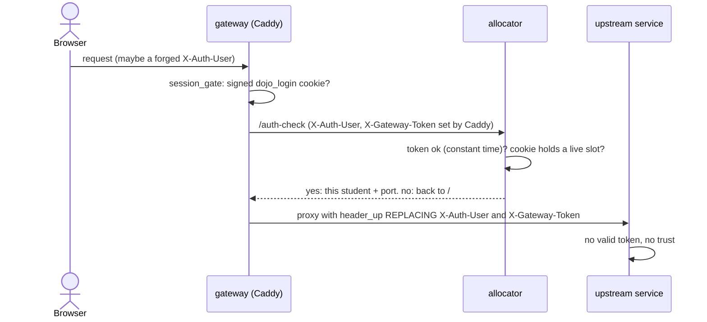

# Security model

**Threat model in one sentence:** students will poke at everything they can reach, from curiosity or by accident, and
the lab must stop that from becoming access to another student's work, the host, or the internet. It is an
*ephemeral training lab*, not a production system; some residual risks are deliberately accepted (see the end).

Three layers: **trust zones** (network), **identity** (headers and tokens), **kernel checks** (Linux users). The
formal findings and their fix history are in [`archive/threat-model-20260926-154208/`](archive/threat-model-20260926-154208/)
and [`RELEASES.md`](../RELEASES.md).

## 1. Trust zones: one way in

| Zone | What | Rule |
|---|---|---|
| 1 | `gateway` | The only container with published ports; the only one on both the outside and the inside |
| 2 | `workshop_lab`, `web_lab` | `internal: true`: no route to the internet. Student terminals reach Forgejo and their workshop's services and nothing else |
| 3 | Sandboxes: `bootstrap_net`, `runner_net`, `cloud_net`, `ctf_net`/`ctf_ops` | Risky by nature, each with exactly one door. Provisioning reaches Forgejo only. Student-written CI reaches Forgejo and what a workshop lists. The privileged Docker host is reachable only by `cloud-api` through a shared socket and fixed templates |

Because nothing has internet at lab time, every tool is baked into an image, **version-pinned and sha256-verified
per architecture**, and every external image is pinned by digest. `--dry-run` fails on an unpinned image.

## 2. Identity: only the gateway can say who you are

- **Headers are replaced, never passed through.** Caddy's `header_up` overwrites whatever the client sent.
- **The token proves the request came through Caddy.** All students share a network, so a terminal can reach any
  service directly. Without the right `X-Gateway-Token`, identity headers are ignored (and Dojo Cloud answers 401).
- **Each upstream has its own token**, `HMAC-SHA256(GATEWAY_TOKEN, "dojo-gateway-token/v1/<service>")`, so one
  service's token is refused by every other. The shared `GATEWAY_TOKEN` is used only by the allocator and engine
  blocks. The rendered snippet that contains the tokens is owned by `nobody`, mode 0440.
- **The cookie says which student.** The class shares one login, so identity is the allocator-issued slot cookie,
  checked on every `/auth-check`. A released or unassigned session cannot reach a workspace even with the class password.
- **The facilitator has a separate door.** `/admin` accepts only the facilitator session; the class login gets 403.
  `shared` routes carry no identity; `identity` and `facilitator` routes carry the pair.
- **Fail closed.** `dojo_http.gateway_user`/`is_facilitator` honour identity only with a correct token and fail
  closed when the token is unset.

Every service a student can reach directly **must** check the token. The runner-pool controller, for example, also
requires `X-Auth-User == FACILITATOR_USERNAME` and an `X-Requested-With` header on POSTs.

## 3. Kernel checks: a shared container, not a shared identity

All students' shells, IDEs and terminals live in one `web-terminal` container with one network namespace, so a
source IP means nothing. The kernel separates them:

| Control | Detail |
|---|---|
| One Linux user each | Own uid, `0700` home, **locked password** (no `su`), no root |
| Per-uid firewall | `iptables` chain `DOJO_ISOLATION` with `-m owner --uid-owner`: a uid may connect only to its own workspace ports; other uids' ports are dropped |
| Ingress network | The gateway reaches workspace ports over `terminal_ingress`; the entrypoint drops those ports on every other interface |
| PID namespace each | `ps` shows only your processes, never a neighbour's command line. Facilitator and bots stay outside; `su`, `sudo`, `ping` do not work inside |
| `prlimit --nproc` | Per-student fork-bomb tripwire (1024), below the container pids cap. No address-space or per-user memory cap (breaks node; needs per-user cgroups) |
| Brokers read the uid from the kernel | Cloud `ARM_*` credentials, vault JWTs and similar come from a root-owned unix-socket broker using `SO_PEERCRED`; the signing key is root-only |
| Reserved ports | Services a student must reach must avoid TCP 9000-9099 and 9500-9899 |

## 4. Student credentials

- Forgejo passwords are **derived** (`HMAC-SHA256(STUDENT_PASSWORD_SEED, "forgejo:"+user)`), so knowing one tells you
  nothing about another. Students never type them: SSO and a scoped token in `~/.git-credentials`/`~/.netrc` (`0600`)
  do it. The roster's **Password** button shows one on demand and is audit-logged (`forgejo-password-shown`).
- DNS keys are per account and own only that account's names; CI authority comes from the Forgejo-signed ID token.
- Cloud, vault and similar credentials are short-lived or broker-issued (see [Data flows](data-flows.md#8-credentials-the-student-never-types)).

## 5. Web-layer rules

- **Student-controlled strings are shown to the whole class.** Render with `textContent` only, never `innerHTML`.
- **Strict CSP** on the allocator's pages: no inline script or style (`pages.py` serves static assets).
- **Sign-in**: signed 12-hour cookie derived from the passwords and gateway token; wrong guesses limited (30/min per
  client address, then 429); `/logout`. The login page can use `GATEWAY_TRUSTED_PROXIES` to count real client addresses.
- **Plain http** off localhost prints a warning; https sends HSTS.
- **Slides** sit behind the class login too.
- **Caddy always strips `Authorization`** before Forgejo (Forgejo hard-fails on a foreign Basic credential, and it
  would leak the shared gate credential).
- **Concurrency safety**: the allocator is threaded with socket timeouts; the gateway gives allocator calls a 3 s
  dial and 10 s header timeout, so a slow allocator is a 502, not a hung page. Slot assignment is rate-limited.

## 6. Containers and CI

- Runner pool, app-host and their shims drop capabilities (the supervisor keeps CHOWN, DAC_OVERRIDE, FOWNER, SETUID,
  SETGID, KILL) and set `no-new-privileges`. Runners are **single-use**, in their own user and PID namespaces.
- No container-engine socket exists anywhere student-reachable. The one privileged component per workshop
  (`cloud-host`, `ctf-host`, Docker-in-Docker) is internal-only, publishes nothing, and has a single client with a
  fixed API surface (`cloud-api`; `ctf-controller` can pull/create/start/stop/rm but never build; `ctf-builder` builds
  from a repo it clones itself and never accepts a Dockerfile from its caller).
- Services use per-service reset and control tokens compared in constant time.
- Every identity and control-plane decision writes one JSON log line; DNS zone changes (allowed and refused), vault
  requests, resets and password reveals are auditable.
- Resource limits everywhere are env settings, and `0` turns each off.

## 7. Who can reach what

| From ↓ / To → | git-server | presentation | dns-server | step-ca / demo-app | cloud-api | cloud-host | Internet |
|---|:--:|:--:|:--:|:--:|:--:|:--:|:--:|
| Student terminal | ✓ | — | via `dns-api` (dns-as-code, cert-autorenewal, intro) | cert-autorenewal | Dojo Cloud workshops (:443) | — | — |
| gateway | ✓ | ✓ | — | `/demo`, `/inspect` | `/cloud` | — | in only |
| runner-pool | ✓ | — | via `dns-api` | — | cloud-policy-as-code (aliased names) | — | — |
| step-ca | — | — | ✓ | ✓ | — | — | — |
| cloud-api | — | — | — | — | — | ✓ | — |
| bootstrap | ✓ | — | — | — | — | — | — |

## 8. Accepted residuals and stated shortcuts

This is an ephemeral lab. Residual findings are fine; extra hardening is not the goal. Things stated to students or
accepted knowingly:

- Without per-user cgroups there is one shared memory pool for all students; a fork bomb is tripwired, a memory hog
  is bounded only by the container ceiling.
- The vault keeps one unseal key share on a volume, and OpenBao and Postgres traffic is plain http on lab networks.
- All students share a network namespace; nothing relies on source IP.
- Default passwords are acceptable only on loopback or an explicitly allowed VPN-only network.
- The runner pool's weak point is that concurrent runners share a kernel and filesystem, kept apart by users,
  namespaces and umask and thrown away after one job. Hosts that block unprivileged user namespaces (Ubuntu 24.04's
  AppArmor `restrict_unprivileged_userns`) stop runners from starting (they show red).
- Public-network exposure is your responsibility: the repo does not manage NSGs or firewalls.

## 9. Branding and content safety

"Dojo Cloud" is Azure-*inspired*: no Microsoft names, logos or trademarks. Labs must never contain challenge answers;
Sensei skips headings that name a challenge as a backstop.
