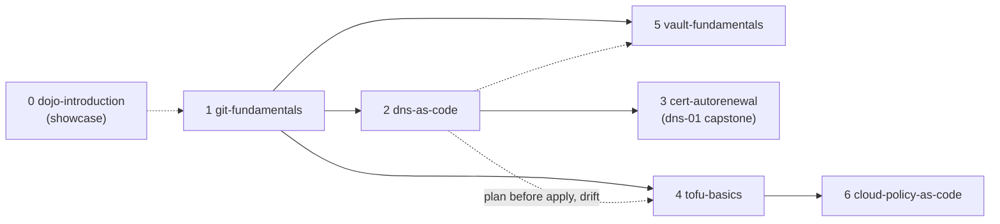

# Workshop catalog

`./dojo list` prints this order from each pack's `workshop.env`. Numbers 1-7 are a **learning path** (teach them in
order; a later workshop assumes the earlier ones' *ideas*, not their files). 0 is a showcase; 99-103 are the CTF
series and a test harness.

| # | Pack | Title | Length | Labs | Modules |
|---|---|---|---|---|---|
| 0 | `dojo-introduction` | Dojo Introduction | ~35 min | none (tour) | runner-pool, dojo-cloud, dns-ui, dns-gate, sensei |
| 1 | `git-fundamentals` | Git Training Lab | 60 min | 5 | sensei |
| 2 | `dns-as-code` | DNS as Code Lab | ~2 h | 6 | runner-pool, dns-ui, dns-gate, sensei |
| 3 | `cert-autorenewal` | Certificate Autorenewal Lab | ~1¾ h | 5 | dns-ui, dns-gate, sensei |
| 4 | `tofu-basics` | OpenTofu Basics Lab | ~2¼ h | 11 (0-10) | dojo-cloud, sensei |
| 5 | `vault-fundamentals` | Vault Fundamentals Lab | ~3½ h | 14 (0-13) | openbao, runner-pool, sensei |
| 6 | `cloud-policy-as-code` | Cloud-Policy-as-Code | ~4-5 h | 13 (0-12) + capstone | dojo-cloud, runner-pool, sensei |
| 7 | `ctf-defend` | CTF-5: Defend | ~2 h | 1 | ctf-range, runner-pool |
| 100 | `ctf-access` | CTF-1: Access and Identity | ~150 min | 4 | ctf-range |
| 101 | `ctf-server-trust` | CTF-2: Server-side Trust and APIs | ~150 min | 4 | ctf-range |
| 102 | `ctf-secrets-config` | CTF-3: Secrets and Misconfiguration | ~115 min | 2 | ctf-range |
| 103 | `ctf-trust-chain` | CTF-4: Trusting the Wrong Thing | ~115 min | 2 | ctf-range |
| 99 | `ctf-defend-test` | CTF Defend Test (harness) | ~15 min | facilitator-only | ctf-range, runner-pool, openbao |

## The learning path

Audience: engineering and IT operations people, from those who use git daily to those who never have. Comfort with a
terminal is assumed; git knowledge is not. Git Fundamentals gives everyone the clone-branch-PR routine; later
workshops apply it to operational work where changes go through review and automation instead of by hand.

---

## 0. dojo-introduction: a light tour

A show-and-tell for facilitators and visitors, not a course. Forgejo with CI runners, DNS as code and Dojo Cloud all
run at once (the vault and certificate lab are left out to stay light). One terminal image carries `dnscontrol`,
`dig` and `tofu`.

- **Deliverables**: a platform-tour deck, a Workshop Library page linking every workshop's slides and labs (served at
  `/slides/w/<name>/`), and `tools-tour.md` with a few commands per capability.
- **Facilitator view**: Runners, DNS Zones, DNS Admin, Dojo Cloud tabs.
- **Forgejo repo**: `dojo-team/dojo-tour`.

## 1. git-fundamentals: everyday git

Content only; the engine exactly as is. Pure git against Forgejo.

| Lab | Topic | Time |
|---|---|---|
| 1 | The core workflow: clone → branch → edit → commit → push → PR | ~15 min |
| 2 | Reviewing and undoing changes before you commit | ~10 min |
| 3 | Stashing | ~8 min |
| 4 | Investigating history: log, blame, show | ~10 min |
| 5 | Merge conflicts and safely undoing a shared change | ~12 min |

- **Seed repo**: `training/sample-training-repo` with `roster/team.yaml`. Lab 1: add yourself to the roster, open a
  PR; **Sensei** reviews and merges it.
- **Hardest part**: Lab 5 (merge conflicts) is deliberately the hardest.
- **Extras**: `lab-prep N`; `tmux-guide.md`, `zellij-guide.md`; achievements c1 (The Hotfix) and c2; an
  [Azure DevOps edition](../workshops/git-fundamentals/delivery-azure-devops/) of the same session (facilitator guide,
  pre-work checklist, FAQ, feedback survey) for delivery against Azure Repos.

## 2. dns-as-code: DNS in git

Manage DNS records with `dnscontrol`; a PR runs a CI preview; merging applies it to a live PowerDNS.

| Lab | Topic |
|---|---|
| 1 | Your own zone |
| 2 | Drift, and undoing your own changes |
| 3 | The change process on a shared zone |
| 4 | `dnsctl.py`, the CLI wrapper |
| 5 | Investigating and rolling back history |
| 6 | Merge conflicts in `dnsconfig.js` |

- **Adds**: PowerDNS (`dns-server`), `dns-api` (dns-gate), the runner pool, DNS Zones page, DNS Admin (facilitator).
- **The loop**: `dnscontrol preview` with your own key → PR → CI posts the diff and a "DNS Preview" status → merge →
  CI runs `dnscontrol push` using an Actions ID token → `dig` and the DNS Zones page show it.
- **Why a merge matters**: `dns-api` accepts a CI change only from a push to `main` of the class repo; a PR job gets 403.
- **Sensei** runs in *approve* mode: it approves clean one-record PRs (and your Lab 5 rollback) but **never merges**;
  students merge their own. A student's PR needs them to have reviewed someone else's first (or 180 s patience).
- **Facilitator trick**: edit a record in **DNS Admin** to create drift, then watch the next `dnscontrol push` revert it.

## 3. cert-autorenewal: ACME and renewal

| Lab | Topic |
|---|---|
| 1 | Trust the CA (`step ca bootstrap`) |
| 2 | Issue and install a certificate with `certbot` (http-01) |
| 3 | The same with `acme.sh` |
| 4 | Automate renewal (cron) |
| 5 | The dns-01 challenge |

- **Adds**: `step-ca` (a private ACME CA with **5-10 minute certificate lifetimes** so renewals are visible),
  PowerDNS, one shared nginx `demo-app` serving every student's vhost, `site-inspector`, `dns-seed`.
- **Isolation**: not per container but per-student ownership of a subdirectory on a shared webroot volume
  (`/srv/webroot/studentNN`); a watcher in `demo-app` reloads nginx on change, so no docker.sock.
- **Network**: `workshop_lab` is pinned to `172.30.0.0/24` so `dns-server` (.10) and `demo-app` (.20) have stable addresses.
- **Site Inspector** is the students' browser for `demo-app` (the gateway cannot proxy a browser to each private name).
- **Capstone**: the dns-01 lab drives the PowerDNS API that workshop 2 teaches `dnscontrol` over.
- **Challenge c2** "watch": the site must renew itself for 20 minutes.

## 4. tofu-basics: OpenTofu

| Lab | Topic |
|---|---|
| 0 | Get the repo and take the tour |
| 1 | First run: `init`, `plan`, `apply` |
| 2 | Change a value and read the plan |
| 3 | Tear it down |
| 4 | Meet Dojo Cloud |
| 5 | Deploy hello |
| 6 | Break a policy on purpose |
| 7 | Drift: when reality changes behind your back |
| 8 | Change types: in-place vs replace |
| 9 | Scale it: `for_each` and quotas |
| 10 | Clean up |

- **Track A (labs 0-3)**: an offline sandbox. Providers come from a mirror baked into the image
  (`/opt/tofu-providers`); nothing leaves the terminal.
- **Track B (labs 4-10)**: the real `azurerm` provider against **Dojo Cloud**, an Azure-inspired practice cloud with an
  ARM-style API, a portal at `/cloud`, per-student subscriptions, policies, quotas and drift. `terraform` is OpenTofu.
- **Credentials**: a root broker hands each shell its own `ARM_*` over a unix socket, using `SO_PEERCRED`.
- **Policy errors** come back as ARM-shaped errors (missing tag, disallowed region, oversized container, over quota).
- **Fork workflow**: each student forks `iac-team/tofu-basics`.
- **Extras**: `FACILITATOR.md` run-of-show, an end-to-end test suite and load test in `tests/`.

## 5. vault-fundamentals: secrets with OpenBao

One OpenBao for the class; each student works in a **namespace of their own** under one shared templated policy.

| Lab | Topic |
|---|---|
| 0 | Sign in, meet your token, take the tour |
| 1 | Leak it |
| 2 | Keep it encrypted on your own machine (`sops`, `pass`) |
| 3 | Use the shared vault |
| 4 | You are the admin (of your namespace) |
| 5 | The app reads a secret |
| 6 | OpenBao Agent |
| 7 | Encrypted config in the repo |
| 8 | Secrets in the pipeline: Forgejo Actions secrets |
| 9 | CI logs in to OpenBao |
| 10 | Deploy with a delivered secret ID |
| 11 | Deploy with workload identity |
| 12 | Dynamic database credentials (optional) |
| 13 | Incident drill: a token leaked |

- **Adds**: `openbao` (+ setup, SSO shim, audit reader), the runner pool, `app-host` (one deploy slot per student and a
  capstone slot), `app-db` (Postgres).
- **No password to type**: a broker signs a short-lived JWT for the caller's uid and OpenBao exchanges it for a token.
  In the browser, Forgejo is the OIDC provider.
- **Facilitator tabs**: Vault, Audit, Apps, Runners.
- **Stated shortcuts**: one unseal share on a volume; plain http on lab networks.
- **Prerequisite**: Git Fundamentals. Tests: one script per lab in `tests/`.

## 6. cloud-policy-as-code: governing the cloud

Builds on tofu-basics' Dojo Cloud (the same module) with a **Policy engine**: definitions, assignments, parameters,
sets, `modify` and remediation, exemptions.

| Lab | Topic |
|---|---|
| 0 | Fork the repo, connect CI, deploy the app |
| 1 | Why guardrails? Meet your first refusal |
| 2 | Anatomy of a policy |
| 3 | Your first policy as code |
| 4 | Audit before you deny |
| 5 | Parameters and reuse |
| 6 | Policy sets |
| 7 | Modify and remediation |
| 8 | Exemptions, a reviewed way to say "not yet" |
| 9 | Shift left with Rego (conftest on the plan) |
| 10 | Testing policies (`opa test`) |
| 11 | Policy in the pipeline: a PR that cannot merge a violation |
| 12 | Drift: policy changed behind git's back |
| Capstone | A new rule, start to finish |

- **Adds** to the terminal: `opa`, `conftest`. CI jobs get the same binaries (`JOB_TOOLS`), the offline provider
  mirror (a one-shot fills a volume), a route to Dojo Cloud (aliases on `runner_net`) and its CA.
- **Heavy**: every lab is a real `tofu apply`, so the pack raises `WEB_TERMINAL_MEM_LIMIT=6g` and pids to 1024.

## The CTF series (capture the flag)

A thin pack per session on the shared **`ctf-range`** module. Each student gets their own copy of a vulnerable target
(one live per student at a time) on a boxed Docker-in-Docker host, reachable only from their own uid. Flags are
per-student HMACs; students submit with `dojo-flag`, verified by `ctf-flags`, and credited to achievements.

| Pack | Theme | Targets (labs) |
|---|---|---|
| `ctf-access` (CTF-1) | Getting in when auth is weak | `sqli-login`, `weak-auth-portal`, `idor-pcap`, `cert-trust-bypass` |
| `ctf-server-trust` (CTF-2) | When the server trusts too much | `ping-tool`, `ssrf-fetcher`, `api-mass-assignment`, `api-bfla` |
| `ctf-secrets-config` (CTF-3) | Leaked credentials and how far they reach | `leaky-config`, `git-secrets` |
| `ctf-trust-chain` (CTF-4) | A component, rule or pipeline trusted wrongly | `dns-resolver-cve`, `policy-bypass` |
| `ctf-defend` (CTF-5) | **Defend**: a live incident on your own app, patched with a PR, a CI gate and a redeploy | `customer-portal` |

How it behaves:

- **Attack Range card**: start, stop or reset your target; a FIFO queue limits concurrent jobs
  (`CTF_ATTACK_MAX_CONCURRENT`) and an idle auto-stop (`CTF_ATTACK_IDLE_SECONDS`) frees resources.
- **No lab depends on another** in CTF-1 to 4, so students can go in any order. In a short slot, drop CTF-1 Lab 4 first.
- **Hints**: the slides never name a bug; each lab has two rounds of hints; an `exploit-guide/` exists for anyone who
  does not finish. Do not volunteer hints from the stage; ask where they have looked.
- **Lab Info library**: a Linux/shell primer plus a primer per tool (`nmap`, `sqlmap`, `tshark`, `ffuf`, `opa`...),
  baked into `~/lab-info` and readable in the browser (a **Lab Info** card), mechanics only, never lab-specific payloads.
- **Scoped images**: each pack builds a `ctf-host` stage with only its own targets (≈900 MB vs 1.89 GB for the full catalog).
- **Set a real `CTF_CONTROL_TOKEN`** in `workshop.env`; the committed value is a placeholder.
- **CTF-5 (Defend)**: the app (`customer-portal`) is attacked live by an **attacker-bot swarm** on a shared green →
  yellow → red clock; students patch the code, a PR runs the scan + exploit gate, and on merge `ctf-builder` builds
  and `ctf-controller` redeploys the slot in place. A SOC feed and a "wall of shame" show the room's state.
  `ctf-defend-test` is the facilitator-only harness for this loop.
- **Status**: the CTF series is newer than the main path; check each pack's `FACILITATOR.md` "Honest status" and
  [`CTF-WORKSHOP-PLAN.md`](CTF-WORKSHOP-PLAN.md) before a live room.

## Common to all packs

- A pack's `FACILITATOR.md` states an **honest status** and its timings; per-lab times are estimates until a room is measured.
- Achievements catalogs live in `workshops/<name>/achievements/` with a generated `ACHIEVEMENTS.md` for review.
- Every pack runs `./dojo <pack> --dry-run` clean and with `--test --fast` bots where it has `bots/steps.sh`.
