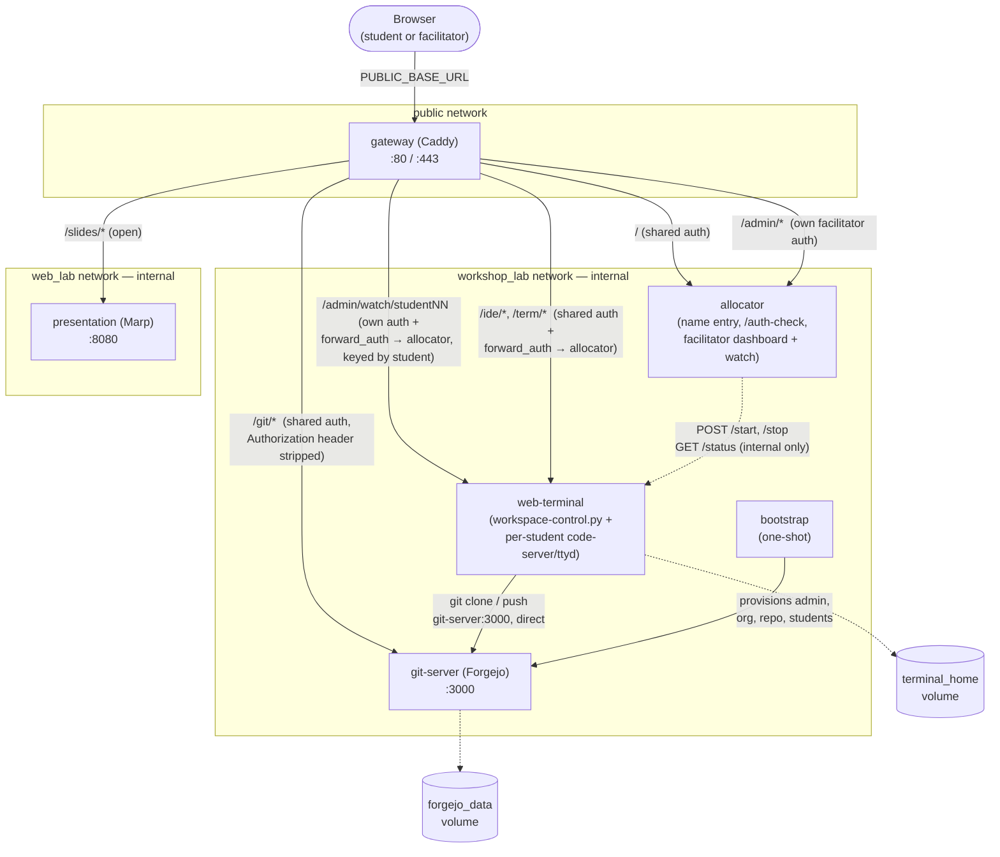
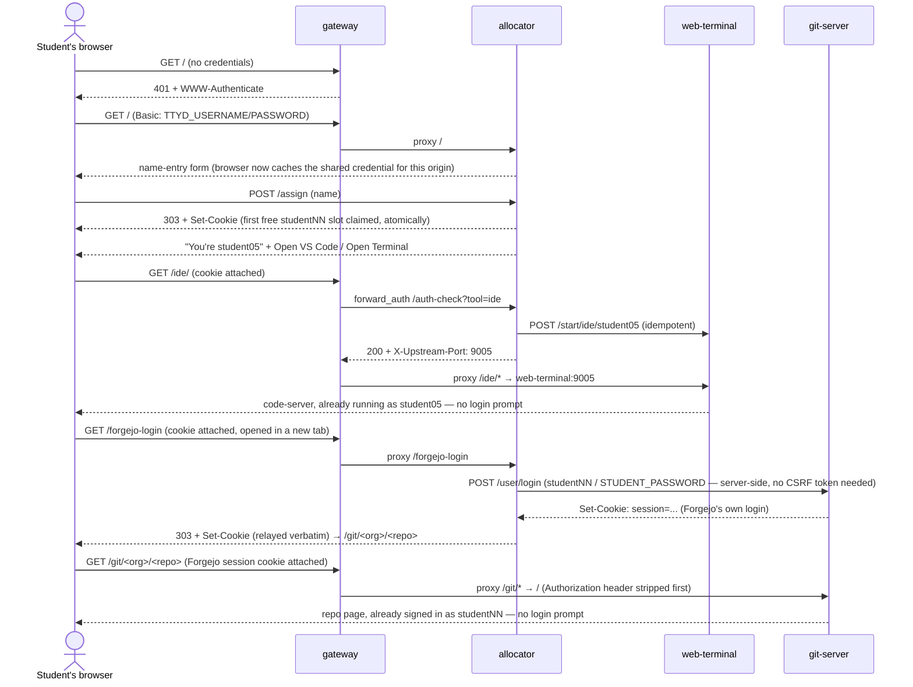
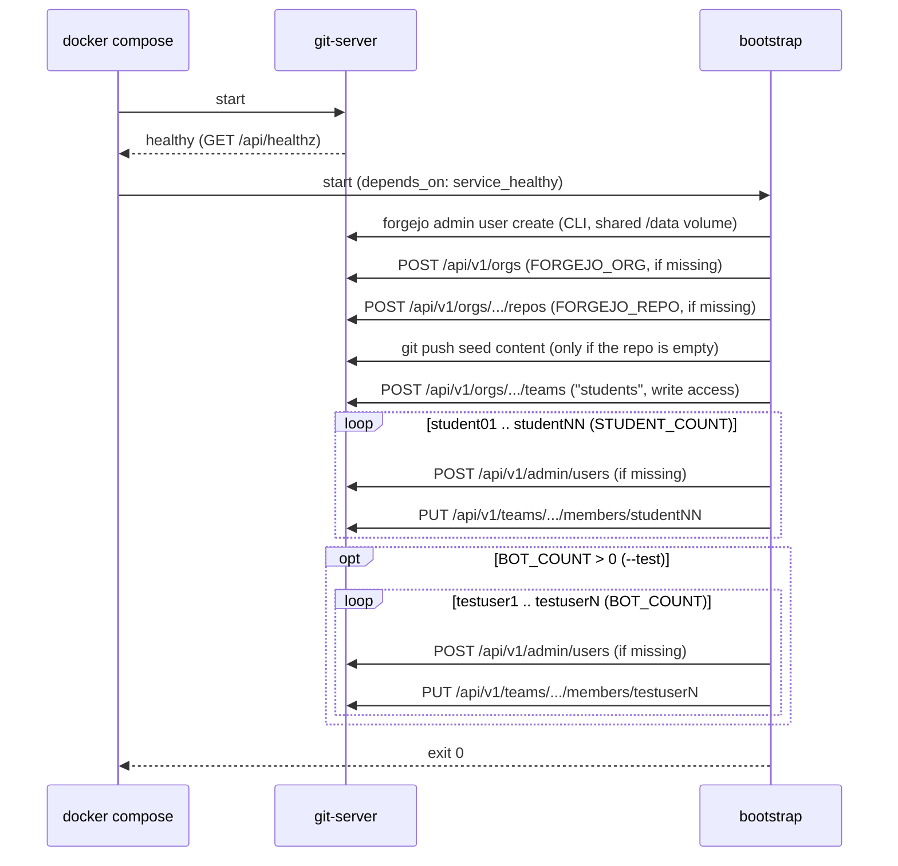

# Workshop Engine

The reusable runtime for every workshop in this repo. Nothing in this
directory should need editing to run a *different* workshop — only the
content it's pointed at, the account settings in `.env`, and (for a
workshop that needs different tooling than the default) a Compose overlay
file the workshop itself supplies. See [`../workshops/README.md`](../workshops/README.md)
for how a workshop is put together and how to add a new one; that's the
doc to read before touching anything in here.

It runs six services by default (a workshop's overlay can add more — see
`../workshops/dns-as-code/` for an example that adds a PowerDNS backend):

| Service         | Image                           | Purpose                                                                    |
| ---------------- | --------------------------------- | ----------------------------------------------------------------------------- |
| `gateway`        | built from `gateway/` (Caddy)     | The **only** service exposed to students. One hostname, TLS, routing, auth |
| `git-server`     | `codeberg.org/forgejo/forgejo`    | Git hosting (branches, PRs, review)                                        |
| `bootstrap`      | same, one-shot                    | Creates the admin user, org, sample repo, and student accounts on Forgejo  |
| `presentation`   | built from `presentation/` (Marp) | Serves `WORKSHOP_CONTENT_DIR/slides` (HTML only; no Chromium/PDF export)   |
| `allocator`      | built from `allocator/`           | Assigns each browser session a student account, drives the facilitator dashboard (name/IP/status/Release) |
| `web-terminal`   | built from `web-terminal/`        | Hosts each assigned student's code-server + ttyd processes, spawned on demand |

Everything runtime-related lives in Docker/Podman **named volumes** — there
are no host bind mounts for account data or Forgejo's database. Nothing
persists once you tear the stack down.

## Architecture

Only `gateway` is reachable from outside the stack. `git-server`,
`presentation`, `allocator`, and `web-terminal` sit on internal-only Compose
networks and publish no ports of their own — the gateway is the sole entry
point and the only thing that needs a hole in a firewall/NSG.



`web-terminal` and `allocator` sit only on `workshop_lab`, not `web_lab` — from
inside a student's shell, `git-server:3000` is reachable but
`presentation:8080` is not (deliberately; slides are a browser-only
concern). `gateway` is the one service that joins every network, since it
has to reach every backend and also be the thing with a published port.
`allocator` holds no persistent state (in-memory only, same ephemeral
design as everything else) and never touches Docker itself — it only ever
calls `web-terminal`'s internal control port, never a docker.sock.

### How a request gets routed and authenticated



A released or never-assigned session gets a `303` back to `/` at the
`/auth-check` step instead — see **Facilitator operations** below for
Release.

The `Authorization` header gets stripped before Forgejo ever sees it because
Forgejo's own API hard-fails if it sees a Basic Auth credential that isn't a
real Forgejo account (it doesn't fall back to the session cookie). Without
that strip, the shared gateway credential would break Forgejo's web UI —
this was found and fixed by testing the actual pull-request flow end to end,
not assumed.

### How bootstrap provisions Forgejo

Runs once per `compose up`, waits for `git-server` to report healthy, and is
safe to re-run — every step checks for existing state first.



## How requests are routed

Students only ever talk to `gateway`, at one address (`PUBLIC_BASE_URL`):

| Path            | Goes to        | Auth                                                              |
| ---------------- | --------------- | -------------------------------------------------------------------- |
| `/slides/*`      | `presentation`  | None — open, read-only content                                    |
| `/`              | `allocator`     | Shared gate (`TTYD_USERNAME`/`TTYD_PASSWORD` **or** `FACILITATOR_USERNAME`/`PASSWORD`) — name entry, tool picker; a facilitator identity here 303s straight to `/admin` |
| `/whoami`        | `allocator`     | Shared gate. Returns `{"user": "<studentId>"}` for a browser holding a slot, `{"user": null}` otherwise (the facilitator too). The lab reader uses it to swap the reader's username in for `studentXX` |
| `/ide/*`, `/term/*` | `web-terminal` | Shared gate, **then** `forward_auth` to `allocator`'s `/auth-check` — only a browser session holding a live assignment reaches the actual code-server/ttyd process |
| `/admin/*`       | `allocator`     | Its own `basic_auth` using only `FACILITATOR_USERNAME`/`PASSWORD` — checked *before* the shared gate below, so a student credential alone can't reach it. Renders one tabbed page: a live roster of watch tiles (Roster tab) plus the facilitator's own VS Code/Terminal/Forgejo/Slides as further tabs. `/admin/watch/<studentId>` is a second, distinct route under the same auth block — a read-only view onto *that* student's terminal, keyed by student ID via its own `forward_auth /auth-check-watch` rather than the caller's identity |
| `/git/*`         | `git-server`    | Shared gate to reach it, then Forgejo's own per-student login for anything beyond public browsing |
| `/<name>`, `/<name>/*` | whatever a workshop or module declares (e.g. `/cloud` → `cloud-api`, `/demo` → `demo-app`) | Shared gate, then one of three fixed gates. For `identity`/`facilitator`, `forward_auth` to `allocator`'s `/auth-check?route=<id>`, and Caddy itself sets `X-Auth-User` and `X-Gateway-Token` for the upstream. Only exists while that workshop runs (see [Workshop extensions](#workshop-extensions-extensionsjson)) |

The shared gate is one Caddy `basic_auth` block covering everything except
`/slides/*`, and it accepts **either** the shared student credential or the
facilitator's own — so a facilitator only ever needs to remember one
credential (theirs) to reach anything in the stack, including `/ide`,
`/term`, and `/git`, all of which still sit behind this same gate after
`/admin` routes them there. Both `basic_auth` blocks use Caddy's same
default realm (this Caddy version has no Caddyfile option to change it),
which works in our favor: a browser that's already authenticated as the
facilitator on either block transparently reuses that cached credential on
the other too, rather than prompting twice.

Whichever basic_auth account actually matched is forwarded to `allocator`
on every request as `X-Auth-User` (`header_up {http.auth.user.id}` in
`gateway/Caddyfile` — this always *overwrites* any client-supplied header
of the same name, so it can't be spoofed). `allocator/server.py` trusts
this to recognize the facilitator immediately, on the very first request —
typing the facilitator credential once, anywhere, is enough; there's no
separate login step and no dependency on a cookie existing yet. This is
also what stops a facilitator from ever being accidentally assigned a
student slot: entering the facilitator credential at `/` renders their own
page instead of the name-entry form. Reaching `/ide` or `/term` is a
deliberate second step, gated by having actually been assigned an account
through `/` (or being the facilitator) rather than typed credentials —
direct navigation to `/ide` or `/term` with no valid assignment bounces
straight back to `/`.

**Forgejo SSO.** The Open Forgejo button doesn't link straight to `/git/*`
— it links to `/forgejo-login`, which resolves the browser's identity
exactly like `/ide`/`/term` do, then has `allocator` POST Forgejo's own
login form itself, server-side, over the internal network (`studentNN` +
`STUDENT_PASSWORD` for a student, `FORGEJO_ADMIN_USER` +
`FORGEJO_ADMIN_PASSWORD` for the facilitator — matching whatever
`bootstrap.sh` actually seeded those accounts with), then relays Forgejo's
own `Set-Cookie` response straight onto the browser and redirects into the
repo. No Forgejo reverse-proxy-auth config, no header-trust surface across
the internal network (which would have been a real problem here — students
have shell access on `web-terminal`, the same internal network Forgejo
sits on, so trusting any header-based identity from that network would let
a student forge one for another account). A student can only ever land in
their own resolved identity's Forgejo account through this route, the same
guarantee `/auth-check` already relies on for `/ide`/`/term`. Separately,
note that `bootstrap.sh` gives every `studentNN` Forgejo account the *same*
`STUDENT_PASSWORD` (matching their shared Linux/ttyd password) — a student
who knows another student's account name could already sign into that
account manually on Forgejo's own login form; this route doesn't change
that, since it only ever authenticates the caller as their own resolved
identity. Forgejo's
login form needs no CSRF token to POST (verified against the running
instance), which is what makes this possible without `allocator` holding a
live Forgejo session of its own.

Git operations (`clone`/`push`) never go through the gateway or this SSO
route at all — students run them from inside the terminal, straight to
`git-server:3000` on the internal network. That matters because git's
protocol sends its own
Basic Auth credential per-request; layering the shared gate's credential on
top of it would collide. `gateway/Caddyfile` explicitly strips the
`Authorization` header before proxying to Forgejo for exactly this reason —
don't remove that when editing it.

### Workshop extensions (`extensions.json`)

A workshop or module adds landing cards, `/admin` tabs, routes and status
checks with an `extensions.json`, not by editing the engine. The format, the
gates and the rules are in [`workshops/README.md`](../workshops/README.md#front-door-extensionsjson);
this is how the engine uses it.

- **Render before start.** `run.sh` copies each module's manifest (as
  `50-NN-module-<name>.json`, in `MODULES` order) and the workshop's (as
  `90-workshop-<name>.json`) into `.generated/in/`, then runs
  `allocator/render_extensions.py` once in a throwaway allocator container,
  mounted from source so a dry run checks with the current rules. It writes
  `.generated/gateway/extensions.caddy` and `.generated/allocator/extensions.json`
  (both git-ignored). Any error stops `./run.sh` before anything starts;
  warnings (a card with no matching `/admin` tab) are printed and the start
  goes on. `--dry-run` runs this step too.
- **Gateway.** `gateway/Caddyfile` has one `import /etc/caddy/extensions/*.caddy`
  inside the shared-gate block, before the allocator catch-all; the snippet is
  bind-mounted read-only. Every route comes from one template per gate in the
  renderer: it strips client copies of `X-Dojo-User`/`X-Dojo-Host` **before**
  `forward_auth` (wrapped in `route {}`, since Caddy would otherwise sort
  `request_header` after `forward_auth`), always strips `Authorization`, and for
  `identity`/`facilitator` replaces `X-Auth-User` and `X-Gateway-Token` with
  what the allocator vouched for. Caddy re-sorts path-matched `handle` blocks,
  so correct routing relies on the renderer's no-overlap rule, not on order.
- **Allocator.** Reads `.generated/allocator/extensions.json` at start: cards
  go on the landing page after the built-in ones, tabs into `/admin` after the
  built-in ones, status checks into the status strip. `/auth-check?route=<id>`
  looks the route up: `303` to `/` without a session, `403` for a student on a
  `facilitator` route, `404` for an unknown or `shared` route, and otherwise
  `200` with `X-Dojo-User` (and `X-Dojo-Host` when the route has a `host`).
  The facilitator's `{user}` is their own account name, so they get their own
  demo site rather than a student's.
- **Legacy.** `STATUS_CHECKS` (`Label=URL;...` on the allocator) still adds
  status-strip entries; new work uses `status_checks` in the manifest.

### Modules and the terminal image

`MODULES="a b"` in `workshop.env` adds `../modules/a/`, `../modules/b/` (see
`./run.sh modules` and [`workshops/README.md`](../workshops/README.md#writing-a-module)):

- **Settings.** Each `module.env` is sourced first, then `.env` and
  `workshop.env` again, so the workshop wins.
- **Compose files.** `-f docker-compose.yml`, each module's `compose.yml`, then
  the workshop's `COMPOSE_OVERLAY`. The list is written to `.last-overlay`
  (one file per line) so `./run.sh stop` / `teardown.sh` bring down the same
  set. Build-change detection hashes each module folder and the overlay folder.
- **Terminal chain.** `gitopsdojo/web-terminal:base` → each module's
  `terminal/` as `:<workshop>.<module>` → the workshop's `compose/terminal/` as
  `:<workshop>`. Each link is `ARG BASE` / `FROM ${BASE}` and inherits the
  entrypoint and HEALTHCHECK. The final tag reaches `docker-compose.yml` as
  `WEB_TERMINAL_IMAGE`, so no overlay sets `image:` on `web-terminal`.
- **Start-up hooks.** `web-terminal/entrypoint.sh` runs every
  `/etc/dojo/start.d/*.sh` as root, in name order, once the accounts exist
  (modules `50-`, workshops `90-`). A failing hook stops the container. No
  hooks, no change.

## Setup

Everything is driven from `run.sh`, which lives in the repo root (and in
`engine/` — the root one just forwards to it):

```sh
./run.sh setup
# or, non-interactive with fixed lazy credentials for local/throwaway use:
./run.sh setup --default
```

`./run.sh setup` (which runs `scripts/env-setup.sh`) walks through every setting below, showing its
current default in `[brackets]` (Enter accepts it) and auto-generating a
strong random value for passwords/tokens on a bare Enter. It also offers to
run `capacity-calc.sh` for you to size `WEB_TERMINAL_MEM_LIMIT`/
`WEB_TERMINAL_PIDS_LIMIT`/`CODE_SERVER_MAX_HEAP_MB` to this machine. Prefer
this path for a real workshop, since it gives every session unique
credentials. `--default` skips all of that and fills in fixed, easy values
instead (`student`/`student123`/`admin`/`admin` — see the script's header
for the exact mapping); machine-to-machine secrets (`CONTROL_TOKEN`/
`GATEWAY_TOKEN`) are still randomly generated even in `--default` mode,
since nobody ever types those. Either way it still tries to auto-size the
resource-ceiling settings via `capacity-calc.sh`.

`./run.sh setup --force` skips the "`.env` already exists" prompt. Prefer to
do it by hand instead? `cp .env.example .env` and edit directly — same
settings, same file.

`.env` now holds only account/secret/network settings — the same for every
workshop. Which workshop to run (content, Forgejo org/repo, any extra
services) is selected separately, by name, via `./run.sh` below.

| Variable                                          | Purpose                                                        |
| -------------------------------------------------- | --------------------------------------------------------------- |
| `WORKSHOP_CONTENT_DIR`                             | Path to a `workshops/<name>/content` folder (slides, lab, sample-repo) |
| `WORKSHOP_NAME`                                    | Name shown in the terminal welcome message                     |
| `PUBLIC_BASE_URL`                                  | What students type into their browser. See **Deployment scenarios** below |
| `LAB_HOST_IP`                                      | Interface the gateway binds to on this machine — see below     |
| `GATEWAY_HTTP_PORT`, `GATEWAY_HTTPS_PORT`          | Host ports the gateway publishes (default 80/443)               |
| `TTYD_USERNAME`, `TTYD_PASSWORD`                   | Shared gate in front of the terminal and Forgejo browsing       |
| `STUDENT_COUNT`, `STUDENT_PREFIX`, `STUDENT_PASSWORD` | Linux terminal accounts *and* matching Forgejo accounts (1-99) |
| `FACILITATOR_USERNAME`, `FACILITATOR_PASSWORD`     | Facilitator's Linux login, sudo-capable                        |
| `FORGEJO_ADMIN_USER`, `FORGEJO_ADMIN_PASSWORD`, `FORGEJO_ADMIN_EMAIL` | Forgejo admin created by `bootstrap` (avoid the reserved name `admin`) |
| `FORGEJO_ORG`, `FORGEJO_REPO`                      | Where the seeded sample repo lives                              |

These are workshop credentials, not production secrets — rotate them for
every session. `.env` is gitignored.

### Deployment scenarios

**Local laptop (default):**
```
PUBLIC_BASE_URL=http://localhost
LAB_HOST_IP=127.0.0.1
```
Plain HTTP, no TLS, reachable only from this machine.

**Azure VM, internal workshop:** bind the gateway to all interfaces and let
Azure's free per-public-IP DNS label give you a real hostname — Caddy then
gets a trusted Let's Encrypt certificate automatically, no custom domain
needed:
```
PUBLIC_BASE_URL=https://<your-label>.<region>.cloudapp.azure.com
LAB_HOST_IP=0.0.0.0
```
Set the DNS label on the VM's public IP in the Azure portal (or
`az network public-ip update --dns-name <label> ...`) before starting the
stack, since Caddy requests the certificate on first boot and needs that
hostname to already resolve.

`LAB_HOST_IP=0.0.0.0` is fine here — the actual access boundary on a VM
should be the **NSG**, scoped to your corporate network/VPN range for the
workshop's duration, not this setting. This repo doesn't manage the NSG;
that's an Azure-side step you control per-deployment.

**A second address, one flag away (`--env`):** `./run.sh <workshop> --env home`
sources `engine/.env.home` after `engine/.env`, so it only needs the lines that
differ and everyday runs are unchanged.

**Behind another reverse proxy (e.g. a home-lab Caddy with a real certificate):**
the proxy terminates TLS and forwards to the gateway on plain HTTP. `GATEWAY_LISTEN`
is what the gateway serves; `PUBLIC_BASE_URL` stays what browsers use (links,
Forgejo's clone URLs, the Secure cookie flag):
```
PUBLIC_BASE_URL=https://dojo.example.com
GATEWAY_LISTEN=http://:8080
LAB_HOST_IP=0.0.0.0
```
and on the proxy, `dojo.example.com { reverse_proxy <this-host>:8080 }`. Scope a
firewall rule so only the proxy can reach port 8080.

## Start

```sh
./run.sh <workshop-name>       # e.g. ./run.sh git-fundamentals, ./run.sh dns-as-code
./run.sh list                  # see available workshops
./run.sh setup                 # create .env (--default for lazy local values)
./run.sh capacity --students N # size the terminal resource limits (scripts/capacity-calc.sh)
./run.sh stop                  # tear down the stack and all volumes (scripts/teardown.sh)
./run.sh <workshop> --dry-run  # preview a start (also: ./run.sh stop --dry-run) — changes nothing
```

Run these from the repo root, or from `engine/` — same commands either way.

**Preview first with `--dry-run`.** `./run.sh <workshop-name> --dry-run` shows
the resolved content/overlay, which images would be rebuilt vs. reused,
and whether the Compose config validates — without building, starting, or
writing anything (it won't even offer to install tab-completion).
`./run.sh stop --dry-run` lists the Compose files, services, volumes, and
running containers that `stop` would act on, and the exact command it would
run, without removing anything. Worth doing before `stop`, since that deletes
every volume. (`setup` and `capacity` don't take `--dry-run`: `capacity` is
already read-only, and `setup` only writes the gitignored `.env`, asking
before it overwrites one.)
`./run.sh --help` lists every command, and `./run.sh <command> --help` prints
that command's own help (e.g. `./run.sh capacity --help` for all the sizing
flags, `./run.sh setup --help` for `--default`/`--force`).

**Tab-completion.** The first time you run `./run.sh` in an interactive
terminal, it offers to wire up completion for workshop names,
`setup`/`capacity`/`list`/`stop`/`teardown`, and their flags — for bash or zsh, whichever `$SHELL` says you're
using (`engine/scripts/install-completion.sh`). Say yes and it appends two
lines to `~/.bashrc`/`~/.zshrc`, sourcing the matching script under
`engine/completions/`; say no, and it won't ask again (tracked in
`engine/.build-state/`, gitignored) — source the file yourself later if you
change your mind. One completion script covers both the root `./run.sh` and
`engine/run.sh` (`./run.sh`, `../run.sh`, `engine/run.sh`, `./engine/run.sh`),
and it finds the workshops from its own location, not your current directory,
so it works the same wherever you are. Already installed? It's sourced by
path, so a new shell picks up updates with no re-install. Never prompts outside a real terminal (CI, `--test` bot
runs, etc. are unaffected), and does nothing at all for a shell it doesn't
recognize (e.g. PowerShell) beyond pointing you at `engine/completions/` to
wire up by hand.

`run.sh` picks the workshop's content/org/repo from
`workshops/<name>/workshop.env`, builds the base terminal image, layers on
that workshop's Compose overlay if it has one, and brings the stack up —
see [`../workshops/README.md`](../workshops/README.md) for the full
mechanism. (Running `docker compose up -d --build` directly still works
too, using whatever's in `.env` — useful for quick iteration on the engine
itself, but `run.sh` is the normal path.)

Needs a container engine on `PATH`: real `docker` (with the `compose`
plugin) if you have it, otherwise `run.sh`/`scripts/teardown.sh` fall back
to `podman build`/`podman-compose` automatically — there's no flag to set,
they just detect whichever is actually installed. Confirmed working
end-to-end on Podman (`podman-compose`) as well as Docker.

This builds the terminal and gateway images, starts Forgejo, waits for it to
report healthy, then runs `bootstrap` once to create the admin account, the
configured Forgejo organization, the seeded sample repo, and one Forgejo
account per configured student (added to a `students` team with write
access — no public self-registration is needed or allowed).

Open `PUBLIC_BASE_URL` in a browser. Students pass the shared gate
(`TTYD_USERNAME`/`TTYD_PASSWORD`), type their name, and are automatically
assigned the next free `${STUDENT_PREFIX}NN` account — no second password
to type, no picking their own account. They land straight in code-server
(or ttyd, their choice) as that account. Their Open Forgejo link SSOs them
straight into their matching Forgejo account with no login prompt (see
**Forgejo SSO** above); `STUDENT_PASSWORD` is only something they'd need to
type themselves for a `git clone`/`push` from inside the terminal, and
the landing page they see after that shows it to them as their **Forgejo
password** (`no-store`, HTML-escaped, and only ever their own account's
secret, never the shared gate or facilitator credentials), so labs can
send students there instead of quoting a value that depends on your `.env`.
`/slides` is reachable from the same address too. The facilitator sees every
assigned student (name, account, IP, live active/inactive status) at
`/admin`, gated by `FACILITATOR_USERNAME`/`PASSWORD` — see
**Facilitator operations** below.

**Capacity**: code-server instances run meaningfully heavier than a bare
shell. Measured natively on amd64 with 3 students connected at once (a
fresh session with README.md and its preview, a `.yaml` and a `.tf` open):
about **260MB** PSS / **240MB** private memory per student, of which
roughly 200MB is the extension host, pty host and language servers. That is
down from about 480MB before the extension trim and code-server node flags
(`f977209`); see `web-terminal/vscode-extensions.md` and
`CODE_SERVER_MAX_HEAP_MB` below. They're spawned lazily on first `/ide`
visit and killed on Release — cost scales with concurrently-*active*
students, not `STUDENT_COUNT`. A room where everyone is connected at once is
the peak; nothing below lowers it. Three knobs bound it:

- `web-terminal`'s container-wide `mem_limit`/`pids_limit`
  (`docker-compose.yml`, set via `WEB_TERMINAL_MEM_LIMIT`/`WEB_TERMINAL_PIDS_LIMIT`
  in `.env`) is the ceiling for every student's code-server/ttyd process
  combined. Size roughly `(expected concurrent students) × 650MB × 1.15 + 512MB`
  for RAM and `(expected concurrent students) × 40 + 200` for pids: the same
  rule `./run.sh capacity` falls back to (below).
- `CODE_SERVER_MAX_HEAP_MB` (default 384) caps the V8 heap of each
  node process a student's code-server runs: the server, extension host,
  pty host and file watcher (`workspace-control.py`). It is passed as a
  node command-line flag, not `NODE_OPTIONS`, because code-server strips
  `NODE_OPTIONS` from its children but forks them with the parent's flags
  (checked in `/proc/<pid>/cmdline`). Language servers are forked by their
  extensions and stay uncapped, so `WEB_TERMINAL_MEM_LIMIT` is their only
  backstop. The same launch also sets `--max-semi-space-size=2`,
  `--optimize-for-size` and `MALLOC_ARENA_MAX=2` to keep each student small. `scripts/capacity-calc.sh`'s live-calibration mode measures
  actual private memory (`RssAnon`) rather than assuming a per-process cap.
- `CODE_SERVER_RECONNECTION_GRACE_SECONDS` (default 300) and
  `CODE_SERVER_IDLE_TIMEOUT_SECONDS` (default 900) release memory from
  students who have *left*. Without them, a closed tab's extension host and
  language servers stay resident for VS Code's default 3 hours. After the
  grace time they're killed (~330MB back per student); after the idle
  timeout the whole code-server exits and the next `/ide` request restarts
  it (via the allocator's `forward_auth` → `start_workspace()`), while
  terminals — tmux sessions under the student's own uid — are untouched. A
  student whose browser tab is still connected is not affected: the timers
  start when the connection goes (tab closed, network lost). Not tested: how
  code-server sees a discarded background tab or a sleeping laptop. One visible
  effect: a student who returns after more than the grace time is asked to
  reload the window rather than resuming in place. `0` disables a timer; a
  non-zero `CODE_SERVER_IDLE_TIMEOUT_SECONDS` must be more than 60 (code-server
  rejects less, and the container refuses to start).

These are set by hand in `.env`, not derived automatically. Run
`./run.sh capacity --students <N>` **on the target machine**
(the Azure VM itself, or your Mac for local testing) before a real
session — it reads that machine's actual memory and, if a couple of
`--test` bot students are already live in `workshop_terminal`, calibrates
against their real measured private memory instead of estimating (a
reading too low to be a connected IDE — e.g. a bot whose `/ide` was never
opened in a browser — is ignored, not trusted). Without usable live data it
falls back to that rule of thumb: `(concurrent students × 650MB × 1.15) +
512MB` for RAM, `(concurrent students × 40) + 200` for pids. The 650MB was
set from the older 480MB measurement plus headroom, so it is now
conservative against the ~260MB measured since; it stays until a longer
session has been measured, since a session grows over an hour; `WEB_TERMINAL_MEM_LIMIT` is the only backstop for that.

Extensions: code-server ships with a small, curated extension set —
`redhat.vscode-yaml` and `GitHub.github-vscode-theme` —
pinned + sha256-verified and fetched via `wget` at
build time (`web-terminal/Dockerfile`, same pattern as ttyd/zoxide/glow),
not installed live by ID and not committed to this repo as binaries. Both
were checked on open-vsx.org and are published by the extension's
real/verified namespace owner. Installed into one shared, read-only
directory every student's instance points at — add or remove one by
adding/removing a `fetch_ext` line in the Dockerfile, not per-student.
Python files get syntax highlighting from VS Code's built-in `python`
extension; `ms-python.python` was dropped, since without Pylance (not on
Open VSX) it added per-student memory and no real IntelliSense. Students can't reach the
Marketplace/Open VSX to install anything else regardless: `web-terminal`
sits only on the internal-only `workshop_lab` network (see
`docker-compose.yml`), with no route to the internet at all once the
stack is up.

**Facilitator ops below use plain `docker compose ...` commands.** If the
running workshop has modules or a Compose overlay, add `-f docker-compose.yml`
plus one `-f` per file listed in `.last-overlay` to those commands too, and
set `WEB_TERMINAL_IMAGE` to the last link of the terminal chain (below:
`gitopsdojo/web-terminal:<workshop>`, or `:<workshop>.<module>` when only a
module adds tools). A bare `docker compose ...` only sees the
base file, and e.g. `--force-recreate web-terminal` would recreate it
*without* that workshop's extra tooling. Simplest fix: re-run
`./run.sh <workshop-name>` instead, which always passes the right flags and
is safe to run again on an already-running stack.

## Update workshop content mid-session

Changes to `slides/` and `lab/` under `WORKSHOP_CONTENT_DIR` are visible
through bind mounts without rebuilding. A new file placed in `lab/` reaches
every student's `~/lab` on their next terminal restart (`docker compose up
-d --force-recreate web-terminal`); files a student has already edited are
never overwritten. `lab/README.md` always reflects the current instructions.

Rebuild is only required when `.env`, this Compose file, an image's
Dockerfile, or `web-terminal/entrypoint.sh` / `gateway/Caddyfile` changes.
Re-running `./run.sh <workshop-name>` already detects that: it hashes the
web-terminal/allocator/gateway build contexts individually (only rebuilding
the ones that actually changed — see `build_if_changed` in `run.sh`), and
hashes every module folder plus the workshop's `compose/` overlay directory
as one unit to catch changes to any module or workshop service beyond that
(the `forgejo-runner` module, cert-autorenewal's `dns-seed`/`step-ca`/`demo-app`, etc. —
see `compose_overlay_build_if_changed`). Re-running `./run.sh` is the normal
way to pick up any of that. It also cleans up after itself: an image whose
tag a rebuild moves would otherwise linger as `<none>`, so `run.sh` notes each
image a build displaces and removes it once the containers are running on the
new one (`track_superseded` / `reap_superseded`). Only images that rebuild
displaced are touched, and only ones this project builds (`gitopsdojo/*` and
Compose's own `engine_*` names): an image you tagged or built yourself is
never a candidate. One still in use is kept in `.build-state/superseded-images`
and retried next run. On podman, `run.sh` builds in Docker image format
(`BUILDAH_FORMAT=docker`) because the default OCI format has no `HEALTHCHECK`,
and the change-detection hash is salted with that, so the first run after
pulling it rebuilds every image once. `--dry-run` reports what would be rebuilt;
a workshop terminal image is reported as rebuilt whenever the base image it is
built on would be. The manual form below forces every image to
rebuild regardless of whether anything changed; reach for it only if you
suspect the change-detection state itself is stale (e.g. you edited a file
outside of git, or deleted `engine/.build-state/` by hand) — add the
workshop's `-f` overlay flag too if it has one:

```sh
docker compose up -d --build --force-recreate
```

## Facilitator operations

**See who's connected, watch their terminal, and free up a stuck
account** — open `/admin` (gated by `FACILITATOR_USERNAME`/`PASSWORD`,
no separate "log in as facilitator" hop — visiting `/admin` sets your
session automatically). This is a single tabbed page: **Roster** is the
default tab and shows a live grid of tiles, one per held student slot,
each embedding a read-only view of that student's actual terminal
(`/admin/watch/<studentId>`, an iframe onto their tmux session via its own
`forward_auth`-gated route — see **How requests are routed** above) behind
an account/name/IP/status header. The status dot is polled from
`web-terminal` every few seconds — green means a process for that account
is actually running, not just "was assigned at some point." **VS Code**,
**Terminal**, **Forgejo**, and **Slides** are further tabs holding the
facilitator's own session in each tool (lazily loaded on first click, kept
alive when switching tabs). Clicking **Release** on a roster tile
immediately kills that student's code-server/ttyd process and frees the
account; their next visit to `/` gets reassigned automatically (the same
account if it's still free, otherwise the next open one). Your own
workspace never consumes a student slot.

**Service status strip.** The top right of `/admin` shows one chip per service —
a coloured dot, the name, and a word (**Ready** / **Starting** / **Down**) —
for Forgejo, the terminals, the slides (probed through the gateway exactly as a
browser would, using `PUBLIC_BASE_URL`), and any `status_checks` a workshop or module declares in its `extensions.json`.
Hover a chip for the reason. The allocator decides the colour: green when the
last probe was OK; yellow while a service has never been OK and is still inside
its start-up grace (`STATUS_STARTUP_GRACE_SECONDS`, default 300), or was OK within
the last `STATUS_LOSS_GRACE_SECONDS` (default 30, a blip or a restart); red
otherwise. Probes run every `STATUS_INTERVAL_SECONDS` (default 5) in one
background thread, so a hung service never slows `/assign` or `/auth-check`.
The strip is facilitator-only by design: students are not shown service health.

## Demo bots (`--test`)

```sh
./run.sh git-fundamentals --test        # 3 bots
./run.sh git-fundamentals --test 14     # 14 bots, for load / bigger-cohort testing
```

Spins up simulated "students" alongside the real stack — no extra
Compose service, just extra accounts (`testuser1`..`testuser3` by
default, `testuser1`..`testuserN` with `--test N`, max 35) provisioned the same way `student01`..`studentNN` are, plus a
script (`web-terminal/bot-runner.sh`) that drives each one through the
git-fundamentals lab on its own: clone, branch, edit, commit, push, open a
pull request, then the Lab 2-5 review/stash/history/conflict/undo
exercises — all for real, against the actual Forgejo instance, on branches
named `testuserN/round<N>-...` so anything they push is unambiguously
traceable back to a bot, never confusable with real student work. Useful
for demoing the whole workshop solo, or for exercising the facilitator
dashboard (`/admin`) — watch tiles, Release, the live roster — without
needing real students connected.

**Per-workshop bot steps.** The steps above are the default. A workshop
pack can give its bots its own labs by shipping
`content/bots/steps.sh`: `bot-runner.sh` sources it (the content dir is
mounted read-only at `/opt/workshop-content`) after defining its helpers
(`run_cmd`, `narrate`, `think`, `orient`, `branch_name`, `api_curl`) and the
generic steps (`step_ensure_clone`, `step_sync_main`, `step_lab1_push_and_pr`,
`step_wrap_round`). The file defines its own step functions, may redefine any
of the engine's, and sets `STEPS` for each `$PERSONA`. Steps must be safe to
re-run from the top and return non-zero on failure (the runner retries that
step with backoff).

**Fork workflow (off by default).** A workshop whose labs have each student
fork the repo (tofu-basics) sets `FORGEJO_FORK_WORKFLOW=1` in its
`workshop.env`. Each bot then forks `FORGEJO_ORG/FORGEJO_REPO` into its own
account, clones the fork (the team repo becomes `upstream`), pushes its
branches to the fork, syncs `main` from `upstream`, and opens its pull
requests from the fork into the team repo, where the facilitator merges them
as before.

**Three personas, not three copies of the same script.** `testuser1` is
always the expert, `testuser2` the intermediate, and `testuser3` the novice.
With `--test N` for N > 3, every bot past the third is assigned one of those
three personas at random (picked once by `entrypoint.sh`, recorded as
`BOT_PERSONA` in the bot's `~/.dojo-bot.env`, and kept across container
restarts) — so `--test 14` gives you the three fixed bots plus 11 randomly
mixed ones. Each persona changes more than just typing speed:

| | Expert (`testuser1`) | Intermediate (`testuser2`) | Novice (`testuser3`) |
| --- | --- | --- | --- |
| Pacing | Fast, brief pauses | Moderate | Slow, hesitant |
| Extra commands | Rare (`git status -sb`) | Occasional (`ls`, `pwd`, `git status`) | Frequent (`pwd`, `ls -la`, `whoami`, `cat`, re-reading the lab file) |
| Mistakes | Rare | Occasional (forgets to stage, deletes the branch it's on) | Frequent, plus wrong-directory `git status`, typo'd commands |
| How far into the labs | All of Lab 1-5, every round | Lab 1-4 | Lab 1-2 only |

That last row is deliberate, not just slower pacing: the novice's round
never includes the Lab 3-5 steps at all, no matter how long it runs. Over a
roughly 10-minute demo window the expert cycles through the whole
curriculum a couple of times, the intermediate bot gets through Lab 4 once
or twice, and the novice is still visibly working through Lab 1/Lab 2 —
exactly the kind of spread you'd see facilitating a real cohort.

**Resumable, and self-healing after Release.** Each bot persists its
progress (`~/.dojo-bot-state`: round + step) after every single step, and a
small supervisor loop (`bot-supervisor.sh`, backgrounded by
`entrypoint.sh`) restarts a bot's tmux session any time it's missing —
including right after you click **Release** on its roster tile, which
kills its process like it would a real student's. The bot comes back
within `BOT_SUPERVISOR_INTERVAL` seconds (15 by default) and resumes
exactly where it left off, so Release is safe to use on a bot to test that
flow without losing its progress.

**Config** (all optional, in `.env` — see `.env.example`): `BOT_COUNT`
(`--test` defaults this to 3 if unset; `--test N` sets it to N and overrides `.env`), `BOT_PREFIX` (default `testuser`),
`BOT_PASSWORD` (default `testuser123`). A bot's Forgejo account uses the
same `FORGEJO_ORG`/`FORGEJO_REPO` as everything else, and is added to the
`students` team by `bootstrap.sh` exactly like a real student account, so
it can push and open pull requests.

**Only meaningful for the git-fundamentals content** — `bot-runner.sh` is
written against that workshop's `roster/team.yaml` file specifically (it
falls back to editing a generic `NOTES-<bot>.md` if that file doesn't
exist, so it won't crash against a different workshop's content, but it
won't do anything workshop-specific for one either).

**Stop the bots** without tearing down the rest of the stack: set
`BOT_COUNT=0` in `.env` and re-run `./run.sh <workshop-name>` (without
`--test`), then remove the leftover accounts/state the same way you'd reset
a student's home directory (see below).

## Facilitator maintenance

**Change student count or passwords** — edit `.env`, then re-run `./run.sh
<workshop-name>` (or `docker compose up -d --build` with no service names)
to pick up the change. Don't pass a subset of service names to `up` on
Podman — `podman-compose` re-derives the whole pod from whatever you list
and silently removes any running container you *didn't* name, which takes
down the rest of the stack as a side effect.

**Reset a student's terminal home** without a full teardown:

```sh
docker compose exec web-terminal sh -c 'rm -rf /home/student01/* /home/student01/.[!.]*'
docker compose up -d --force-recreate web-terminal
```

**Inspect provisioned accounts:**

```sh
docker compose exec web-terminal getent passwd student01
docker compose logs bootstrap
```

**Reset all assignments** (e.g. between back-to-back workshop sessions on
the same running stack) without touching student home directories:

```sh
docker compose restart allocator
```

The allocator's slot table is in-memory only; a restart clears every
assignment (documented, expected behavior — see **Architecture** above).
Any student whose browser still has an old session cookie is simply
reprompted for their name on their next request.

## End of workshop: cleanup

Nothing here is meant to survive past the session. Run this when the
workshop ends:

```sh
./run.sh stop
```

This is `docker compose down --volumes` — it deletes every student's
terminal home *and* all Forgejo data (repos, accounts, PRs) in one step.
There is no undo and no archive step; if you ever want to keep a record of
a session's PRs or the roster file, export it manually before running this.

To have cleanup happen automatically without you remembering, schedule the
same command on the host, e.g.:

```sh
# four hours from now
echo "cd $(pwd) && ./run.sh stop" | at now + 4 hours
```

On a VM, deallocating/deleting the VM after the session is the cleanest
option of all.

## Troubleshooting

**Browser reaches `/ide` or `/term` but gets bounced straight back to `/`**
— that's `/auth-check` reporting no live assignment for that browser's
session cookie (expected after a Release, an allocator restart, or if the
URL was opened directly without going through `/` first). Check the
allocator's view of things:

```sh
docker compose logs --tail 80 allocator
```

**code-server/ttyd loads slowly or 502s right after clicking "Open"** —
the process is spawned on first request and needs a moment to bind its
port; a reload a couple of seconds later should succeed. If it doesn't,
check `web-terminal`:

```sh
docker compose logs --tail 80 web-terminal
docker compose exec web-terminal pgrep -a -u student01
```

**`./run.sh` fails building `web-terminal` with a `wget`/TLS error while
fetching the pinned extensions** (`certificate ... not trusted` or
`unable to get local issuer certificate`) — you're on a network with TLS
inspection (a corporate proxy that re-signs outbound HTTPS), and `wget`
needs to trust that proxy's CA to reach `open-vsx.org`. Point
`CORP_CA_BUNDLE` (or `REQUESTS_CA_BUNDLE`, if your shell already sets it
for other tools) at a PEM file and re-run `./run.sh` — it's passed through
as a BuildKit build secret (`--secret id=corp_ca_cert`), mounted only for
that one build step and never written into the image. Try whatever
CA/combined-bundle file your shell already uses for other HTTPS tools
first (e.g. `$REQUESTS_CA_BUNDLE`, if pip/curl already need one on your
network) — in practice this is usually enough, since it's your system's
general trust store plus whatever your org added to it, not something
that has to specifically single out `open-vsx.org`. If it still fails,
get your org's actual inspection CA from your network/security team. This
only affects the build step; the running container has no network route
out at all (`web-terminal` is internal-only, see **Capacity** above), so
it's never a concern for students.

**A student can't log in to the terminal** — confirm the account was
provisioned:

```sh
docker compose exec web-terminal getent passwd student01
```

**A student can't clone/push, or can't sign into Forgejo in the browser** —
confirm their Forgejo account exists and `bootstrap` finished:

```sh
docker compose logs bootstrap
```

Inside the terminal, use `git-server:3000`, not `localhost:3000` —
`localhost` refers to the terminal container itself. The terminal network is
intentionally restricted: it can reach `git-server` but not `presentation`
or the public internet.

**Gateway won't get a TLS certificate on the VM** — confirm `PUBLIC_BASE_URL`'s
hostname actually resolves to the VM's public IP already, and that the NSG
allows inbound 80/443 from the internet (Let's Encrypt's HTTP-01 challenge
needs to reach the gateway on port 80 to issue the cert, even though the
final result is served on 443):

```sh
docker compose logs gateway
```
