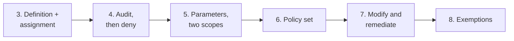

# Cloud-Policy-as-Code Lab

Welcome. This is your personal workspace for the **Cloud-Policy-as-Code** session. You will write the rules that keep a cloud safe, as code: definitions, assignments, parameters and sets, then modify rules, exemptions, Rego checks, tests, a pipeline and drift detection, all against **Dojo Cloud Policy**, the practice cloud's policy service (the same model as the big clouds' policy services).

You are working in your own student account. Keep all lab work under this `~/lab` folder. Every lab works in your own fork of the team repo, made in Lab 0. If you fall behind or join late, run `lab-prep N` to bring your workspace to the start of lab N.

## The labs

| Lab | Topic | Minutes (estimate) |
| --- | ----- | ------------------ |
| [Lab 0](lab0.md) | Setup: fork, clone, CI secrets, deploy the app | 10 |
| [Lab 1](lab1.md) | Why guardrails: your first 403, and the Policy blade | 8 |
| [Lab 2](lab2.md) | Anatomy of a policy: definition, assignment, scope | 12 |
| [Lab 3](lab3.md) | Your first policy as code: require a `costCenter` tag (slow apply) | 15 |
| [Lab 4](lab4.md) | Audit and compliance: audit before you deny | 12 |
| [Lab 5](lab5.md) | Parameters and reuse: one definition, two assignments, DoNotEnforce | 15 |
| [Lab 6](lab6.md) | Policy sets: one assignment for a whole baseline | 15 |
| [Lab 7](lab7.md) | Modify and remediation: rules that fix | 30 |
| [Lab 8](lab8.md) | Exemptions: a reviewed, dated waiver | 20 |
| [Lab 9](lab9.md) | Shift left with Rego and conftest: check the plan | 25 |
| [Lab 10](lab10.md) | Testing policies with `opa test`; fix a planted bug | 25 |
| [Lab 11](lab11.md) | Policy in the pipeline: PR checks, merge, apply | 30 |
| [Lab 12](lab12.md) | Drift: when the cloud and git disagree | 25 |

The [capstone](capstone.md) (a new rule end to end) closes Lab 12; allow about 45 minutes.

**The timings are estimates.** Labs that apply policy (3, 4, 5, 6, 7, 8) include waits of 2 to 3.5 minutes. Creating or destroying a policy definition or assignment takes about 100 seconds, because the provider waits until the cloud's policy service has replicated the change everywhere (eventual consistency). Each of those labs says so up front and gives you something to read while it runs. The waits are part of the lesson, not a fault.

## How the labs fit

The workshop has three movements.

**Understand (Labs 0-2).** You deploy a small application, break the platform's built-in guardrails on purpose, and learn the five-part model: a **definition** is the rule, an **assignment** switches it on at a **scope** with parameters, an **effect** decides what happens, and **compliance** is the cloud's report.

**Write cloud-side policy (Labs 3-8).** You build up one repository's worth of real policy, a step at a time:

Each lab starts from the end state of the one before, so what you write in Lab 3 is still enforced in Lab 8.

**Check it before and around the cloud (Labs 9-12).** Cloud-side policy catches a mistake at the last moment, at `apply`. Rego and conftest check the *plan* earlier; `opa test` proves the rules themselves are right; a pull-request pipeline makes checks mandatory; drift detection notices when someone changes policy outside git. The result is the whole loop: **write the rule in git, test it, review it, let CI apply it, and notice when reality drifts.**

## Two OpenTofu folders

| Folder | What it holds | Applied by |
| ------ | ------------- | ---------- |
| `infra/` | The application: a resource group and a container group. | you, then CI |
| `policy/cloud/` | Policy objects: definitions, assignments, sets, exemptions. | you, then CI |

They have separate state on purpose: the rules can change without touching the app. Policy is assigned at **subscription** scope so it never needs the app to exist first.

## Habits for every lab

- Use `tofu` (`terraform` also works, it is a link to it).
- Run a **scratch** folder (`~/lab/scratch`) for anything that is meant to fail. It has its own state, so your real app is never at risk. Each lab shows the setup commands.
- Commit as you go, but do not push to `main` until Lab 11: pushing runs the Apply pipeline.
- Read the **Check** box at the end of each lab: it is the success criterion.
