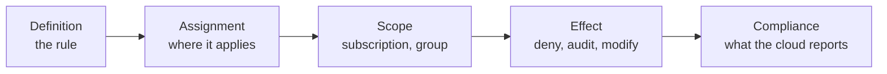

# Lab 0: Fork the repo, connect CI, deploy the app

**Time:** about 10 minutes. **Goal:** get your own copy of the team repository, give your fork the credentials its CI will need later, deploy a small application to Dojo Cloud, and learn what every folder in the repo is for. This lab creates the one application that every later policy will govern.

> **Starting here?** This is the first lab, so there is nothing to catch up on. If you come back later, `lab-prep 0` is safe to run again.

## The idea of the whole workshop

A cloud lets anyone with the right login create almost anything. That is the point of a cloud, and it is also the problem: the first time someone creates a 64-core machine in the wrong country with no owner tag, you find out from the bill. **Policy** is how an organisation says "yes, but within these rules", and does it in a way the cloud itself enforces, not a wiki page that people have to remember.

**Policy as code** means those rules are written as files, kept in git, reviewed in pull requests, tested, and applied by a pipeline, exactly like the infrastructure they govern. Over the next labs you will build up this chain:



You will meet each link in order. Lab 0 is only about getting ready.

---

## 1. Fork the team repo

The team's repository is `platform-team/cloud-policy-as-code`. Instead of everyone pushing into one repo, each of you works in your own **fork**: a copy on the git server under your account that remembers where it came from.

1. Open **Forgejo** from the landing page and sign in if asked.
2. Open the repository `platform-team/cloud-policy-as-code`.
3. Press **Fork** (top right), keep the suggested owner (your own name) and confirm.

You now have `<your-name>/cloud-policy-as-code`. The page header says "forked from platform-team/cloud-policy-as-code".

## 2. Save your cloud login as CI secrets

Later labs run pipelines in Forgejo Actions. A pipeline needs to sign in to Dojo Cloud the same way your terminal does, and the right way to hand it a password is a **secret**: a value stored on the repository that jobs can read but nobody can view again. Open the **Terminal** from the landing page and run:

```bash
lab-prep 0
```

Expected (abridged):

```text
==> Lab 0: your fork student01/cloud-policy-as-code
    already done: fork exists

==> Lab 0: save your Dojo Cloud login as Actions secrets on student01/cloud-policy-as-code
    secret ARM_CLIENT_ID saved
    secret ARM_CLIENT_SECRET saved
    secret ARM_SUBSCRIPTION_ID saved
    secret ARM_TENANT_ID saved

==> Lab 0: protect main
    main protected
```

If it says "no fork yet", go back to step 1 and run it again.

**What just happened?** `lab-prep 0` read the four `ARM_*` variables your terminal already has and stored them as repository secrets on your fork. It also marked `main` as a **protected branch**, so changes to it have to arrive through a pull request that passes the policy check. You will see that gate work in Lab 11. You can look at the secrets in Forgejo under your fork's **Settings > Actions > Secrets**: the names are listed, the values are not.

## 3. Clone your fork

```bash
mkdir -p ~/lab && cd ~/lab
git clone http://git-server:3000/$USER/cloud-policy-as-code.git
cd cloud-policy-as-code
ls -la
```

Git signs in with the access token your terminal came with, so there is no password prompt.

## 4. Tour of the repository

```bash
ls infra policy/cloud policy/cloud/rules policy/rego .forgejo/workflows
```

| Path | What it is |
| ---- | ---------- |
| `infra/` | The **application**: one resource group and one container group running a small web page. It is the thing the policies govern. |
| `policy/cloud/` | OpenTofu that writes **Dojo Cloud Policy** objects into the cloud: definitions, assignments, exemptions. |
| `policy/cloud/rules/` | The rules themselves as plain JSON, loaded by `main.tf` with `file()`. |
| `policy/rego/` | Rego rules and tests that check a *plan* before anything is applied (Labs 9-10). |
| `.forgejo/workflows/` | The pipelines: `pr.yml` checks pull requests, `main.yml` applies, `drift.yml` looks for out-of-band changes (Labs 11-12). |

Two OpenTofu folders, two jobs: `infra/` says what should be *running*, and `policy/cloud/` says what is *allowed to run*. They have separate state, so you can change the rules without touching the app and the other way round. Open `infra/main.tf` and read it:

```bash
cat infra/main.tf
```

Notice the names and tags:

- The names are `rg-${var.owner}-app` and `ci-${var.owner}-app`. `var.owner` is **you**: your terminal sets `TF_VAR_owner` to your username, so every student gets their own resources and there is nothing to edit.
- The tags are `owner` and `env`. They are there because the cloud's built-in guardrails already **require** them (Lab 1). The comment says a third tag, `costCenter`, is deliberately missing. Lab 3 will make that matter.

Now look at the policy folder:

```bash
cat policy/cloud/main.tf | head -30
```

Almost all of it is commented out. Each lab enables a part. Today `policy/cloud` creates nothing but a data source.

## Where your state lives

OpenTofu records what it has built in a **state**. Here it is not a file on your terminal: each folder's `versions.tf` has a `backend "http"` block that keeps the state in Dojo Cloud (`infra` for the app, `policy` for the rules). Your terminal already has the credentials (`TF_HTTP_USERNAME` and `TF_HTTP_PASSWORD`, copied from your `ARM_*` values). The pipeline will share this same state in Lab 11, and the state is **locked** while an apply runs, so two runs cannot overwrite each other.

## 5. Deploy the app

```bash
cd ~/lab/cloud-policy-as-code/infra
tofu init
tofu plan
tofu apply
```

Type `yes` when asked. Expected (abridged):

```text
Plan: 2 to add, 0 to change, 0 to destroy.
...
azurerm_resource_group.app: Creation complete after 2s
azurerm_container_group.app: Creation complete after 20s

Apply complete! Resources: 2 added, 0 changed, 0 destroyed.
```

Open the **Dojo Cloud** portal from the landing page. Under your resource groups you will see `rg-<you>-app` with a container group `ci-<you>-app` in it, running `dojo/hello:1.0`.

**What just happened?** Your terminal sent two writes to the cloud: "create this resource group" and "create this container group". Before the cloud accepted them, it checked each one against the **built-in guardrails** that the platform team assigned for everybody. Both passed (Canadian region, owner and env tags, an approved image, small CPU and memory, port 80), so the resources were created. You did not see the check, because nothing was wrong. In Lab 1 you will make it fail on purpose, so you can see exactly what a refusal looks like.

> **A word on git in these labs.** From Lab 3 you will commit your changes locally as you go, so the history tells the story. Until Lab 11, commit locally and do not push: a push to `main` starts `main.yml`, which applies too, and it would race your own applies for the state lock. Pushing belongs to Lab 11.

## Check

- [ ] Your fork exists and `lab-prep 0` printed four `secret ... saved` lines.
- [ ] `~/lab/cloud-policy-as-code` exists.
- [ ] The portal shows `rg-<you>-app` containing a running `ci-<you>-app`.

```bash
tofu state list
```

```text
azurerm_container_group.app
azurerm_resource_group.app
```

## Recap

- Policy as code means rules in git: reviewed, tested, applied by a pipeline.
- `infra/` is the app, `policy/cloud/` is the rules, `policy/rego/` checks plans, `.forgejo/workflows/` is the pipeline.
- Your fork holds your CI secrets and a protected `main`.
- Your app already passes the platform's built-in guardrails. Next you will see them refuse something.

**Next:** [Lab 1](lab1.md), why guardrails exist, and what a refusal looks like.
