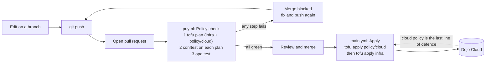

# Lab 11: Policy in the pipeline, a pull request that cannot merge a violation

**Time:** about 30 minutes. **Goal:** put every check you have built behind a pull request. You will break a rule on purpose, watch the pipeline refuse the change, fix it, and merge so the pipeline applies it.

> **Starting here?** This lab needs your clone, the app applied, the policy from Labs 3-8 applied, and the fixed `regions.rego` with its tests from Lab 10. Run `lab-prep 11` to set that up (the policy apply takes about 3.5 minutes). It is safe to run even if you did the earlier labs.

```bash
cd ~/lab/cloud-policy-as-code
```

---

## The pipeline you already have

Your fork contains three workflows in `.forgejo/workflows/`. You have already seen two of them run in Lab 8. This lab is about how they fit together:



Read it as three layers of the same rule:

1. **`opa test`** checks that the *rules themselves* are right (Lab 10).
2. **`conftest`** checks that *this change* obeys the rules, before apply (Lab 9).
3. **The cloud's own policy** refuses it anyway at apply, if the first two were skipped or wrong (Labs 1-8).

The workflow file is short enough to read in full. Open it:

```bash
cat .forgejo/workflows/pr.yml
```

The shape that matters:

```yaml
name: Policy check
on:
  pull_request:

jobs:
  check:
    runs-on: host
    steps:
      - name: Plan infra and policy/cloud
        run: |
          for d in infra policy/cloud; do
            (cd "$d" && tofu init -input=false && tofu plan -input=false -out=plan.out && tofu show -json plan.out > plan.json)
          done
      - name: Conftest
        run: |
          for d in infra policy/cloud; do
            conftest test --policy policy/rego --namespace main "$d/plan.json"
          done
      - name: Rego unit tests
        run: opa test policy/rego --ignore fixtures -v
```

Three things to notice. It runs `on: pull_request`, so it protects the branch *before* the code arrives. The credentials come from the Actions secrets that `lab-prep 0` saved on your fork (`secrets.ARM_*`); the plan needs to read the cloud, but nothing is applied. And `main` is **protected**: the fork requires this check to pass before **Merge** is enabled, so a red check is not advice, it is a locked door.

### One state, shared by your terminal and the pipeline

For the pipeline to apply what you created, it must know what exists. OpenTofu's **state** is that record, and until now it sat in a file on your terminal. `infra/` and `policy/cloud/` now keep their state in a **shared remote backend** (`backend "http"` in each folder's `versions.tf`, at `https://management.dojo.cloud/_dojo/tfstate/infra` and `.../tfstate/policy`), so your terminal and the CI job read and write the same state. The credentials come from the environment: `TF_HTTP_USERNAME` and `TF_HTTP_PASSWORD` are set for you in the terminal, and the workflows build them from the `ARM_CLIENT_ID` and `ARM_CLIENT_SECRET` secrets.

Two consequences. The pipeline's apply works against the resources you made in the earlier labs, instead of trying to create them again. And state is **locked while a run is using it**: do not apply from your terminal while `main.yml` is running, or you will see `Error acquiring the state lock`. Wait for the run to finish (or for the other command to), then retry. The lock is what stops two applies from corrupting each other.

## 2. Break the rule on a branch

Never experiment on `main` when a pipeline watches it. Start a branch:

```bash
git checkout -b drop-costcenter
```

Edit `infra/main.tf` and remove the `costCenter` line from `local.tags`:

```hcl
locals {
  tags = {
    owner = var.owner
    env   = "dev"
  }
}
```

First see what you would have learned locally:

```bash
cd infra
tofu plan -out=plan.out
tofu show -json plan.out > plan.json
cd ..
conftest test --policy policy/rego --namespace main infra/plan.json
```

```text
FAIL - infra/plan.json - main - azurerm_resource_group.app is missing the costCenter tag
FAIL - infra/plan.json - main - azurerm_container_group.app is missing the costCenter tag

2 tests, 1 passed, 0 warnings, 2 failures
```

(The `legacy` group also appears if it is changed; yours may list extra lines.) Run `tofu plan` alone and you would have seen a perfectly normal "2 to change": OpenTofu has no idea this is against the rules. Only the Rego check does.

Commit and push anyway, because the pipeline is what you are testing:

```bash
git add infra/main.tf
git commit -m "Drop the costCenter tag (this should be refused)"
git push -u origin drop-costcenter
```

## 3. Open the pull request

1. In your fork, **New pull request**, base `main`, compare `drop-costcenter`. As in Lab 8, make sure **both** sides are your fork.
2. Title it `Drop costCenter (expect a failure)` and create it.
3. Scroll to the checks at the bottom of the pull request. A **Policy check** run starts. Click **Details** (or open **Actions** in your fork) and follow the job.

After a minute or so the **Conftest** step turns red. Open it:

```text
FAIL - infra/plan.json - main - azurerm_resource_group.app is missing the costCenter tag
FAIL - infra/plan.json - main - azurerm_container_group.app is missing the costCenter tag
Error: running conftest: ...
```

The first step (the plan) was green, and the last step (the unit tests) did not run, because a failed step stops the job. The pull request now shows the check as failed and **Merge** is blocked. The reviewer does not have to remember the rule or spot the missing tag in a diff: the pipeline did, with the resource address and the reason.

## 4. Fix it, and merge

Put the tag back, and make one real change so the merge has something to apply. Add a `team` tag:

```hcl
locals {
  tags = {
    owner      = var.owner
    env        = "dev"
    costCenter = "cc-1001"
    team       = "platform"
  }
}
```

```bash
git add infra/main.tf
git commit -m "Restore costCenter; add a team tag"
git push
```

The push updates the open pull request and starts a new **Policy check**. Wait for it: all three steps go green, and the pull request shows the check as passing. Press **Merge** (a merge commit is fine), and delete the branch if Forgejo offers.

## 5. Watch main apply it

The merge is a push to `main`, which starts **Apply** (`main.yml`). Open **Actions** in your fork and open the new run:

```text
Apply policy/cloud   ... No changes. Your infrastructure matches the configuration.
Apply infra          ... Apply complete! Resources: 0 added, 2 changed, 0 destroyed.
```

The order is deliberate: **policy first, infra second**. If the change adds a rule and a resource that must follow it, the rule is in place before the resource is written, so the cloud's own check applies to the new resource too.

Then bring your clone up to date:

```bash
git checkout main
git pull
```

## 6. Make the check mandatory (read this one)

Open your fork's **Settings, Branches** and look at the protection on `main`. `lab-prep 0` set it up: a required status check. This is what turns a pipeline from a suggestion into a gate: a pull request cannot be merged until the check is green. Without it, the CI is just a notification.

Be honest about the limits: in this workshop you can still push to `main` directly (the labs before this one did), and a repository administrator can change the rule. In a real organisation, the protection applies to everyone, and changing it is itself an audited action. A gate you can walk around is a habit, not a control.

## What just happened

- Your terminal and the pipeline share one remote state, locked during every apply.
- A pull request is the point where a change can be inspected *before* it exists in the cloud. Plan, `conftest` and `opa test` run there automatically.
- A violation is refused by the pipeline with the resource's name, long before the cloud's 403.
- Merging triggers the apply, from a clean checkout, in a fixed order (policy, then infra). Nobody applies from a laptop.
- The check is **required**, so the merge button is a gate.

## Check yourself

1. Why does the pipeline run `conftest` on a *plan* and not on the `.tf` files? *(the plan has the real, resolved values; the `.tf` has variables and references that are not known yet)*
2. Why does `main.yml` apply policy before infra? *(a new rule must be in force before the resources it governs are written)*
3. What makes a failing check actually stop the merge? *(branch protection with a required status check)*

**Check box.** You are done when all of these hold:

- [ ] You saw the **Policy check** fail at the **Conftest** step on the `drop-costcenter` pull request, with the costCenter message.
- [ ] After the fix the check was green and you merged the pull request.
- [ ] The **Apply** run on `main` finished green and the containers now have `team = platform`.
- [ ] Your local `main` is up to date and `git status` is clean.

## Recap

The pipeline is the policy in motion: tests keep the rules right, `conftest` checks each change against them, the required check gates the merge, and the merge applies the change in a fixed order. The cloud's own policy is still there behind all of it. **Next:** [lab12.md](lab12.md): what happens when someone changes policy *around* the pipeline.
