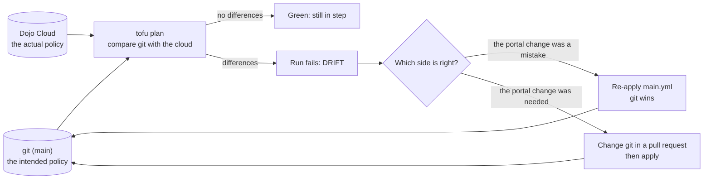

# Lab 12: Drift, when someone changes policy behind git's back

**Time:** about 25 minutes. **Goal:** cause drift on purpose, have a pipeline detect it, and put things right so that git wins again. Then think about why this matters more for policy than for almost anything else.

> **Starting here?** This lab needs your clone, the app applied, the policy from Labs 3-8 applied, and the Lab 10 and Lab 11 work merged into your fork's `main`. Run `lab-prep 12` to set that up (the policy apply takes about 3.5 minutes). It is safe to run even if you did the earlier labs.

```bash
cd ~/lab/cloud-policy-as-code
git checkout main
git pull
```

---

## What drift is

Everything so far assumed one rule: *git describes the cloud, and only the pipeline changes the cloud.* Real life breaks that rule in small, well-meant ways. Someone is on call, a deployment is blocked by a policy, and the fastest fix at 2 a.m. is to open the portal and switch the policy off "just for an hour". The hour passes and nobody remembers.

That is **drift**: the cloud no longer matches what git says. For ordinary resources drift is untidy. For **policy** it is dangerous, because a disabled guardrail does not break anything. It only lets bad things through, silently, and the dashboard you would check to find out is the very thing that was changed.

The cure has two halves. A **detective** control finds the change; a **corrective** control puts it back:



Notice the question in the middle. Drift is not always an error; sometimes the emergency change was right. What is never acceptable is for the cloud to be quietly different from git, so either git is corrected or the cloud is.

## 1. Look at the detector

```bash
cat .forgejo/workflows/drift.yml
```

The part that matters:

```yaml
on:
  workflow_dispatch:
  push:
    branches: [main]
...
      - name: Plan policy/cloud and fail on drift
        run: |
          cd repo/policy/cloud
          tofu init -input=false
          set +e
          tofu plan -input=false -detailed-exitcode
          rc=$?
          if [ "$rc" -eq 2 ]; then
            echo "DRIFT: someone changed policy outside git"
            exit 1
          fi
          exit "$rc"
```

`tofu plan -detailed-exitcode` has three outcomes: **0** nothing to do, **1** an error, **2** there are changes to make. A plan on `main` that wants to change something, with nobody having touched the code, means the cloud has moved. The script turns exit code 2 into a clear message and a failed run. In a real organisation the schedule would be `cron` (hourly or nightly); here it runs when you start it by hand and after every push to `main`, so you can watch it.

## 2. Establish a clean baseline

Run it once with nothing changed. In your fork open **Actions**, pick the **Drift** workflow in the left list, press **Run workflow**, choose `main`, and run it. Wait for it to finish.

```text
No changes. Your infrastructure matches the configuration.
```

A green run is the baseline: git and the cloud agree. (If it is red, an earlier lab left something different; run `cd policy/cloud && tofu apply` and try again.)

## 3. Cause the drift

Pretend you are the engineer at 2 a.m. Open the portal's **Policy** blade, find the `team-baseline` assignment and press **Disable enforcement**, then confirm. Its **Enforcement mode** turns to `DoNotEnforce`.

`DoNotEnforce` is the setting you met in Lab 5: the rules still *evaluate* and report compliance, but they no longer *deny*. See what it does to you. Add a file `infra/drift-demo.tf` with a resource group that breaks the costCenter rule:

```hcl
resource "azurerm_resource_group" "drift_demo" {
  name     = "rg-${var.owner}-drift"
  location = var.location
  tags = {
    owner = var.owner
    env   = "dev"
  }
}
```

```bash
cd infra
tofu apply
```

```text
azurerm_resource_group.drift_demo: Creation complete after 1s
Apply complete! Resources: 1 added, 0 changed, 0 destroyed.
```

In Lab 9 the same group was refused. Now it is in the cloud, and nobody was told. Back in the portal's **Policy** blade press **Evaluate now**: `team-baseline` lists the group as **non-compliant**, so the information is there, but only for someone who goes looking.

## 4. Let the detector find it

In Forgejo: **Actions**, **Drift**, **Run workflow** on `main`. Open the run when it appears:

```text
  # azurerm_subscription_policy_assignment.team_baseline will be updated in-place
  ~ resource "azurerm_subscription_policy_assignment" "team_baseline" {
      ~ enforce = false -> true
        name    = "team-baseline"
    }

Plan: 0 to add, 1 to change, 0 to destroy.
DRIFT: someone changed policy outside git
Error: Process completed with exit code 1.
```

Read the plan as a diff between *what the cloud has* (`enforce = false`) and *what git says* (`true`). Notice that the detector never needed to know what the portal did. It only compares. That is why this works for any out-of-band change: a deleted assignment would show as `1 to add`, a changed parameter as `~`. The run is red; someone has to look.

## 5. Make git win

Here the portal change was a mistake, so the corrective action is to apply what git says. Two ways, and you should know both:

**In the pipeline.** (State is shared and locked during an apply, so use only one of the two ways at a time.) Open the latest **Apply** run in **Actions** and press **Re-run**. That replays `main.yml` against the current `main`.

**From your terminal.**

```bash
cd ~/lab/cloud-policy-as-code/policy/cloud
tofu apply
```

```text
  ~ enforce = false -> true
Apply complete! Resources: 0 added, 1 changed, 0 destroyed.
```

Either way, the assignment is back in `Default` enforcement mode, because the code said so. Confirm in the portal (**Policy**, Enforcement mode `Default`), then run **Drift** again from **Actions**: green.

Now clean up the group that slipped through. Delete the file and apply, so git and the cloud agree again:

```bash
cd ~/lab/cloud-policy-as-code/infra
rm drift-demo.tf
tofu apply
```

```text
azurerm_resource_group.drift_demo: Destruction complete after 1s
Apply complete! Resources: 0 added, 0 changed, 1 destroyed.
```

(A delete is not subject to the costCenter rule, and enforcement is back on, so you can see the policy is working again: add `drift-demo.tf` back and the apply is refused. Delete it once more.)

## 6. Why this matters

Spend a few minutes with these questions; they are the point of the lab.

- **Drift is the normal state of any system people can touch.** The portal is a convenience, and a convenient path around the pipeline will be used. You cannot prevent every manual change; you can make it impossible to miss.
- **Policy drift is worse than resource drift.** A resource that is wrong breaks something, and you notice. A guardrail that is off breaks nothing, and the first symptom is the incident it was meant to stop.
- **Detection needs a schedule.** A drift check that only runs when someone remembers is not a control. Run it hourly or nightly, and send the failure somewhere a human will see it.
- **Prevention and detection are different tools.** Restricting who may edit policy in the portal (access control) *prevents* drift. The drift workflow *detects* what got through anyway. You want both, and neither replaces the other.
- **Git wins, or git changes.** When a run fails with DRIFT, the answer is never "leave it". Either re-apply git, or change git first, in a pull request, with the reason in the description.

## What just happened

- You caused drift by disabling enforcement outside git, and saw that this lets a rule-breaking resource through without any error.
- `tofu plan -detailed-exitcode` on `main` turned "git and the cloud disagree" into a failing run.
- Re-applying `main` made git the source of truth again. The `DRIFT` message was the whole alert.

## Check yourself

1. What does exit code 2 from `tofu plan -detailed-exitcode` mean? *(there are changes to make; here, the cloud has moved away from git)*
2. Why is a switched-off policy a worse kind of drift than a changed resource? *(nothing breaks, so nothing tells you; the guardrail just stops guarding)*
3. When a drift run fails, what are the two right responses? *(re-apply git if the portal change was wrong; change git in a pull request if it was needed)*

**Check box.** You are done when all of these hold:

- [ ] You saw the **Drift** run go red with `DRIFT: someone changed policy outside git` and the `enforce = false -> true` line.
- [ ] You restored enforcement from git (not by clicking **Enforce** in the portal), and the next **Drift** run is green.
- [ ] `rg-<you>-drift` is gone and `infra/drift-demo.tf` does not exist.
- [ ] `git status` is clean.

## Recap

Policy as code is only as strong as the rule that git is the truth. People will change the cloud directly, so run a plan on `main` on a schedule and treat any difference as an alert; then either re-apply git or change git. That is the whole loop: write, test, review, apply, detect, repeat. **Next:** [capstone.md](capstone.md): a new rule, start to finish, with nobody telling you the steps.
