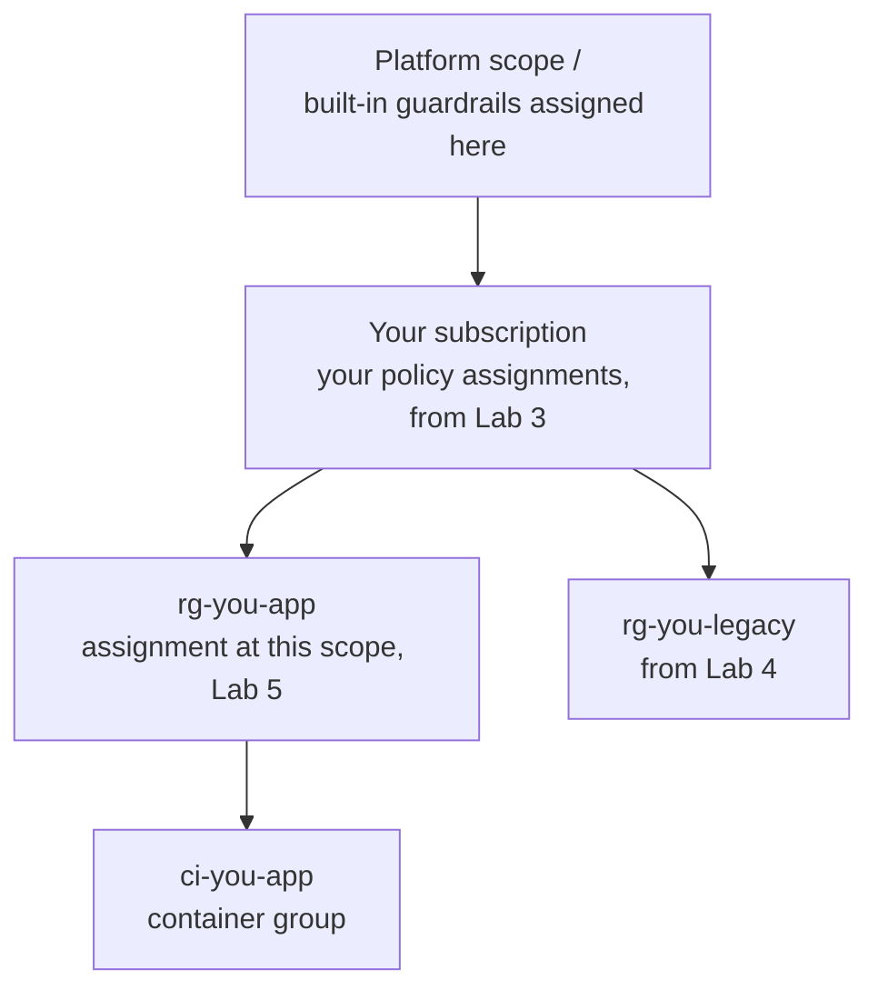

# Lab 2: Anatomy of a policy

**Time:** about 12 minutes. **Goal:** read a policy definition line by line, explain how a **definition**, an **assignment** and a **scope** relate, and predict three outcomes on paper before checking them against the cloud.

> **Starting here?** This lab needs your clone with the app applied (Lab 0). Run `lab-prep 2` to set that up; it is safe to run even if you did the earlier labs.

## The model in one picture

Policy has five parts. Most confusion about it comes from mixing them up, so keep this straight:

| Part | It answers | Example |
| ---- | ---------- | ------- |
| **Definition** | *What is the rule?* A condition and what to do when it matches. It does nothing by itself. | "A resource with no `costCenter` tag is non-compliant." |
| **Assignment** | *Where, and with which settings, is the rule switched on?* | "Apply that definition to this subscription, with effect `deny`." |
| **Scope** | *Which resources does the assignment cover?* Everything at and below the scope. | The whole subscription, or one resource group. |
| **Effect** | *What happens to a resource that matches?* | `deny`, `audit`, `modify`, `append`, `disabled`. |
| **Compliance** | *What does the cloud report afterwards?* | "`rg-legacy` is NonCompliant with `require-costcenter`." |

A definition is like a function, an assignment is like calling it with arguments on some data. One definition can be assigned many times, with different parameters and scopes (Lab 5).

## 1. Scope is a tree



An assignment applies to its scope **and everything beneath it**. The built-ins sit at the top, so they cover you without you doing anything. When you assign a rule to the subscription it covers every resource group and resource in it. An assignment on `rg-you-app` covers only that group's contents. Rules *add up*: a resource must satisfy every assignment that reaches it, from every level. There is no "closer scope overrides" rule for deny. To carve out an exception you use `not_scopes` on an assignment or an **exemption** (Lab 8).

## 2. Read a definition

In the portal, open the **Policy** blade, then **Definitions**, and open **Allowed locations**. Its rule looks like this:

```json
{
  "if": {
    "not": { "field": "location", "inExact": "[parameters('listOfAllowedLocations')]" }
  },
  "then": { "effect": "deny" }
}
```

Read it as a sentence: **if** the resource's location is *not* in the allowed list, **then** deny. The pieces:

- **`if` / `then`:** the condition and the consequence. This is the whole grammar of a rule.
- **`field`:** what to look at on the resource being written. Fields are things like `type`, `name`, `location`, `tags`, a single tag as `tags['costCenter']`, or a property alias such as the image of a container.
- **A comparison** against the field: `equals`, `notEquals`, `in`, `notIn`, `like`, `notLike`, `contains`, `notContains`, `exists`, `less`, `lessOrEquals`, `greater`, `greaterOrEquals`. Dojo Cloud adds two: `inExact` (a case-sensitive `in`) and `isBlank` (is empty or only spaces).
- **`allOf` / `anyOf` / `not`:** combine conditions (AND, OR, NOT).
- **`[parameters('listOfAllowedLocations')]`:** a placeholder filled in by the *assignment*. The same definition can therefore be reused with a different list.

Notice what the rule describes: the **bad** case. A policy rule matches what you want to *stop*. Beginners write the good case and get it backwards.

Also on the definition page:

- **Parameters:** the declared inputs, with a type (`String`, `Array`, `Integer`, `Float`...), optional allowed values and optional default.
- **Mode:** `All` evaluates every resource, including resource groups. `Indexed` skips resource groups and evaluates only resources that have a location and tags the usual way. Pick `All` for rules about resource groups or tags that must exist everywhere; `Indexed` when the rule is about a particular resource type.
- **Policy type:** `BuiltIn` (the platform's, read-only) or `Custom` (yours).

Now look at the `[*]` form in "Allowed container images". A container group holds several containers, and its image alias ends in `containers[*].image`. For a `[*]` field the condition has to hold **for every element**, so one bad image in a group of five is enough to make the group fail.

## 3. Effects

The `then` block names an effect:

| Effect | What it does |
| ------ | ------------ |
| `deny` | Refuse the write (the 403 you saw in Lab 1). |
| `audit` | Allow it, but mark the resource **NonCompliant** (Lab 4). |
| `modify` | Change tags on the way in, or on existing resources through remediation (Lab 7). |
| `append` | Add fields on the way in. |
| `disabled` | Keep the assignment, evaluate nothing. |

Effects are written either literally or as a parameter, `"effect": "[parameters('effect')]"`. The second form is what you will use: it lets one rule be audited first and denied later without editing the rule.

## 4. Predict, then check

Here are three writes, to be attempted in a scratch folder. **Before you run anything, write down on paper for each one: allowed or refused? If refused, by which built-in?**

| # | Write | Your prediction |
| - | ----- | --------------- |
| 1 | A resource group in `canadaeast` tagged `owner` and `env = dev` | |
| 2 | A resource group in `canadacentral` tagged `owner` and `env = ""` (an empty string) | |
| 3 | A container group in the group from case 1 running image `dojo/hello:3.0` | |

Hint: look at the rule of "Require tag 'env'" in the Definitions list. Does an empty tag count as present?

Set up the scratch folder (the same one as Lab 1; the commands are safe to repeat):

```bash
mkdir -p ~/lab/scratch && cd ~/lab/scratch
cp ~/lab/cloud-policy-as-code/infra/{providers,versions,variables}.tf .
sed -i 's#tfstate/infra#tfstate/scratch#' versions.tf
tofu init
```

**Case 1:**

```bash
cat > main.tf <<'EOT'
resource "azurerm_resource_group" "scratch" {
  name     = "rg-${var.owner}-scratch"
  location = "canadaeast"
  tags = {
    owner = var.owner
    env   = "dev"
  }
}
EOT
tofu apply -auto-approve
```

```text
azurerm_resource_group.scratch: Creation complete after 2s
Apply complete! Resources: 1 added, 0 changed, 0 destroyed.
```

**Case 2.** The empty-string tag goes on a *second* group, so case 1's group stays put:

```bash
cat >> main.tf <<'EOT'

resource "azurerm_resource_group" "blank" {
  name     = "rg-${var.owner}-blank"
  location = "canadacentral"
  tags = {
    owner = var.owner
    env   = ""
  }
}
EOT
tofu apply -auto-approve
```

```text
Error: creating "Resource Group (Subscription: \"<your subscription id>\"\nResource Group Name: \"rg-student01-blank\")": unexpected status 403 (403 Forbidden) with error:
RequestDisallowedByPolicy: Resource 'rg-student01-blank' was disallowed by policy.
Policy: 'Require tag 'env''. The resource is missing the required tag 'env'.
```

(abridged.) The built-in rule is `anyOf [tag does not exist, tag isBlank]`, so an empty value fails just like a missing one. The error text says "missing" for both.

**Case 3.** Remove the failing `blank` group (delete the last resource block from `main.tf`), then add a container group with an unapproved image:

```bash
python3 - <<'EOT'
s = open("main.tf").read()
open("main.tf", "w").write(s.split('\nresource "azurerm_resource_group" "blank"')[0])
EOT
cat >> main.tf <<'EOT'

resource "azurerm_container_group" "scratch" {
  name                = "ci-${var.owner}-scratch"
  location            = azurerm_resource_group.scratch.location
  resource_group_name = azurerm_resource_group.scratch.name
  os_type             = "Linux"
  ip_address_type     = "Public"
  dns_name_label      = "${var.owner}-scratch"

  exposed_port {
    port     = 80
    protocol = "TCP"
  }

  container {
    name   = "hello"
    image  = "dojo/hello:3.0"
    cpu    = 0.25
    memory = 0.125

    ports {
      port     = 80
      protocol = "TCP"
    }
  }

  tags = {
    owner = var.owner
    env   = "dev"
  }
}
EOT
tofu apply -auto-approve
```

```text
Error: creating Container Group (Subscription: "<your subscription id>"
Resource Group Name: "rg-student01-scratch"
Container Group Name: "ci-student01-scratch"): performing ContainerGroupsCreateOrUpdate: unexpected status 400 (400 Bad Request) with error:
InvalidImage: Image 'dojo/hello:3.0' is not in the approved image list: dojo/hello:1.0, dojo/hello:2.0.
```

(abridged.) Refused by "Allowed container images", reported in the older 400 form like the CPU rule in Lab 1.

How did you do? The usual slips: expecting case 1 to fail because `canadaeast` "feels" unusual (it is on the allowed list), and expecting case 2 to pass because the tag *exists*.

Clean up:

```bash
tofu destroy -auto-approve
```

## 5. Where did the compliance record go?

In the portal's **Policy** blade, open **Compliance**. Denied writes never produced a resource, so they never appear there. Compliance is only about resources that exist. That is why `audit` (Lab 4) and **existing** resources matter: deny stops new problems, compliance shows the ones already there.

## Check

- [ ] You predicted all three cases on paper before running them, and can explain any you got wrong.
- [ ] You can say in one sentence each what a definition, an assignment and a scope are.
- [ ] You can explain why a rule's `if` describes the *bad* case.

## Recap

- A **definition** is the rule (`if` a field matches a condition, `then` an effect); an **assignment** turns it on at a **scope**, supplying parameters; **compliance** is what the cloud reports.
- Assignments cover their scope and everything below; rules add up.
- `All` mode includes resource groups, `Indexed` does not.
- `[*]` conditions must hold for every element.

**Next:** [Lab 3](lab3.md): you write your first policy as code and see it enforced.
