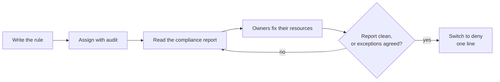

# Lab 4: Audit before you deny

**Time:** about 12 minutes, of which 2 to 3.5 are waiting. **Goal:** meet a resource the new rule would refuse but that you cannot fix today, switch the rule from `deny` to `audit` with a one-line change, and read the result in the compliance report. You will learn why every rule should start life in audit.

> **Starting here?** This lab starts from the end of Lab 3 (the `require-costcenter` policy applied, the app tagged). Run `lab-prep 4` to set that up; it applies the earlier labs' work and takes about 3.5 minutes.

## Read this first: this apply is slow too

Changing an assignment is a policy write, and policy writes wait for the cloud to replicate them (eventual consistency, as in Lab 3). Creating a definition and then an assignment costs about 100 seconds each, so about 3.5 minutes in all. This lab only **changes** an existing assignment, so expect about 2 minutes. Either way, start the apply, then read the "while it runs" section.

## The scenario

Another team owns an older resource group, `rg-<you>-legacy`, that also has to live in your subscription. It has `owner` and `env` tags and no `costCenter`, and they cannot add one this quarter (the tagging migration is ticket OPS-123). Your new rule is in `deny` mode.

## 1. Add the legacy group and watch it fail

At the end of `infra/main.tf`, add:

```hcl
# Lab 4: an older resource group with no costCenter tag.
resource "azurerm_resource_group" "legacy" {
  name     = "rg-${var.owner}-legacy"
  location = var.location
  tags = {
    owner = var.owner
    env   = "dev"
  }
}
```

Apply the infra:

```bash
cd ~/lab/cloud-policy-as-code/infra
tofu fmt
tofu apply -auto-approve
```

```text
Plan: 1 to add, 0 to change, 0 to destroy.

Error: creating/updating Resource Group "rg-student01-legacy": unexpected status 403 (403 Forbidden) with error:
RequestDisallowedByPolicy: Resource 'rg-student01-legacy' was disallowed by policy.
Policy: 'Require a costCenter tag'. Assignment 'require-costcenter', definition 'Require a costCenter tag':
tag 'costCenter' does not exist.
```

(abridged.) This is exactly the Lab 3 refusal. And here it is a problem: the rule is correct, but it blocks a legitimate resource that cannot comply *yet*. In a real company, the person who wrote the rule would now be phoning the owner of the legacy group, or worse, the rule would be quietly switched off for everybody.

## 2. Why audit first

**Audit** is an effect that lets the write through and records the non-compliance. It answers "what would this rule break?" without breaking anything.



You roll out any new guardrail in that order: audit, look, fix, then deny. A deny rule you have never seen run is a surprise for somebody. The parameter you added in Lab 3 is what makes the switch cheap: the rule file does not change, only one line in the assignment.

## 3. Switch the assignment to audit

In `policy/cloud/main.tf`, give the assignment a `parameters` argument:

```hcl
resource "azurerm_subscription_policy_assignment" "require_costcenter" {
  name                 = "require-costcenter"
  subscription_id      = data.azurerm_subscription.current.id
  policy_definition_id = azurerm_policy_definition.require_costcenter.id
  parameters = jsonencode({
    effect = { value = "audit" }
  })
}
```

Note the shape: `jsonencode` of a map from the **parameter name** to `{ value = ... }`. The names must match the definition's `parameters` block, and the cloud rejects an unknown name or a value outside `allowedValues`.

```bash
cd ~/lab/cloud-policy-as-code/policy/cloud
tofu fmt
tofu plan
```

```text
  # azurerm_subscription_policy_assignment.require_costcenter will be updated in-place
  ~ resource "azurerm_subscription_policy_assignment" "require_costcenter" {
      + parameters = jsonencode(
          + {
              + effect = {
                  + value = "audit"
                }
            }
        )
    }

Plan: 0 to add, 1 to change, 0 to destroy.
```

One in-place change. The definition is untouched. Apply it:

```bash
tofu apply
```

Type `yes`, then read while it runs.

## While it runs: reading

**Audit is not a weaker deny.** It is a different question. Deny answers "may this happen?". Audit answers "does this exist?". An audited resource is allowed to be created, and appears in compliance as NonCompliant with a reason. Nobody is told off. If nobody reads the report, audit does nothing, so someone has to own the report.

**The effects at a glance**, from least to most intrusive:

| Effect | Stops the write? | Changes the resource? | Visible in compliance? |
| ------ | ---------------- | --------------------- | ---------------------- |
| `disabled` | no | no | no, it is switched off |
| `audit` | no | no | yes |
| `modify` / `append` | no | yes, adds fields or tags | yes (Lab 7) |
| `deny` | yes | n/a | for existing resources only |

**What is actually in the plan?** The only difference is the assignment's `parameters`. The cloud applies the new value as soon as the update has replicated. This is also why each lab is "one policy apply": policy is designed so that a small edit is a small change.

**Think ahead.** The assignment for a team baseline in Lab 6 will pass one `effect` to *several* rules. What would audit-first mean there? (You would assign the whole baseline in audit, review all the findings together, then flip one line.)

## 4. Create the legacy group

When the apply finishes:

```text
azurerm_subscription_policy_assignment.require_costcenter: Modifying...
...
azurerm_subscription_policy_assignment.require_costcenter: Modifications complete after 1m41s

Apply complete! Resources: 0 added, 1 changed, 0 destroyed.
```

Run the infra apply from step 1 again:

```bash
cd ~/lab/cloud-policy-as-code/infra
tofu apply -auto-approve
```

```text
azurerm_resource_group.legacy: Creation complete after 2s

Apply complete! Resources: 1 added, 0 changed, 0 destroyed.
```

The write that was refused is now allowed.

## 5. Read the compliance report

Open the portal's **Policy** blade and its **Compliance** view:

- `rg-<you>-app` and `ci-<you>-app` are **Compliant** with `require-costcenter`.
- `rg-<you>-legacy` is **NonCompliant**, and the reason reads `tag 'costCenter' does not exist`.

This list is your to-do list. Hand it to the owner of the legacy group. When there is nothing in it, or every remaining item has an agreed exception (Lab 8), the rule is safe to enforce.

## 6. Going back to deny is one line

Do not do this now, but look at the change you would make once the report is clean. Either delete the `parameters` block (the default is `deny`), or write it out:

```hcl
  parameters = jsonencode({
    effect = { value = "deny" }
  })
```

That is a one-line pull request, easy to review and easy to revert. Compare it with the alternative of editing the rule, and you can see why the parameter was worth the extra three lines in Lab 3. You will leave `audit` in place: Lab 6 replaces this assignment with a set and turns it back on with a clear head.

## 7. Commit it

```bash
cd ~/lab/cloud-policy-as-code
git add infra policy
git commit -m "Audit the costCenter rule; add the legacy resource group"
```

## Check

- [ ] The legacy group was refused with a 403 while the assignment was on deny.
- [ ] After the switch, `rg-<you>-legacy` exists and the Policy blade shows it **NonCompliant** with a reason.
- [ ] The app group and container group are still **Compliant**.

## Recap

- `audit` lets a write through and records it as NonCompliant; `deny` blocks it.
- Roll out in order: audit, read the report, fix or agree exceptions, then deny.
- Because the effect is a parameter, the switch is a one-line change to the assignment, not to the rule.
- Compliance is the cloud's report on **existing** resources, and it is the to-do list for a rule's rollout.

**Next:** [Lab 5](lab5.md): one rule, two assignments, and a dry run called DoNotEnforce.
