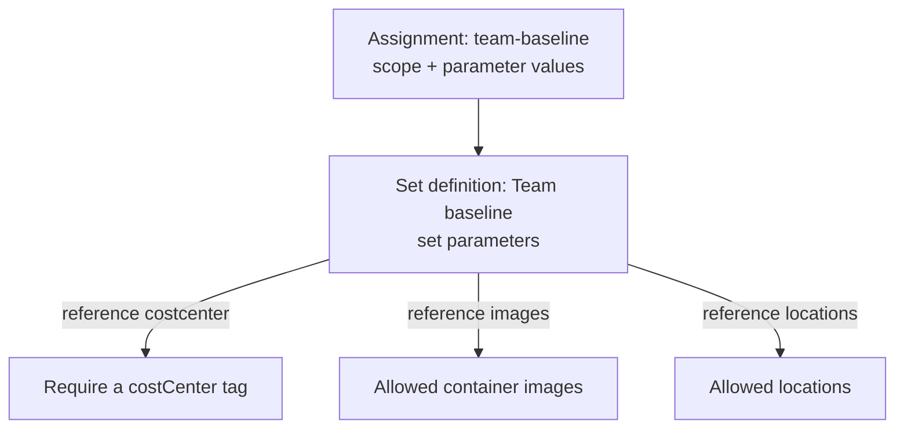

# Lab 6: Policy sets

**Time:** about 15 minutes, of which about 3.5 are waiting. **Goal:** bundle several rules into one **policy set** (also called an initiative), assign the whole bundle once, pass parameters down to its members, and read compliance per member.

> **Starting here?** This lab starts from the end of Lab 5 (two assignments of the images rule, app on 2.0). Run `lab-prep 6` to set that up; it applies the earlier labs' work and takes about 3.5 minutes.

## Read this first: this apply is slow too

This apply creates a definition (about 100 seconds), then a set (instant), then an assignment of the set (about 100 seconds), and destroys two old assignments (about 100 seconds, running in parallel with the rest). Expect **about 3.5 minutes**. As always, the wait is the provider letting the cloud's policy service replicate each object everywhere (eventual consistency) before moving on. The set itself costs no wait, which is one reason sets are cheap to change.

## The problem sets solve

You now have three rules (costCenter, images, and soon locations) and each is its own assignment, with its own scope, its own effect and its own name in the compliance report. Every new team that needs the same bundle has to repeat the whole list. And "are we compliant with the team standard?" has no single answer.

A **policy set definition** is a named list of definitions, each included by a **reference**, with its parameters wired up. You assign the set once; the assignment applies every member. The model gets one level deeper:



The set has its own **parameters**; the assignment supplies values for those; the set then passes each value down to the member that needs it, written as `[parameters('name')]`. Members keep their own definitions, so the same "allowed images" definition can sit in a set *and* have its own assignment, as it does in this lab.

## 1. Enable the Lab 6 block

In `policy/cloud/main.tf`, the section from `# Lab 6:` to `# Lab 7:` is commented out. Uncomment it:

```bash
cd ~/lab/cloud-policy-as-code/policy/cloud
sed -i '/^# Lab 6:/,/^# Lab 7:/{/^# Lab [67]:/!s/^# \{0,1\}//}' main.tf
```

## 2. Remove the two assignments the set replaces

The set will apply the costCenter rule and the images rule at subscription scope, so the two separate subscription assignments (`require_costcenter` and `images_subscription`) must go, otherwise each rule would be evaluated twice. **Keep** both definitions: the set refers to them. **Keep** `images_strict`: it is on the resource group with a different list, and the set cannot express that.

Delete the two resource blocks in VS Code, or let a short script do it:

```bash
python3 - <<'EOT'
import re
s = open("main.tf").read()
for name in ("require_costcenter", "images_subscription"):
    s = re.sub(r'(?:#[^\n]*\n)*resource "azurerm_subscription_policy_assignment" "%s" \{\n.*?\n\}\n\n?' % name, "", s, flags=re.S)
open("main.tf", "w").write(s)
EOT
tofu fmt
tofu validate
```

```text
Success! The configuration is valid.
```

(`tofu validate` needs `tofu init` to have been run in this folder, which `lab-prep` or an earlier lab did.) Now read the three new resources.

The **new definition**, which follows the pattern you know. Look at its rule, `rules/allowed-locations.json`:

```json
{
  "if": {
    "not": { "field": "location", "in": "[parameters('allowedLocations')]" }
  },
  "then": {
    "effect": "[parameters('effect')]"
  }
}
```

It is the team's own copy of the platform's location rule, with the list and the effect left as parameters.

The **set definition**:

```hcl
resource "azurerm_policy_set_definition" "team_baseline" {
  name         = "team-baseline"
  policy_type  = "Custom"
  display_name = "Team baseline"

  # Set parameters: what the assignment supplies, passed down to the members.
  parameters = jsonencode({
    effect           = { type = "String", defaultValue = "deny" }
    allowedImages    = { type = "Array" }
    allowedLocations = { type = "Array" }
  })

  policy_definition_reference {
    policy_definition_id = azurerm_policy_definition.require_costcenter.id
    reference_id         = "costcenter"
    parameter_values     = jsonencode({ effect = { value = "[parameters('effect')]" } })
  }
  policy_definition_reference {
    policy_definition_id = azurerm_policy_definition.allowed_images.id
    reference_id         = "images"
    parameter_values = jsonencode({
      allowedImages = { value = "[parameters('allowedImages')]" }
      effect        = { value = "[parameters('effect')]" }
    })
  }
  policy_definition_reference {
    policy_definition_id = azurerm_policy_definition.allowed_locations.id
    reference_id         = "locations"
    parameter_values = jsonencode({
      allowedLocations = { value = "[parameters('allowedLocations')]" }
      effect           = { value = "[parameters('effect')]" }
    })
  }
}
```

Work through it:

- **`parameters`** declares the set's own inputs. There are three, and every member's needs are met by one of them. One `effect` is shared by all members, so the whole baseline is audit or deny together.
- **`policy_definition_reference`** is one member. `policy_definition_id` says which definition. `reference_id` is that member's **name inside the set**, the label compliance reports use (`costcenter`, `images`, `locations`). It has to be unique in the set.
- **`parameter_values`** fills in the *member's* parameters. Each value is the string `"[parameters('x')]"`, which means "whatever the set's parameter `x` is". Read `allowedImages = { value = "[parameters('allowedImages')]" }` aloud: the member's `allowedImages` gets the set's `allowedImages`. The left name is the member's, the name inside the brackets is the set's, and they can differ.

The **set assignment**:

```hcl
resource "azurerm_subscription_policy_assignment" "team_baseline" {
  name                 = "team-baseline"
  subscription_id      = data.azurerm_subscription.current.id
  policy_definition_id = azurerm_policy_set_definition.team_baseline.id
  parameters = jsonencode({
    effect           = { value = "deny" }
    allowedImages    = { value = ["dojo/hello:1.0", "dojo/hello:2.0"] }
    allowedLocations = { value = ["canadacentral", "canadaeast"] }
  })
}
```

It is the same resource type as before, now pointing at a set, with one value for each of the set's parameters. Note `effect = deny`: you looked at the audit report in Lab 4, so the baseline now enforces.

## 3. Plan and apply

```bash
tofu plan
```

```text
Plan: 3 to add, 0 to change, 2 to destroy.
```

The three additions are the locations definition, the set and the set assignment. The two destroys are the old assignments.

```bash
tofu apply
```

Type `yes`, and read while it runs.

## While it runs: reading

**Why are the two old assignments safe to remove?** Their rules did not disappear: the same definitions are now enforced through the set, at the same scope. The difference is that the set assignment comes into force once its own 100 seconds are up, while the old ones are destroyed in parallel. For a short moment a write could be judged by both, or by one; none of the three rules is weakened for long, and in a team you would sequence a change like this through a pull request (Lab 11).

**What changed for deny and audit?** Nothing about how effects work. A set is only a delivery mechanism. When a write arrives, the cloud evaluates **every member** of every assignment that reaches the resource, and the strictest verdict wins: if any member denies, the write is refused.

**Why keep `images_strict` outside?** A set assignment gives one value per set parameter for one scope. The strict rule needs a *different* list on a *narrower* scope, which is an assignment, not a member. You could also assign the same set on the resource group with other parameter values; for a single rule it is not worth it.

**Where do sets pay off?** (1) Naming a standard once ("the team baseline") and assigning it to many subscriptions. (2) Compliance for the whole standard in one view, with each member's result visible. (3) Adding a rule to the standard without touching any assignment: you will do that at the end of this lab.

**Think ahead.** Your costCenter definition is mode `All`; the images and locations definitions are `Indexed`. A set can mix modes, because the mode belongs to each member's definition, not to the set. So a resource group is checked by the costCenter member and skipped by the other two. (The platform's own built-in location rule, which is mode `All`, still covers resource groups.)

## 4. Read compliance per member

When the apply finishes:

```text
azurerm_policy_definition.allowed_locations: Creation complete after 1m40s
azurerm_policy_set_definition.team_baseline: Creation complete after 1s
azurerm_subscription_policy_assignment.team_baseline: Creation complete after 1m41s
azurerm_subscription_policy_assignment.require_costcenter: Destruction complete after 1m40s
azurerm_subscription_policy_assignment.images_subscription: Destruction complete after 1m40s

Apply complete! Resources: 3 added, 0 changed, 2 destroyed.
```

(The order and exact times vary.) In the portal's **Policy** blade:

- **Assignments** now lists `team-baseline` (your subscription) and `images-strict` (the resource group), and the old two are gone.
- **Definitions** shows **Team baseline** as a *policy set*.
- **Compliance** is now organised by assignment, with a row per resource **per member**, identified by its reference id:

| Resource | Member | State |
| -------- | ------ | ----- |
| `rg-<you>-app` | `costcenter` | Compliant |
| `ci-<you>-app` | `costcenter` | Compliant |
| `ci-<you>-app` | `images` | Compliant |
| `rg-<you>-legacy` | `costcenter` | **NonCompliant**, `tag 'costCenter' does not exist` |

The legacy group is still there, as it was in Lab 4, and still flagged. The difference is the effect: the baseline is `deny`, so nobody can create *another* resource without a costCenter, and the legacy group is the only exception to explain. Lab 8 does that properly.

Prove the set denies. The platform's built-ins already stop a bad region, so test the **costCenter** member: in the scratch folder, try a resource group with no `costCenter` tag.

```bash
mkdir -p ~/lab/scratch && cd ~/lab/scratch
cp ~/lab/cloud-policy-as-code/infra/{providers,versions,variables}.tf .
tofu init
cat > main.tf <<'EOT'
resource "azurerm_resource_group" "scratch" {
  name     = "rg-${var.owner}-scratch"
  location = "canadacentral"
  tags = {
    owner = var.owner
    env   = "dev"
  }
}
EOT
tofu apply -auto-approve
```

```text
Error: creating/updating Resource Group "rg-student01-scratch": unexpected status 403 (403 Forbidden) with error:
RequestDisallowedByPolicy: Resource 'rg-student01-scratch' was disallowed by policy.
Policy: 'Team baseline'. Assignment 'team-baseline', definition 'Require a costCenter tag': ...
```

(abridged.) The refusal names the **set assignment** and the **member's definition** that fired, which is how you find the right rule inside a bundle. Nothing was created, so there is nothing to clean up.

## 5. Add a member without a new assignment

Commit what you have first, so you can undo the experiment:

```bash
cd ~/lab/cloud-policy-as-code
git add infra policy
git commit -m "Team baseline policy set replaces the separate subscription assignments"
```

Now extend the set. In `policy/cloud/main.tf`, add a fourth `policy_definition_reference` inside the set, next to the others. It reuses the costCenter definition under a new reference id, with the effect fixed to `audit`:

```hcl
  policy_definition_reference {
    policy_definition_id = azurerm_policy_definition.require_costcenter.id
    reference_id         = "costcenter-audit"
    parameter_values     = jsonencode({ effect = { value = "audit" } })
  }
```

```bash
cd policy/cloud
tofu plan
```

```text
  # azurerm_policy_set_definition.team_baseline will be updated in-place
  ~ resource "azurerm_policy_set_definition" "team_baseline" {
      + policy_definition_reference {
          + parameter_values     = jsonencode(...)
          + policy_definition_id = "/subscriptions/.../policyDefinitions/require-costcenter-tag"
          + reference_id         = "costcenter-audit"
        }
    }

Plan: 0 to add, 1 to change, 0 to destroy.
```

(abridged.) One change, to the **set**. The assignment `team_baseline` is not in the plan at all: it points at the set, so a new member is picked up by every existing assignment of it. That is the payoff of a set: a standard can *grow* without anyone re-assigning anything, in every subscription that assigned it.

(A real new rule also needs its own definition, which has the 100-second wait; the set change itself is instant.)

Do not apply this. Throw the experiment away:

```bash
cd ~/lab/cloud-policy-as-code
git checkout -- policy/cloud/main.tf
git status --short
```

## Check

- [ ] The Policy blade shows one set (**Team baseline**) assigned once, and the old `require-costcenter` and `images-subscription` assignments are gone. `images-strict` is still there.
- [ ] Compliance lists results per member, with reference ids `costcenter` and `images` (and `locations`).
- [ ] The scratch resource group was refused by `team-baseline` / `Require a costCenter tag`.
- [ ] You can explain why adding a member needed no new assignment.

```bash
cd ~/lab/cloud-policy-as-code/policy/cloud && tofu state list
```

```text
data.azurerm_resource_group.infra
data.azurerm_subscription.current
azurerm_policy_definition.allowed_images
azurerm_policy_definition.allowed_locations
azurerm_policy_definition.require_costcenter
azurerm_policy_set_definition.team_baseline
azurerm_resource_group_policy_assignment.images_strict
azurerm_subscription_policy_assignment.team_baseline
```

## Recap

- A **policy set** is a named list of definitions. Each member is a `policy_definition_reference` with a unique `reference_id`.
- The set declares **parameters**; the assignment supplies values; members receive them through `[parameters('x')]`.
- Assign the set once. Compliance is reported per member; a refusal names the member's definition.
- Adding a member changes the set only, so every existing assignment picks it up with no extra wait.
- Definitions can live in a set and also have their own assignment, as `allowed-images` does.

**Next:** [Lab 7](lab7.md): rules that do not just judge, but *fix*. Modify and remediation.
