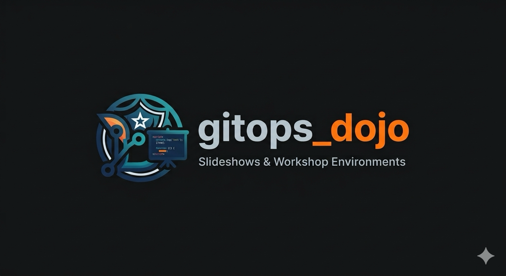

<!-- _class: hub -->

# Dojo Introduction

A look at the GitOps Dojo: how it works, with Forgejo, DNS as code and Dojo Cloud running at once.

<a class="enter" href="presentation.md">&rarr; Platform tour</a>
 
<a class="enter secondary" href="workshops.md">&rarr; Workshop library</a>
 
<a class="enter secondary" href="lab-index.md">&rarr; Tool tour</a>

Show and tell · Click around as a student or as the facilitator

