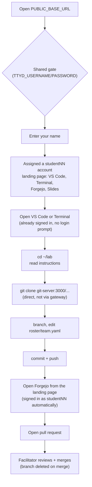

# Student Workflow — Git Fundamentals (Local Lab)

What a student sees and does during the local, self-hosted delivery of this
workshop. For starting/stopping/resetting the stack, see
[`engine/README.md`](../../../engine/README.md) — that's the facilitator
side; this doc is the student-facing walkthrough.



## 1. Open the workshop URL

```text
<PUBLIC_BASE_URL from the facilitator>
```

You'll be prompted for the shared gate credentials the facilitator gives
you. Enter them once — the browser remembers them for every tool in the
workshop for the rest of the session.

## 2. Enter your name

The first page asks for your name. Submit it and you're given the next free
student account (`student01`, `student02`, ...). The page that follows is
your landing page, with a card for each tool: **VS Code**, **Terminal**,
**Forgejo** and **Slides**. Come back to it any time by opening
`PUBLIC_BASE_URL` again.

## 3. Open VS Code or the Terminal

Either card drops you straight into your own workspace, already running as
your student account — there's no Linux login prompt. VS Code has an
integrated terminal; every lab command works the same in either one.

## 4. Confirm your session

```sh
whoami
pwd
git config --global user.name
git config --global user.email
cd ~/lab
glow README.md   # or: less README.md
```

Your Git identity is pre-set to match your student account.

## 5. Open the slides

Click the **Slides** card, or in another browser tab:

```text
<PUBLIC_BASE_URL>/slides/
```

## 6. Work the lab

Follow `~/lab/README.md` — it walks through cloning
`http://git-server:3000/training/sample-training-repo.git`, branching,
editing `roster/team.yaml`, and pushing. Do this from the terminal, using
`git-server:3000` — not the browser URL, and not `localhost:3000` (that
means the terminal container itself).

## 7. Open a pull request

Click the **Forgejo** card on your landing page. It opens Forgejo in a new
tab, already signed in as your student account — no second login. Find
your pushed branch and open a pull request into `main`. When the PR is
merged, Forgejo deletes the branch on the server (the "Delete branch"
option is ticked by default); `git fetch --prune` then tidies up your local
clone, as Lab 1 shows.

## Network behavior

| From the terminal            | Result                                   |
| ------------------------------ | ------------------------------------------ |
| `http://git-server:3000`       | Allowed — Forgejo Git operations         |
| `http://presentation:8080`     | Blocked — view slides from your browser  |
| Public internet                | Blocked — local lab only                 |
