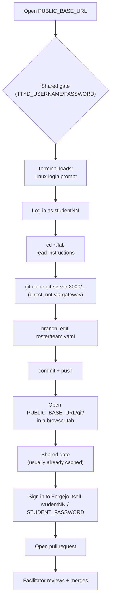

# Student Workflow — Git Fundamentals (Local Lab)

What a student sees and does during the local, self-hosted delivery of this
workshop. For starting/stopping/resetting the stack, see
[`engine/README.md`](../../../engine/README.md) — that's the facilitator
side; this doc is the student-facing walkthrough.



## 1. Open the workshop URL

```text
<PUBLIC_BASE_URL from the facilitator>
```

You'll be prompted for the shared gate credentials the facilitator gives
you. Enter them once — the browser remembers them for both the terminal and
Forgejo for the rest of the session.

## 2. Log in to the terminal

The page that loads after the gate is the terminal. Log in at the Linux
prompt with your assigned account (`student01`, `student02`, ...) and the
shared student password.

## 3. Confirm your session

```sh
whoami
pwd
git config --global user.name
git config --global user.email
cd ~/lab
glow README.md   # or: less README.md
```

Your Git identity is pre-set to match your terminal username.

## 4. Open the slides

In another browser tab:

```text
<PUBLIC_BASE_URL>/slides/presentation.md
```

No login needed for slides.

## 5. Work the lab

Follow `~/lab/README.md` — it walks through cloning
`http://git-server:3000/training/sample-training-repo.git`, branching,
editing `roster/team.yaml`, and pushing. Do this from the terminal, using
`git-server:3000` — not the browser URL, and not `localhost:3000` (that
means the terminal container itself).

## 6. Open a pull request

In another browser tab:

```text
<PUBLIC_BASE_URL>/git/
```

You'll see the shared gate again if the browser didn't cache it for this
tab — same credentials as the terminal. Then sign in to **Forgejo itself**
with your student account (same username/password as the terminal) — this
is a separate, deliberate second login, not the shared gate. Find your
pushed branch and open a pull request into `main`.

## Network behavior

| From the terminal            | Result                                   |
| ------------------------------ | ------------------------------------------ |
| `http://git-server:3000`       | Allowed — Forgejo Git operations         |
| `http://presentation:8080`     | Blocked — view slides from your browser  |
| Public internet                | Blocked — local lab only                 |
